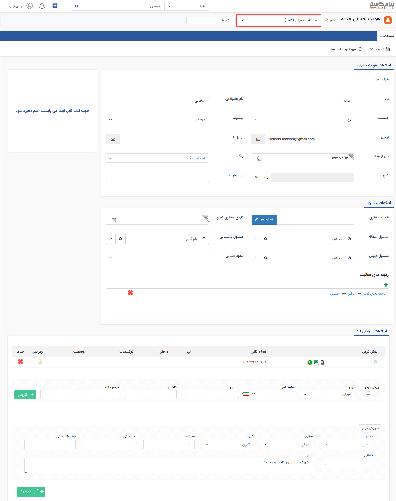
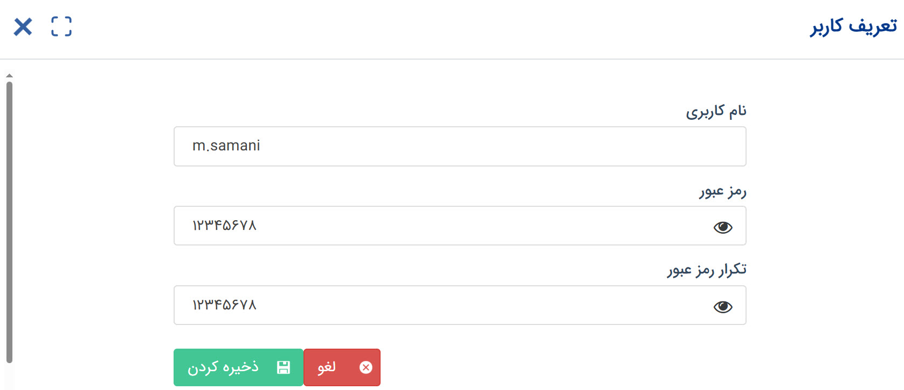
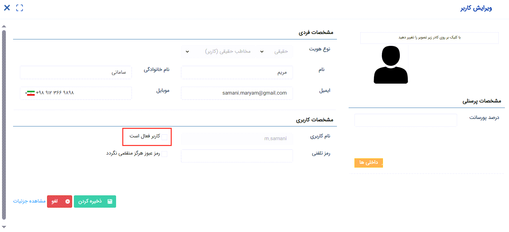

# ایجاد کاربر جدید از صفحه پروفایل
چنانچه در راهنمای ایجاد کاربر به آن اشاره شده‌است، استفاده از کلید افزودن کاربر در صفحه مدیریت کاربران یک راه آسان برای ایجاد کاربر است؛ لکن تنها روش ممکن نیست. شما می‌توانید از صفحه کاربر نیز اقدام به ایجاد کاربر نمایید. 
در بسیاری از مواقع، هویت کاربر ممکن است در نرم‌افزار موجود باشد. فرض کنید از بین تمام افراد جویای کار که هویت آن‌ها را در نرم‌افزار ثبت کرده‌اید و فرآیند مصاحبه و جذبشان را در پیام‌گستر مدیریت کرده‌اید، تصمیم به همکاری با یک نفر از آن‌ها را دارید و حال می‌خواهید کاربری او را ایجاد کنید. در چنین شرایطی اگر از بخش مدیریت گروه‌ها و کاربران اقدام به ساخت کاربری نمایید، هنگام ایجاد کاربری، یک هویت دیگر نیز برای کاربر ساخته می‌شود. در چنین شرایطی بهتر است که از هویت موجود برای ساخت کاربری استفاده نمایید.  در مثالی دیگر، شرایطی را فرض کنید که می‌خواهید اطلاعات کامل  کاربر را در پروفایل وی ثبت نمایید. به سبب اینکه تنها اطلاعات الزامی برای ایجاد کاربر در صفحه مشخصات کاربر نمایش داده‌می‌شود، ثبت اطلاعات در صفحه پروفایل و سپس ایجاد کاربری می‌تواند برایتان آسان‌تر باشد. 
برای جلوگیری از بروز چنین مشکلاتی، روش ایجاد کاربر از روی صفحه هویت می‌تواند برایتان کاربردی باشد. شما می‌توانید با ایجاد هویت از نوع «مخاطب حقیقی (کاربر)» و ذخیره‌ی آن در بانک اطلاعاتی (یا تبدیل زیرنوع هویت موجود به هویت حقیقی کاربر)، پس از ایجاد پروفایل وی، اقدام به ایجاد کاربری برای او نمایید. بدین منظور کافیست که مراحل زیر را طی کنید. 

## گام اول: ایجاد هویت
از یکی از روش‌های ثبت هویت، یک هویت از زیرنوع مخاطب حقیقی (کاربر) با مشخصات کاربر مورد نظر ایجاد کنید. برای ثبت هویت می‌توانید از ویجت دسترسی سریع استفاده کنید و یا اینکه در بانک اطلاعاتی، دسته‌بندی مورد نظر را انتخاب کرده و هویت را در آن ذخیره نمایید. در صورت نیاز می‌توانید از [راهنمای ایجاد هویت حقیقی](https://github.com/1stco/PayamGostarDocs/blob/master/Help/Integrated-bank/Database/General-specifications/ijad-mokhatab/haghighidasti.md) استفاده نمایید.  
در این راستا به چند نکته توجه داشته‌باشید: 
- زیرنوع انتخابی هویت، حتما باید از نوع مخاطب حقیقی (کاربر) باشد. 
- با توجه به عدم کاربرد برخی فیلدها نظیر مسئول فروش/پشتیبانی/متفرقه، می‌توانید از درج اطلاعات در آن‌ها صرف نظر نمایید. 
- با توجه به نیاز کاربر به دریافت پیام فعال‌سازی و کد یک‌بار مصرف (که ممکن است از نوع پیامک یا ایمیل تنظیم شده‌باشند)، اطلاعات ارتباطی شامل موبایل و ایمیل را تکمیل نمایید تا کاربر در مراحل آتی دچار مشکل نشود. 
در نهایت پس از تکمیل اطلاعات می‌توانید هویت را ذخیره نمایید. 

> **نکته** 
> اگر هویت مورد نظر پیش‌تر در نرم‌افزار ثبت شده‌است، کافیست که با استفاده از کلید «تبدیل هویت» زیرنوع آن را به یکی از زیرنوع‌های هویت که نوع پروفایل آن «اپراتور» است، تغییر دهید. 

## گام دوم: ایجاد کاربر
پس از ایجاد هویت، از کلید «تعریف کاربر» که در نوار سفید بالای صفحه مشاهده می‌کنید برای ایجاد کاربری استفاده نمایید. با کلیک بر روی کلید «تعریف کاربر»، صفحه تعریف کاربر به شما نمایش داده می‌شود. 

در این صفحه کافیست نام کاربری مورد نظر و رمز عبور اولیه را وارد نمایید. پس از ذخیره کاربری هویت ایجاد شده و اطلاعات کاربری برای وی ارسال می‌شود.  

> **نکته** 
> پیام ارسالی برای هویت جهت اطلاع‌رسانی نام کاربری و رمز عبور، از بخش [مدیریت پیام‌های سیستمی](https://github.com/1stco/PayamGostarDocs/blob/master/Help/Basic-Information/Manage-system-messages/2.6.0/Manage-system-messages.md) قابل ویرایش می‌باشد. از این بخش می‌توانید مشخص کنید که پیام از چه رسانه‌ای و با چه محتوایی برای کاربر ارسال شود. 

## گام سوم: تایید کاربر
توجه داشته‌باشید که کاربری که از این روش ایجاد کرده‌اید، هنوز فعال نشده‌است. برای فعال‌سازی کاربری این هویت لازم است که از صفحه مدیریت گروه‌ها و کاربران اقدام به این کار نمایید. بدین منظور: 
- وارد بخش مدیریت گروه‌ها و کاربران شوید تا به لیست کاربران درسترسی داشته‌باشید.
- از فیلتر استفاده نمایید و کاربران غیرفعال را جتسجو کنید. برای اینکه کاربران غیرفعال به شما نمایش داده شود کافیست در قسمت فیلتر، وضعیت را بر روی حالت «غیرفعال» قرار دهید و بر روید کلید «اعمال» کلیک کنید.
- کاربری که ایجاد کرده‌اید را در لیست کاربران غیرفعال پیدا کنید و بر روی آیکون «ویرایش» در مقابل آن کلیک کنید.
- در صفحه مشخصات کاربر، گزینه «کاربر فعال است» را علامت‌گذاری کرده و تغییرات هود را ذخیره کنید. چنانچه در صفحه پروفایل هویت ایمیل هویت را وارد نکرده‌باشید، برای فعال‌سازی در این بخش ملزم به ورود ایمیل خواهیدبود.  

> **نکته** 
> علاوه بر صفحه مشخصات کاربر می‌توانید با کلیک بر روی کلید «مدیریت کاربر» وارد صفحه کنسول مدیریت کاربر شوید و با کلیک بر روی کلید «فعال‌سازی» اقدام به فعال کردن کاربر نمایید. 
