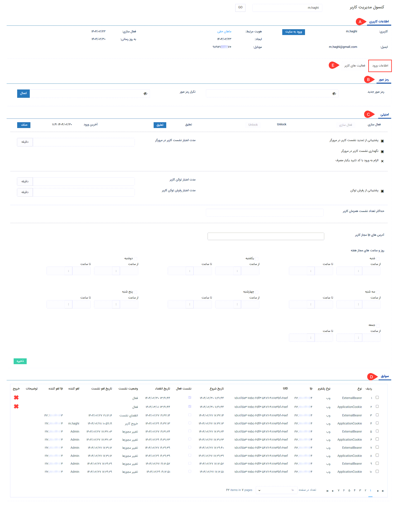
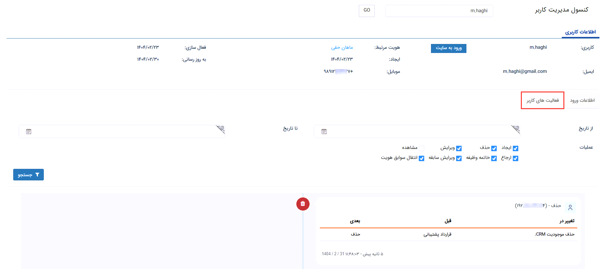

# کنسول مدیریت کاربر
کنسول مدیریت کاربر به مدیر سیستم و مدیر گروه‌ها و کاربران این امکان را می‌دهد که: 
- بدون نیاز به درج نام کاربری و رمز عبور وارد کاربری یک کاربر شوند.
- تنظیمات امنیتی را برای یک کاربر شخصی‌سازی کنند.
- در صورت نیاز غیرفعال شدن کاربری یا فراموش رمزعبور مشکل ورود کاربر را برطرف کنند.
- لاگ‌های ورود و نشست کاربر را مشاهده و در صورت نیاز نشست آن را منقضی کنند.
- فعالیت‌های کاربر از جمله آیتم‌های مشاهده شده، ایجاد شده، ویرایش شده و ... را مشاهده کنند. 
در ادامه، به بررسی هر یک از تنظیمات و امکانات این صفحه می‌پردازیم. 

## A. اطلاعات کاربری
در این قسمت می‌توانید خلاصه‌ای از اطلاعات کاربر را مشاهده نمایید. از طریق لینک نام هویت کاربر (نام هویت که با رنگ آبی نمایش داده‌می‌شود) می‌توانید وارد صفحه پروفایل وی شوید. علاوه بر این اطلاعات، کلید ورود به سایت را در این قسمت مشاهده می‌کنید. 
- **ورود به سایت:**  با کلیک بر روی این گزینه می‌توانید از طریق این کاربری وارد نرم‌افزار شده و محیط نرم‌افزار را از دید او مشاهده کنید. بدیهی است که اقدامات انجام شده در این حالت، به نام کاربری مربوطه ثبت می‌شود. این امر می‌تواند برای اطمینان از صحّت دسترسی‌های تنظیم شده و یا انجام اقدامی از جانب کاربر، کاربرد داشته‌باشد. 

## B. رمز عبور
در صورت نیاز به تغییر رمز عبور کاربر، کافی است رمز جدید را در این قسمت وارد و تکرار نمایید. با کلیک بر روی کلید «اعمال»، رمز او به رمز جدید تغییر پیدا می‌کند. از این بخش می‌توانید برای مواقعی که کاربر رمز خود را فراموش کرده، استفاده نمایید. البته لازم به ذکر است که کابر، خود نیز می‌تواند با کلیک بر روی لینک «فراموشی رمز عبور»، اقدام به تغییر رمز خود نماید. 

## C. امنیتی
در این بخش می‌توانید تنظیمات امنیتی کاربر را مدیریت نمایید. 
- **فعال‌سازی:** در صورت غیرفعال شدن کاربری شخص، با کلیک بر روی این کلید می‌توانید مجدداً کاربری وی را فعال نمایید.
- **Unlock:** در صورت قفل شدن حساب کاربری فرد (مثلاً به علت تکرار رمز عبور نادرست)، از این قسمت می‌توانید اقدام به رفع آن نمایید.
- **تعلیق:** با کلیک بر روی این کلید، وضعیت کاربر به حالت تعلیق تغییر نموده و کاربر امکان ورود به نرم‌افزار را نخواهد‌داشت. در این حالت پیغامی مبتنی بر تعلیق کاربری به ایشان نمایش داده‌می‌شود.
برای برداشتن تعلیق، کافی است بر روی «رفع تعلیق» که در همین قسمت به شما نمایش داده‌می‌شود، کلیک نمایید.
- **آخرین ورود:** در این بخش، تاریخ و ساعت آخرین ورود کاربر به نرم‌افزار نمایش داده‌می‌شود. با کلیک بر روی کلید «حذف» می‌توانید لاگ آخرین ورود او را از سیستم حذف نمایید. 

> **نکته** 
> تنظیمات مرتبط با نشست کاربر و اعتبار توکن، تنظیمات عمومی هستند که از قسمت [تنظیمات امنیتی](https://github.com/1stco/PayamGostarDocs/blob/master/Help/Settings/General-settings/security/securitySetting-2.8.7.md) (تنظیمات کلی > امنیتی)، برای کلیه کاربران تنظیم می‌گردند. چنانچه می‌خواهید تعداد معدودی از کاربران را از قاعده مستثنی کنید و تنظیمات دیگری برای آن‌ها در نظر بگیرید، این تنظیمات را در بخش کنسول کاربری وی تغییر دهید. در غیر این صورت نیازی به تنظیم این بخش‌ها در کنسول کاربر نمی‌باشد. در این راستا به توضیحات زیر توجه داشته‌باشید: 
> - در حالت انتخاب آیکون مربع، تنظیمات بر اساس آنچه در تنظیمات کلی امنیتی درج شده، برای کاربر لحاظ می‌شود.
> - در حالت تغییر آیکون به حالت تیک، گزینه‌ی مربوطه برای کاربر فعال می‌شود. یعنی چنانچه این موارد در بخش تنظیمات کلی امنیتی غیرفعال در نظر گرفته شده‌باشد، برای این کاربر فعال خواهدبود.
> - در حالت تغییر آیکون به حالت ضربدر، چنانچه این موارد در بخش تنظیمات کلی امنیتی فعال در نظر گرفته‌شده باشد، برای این کاربر غیرفعال خواهد بود.
> - در مواردی که برای درج عدد در نظر گرفته شده، در صورت خالی بودن بخش، مربوطه، مدت اعتبار برا اساس تنظیمات کلی امنیتی اعمال می‌شود. در صورت درج عدد در این بخش‌ها، اعتبار موارد مذکور صرفاً برای این کاربر، بر اساس اعداد درج شده در کنسول لحاظ می‌شود. 

- **مدت اعتبار نشست کاربر در نرم‌افزار:** با استفاده از این بخش می‌توانید تنظیمات مدت اعتبار نشست را متفاوت از تنظیمات امنیتی برای کاربر لحاظ کنید. با این قابلیت می‌توانید مدت زمان مجاز برای فعالیت کاربر پس از هر ورود را محدود نمایید. در این حالت،‌ پس از گذشت مدت زمان مشخص شده، کاربر به صورت خودکار از حساب کاربری خود خارج شده و در صورت نیاز به ورود مجدد لازم است  با استفاده از نام کاربری و رمزعبود خود، اقدام به ورود نماید. در صورت خالی بودن این قسمت، مدت اعتبار نشست کاربر بر اساس تنظیمات امنیتی (قابل تنظیم در تنظیمات کلی) در نظر گرفته‌می‌شود.
- **پشتیبانی از تمدید نشست کاربر در مرورگر:** با فعال/غیرفعال‌سازی این بخش می‌توانید تنظیمات پشتیبانی از تمدید نشست را متفاوت از تنظیمات امنیتی برای کاربر لحاظ کنید. با فعال‌سازی این گزینه (کلیک بر روی آیکون کناری و تغییر آن به حالت تیک)، زمان اعتبار نشست کاربر در نرم‌افزار به جای زمان ورود، از آخرین فعالیت وی در پیام‌گستر در نظر گرفته‌می‌شود. 
- **نگهداری نشست کاربر در مرورگر:** با استفاده از این بخش می‌توانید تنظیمات نگهداری نشست در مرورگر را متفاوت از تنظیمات امنیتی برای کاربر لحاظ کنید. با فعال کردن این قسمت (کلیک بر روی آیکون مربع و تغییر آن به حالت تیک) با بسته شدن صفحه‌ی مرورگر، کاربر تا زمان اعتبار نشست خود می‌تواند بدون نیاز به درج مجدد نام کاربری و رمز عبور، وارد حساب کاربری خود در نرم‌افزار شود. به عبارتی فعال‌سازی این گزینه، اعتبار نشست کاربر در نرم‌افزار در صورت بسته شدن مرورگر را تا پایان اعتبار زمانی آن نشست، حفظ می‌کند.
- **الزام به ورود با کد تایید یکبار مصرف:**{OTP} با فعال/غیرفعال‌سازی این بخش می‌توانید تنظیمات الزام به استفاده از کد یکبار مصرف را متفاوت از تنظیمات امنیتی برای کاربر لحاظ کنید. با فعال کردن این گزینه، کاربر موظف است برای ورود به نرم‌افزار در نسخه وب، اپلیکیشن موبایل و حتی باشگاه، از کد یکبار مصرف استفاده نماید.
- **پشتیبانی از رفرش توکن:** نوعی توکن برای حفظ دسترسی‌های موقت است که به شما این امکان را می‌دهد که پس از انقضا، بدون نیاز به اعتبارسنجی مجدد دسترسی‌های خود را حفظ کنید. چنانچه از نرم‌افزاری استفاده می‌کنید که از توکن پیام‌گستر استفاده می‌کند (مثلاً تایم‌نگر)، می‌توانید با فعال کردن این گزینه، **مدت اعتبار توکن کاربر** و **مدت اعتبار رفرش توکن کاربر** را برای آن تعیین نمایید.
- **حداکثر تعداد نشست همزمان کاربر:** با درج عدد در این قسمت می‌توانید حداکثر تعداد نشست همزمان کاربر از طریق مرورگرها و یا اپلیکیشن را محدود نمایید. چنانچه عدد ۱ در این قسمت درج شود، کاربر پس از ورود از طریق یک مروگر، تا هنگام خروج از آن، امکان ورود از طریق مرورگر دیگر و یا اپلیکیشن موبایل را نخواهد‌داشت. در صورت خالی بودن این قسمت، حداکثر تعداد نشست بر اساس تنظیمات امنیتی (قابل تنظیم در تنظیمات کلی) اعمال می‌شود.
- **آدرس‌های IP مجاز کاربر:** در صورت درج آدرس IP در این بخش، کاربر تنها از طریق IP تعیین شده امکان ورود به نرم‌افزار را خواهد‌داشت. در چنین حالتی، کاربر در صورت تلاش برای ورود از طریق IP دیگر، با پیغام خطا روبرو شده و امکان ورود نخواهد‌داشت.
- **روز و ساعت‌های مجاز هفته:** با استفاده از این بخش می‌توانید دسترسی کاربر را به روزها و ساعات مشخص، محدود کنید. برای این کار کافی است روز(های) مجاز را انتخاب کرده و ساعات مجاز برای استفاده‌ی این کاربر از نرم‌افزار را مشخص کنید. 

 > **نکته** 
 > با فعال کردن یکی از روزهای هفته، دسترسی به نرم‌افزار (امکان ورود) در سایر روزها، برای کاربر غیرممکن می‌شود. چنانچه هیچ کدام از روزها در این بخش فعال نشده باشد، محدودیتی بر روی روز و ساعات ورود (به جز موارد تعیین شده در تنظیمات امنیتی و تنظیمات بخش بالا) برای کاربر اعمال نمی‌شود. 

پس از اعمال تغییرات مورد نظر، تنظیمات خود را ذخیره نمایید. 

## D. سوابق ورود کاربر
در این قسمت می‌توانید گزارش ورود خروج کاربر را مشاهده نمایید. تاریخ انقضا در این جدول، نشان‌دهنده‌ی محدودیت زمانی‌ است که از بخش تنظیمات امنیتی و یا تنظیمات بالا برای کاربر در نظر گرفته شده‌است. 

## E. فعالیت‌های کاربر {#َUserActivities}
از قسمت میانی صفحه، می‌توانید به تب فعالیت‌های کاربر انتقال پیدا کنید. در این بخش تمامی فعالیت‌هایی که کاربر در نرم‌افزار انجام داده‌است، به شما نمایش داده‌می‌شود. فیلترهای موجود در این بخش به شما این امکان را می‌دهد که فعالیت‌های یک بازه زمانی مشخص و یا نوع خاصی از اقدامات را فیلتر و مشاهده نمایید. به عنوان مثال می‌توانید تمامی آیتم‌هایی که کاربر آن‌ها را حذف یا ویرایش کرده و یا وظایفی که ایجاد کرده و ارجاع داده‌است را ببینید. 

> **نکته** 
> هنگام ایجاد، ویرایش و حذف آیتمی که دارای «مرتبط با» می‌باشد، در اصل دو لاگ در سیستم و در نتیجه در فعالیت‌های کاربر ثبت می‌شود. یک لاگ به سبب ایجاد/ویرایش/حذف آیتم و لاگ دیگر به سبب تغییری که در سابقه‌ی هویت اتفاق افتاده‌است، ثبت می‌شود.  