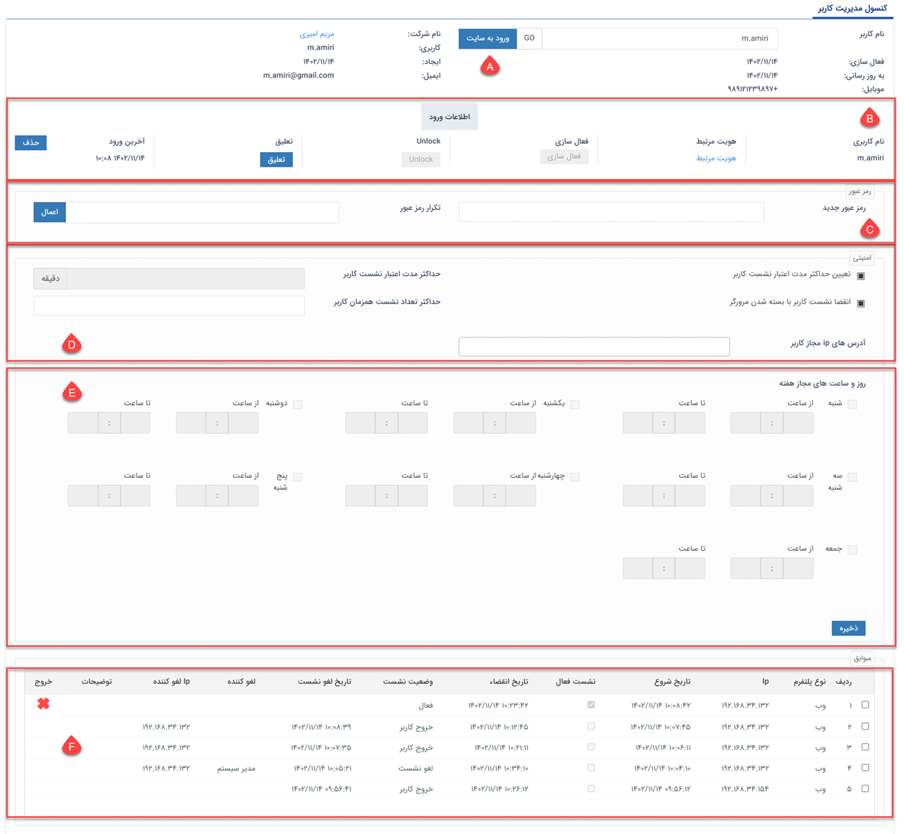

# مدیریت گروه‌ها و کاربران

از طریق این صفحه می‌توانید کاربر و گروه کاربری ساخته و همچنین کاربران، گروه‌های کاربری، دسترسی‌ها و حساب کاربران را مدیریت کنید.

 صفحه‌ی مدیریت گروه‌ها و کاربران دارای دو تب اصلی می‌باشد. با کلیک بر روی تب A لیست کاربران و باکلیک بر روی B لیست گروه‌ها به شما نمایش داده می‌شود. از آن‌جا که به هنگام ورود به صفحه، به صورت پیش‌فرض تب کاربران به شما نمایش داده می‌شود، ابتدا به بررسی این صفحه بخش می‌پردازیم. 
 **۱. کاربر جدید:**  با استفاده از کلید پایین صفحه،‌ می‌توانید کاربر جدید ایجاد نمایید. برای آشنایی بیشتر، راهنمای نحوه‌ی [ایجاد کاربر جدید](https://github.com/1stco/PayamGostarDocs/blob/master/Help/Settings/GroupsAndUsersManagement/NewUserCreation.md) را مطالعه نمایید. 
**۲. افزودن به گروه:** با انتخاب کاربر و کلیک بر روی این کلید می‌توانید کاربر مورد نظر را در یکی از گروه‌های کاربری (قابل مشاهده در تب B) عضو نمایید. 

> **نکته** 
> توجه داشته باشید به تعداد کاربر خریداری شده، امکان تعریف کاربر فعال و به تعداد نامحدود امکان تعریف کاربر غیرفعال وجود دارد. 

**۳. گروه‌های مرتبط:**  با کلیک بر روی هر کاربر، لیست گروه‌های کاربری  که او در آن‌ها عضو است، در این قسمت نمایش داده می‌شود. 
**۴. فلیتر:** با استفاده از این قسمت می‌توانید کاربران مورد نظر را بر اساس معیارهای مختلف فیلتر نمایید. 
- نوع کاربر: می‌توانید فرد مورد نظر خود را بر اساس نوع کاربری (کاربر /مشتری/نماینده) جستجو کنید. توجه داشته باشید که این پارامتر به صورت پیش‌فرض بر روی کاربر تنظیم شده است، برای مشاهده تمامی کاربران این لیست را روی حالت "همه" تنظیم کنید تا تمامی انواع کاربران را در لیست مشاهده کنید.
- ‌شرکت: با این پارامتر می‌توانید کاربر مورد نظر خود را بر اساس شعبه‌های تعریف شده در چارت خود، جستجو کنید.
- دپارتمان: پس از انتخاب شعبه، می‌توانید کاربر را بر اساس دپارتمان جستجو کنید. این به شما کمک می‌کند تا در صورت نیاز، کاربران هر دپارتمان را به صورت مجزا مشاهده نمایید.
- وضعیت: می‌توانید جستجوی خود را به کاربران فعال/غیرفعال محدود کنید و یا بین تمامی کاربران جستجو را انجام دهید.
- در این قسمت می‌توانید کاربر مورد نظر را با درج نام و یا نام کاربری او جستجو نمایید. 
پس از تنظیم پارامترهای فیلتر، برای مشاهده‌ی نتیجه، بر روی دکمه‌ی اعمال کلیک کنید. 
**۵. ویرایش:** با کلیک بر روی کلید ویرایش مقابل هر یک از کاربران، می‌توانید اطلاعات کاربری وی را ویرایش نمایید. در صورت نیاز به کسب اطلاعات در مورد هر یک از فیلدهای این صفحه، از راهنمای [ایجاد کاربر جدید](https://github.com/1stco/PayamGostarDocs/blob/master/Help/Settings/GroupsAndUsersManagement/NewUserCreation.md) استفاده کنید. 
**۶. ویرایش مجوزها:** از طریق این بخش می‌توانید مجوزهای هر کاربر را ویرایش کنید. برای اطلاعات بیشتر به قسمت [تعیین دسترسی کاربران](https://github.com/1stco/PayamGostarDocs/blob/master/Help/Settings/Manage-groups-and-users/permissions/Permissions_2.7.0.md) مراجعه کنید. 
**۷. تاثیر مجوزها:**{#permissionEffect} به  دلیل اینکه از قسمت‌های مختلف نرم‌افزار می‌توان مجوزهای کاربران را تعیین نمود، با کلیک بر روی این دکمه، تمامی مجوز‌های  تخصیص داده شده به کاربر را می‌توانید مشاهده نمایید. در حقیقت از این طریق می‌توانید ببینید در نهایت کاربر دارای چه دسترسی‌هایی می‌باشد (این دسترسی‌ها ممکن است از طریق شعبه، دپارتمان، سمت و یا مستقیم از طریق کاربری به او داده شده باشد). 
**۸. حذف:** از این طریق می‌توانید  کاربر مورد نظر را حذف کنید. در نظر داشته باشید که اگر کاربری که قصد حذف آن را دارید در نرم‌افزار هر گونه سابقه‌ای ایجاد کرده باشد، نرم‌افزار اجازه حذف آن را نخواهد داد. لذا می‌توانید کاربر را به جای حذف، از قسمت ویرایش آن، غیر فعال کنید. 
**۹. مدیریت کاربر:**{#َUserManagementConsole} با استفاده از این گزینه می‌توانید وارد کنسول مدیریت کاربر شوید. در مدیریت کاربر امکاناتات زیادی خواهید داشت، که در قسمت زیر در مورد آن‌ها توضیح داده شده است.

با ورود به صفحه‌ی مدیریت کاربران می‌توانید تنظیمات مورد نظر برای کاربر مربوطه را اعمال/ویرایش نموده و همچنین اطلاعاتی در مورد ورود به حساب کاربری وی به دست آورید. 

**A. اطلاعات کاربری** 
**ورود به سایت:**  با کلیک بر روی این گزینه می‌توانید از طریق این کاربری وارد نرم‌افزار شده و محیط نرم‌افزار را از دید او مشاهده کنید. بدیهی است که در این حالت هر اقدامی انجام گیرد، به نام کاربری مربوطه ثبت می‌شود. 

**B. اطلاعات ورود** 
**هویت مرتبط:** با کلیک بر روی هویت مرتبط، وارد صفحه پروفایل هویت کاربر می‌شوید. 
**فعالسازی:** با کلیک بر روی این کلید، کاربری که کاربری‌اش غیرفعال شده است، مجدد فعال می‌گردد. 
**Unlock:** در صورت قفل شدن حساب کاربری فرد، از این قسمت می‌توانید اقدام به رفع آن نمایید. 
**تعلیق:** با کلیک بر روی این کلید، وضعیت کاربر به حالت تعلیق تغییر نموده و کاربر امکان ورود به نرم‌افزار را نخواهد داشت. در این حالت پیغامی مبتنی بر تعلیق به ایشان نمایش داده می‌شود. 
برای برداشتن تعلیق، کافیست بر روی «رفع تعلیق» که در همین قسمت به شما نمایش داده می‌شود، کلیک نمایید. 
**آخرین ورود:** در این بخش، تاریخ و ساعت آخرین ورود کاربر به نرم‌افزار نمایش داده می‌شود. با کلیک بر روی کلید «حذف» می‌توانید لاگ آخرین ورود او را از سیستم حذف نمایید. 

**C. تغییر رمز عبور** 
در صورت نیاز به تغییر رمز عبور کاربر، کافیست رمز جدید را در این قسمت وارد و تکرار نمایید. با کلیک بر روی دکمه‌ی «اعمال»، رمز او به رمز جدید تغییر خواهد کرد. از این بخش می‌توانید برای مواقعی که کاربر رمز خود را فراموش کرده، استفاده نمایید. 

**D. محدودیت‌های نشست کاربر** 
**تعیین حداکثر مدت اعتبار نشست کاربر:** با استفاده از این قسمت می‌توانید مدت زمان فعالیت کاربر پس از هر ورود را محدود نمایید. برای این کار کافیست بر روی آیکون مربع کنار آیتم کلیک کرده تا به حالت تیک تغییر کند و زمان مورد نظر را بر حسب دقیقه در کادر مقابل وارد نمایید. در این حالت،‌ پس از گذشت مدت زمان مشخص شده، کاربر به صورت خودکار از حساب کاربری خود خارج شده و در صورت نیاز به ورود مجدد لازم است  با استفاده از نام کاربری و رمزعبود خود، اقدام به ورود نماید. 
**انقضای نشست کاربر با بسته شدن مرورگر:** با فعال کردن این قسمت (کلیک بر روی آیکون مربع و تغییر آن به حالت تیک) با بسته شدن صفحه‌ی مرورگر، کاربر از حساب خود خارج شده و  در صورت نیاز به ورود مجدد لازم است با استفاده از نام کاربری و رمزعبود خود، اقدام به ورود نماید. 
> **نکته** 
 > چنانچه تنظیمات آیکون کناری در هر یک از آیتم‌های فوق (حداکثر مدت اعتبار نشست و بستن مرورگر) در حالت خنثی (مربع) باشد، شرایط محدودیت بر اساس آنچه در بخش [تنظیمات امنیتی](https://github.com/1stco/PayamGostarDocs/blob/master/Help/Settings/General-settings/security/securitySetting-2.8.1.md) تعیین شده، اعمال می‌شود. 
 >> در صورت کلیک مجدد بر روی آیکون کناری و تغییر آن به حالت ضربدر، تنظیمات و محدودیت‌های درج شده در بخش [تنظیمات امنیتی](https://github.com/1stco/PayamGostarDocs/blob/master/Help/Settings/General-settings/security/securitySetting-2.8.1.md)، برای این کاربر غیرفعال خواهد شد.

 **حداکثر تعداد نشست همزمان کاربر:** با فعال کردن این گزینه، می‌توانید حداکثر تعداد نشست همزمان کاربر از طریق مرورگرها و یا اپلیکیشن را محدود نمایید. چنانچه عدد یک در این قسمت درج شود، کاربر پس از ورود از طریق یک مروگر، تا هنگام خروج از آن، امکان ورود از طریق مرورگر دیگر و یا اپلیکیشن موبایل را نخواهد داشت. 

> **نکته** 
> در صورت عدم درج عدد در این قسمت، شرایط محدودیت بر اساس آنچه در بخش [تنظیمات امنیتی](https://github.com/1stco/PayamGostarDocs/blob/master/Help/Settings/General-settings/security/securitySetting-2.8.1.md) تعیین شده، اعمال می‌شود. 

**آدرس‌های IP مجاز کاربر:** در صورت درج آدرس IP در این بخش، کاربر تنها از طریق IP تعیین شده امکان ورود به نرم‌افزار را خواهد داشت. در صورت تلاش برای ورود از طریق IP دیگر، کاربر با پیغام خطا روبرو شده و امکان ورود نخواهد داشت.

**E. محدودیت‌های روز و ساعت** 
 با استفاده از این بخش می‌توانید دسترسی کاربر را به روزها و ساعات مشخص، محدود کنید. برای این کار کافیست روز(های) مجاز را انتخاب کرده و ساعات مجاز برای استفاده‌ی این کاربر از نرم‌افزار را مشخص کنید. 
 
 > **نکته** 
 > با فعال کردن یکی از روزهای هفته، دسترسی به نرم‌افزار (امکان ورود) در سایر روزها، برای کاربر غیرممکن می‌شود. چنانچه هیچ کدام از روزها در این بخش فعال نشده باشد، محدودیتی بر روی روز و ساعات ورود (به جز موارد تعیین شده در تنظیمات امنیتی و تنظیمات بخش بالا) برای کاربر اعمال نمی‌شود. 

**F. سوابق ورود کاربر** 
در این قسمت می‌توانید گزارش ورود خروج کاربر را مشاهده نمایید. تاریخ انتقضا در این جدول، نشان‌دهنده‌ی محدودیت زمانی‌ است که از بخش تنظیمات امنیتی و یا تنظیمات بالا برای کاربر در نظر گرفته شده است. 

در تب B می‌توانید لیست گروه‌‌های ایجاد شده را مشاهده نمایید. درصورت نیاز به ارجاع وظیفه گروهی به کاربران، انتخاب مسئولین کارتابل در فرآیندکاری، ثبت نظر برای گروهی از کاربران و تخصیص گروهی دسترسی فعالیت، می‌توانید گروه‌های کاربری مجزا تعیین کنید. برای کسب اطلاعات بیشتر در مورده نحوه‌ی ایجاد گروه کاربران، راهنمای [ایجاد گروه‌های کاربری](https://github.com/1stco/PayamGostarDocs/blob/master/Help/Settings/GroupsAndUsersManagement/UserGroupManagement.md) را مطالعه نمایید. 
