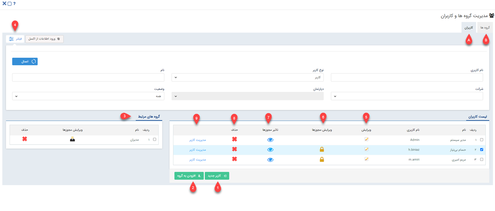
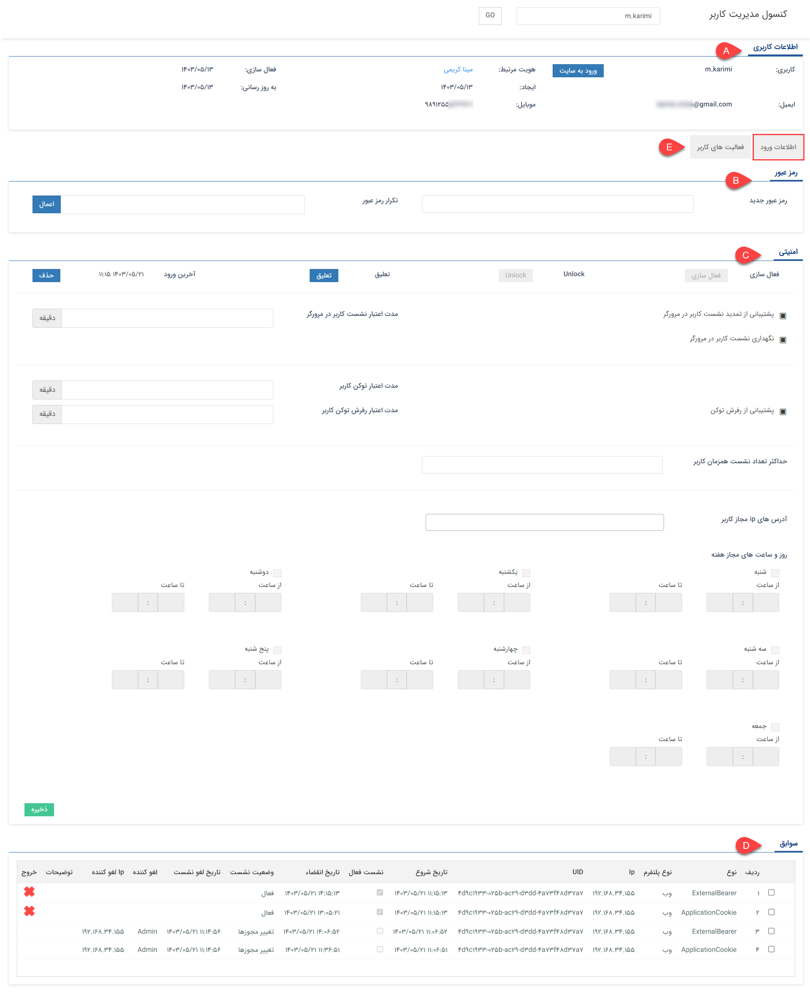
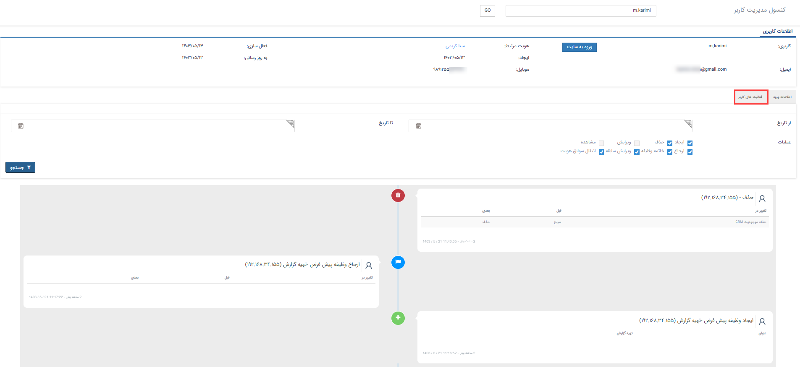

# مدیریت گروه‌ها و کاربران

در این صفحه می‌توانید کاربران و گروه‌های کاربری خود را مدیریت نمایید و کاربر یا گروه جدید بسازید. 

 صفحه‌ی مدیریت گروه‌ها و کاربران دارای دو تب اصلی می‌باشد: 
 - تب A، با نمایش لیست کاربران، امکان ایجاد و مدیریت کاربران نرم‌افزار را برای شما فراهم می‌سازد. 
 - تب B، با نمایش لیست گروه‌های کاربران، امکان ایجاد و مدیریت گروه‌های کاربران را به می‌دهد. 
توضیحات لازم در خصوص نحوه ایجاد گروه‌های کاربری و مدیریت آن‌ها، در راهنمای [ایجاد گروه‌های کاربری](https://github.com/1stco/PayamGostarDocs/blob/master/Help/Settings/GroupsAndUsersManagement/UserGroupManagement.md) ارائه شده‌است. در این بخش، به بررسی تب کاربران پ امکانات این صفحه می‌پردازیم. 
امکانات صفحه، بر اساس شماره‌گذاری تصویر فوق، به شرح زیر می‌باشد: 

 **۱. کاربر جدید:**  با استفاده از کلید پایین صفحه،‌ می‌توانید کاربر جدید ایجاد کنید. برای آشنایی بیشتر با نحوه‌ی تعریف کاربر، راهنمای نحوه‌ی [ایجاد کاربر جدید](https://github.com/1stco/PayamGostarDocs/blob/master/Help/Settings/GroupsAndUsersManagement/NewUserCreation.md) را مطالعه نمایید. 
**۲. افزودن به گروه:** با انتخاب کاربر و کلیک بر روی این کلید می‌توانید کاربر مورد نظر را در یکی از گروه‌های کاربری (قابل مشاهده در تب B) عضو نمایید. 

> **نکته** 
> توجه داشته‌باشید به تعداد کاربر خریداری شده، امکان تعریف کاربر فعال برای شما فراهم می‌باشد. محدودیتی در تعریف کابران غیرفعال وجود ندارد. 

**۳. گروه‌های مرتبط:**  با انتخاب هر کاربر، لیست گروه‌های کاربری  که او در آن‌ها عضو است، در این قسمت نمایش داده‌می‌شود. 
**۴. فلیتر:** با استفاده از این قسمت می‌توانید کاربران مورد نظر را بر اساس معیارهای مختلف فیلتر نمایید. 
- نوع کاربر: می‌توانید فرد مورد نظر خود را بر اساس نوع کاربری (کاربر /مشتری/نماینده) جستجو کنید. توجه داشته باشید که این پارامتر به صورت پیش‌فرض بر روی کاربر تنظیم شده است، برای مشاهده تمامی کاربران این لیست را روی حالت "همه" تنظیم کنید تا تمامی انواع کاربران را در لیست مشاهده کنید.
- ‌شرکت: با این پارامتر می‌توانید کاربر مورد نظر خود را بر اساس شعبه‌های تعریف شده در چارت خود، جستجو کنید.
- دپارتمان: پس از انتخاب شعبه، می‌توانید کاربر را بر اساس دپارتمان جستجو کنید. این به شما کمک می‌کند تا در صورت نیاز، کاربران هر دپارتمان را به صورت مجزا مشاهده نمایید.
- وضعیت: می‌توانید جستجوی خود را به کاربران فعال/غیرفعال محدود کنید و یا بین تمامی کاربران جستجو را انجام دهید.
- در این قسمت می‌توانید کاربر مورد نظر را با درج نام و یا نام کاربری او جستجو نمایید. 
پس از تنظیم پارامترهای فیلتر، برای مشاهده‌ی نتیجه، بر روی دکمه‌ی اعمال کلیک کنید. 
**۵. ویرایش:** با کلیک بر روی کلید ویرایش مقابل هر یک از کاربران، می‌توانید اطلاعات کاربری وی را ویرایش نمایید. در صورت نیاز به کسب اطلاعات در مورد هر یک از فیلدهای این صفحه، از راهنمای [ایجاد کاربر جدید](https://github.com/1stco/PayamGostarDocs/blob/master/Help/Settings/GroupsAndUsersManagement/NewUserCreation.md) استفاده کنید. 
**۶. ویرایش مجوزها:** از طریق این بخش می‌توانید مجوزهای هر کاربر را ویرایش کنید. برای اطلاعات بیشتر به قسمت [تعیین دسترسی کاربران](https://github.com/1stco/PayamGostarDocs/blob/master/Help/Settings/Manage-groups-and-users/permissions/Permissions_2.7.0.md) مراجعه کنید. 
**۷. تاثیر مجوزها:**{#permissionEffect} با توجه به اینکه مسیرهای مختلفی برای تنظیم مجوزهای کاربران در نرم‌افزار وجود دارد، مشاهده‌ی برآیند مجوزهای داده شده به یک کاربر، می‌تواند شما را نسبت به مجوزهای اعطا شده مطمئن سازد. با کلیک بر روی این دکمه، تمامی مجوز‌های  تخصیص داده‌شده به کاربر را می‌توانید مشاهده نمایید. در حقیقت از این طریق می‌توانید ببینید در نهایت کاربر دارای چه دسترسی‌هایی می‌باشد (این دسترسی‌ها ممکن است از طریق شعبه، دپارتمان، سمت و یا مستقیم از طریق کاربری به او داده شده‌باشد). 
**۸. حذف:** از این طریق می‌توانید کاربر مورد نظر را حذف کنید. در نظر داشته‌باشید که اگر کاربری که قصد حذف آن را دارید در نرم‌افزار هر گونه سابقه‌ای ایجاد کرده باشد، نرم‌افزار اجازه حذف آن را نخواهد‌داد. لذا می‌توانید کاربر را به جای حذف، غیر‌فعال کنید. برای این کار با کلیک بر روی آیکون ویرایش، وارد تنظیمات کاربری هویت شوید. 
**۹. مدیریت کاربر:**{#َUserManagementConsole} با استفاده از این گزینه می‌توانید وارد کنسول مدیریت کاربر شوید. در ادامه به بررسی تنظیمات و امکانات کنسول مدیریت کاربر می‌پردازیم. 

**A. اطلاعات کاربری** 
در این قسمت می‌توانید خلاصه‌ای از اطلاعات کاربری هویت را مشاهده نمایید. از طریق لینک نام هویت مرتبط کاربری (نام هویت که با رنگ آبی نمایش داده‌می‌شود) می‌توانید وارد صفحه پروفایل وی شوید. علاوه بر این اطلاعات کلید ورود به سایت را در این قسمت مشاهده می‌کنید. 
**ورود به سایت:**  با کلیک بر روی این گزینه می‌توانید از طریق این کاربری وارد نرم‌افزار شده و محیط نرم‌افزار را از دید او مشاهده کنید. بدیهی است که اقدامات انجام شده در این حالت، به نام کاربری مربوطه ثبت می‌شود. 

**B. رمز عبور** 
در صورت نیاز به تغییر رمز عبور کاربر، کافی است رمز جدید را در این قسمت وارد و تکرار نمایید. با کلیک بر روی کلید «اعمال»، رمز او به رمز جدید تغییر پیدا می‌کند. از این بخش می‌توانید برای مواقعی که کاربر رمز خود را فراموش کرده، استفاده نمایید. 

**C. امنیتی** 
**فعالسازی:** در صورت غیرفعال شدن کاربری شخص، با کلیک بر روی این کلید می‌توانید مجدداً کاربری وی را فعال نمایید. 
**Unlock:** در صورت قفل شدن حساب کاربری فرد، از این قسمت می‌توانید اقدام به رفع آن نمایید. 
**تعلیق:** با کلیک بر روی این کلید، وضعیت کاربر به حالت تعلیق تغییر نموده و کاربر امکان ورود به نرم‌افزار را نخواهد‌داشت. در این حالت پیغامی مبتنی بر تعلیق کاربری به ایشان نمایش داده‌می‌شود. 
برای برداشتن تعلیق، کافی است بر روی «رفع تعلیق» که در همین قسمت به شما نمایش داده‌می‌شود، کلیک نمایید. 
**آخرین ورود:** در این بخش، تاریخ و ساعت آخرین ورود کاربر به نرم‌افزار نمایش داده‌می‌شود. با کلیک بر روی کلید «حذف» می‌توانید لاگ آخرین ورود او را از سیستم حذف نمایید. 
**پشتیبانی از تمدید نشست کاربر در مرورگر:** با فعال‌سازی این گزینه (کلیک بر روی آیکون کناری و تغییر آن به حالت تیک)، زمان اعتبار نشست کاربر در نرم‌افزار به جای زمان ورود، از آخرین فعالیت وی در پیام‌گستر در نظر گرفته‌می‌شود. به عنوان مثال با در نظر گرفتن مدت اعتبار نشست ۳۰ دقیقه‌ای، کاربر تا ۳۰ دقیقه پس از آخرین فعالیت خود در نرم‌افزار، در آن معتبر شناخته شده و پس از آن نیازمند ورود مجدد است. لکن در صورت غیرفعال بودن این گزینه، کاربر ۳۰ دقیقه پس از زمان ورود به نرم‌افزار باید اقدام به ورود مجدد نماید. 
**مدت اعتبار نشست کاربر در نرم‌افزار:** با استفاده از این بخش می‌توانید مدت زمان مجاز برای فعالیت کاربر پس از هر ورود را محدود نمایید. در این حالت،‌ پس از گذشت مدت زمان مشخص شده، کاربر به صورت خودکار از حساب کاربری خود خارج شده و در صورت نیاز به ورود مجدد لازم است  با استفاده از نام کاربری و رمزعبود خود، اقدام به ورود نماید. در صورت خالی بودن این قسمت، مدت اعتبار نشست کاربر بر اساس تنظیمات امنیتی (قابل تنظیم در تنظیمات کلی) در نظر گرفته‌می‌شود. 
**نگهداری نشست کاربر در مرورگر:** با فعال کردن این قسمت (کلیک بر روی آیکون مربع و تغییر آن به حالت تیک) با بسته شدن صفحه‌ی مرورگر، کاربر تا زمان اعتبار نشست خود می‌تواند بدون نیاز به درج مجدد نام کاربری و رمز عبور، وارد حساب کاربری خود در نرم‌افزار شود. به عبارتی فعال‌سازی این گزینه، اعتبار نشست کاربر در نرم‌افزار در صورت بسته شدن مرورگر را تا پایان اعتبار زمانی آن نشست، حفظ می‌کند. 
**پشتیبانی از رفرش توکن:** 

 **حداکثر تعداد نشست همزمان کاربر:** با درج عدد در این قسمت می‌توانید حداکثر تعداد نشست همزمان کاربر از طریق مرورگرها و یا اپلیکیشن را محدود نمایید. چنانچه عدد یک در این قسمت درج شود، کاربر پس از ورود از طریق یک مروگر، تا هنگام خروج از آن، امکان ورود از طریق مرورگر دیگر و یا اپلیکیشن موبایل را نخواهد‌داشت. در صورت خالی بودن این قسمت، حداکثر تعداد نشست بر اساس تنظیمات امنیتی (قابل تنظیم در تنظیمات کلی) اعمال می‌شود. 

> **نکته** 
> تنظیمات مرتبط با نشست کاربر و اعتبار توکن، تنظیمات عمومی هستند که از قسمت [تنظیمات امنیتی](https://github.com/1stco/PayamGostarDocs/blob/master/Help/Settings/General-settings/security/securitySetting-2.8.4.md) (تنظیمات کلی > امنیتی)، برای کلیه کاربران تنظیم می‌گردند. چنانچه می‌خواهید تعداد معدودی از کاربران را از قاعده مستثنی کنید و تنظیمات دیگری برای آن‌ها در نظر بگیرید، این تنظیمات را در بخش کاربری وی تغییر دهید. در غیر این صورت نیازی به تنظیم این بخش‌ها در کنسول کاربر نمی‌باشد. در این راستا به توضیحات زیر توجه داشته‌باشید:
- در حالت انتخاب آیکون مربع، تنظیمات بر اساس آنچه در تنظیمات کلی امنیتی درج شده، برای کاربر لحاظ می‌شود.
- در حالت تغییر آیکون به حالت تیک، گزینه‌ی مربوطه برای کاربر فعال می‌شود. یعنی چنانچه این موارد در بخش تنظیمات کلی امنیتی غیرفعال در نظر گرفته شده‌باشد، برای این کاربر فعال خواهدبود.
- در حالت تغییر آیکون به حالت ضربدر، چنانچه این موارد در بخش تنظیمات کلی امنیتی فعال در نظر گرفته‌شده باشد، برای این کاربر غیرفعال خواهد بود.
- در مواردی که برای درج عدد در نظر گرفته شده، در صورت خالی بودن بخش، مربوطه، مدت اعتبار برا اساس تنظیمات کلی امنیتی اعمال می‌شود. در صورت درج عدد در این بخش‌ها، اعتبار موارد مذکور صرفاً برای این کاربر، بر اساس اعداد درج شده در کنسول لحاظ می‌شود. 
**آدرس‌های IP مجاز کاربر:** در صورت درج آدرس IP در این بخش، کاربر تنها از طریق IP تعیین شده امکان ورود به نرم‌افزار را خواهد‌داشت. در چنین حالتی، کاربر در صورت تلاش برای ورود از طریق IP دیگر، با پیغام خطا روبرو شده و امکان ورود نخواهد‌داشت. 
**روز و ساعت های مجاز هفته:** 
 با استفاده از این بخش می‌توانید دسترسی کاربر را به روزها و ساعات مشخص، محدود کنید. برای این کار کافی است روز(های) مجاز را انتخاب کرده و ساعات مجاز برای استفاده‌ی این کاربر از نرم‌افزار را مشخص کنید. 
 
 > **نکته** 
 > با فعال کردن یکی از روزهای هفته، دسترسی به نرم‌افزار (امکان ورود) در سایر روزها، برای کاربر غیرممکن می‌شود. چنانچه هیچ کدام از روزها در این بخش فعال نشده باشد، محدودیتی بر روی روز و ساعات ورود (به جز موارد تعیین شده در تنظیمات امنیتی و تنظیمات بخش بالا) برای کاربر اعمال نمی‌شود. 
پس از اعمال تغییرات مورد نظر، تنظیمات خود را ذخیره نمایید.

**D. سوابق ورود کاربر** 
در این قسمت می‌توانید گزارش ورود خروج کاربر را مشاهده نمایید. تاریخ انقضا در این جدول، نشان‌دهنده‌ی محدودیت زمانی‌ است که از بخش تنظیمات امنیتی و یا تنظیمات بالا برای کاربر در نظر گرفته شده‌است. 

**E. فعالیت‌های کاربر**{#َUserActivities} 
از قسمت میانی صفحه، می‌توانید به تب فعالیت‌های کاربر انتقال پیدا کنید. در این بخش تمامی فعالیت‌هایی که کاربر در نرم‌افزار انجام داده‌است، به شما نمایش داده‌می‌شود. فیلترهای موجود در این بخش به شما این امکان را می‌دهد که فعالیت‌های یک بازه زمانی مشخص و یا نوع خاصی از اقدامات را فیلتر و مشاهده نمایید. به عنوان مثال می‌توانید تمامی آیتم‌هایی که کاربر آن‌ها را حذف یا ویرایش کرده و یا وظایفی که ایجاد کرده و ارجاع داده‌است را ببینید. 

در این بخش با مدیریت کاربران آشنا شدید. برای تکمیل اطلاعات خود در زمینه مدیریت گروه‌های کاربران، بخش [راهنمای گروه‌های کاربری](https://github.com/1stco/PayamGostarDocs/blob/master/Help/Settings/GroupsAndUsersManagement/UserGroupManagement.md) را نیز مطالعه نمایید. 

