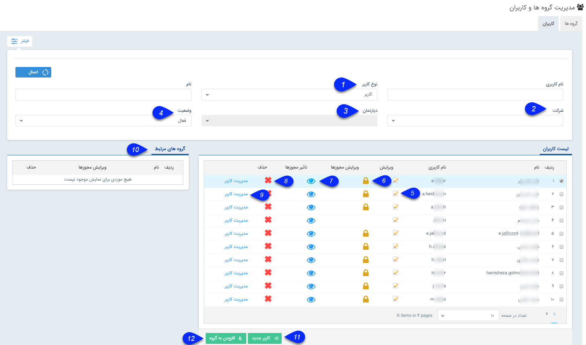
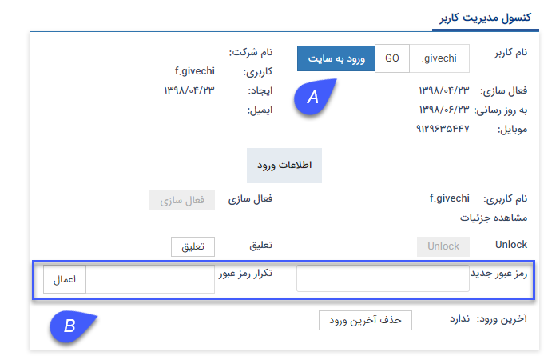

# مدیریت گروه‌ها و کاربران

قبل از انجام تنظیمات و ساخت کاربران، لیست کامل کاربرانی که در سیستم مسئولیت دارند را تهیه نمایید. امکان ساخت لیست کاربران با سمت و حکم پرسنلی به صورت اکسل نیز ورود وجود دارد. در طول زمان در صورت نیاز به روز رسانی اطلاعات می‌توانید از این قابلیت استفاده نمایید. در ضمن تنظیمات امینتی رمز عبور و محدودیت دسترسی برای کاربران از دیگر مسئولیت‌های راهبری می‌باشد.

###  ایجاد کاربر جدید

ابتدا باید اطلاعات کاربران را در سیستم ایجاد نمایید. 
**1.**   می‌توانید لیست کاربران خود را از قسمت **ورود اطلاعات کاربران** به صورت اکسل وارد نمایید (در ورژن 2.6.0 به بعد) و یا به صورت تکی از قسمت **کاربر جدید** اطلاعات کاربر را وارد نمایید.

**2.**   از قسمت **گروه‌ها** لیست گروه‌های کاربری را ساخته و افراد را به گروه مربوطه اضافه نمایید.

###  تنظیمات امنیتی

بعد از ایجاد کاربران و گروه‌های کاربری می‌توانید تنظیمات مربوط به رمز عبور را در این قسمت فعال نمایید. این تنظیمات از مراحل آماده سازی سیستم برای فعالیت‌ های کاربر می‌باشد.

###  نمایش نام کاربر در نرم‌افزار

از دیگر تنظیماتی که باید برای بخش کاربران سیستم انجام دهید، نحوه نمایش نام کاربر در سیستم می‌باشد. در این قسمت انتخاب می‌کنید که به صورت نام کاربری یا نام و نام خانوادگی، نام کاربران نمایش داده شود.

###  ایجاد گروه‌های کاربری

درصورت نیاز به ارجاع وظیفه گروهی به کاربران، انتخاب مسئولین کارتابل در فرآیندکاری، ثبت نظر به گروهی برای کاربران و تخصیص گروهی دسترسی فعالیت، می‌توانید گروه‌های کاربری مجزا تعیین کنید. 

  ایجاد و ویرایش اطلاعات کاربران در بخش "مدیریت گروه‌ها و کاربران" امکان پذیر است:
 

در قسمت فیلتر می‌توانید براساس پارامتر‌های زیر کاربر یا کاربران مد نظر خود را جستجو کنید.

**1.نوع کاربر:** می‌توانید کاربر مورد نظر خود را براساس نوع کاربری (کاربر /مشتری/نماینده) جستجو کنید. توجه داشته باشید که این پارامتر به صورت پیشفرض بر روی کاربر تنظیم شده است، برای مشاهده تمامی کاربران این لیست را روی حالت "همه" تنظیم کنید تا تمامی انواع کاربران را در لیست مشاهده کنید.

**2. شرکت:** با این پارامتر می توانید کاربر مورد نظر خود را بر اساس شعبه جستجو کنید.

**3. دپارتمان:** پس از انتخاب شعبه ، می توانید کاربر را بر اساس دپارتمان جستجو کنید.

**4. وضعیت:** می توانید کاربر را بر اساس وضعیت (فعال/غیرفعال) جستجو کنید.

**5. ویرایش:** کاربر انتخاب شده را می توانید ویرایش کنید.

**6. ویرایش مجوزها:** مجوزهای هر کاربر را میتوانید ویرایش کنید. برای اطلاعات بیشتر به قسمت [تعیین دسترسی کاربران](https://github.com/1stco/PayamGostarDocs/blob/master/Help/Settings/Manage-groups-and-users/permissions/Permissions_2.7.0.md) مراجعه کنید.

**7. تاثیر مجوز ها:** به دلیل اینکه از قسمت‌های مختلف نرم افزار می‌توان مجوزهای کاربران را تعیین نمود، با کلیک بر روی این دکمه، تمامی مجوز‌های  تخصیص داده شده به کاربر را می‌توانید مشاهده نمایید.{#permissionEffect}

**8. حذف:** می‌توانید کاربر مورد نظر را حذف کنید. در نظر داشته باشید که اگر این نام کاربری که قصد حذف آن را دارید در نرم افزار هر گونه سابقه‌ای ایجاد کرده باشد، نرم افزار اجازه حذف آن را نخواهد داد. لذا می‌توانید کاربر را به جای حذف از قسمت ویرایش آن، غیر فعال کنید.

**9. مدیریت کاربر:** با استفاده از این گزینه می‌توانید وارد کنسول مدیریت کاربر شوید. .
 

**A.**  با کلیک بر روی این گزینه می‌توانید با این کاربری وارد نرم‌افزار شده و محیط نرماف‌زار را از دید او مشاهده کنید.

**B.** در صورت نیاز می‌توانید از این بخش رمز عبور کاربر را تغییر دهید و رمز عبور جدیدی برای این کاربر تنظیم نمایید.

**تعلیق:** زمانی که کاربر را به حالت تعیلق تنظیم نمایید، در صفحه ورود به نرم‌افزار اجازه ورود را به کاربر نداده و پیغام تعلیق بودن را به وی نشان می‌دهد.

**آخرین ورود:** در این بخش تاریخ و ساعت آخرین ورود کاربر در نرم‌افزار را نمایش می‌دهد.

**10. گروه‌های مرتبط:** با کلیک بر روی هر کاربر لیست گروه‌های کاربری  که او در آنها عضو است را در این قسمت نمایش می‌دهد.

**11. کاربر جدید:** با استفاده از این دکمه می توانید یک کاربر جدید ایجاد کنید. برای اطلاعات بیشتر قسمت [ایجاد کاربر جدید](https://github.com/1stco/PayamGostarDocs/blob/master/Help/Settings/GroupsAndUsersManagement/NewUserCreation.md) مطالعه کنید.

**12. افزودن به گروه:** می توانید کاربری را که انتخاب کرده اید به یک گروه کاربری دلخواه اضافه کنید.

> **نکته:** توجه داشته باشید به تعداد کاربر خریداری شده امکان تعریف کاربر فعال و به تعداد نامحدود امکان تعریف کاربر غیرفعال وجود دارد.

 
 
 
