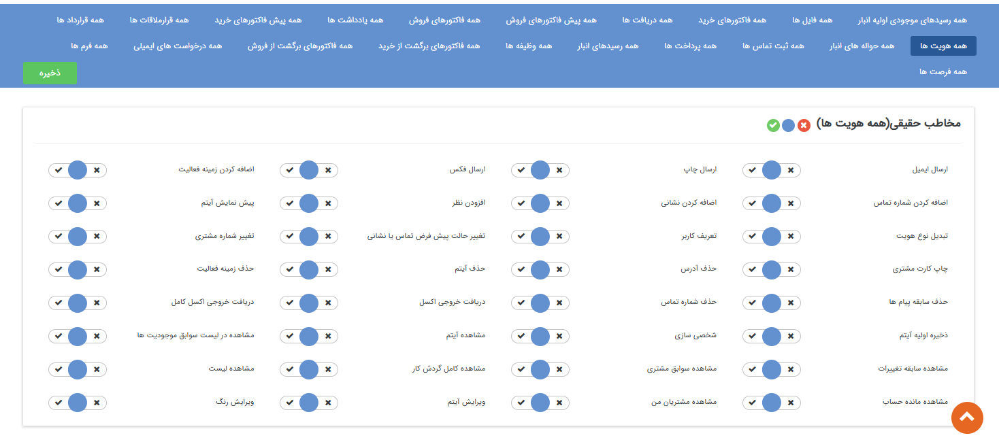
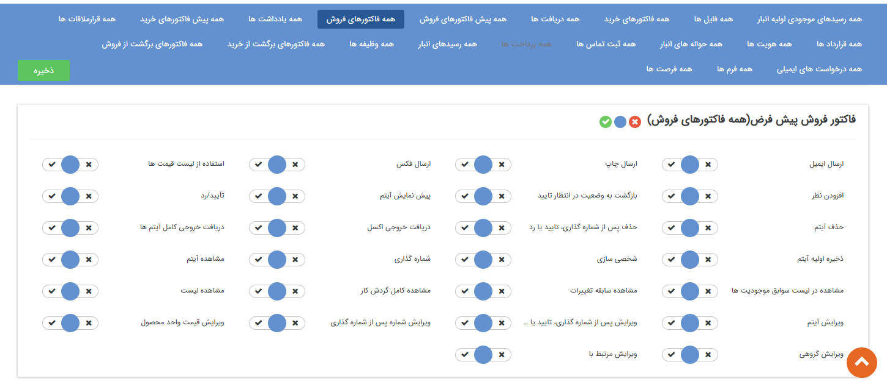
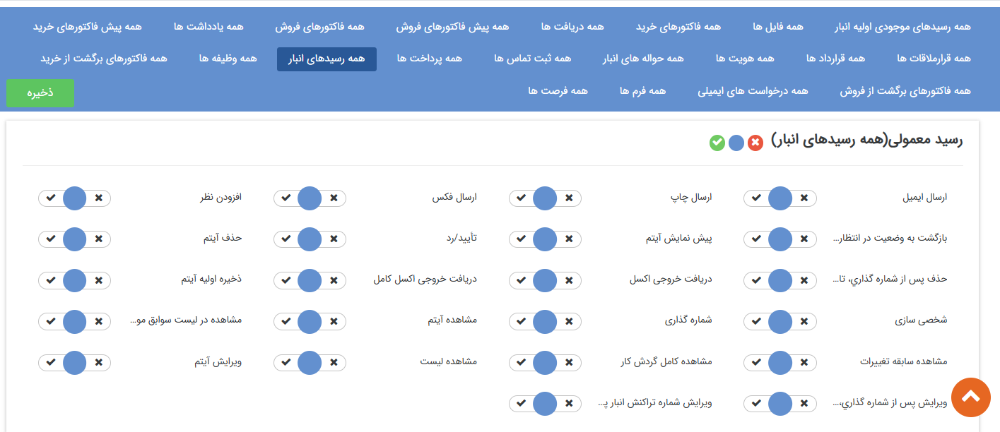
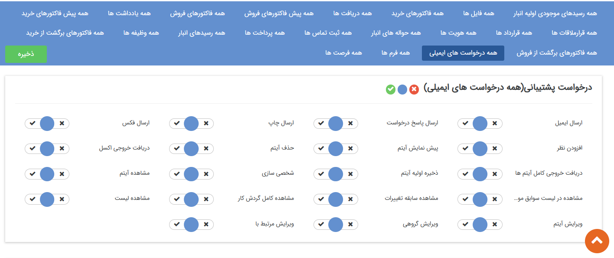
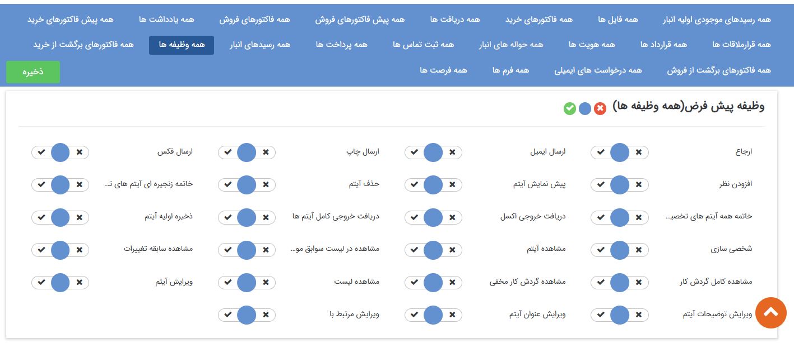

# تعیین دسترسی‌ موجودیت‌ها
در این مقاله به موضوعات زیر می‌پردازیم: 
- [«دسترسی موجودیت‌ها» کدام بخش از نرم‌افزار هستند؟](#CRMObject'sPermissions)
- [مجوزهای مشترک بین تمام آیتم‌های CRM](#CommonPermissions)
- [مجوزهای اختصاصی «هویت‌ها»](#Identity'sPermissions)
- [مجوزهای اختصاصی در آیتم‌های «مالی و پیش‌فاکتورهای خرید و فروش»](#FinancialItem'sPermissions)
- [مجوزهای اختصاصی آیتم‌های «دریافت و پرداخت»](#RecivedAndPayment'sPermissions)
- [مجوزهای اختصاصی آیتم «فرصت»](#Opportunity'sPermissions)
- [مجوزهای اختصاصی «آیتم‌های انبارداری»](#InventoryItem'sPermissions)
- [مجوزهای اختصاصی آیتم «درخواست پشتیبانی»](#Ticket'sPermissions)
- [مجوزهای اختصاصی آیتم «وظیفه»](#Task'sPermissions)
- [مجوزهای اختصاصی آیتم «قرارملاقات»](#Appointment'sPermissions)
- [مجوزهای اختصاصی آیتم «فایل»](#File'sPermissions)

## «دسترسی موجودیت‌ها» کدام بخش از نرم‌افزار هستند؟{#CRMObject'sPermissions}
هر زیرنوع موجودیتی که در بخش شخصی‌سازی ایجاد می‌کنید لازم است دسترسی استفاده‌ی آن را به کاربران سیستم تخصیص دهید. هر یک از این موجودیت‌ها متناسب با ویژگی‌هایی که دارند علاوه بر دسترسی‌های مشترک، دسترسی مختص خود را دارند.  در این راهنما، ابتدا به مجوزهایی که بین تمامی موجودیت‌ها مشترک هستند می‌پردازیم و سپس مجوزهای مختص به هر یک از موجودیت‌ها را بررسی می‌کنیم. 

> **نکته** 
> توجه داشته‌باشید که برخی مجوزها پیش‌نیاز یک یا چند مجوز دیگر است. به عنوان مثال مجوز **مشاهده آیتم** پیش نیاز برخی از مجوز‌ها مانند **ارسال ایمیل** یا **افزودن نظر** است.

## مجوزهای مشترک بین تمام آیتم‌های CRM{#CommonPermissions}
مجوزهای مشترک بین آیتم‌ها را بر روی آیتم فرم آموزش می‌دهیم. فرم به دلیل خنثی بودن ماهیتی که دارد مجوز اختصاصی نداشته و تمام مجوزهای آن در سایر آیتم‌های CRM مشترک است. 

1. **ارسال ایمیل** اجازه ارسال قالب نمایش این آیتم از طریق ایمیل را به کاربر می‌دهد. (برای مثال قالب چاپی فاکتور را برای مخاطب ارسال می‌کند.)
2. **ارسال چاپ:** اجازه ارسال قالب نمایش این آیتم از طریق چاپ را به کاربر می‌دهد. (برای مثال قالب چاپی پیش فاکتور را با مشخصات مخاطبی که به آن مرتبط است چاپ می‌کند.)
3. **ارسال فکس:** اجازه ارسال قالب نمایش این آیتم از طریق فکس را به کاربر می‌دهد. (برای مثال قالب چاپ فرم را برای مخاطبی که برای او فرم را ذخیره کرده ایم ارسال می‌کند.)
4. **افزودن نظر:** اجازه اضافه کردن نظر روی این آیتم را به کاربر می‌دهد.
5. **پیش‌نمایش آیتم:** اجازه پیش نمایش گرفتن از قالب چاپ این آیتم را به کاربر می‌دهد.
6. **ذخیره اولیه آیتم:** اجازه ثبت این آیتم را به کاربر می‌دهد. (برای مثال صدور پیش فاکتور را به کارشناس فروش می‌دهد.)
7. **مشاهده آیتم:** اجازه مشاهده کردن این آیتم را به کاربر می‌دهد. در واقع اگر کاربر این مجوز را نداشته‌باشد، پس از ثبت آیتم، امکان مشاهده آن را نخواهدداشت. به صورت کلی، کاربر برای اینکه بتواند با کلیک بر روی یک آیتم، آن را باز و مشاهده کند، نیاز به این مجوز دارد.
8. **مشاهده لیست:** به صورت پیش‌فرض هر کاربر در لیست‌ سوابق و آیتم‌ها، تنها می‌تواند آیتم‌هایی که خودش ثبت کرده‌است را مشاهده کند. مگر اینکه به عنوان مسئول آن انتخاب شده‌باشد یا مجوز مشاهده‌ی لیست را بر روی آن آیتم داشته‌باشد. این مجوز دسترسی مشاهده آیتم‌هایی که سایر کاربران ثبت کرده‌اند را به کاربر می‌دهد. (برای مثال کاربر تنها فاکتورهایی که خود ذخیره کرده‌است را مشاهده می‌کند اما با داشتن این مجوز می‌تواند فاکتورهایی که دیگر کاربران ثبت کرده اند را نیز در لیست مشاهده کند.) 
9. **مشاهده در لیست سوابق موجودیت‌ها:** با این مجوز کاربر لیست سوابق هر آیتم CRM را می‌تواند مشاهده نماید. برای آیتم‌های هویت، فرم، فرصت، وظیفه و ... که سربرگ سوابق دارند، کاربر به سبب این مجوز می تواند لیست سوابقی که مرتبط با آن آیتم ثبت شده است را مشاهده کند.
10. **دریافت خروجی اکسل:** برای اینکه کاربر بتواند از رکوردهایی که در لیست آیتم مشاهده می‌کند (اجازه مشاهده آن در لیست را دارد)، خروجی اکسل دریافت کند، لازم است که این مجوز را داشته‌باشد. توجه داشته‌باشید که کاربر با داشتن این مجوز، تنها می‌تواند از اطلاعات قابل مشاهده در لیست آیتم (فیلدهای اطلاعاتی که در لیست نمایش داده می‌شود)، خروجی اکسل تهیه کند. به عبارت دیگر، حتی اگر کاربر مجوز مشاهده آیتم را داشته‌باشد، خروجی اکسلی که به واسطه‌ی این مجوز تهیه کرده‌است، شامل تمامی فیلدهای اطلاعاتی آیتم نبوده و تنها ستون‌هایی را شامل می‌شود که در لیست آیتم مشاهده می‌کند.
11. **دریافت خروجی کامل آیتم‌ها:**  کاربر با داشتن این مجوز می‌تواند از تمامی اطلاعات رکوردهایی که در لیست آیتم مشاهده می‌کند (اجازه مشاهده آن در لیست را دارد)، خروجی اکسل دریافت کند. توجه داشته‌باشید که با داشتن این مجوز، کاربر حتی اگر مجوز مشاهده آیتم‌ را نداشته‌باشد (نتواند آیتم را باز و مشاهده کند)، می‌تواند از رکوردهایی که در لیست مشاهده می‌کند، خروجی اکسلی تهیه کند که اطلاعات کامل آن آیتم‌ را شامل شود. بر اساس توضیحات مندرج، چنانچه لازم است کاربری قابلیت دریافت خروجی کامل از تمامی رکوردهای یک آیتم را داشته‌باشد، لازم است که مجوز «مشاهده لیست» و «دریافت خروجی کامل آیتم‌ها» را بر روی آن آیتم داشته‌باشد. 

> **نکته** 
> اگر لیست مورد نظر، شامل چند زیرنوع از آیتم باشد (مثلاً لیست همه فاکتورها) و مجوزهای «دریافت خروجی اکسل» و «دریافت خروجی کامل آیتم‌ها» بر روی زیرنوع‌های موجود در لیست متفاوت باشد، کم‌ترین سطح دسترسی موجود برای دریافت خروجی اکسل در نظر گرفته شده و بر اساس آن، فایل اکسل دریافت می‌شود. 

12. **مشاهده سابقه تغییرات:** اجازه مشاهده تغییراتی که از ابتدای ایجاد این آیتم بر روی آن اتفاق افتاده است را به کاربر می‌دهد.
13. **مشاهده کامل گردش کار:** در صورتی که آیتم چرخه کاری فعال داشته باشد، کاربر با داشتن این مجوز می‌تواند چگونگی گردش آیتم در کارتابل کاربران را مشاهده نماید.
14. **حذف آیتم:** اجازه حذف این آیتم را به کاربر می‌دهد. (در آیتم‌های دارای قابلیت تایید/رد کاربر با داشتن این مجوز تنها قبل از تایید/رد آیتم می‌تواند آن را حذف کند)
15. **ویرایش آیتم:** اجازه ویرایش این آیتم پس از ذخیره اولیه را به کاربر می‌دهد. برای آیتم‌های دارای قابلیت تایید/رد، کاربر با داشتن این مجوز تنها می‌تواند قبل از تایید، آیتم را ویرایش کند.
16. **ویرایش گروهی:** اجازه تغییر دسته جمعی آیتم مورد نظر را به کاربر می‌دهد.
17. **ویرایش مرتبط با:** دسترسی تغییر هویتی که این آیتم به او مرتبط شده است را به کاربر می‌دهد. (کاربر می‌تواند فرم را از سوابق یک مخاطب به سوابق مخاطب دیگری منتقل کند.)
18. **شخصی سازی:** اجازه شخصی سازی (ویرایش تنظیمات این آیتم، تغییر چرخه، اضافه کردن فیلد و ...) این آیتم را به کاربر می‌دهد.

## مجوزهای اختصاصی «هویت‌ها»{#Identity'sPermissions}
علاوه بر مجوزهای مشترک ذکر شده در بخش قبل، دسترسی‌های هویت برای موارد سرنخ، مخاطب، کاربر در چند مجوز تفاوت دارند، برای همین کلیه مجوزها را روی آیتم هویت از نوع سرنخ حقوقی آموزش می‌دهیم. 

1. **اضافه کردن زمینه فعالیت:** از آنجایی که هر هویت امکان عضویت در بیش از یک دسته بندی بانک اطلاعاتی را دارد، کاربر در صورت داشتن این مجوز می‌تواند زمینه فعالیت جدیدی در قسمت "دسته بندی بانک اطلاعاتی" به هویت اضافه کند.
2. **اضافه کردن شماره تماس:** امکان تعریف شماره تماس جدید (از نوع تلفن، موبایل، فکس و تلفکس) برای هویت را به کاربر می‌دهد.
3. **اضافه کردن نشانی:** امکان تعریف کردن آدرس جدید برای هویت را به کاربر می‌دهد.
4. **تبدیل نوع هویت:** امکان تبدیل مخاطب/سرنخ حقیقی به حقوقی یا بالعکس را به کاربر می‌دهد.(با نداشتن این مجوز دکمه تبدیل هویت در نوار ابزار مشخصات نمایش داده نخواهد شد)
5. **تعریف پرسنل:** امکان تعریف پرسنل جدید را برای هویت‌های حقوقی به کاربر می‌دهد.
6. **تعریف کاربر:** کاربر با داشتن این مجوز می‌تواند برای هویت، کاربری باشگاه مشتریان ایجاد کند. (با نداشتن این مجوز دکمه تعریف کاربر در نوار ابزار مشخصات نمایش داده نخواهد شد)
7. **تعیین رابط:** کاربر با داشتن این مجوز می‌تواند یکی از پرسنل تعریف شده برای هویت‌های حقوقی را به عنوان رابط تعیین کند (با نداشتن این مجوز دکمه "تعیین به عنوان رابط" در تب پرسنل هویت‌های حقوقی نمایش داده نخواهد شد)
8. **تعیین مدیر:** کاربر با داشتن این مجوز می‌تواند یکی از پرسنل تعریف شده برای هویت‌های حقوقی را به عنوان مدیر تعیین کند (با نداشتن این مجوز دکمه "تعیین به عنوان مدیر" در تب پرسنل هویت‌های حقوقی نمایش داده نخواهد شد)
9. **تغییر حالت پیش فرض یا نشانی:**  از آن جایی که می‌توان به تعداد نامحدود شماره تماس یا نشانی برای هویت‌ها تعریف کرد، باید یکی از آن‌ها به عنوان پیشفرض تعیین گردد. کاربر با داشتن این مجوز می‌تواند شماره تماس یا آدرس پیشفرض را تغییر دهد. (در صورت نداشتن مجوز اولین شماره تماس/آدرس تعریف شده به عنوان پیشفرض تعیین می‌گردد)
10. **تغییر شماره مشتری:** کاربر در صورت داشتن این مجوز امکان تخصیص یا تغییر شماره مشتری برای هویت را خواهد داشت.
11. **تغییر وضعیت سرنخ:** امکان تبدیل سرنخ به مخاطب یا تغییر وضعیت سرنخ‌های نامعلوم به عدم کفایت یا بالعکس را به کاربر می‌دهد. (مخصوص هویت از نوع سرنخ می‌باشد)
12. **چاپ کارت مشتری:** با داشتن این مجوز دکمه "صدور کارت" در نوار ابزار مشخصات هویت نمایش داده خواهد شد و کاربر می‌تواند برای مشتری کارت صادر کند. (برای تغییر قالب چاپی کارت مشتری به [تنظیمات کلی ](https://github.com/1stco/PayamGostarDocs/blob/master/Help/Settings/General-settings/Customer-card/Customer-card.md)مراجعه کنید)
13. **حذف آدرس:** امکان حذف آدرس‌های تعریف شده برای هویت را به کاربر می‌دهد.
14. **حذف پرسنل:** امکان حذف پرسنل تعریف شده برای هویت‌های حقوقی را به کاربر خواهد داد. (توجه کنید هویت حقیقی مرتبط با پرسنل حذف نخواهد شد و تنها ارتباط آن هویت با شرکت حذف خواهد شد)
15. **حذف زمینه فعالیت:** از آنجایی که هر هویت امکان عضویت در بیش از یک دسته بندی بانک اطلاعاتی را دارد، کاربر در صورت داشتن این مجوز می‌تواند در قسمت "دسته بندی بانک اطلاعاتی" زمینه‌های فعالیت تعریف شده برای هویت را حذف نماید.
16. **حذف سابقه پیام‌ها:** از آنجایی که پیام‌های ارسالی برای هویت‌ها (پیام کوتاه، ایمیل، فکس) در سربرگ سوابق نمایش داده می‌شود، کاربر با داشتن این مجوز می‌تواند سابقه پیام‌ها را حذف نماید.
17. **حذف شماره تماس:** کاربر یا داشتن این مجوز می‌تواند شماره تماس‌های تعریف شده برای هویت (تلفن، موبایل، فکس و تلفکس) را حذف نماید.
18. **مشاهده سوابق مشتری:** در صورتی که کاربر این مجوز را نداشته باشد در سربرگ سوابق هویت، تنها لیست سوابق ایجاد شده توسط خودش را مشاهده خواهد کرد و سوابق ایجاد شده توسط سایر کاربران برای او قایل مشاهده نیست.

> **نکته**  
> توجه داشته باشید کاربر حتی در صورت داشتن مجوز مشاهده سوابق مشتری، فقط می‌تواند لیست سوابق ایجاد شده را در سربرگ سوابق مشاهده نماید و برای باز کردن و مشاهده جزئیات هریک از سوابق باید مجوز مشاهده آیتم مربوطه را داشته باشد. 

19. **مشاهده مانده حساب:** کاربر در صورت داشتن این مجوز در صفحه مشخصات هویت، فیلد مانده حساب را مشاهده خواهد کرد. همچنین می‌تواند در سربرگ مالی، لیست سوابق مالی تایید شده را مشاهده نماید.
20. **مشاهده مشتریان من:** هویت‌هایی که شماره مشتری دارند باید علاوه بر مجوز **مشاهده آیتم**، قابل مشاهده هستند.
21. **ویرایش رنگ:** امکان تخصیص رنگ به هویت یا تغییر آن را به کاربر می‌دهد.

# مجوزهای اختصاصی در قرارداد و انواع فاکتور {#FinancialItem'sPermissions}
مجوزهایی که در این بخش توضیح داده می‌شود برای آیتم‌های قرارداد، پیش‌فاکتور، فاکتور، فاکتور برگشت از فروش و خرید مشترک می‌باشد. 

> **نکته** 
> مجوزهای **استفاده از لیست قیمت** و **ویرایش قیمت واحد محصول** فقط برای پیش‌فاکتور، فاکتور و فاکتور برگشت از فروش و خرید می‌باشد.

1. **استفاده از لیست قیمت:** اجازه تغییر لیست قیمت را به کاربر می‌دهد. (مخصوص آیتم‌های از نوع فاکتور، پیش فاکتور است.)
2. **تایید/ رد:** این آیتم را برای تایید در کارتابل این کاربر نمایش می‌دهد. (مخصوص آیتم‌های مالی - فاکتور، دریافت و ... - و آیتم‌های انبار - حواله و رسیدها- است.)
3. **حذف پس از شماره گذاری، تایید یا رد:**  اجازه حذف این آیتم پس از تایید شدن را به کاربر می‌دهد. (مخصوص آیتم‌های مالی - فاکتور، دریافت و ... - و آیتم‌های انبار - حواله و رسیدها- است.)
4. **شماره گذاری:** این آیتم را برای شماره گذاری در کارتابل کاربر نمایش می‌دهد، علاوه بر این کاربر اجازه تعیین شماره دستی برای آیتم را خواهد داشت.
5. **ویرایش پس از شماره گذاری، تایید یا رد:**  اجازه ویرایش پس از تایید آیتم را به کاربر میدهد. (مخصوص آیتم‌های مالی - فاکتور، دریافت و ... - و آیتم‌های انبار - حواله و رسیدها- است.)
6. **ویرایش شماره پس از شماره گذاری:** اجازه تغییر شماره آیتم پس از تایید را به کاربر تخصیص می‌دهد. (مخصوص آیتم‌های مالی - فاکتور، دریافت و ... - و آیتم‌های انبار - حواله و رسیدها- است.)
7. **ویرایش قیمت واحد محصول:** با استفاده از این مجوز کاربر این امکان را دارد که قیمت واحد محصول را در این فاکتور/پیش فاکتور ویرایش کند.

## مجوزهای اختصاصی آیتم‌های «دریافت و پرداخت»{#RecivedAndPayment'sPermissions}

 
1. **تعیین نوع دریافت/پرداخت چکی:** با استفاده از این مجوز می‌توانید تعیین کنید که کاربر مجوز ثبت دریافت/پرداخت‌ از نوع **چکی** را داشته باشد. (به طور مثال در صورتی که کاربر مجوز تعیین نوع دریافت چکی را نداشته باشد، در هنگام ثبت دریافت، در فیلد نوع دریافت گزینه‌های نقدی و اعتباری را مشاهده خواهد کرد.)
2. **تعیین نوع دریافت/پرداخت نقدی** با استفاده از این مجوز می‌توانید تعیین کنید که کاربر مجوز ثبت دریافت/پرداخت‌ از نوع **نقدی** را داشته باشد. (به طور مثال در صورتی که کاربر مجوز تعیین نوع دریافت چکی را نداشته باشد، در هنگام ثبت دریافت، در فیلد نوع دریافت گزینه‌های چکی و اعتباری را مشاهده خواهد کرد.)
3. **تعیین نوع دریافت/پرداخت اعتباری** با استفاده از این مجوز می‌توانید تعیین کنید که کاربر مجوز ثبت دریافت/پرداخت‌ از نوع **اعتباری** را داشته باشد. (به طور مثال در صورتی که کاربر مجوز تعیین نوع دریافت چکی را نداشته باشد، در هنگام ثبت دریافت، در فیلد نوع دریافت گزینه‌های نقدی و چکی را مشاهده خواهد کرد.)

## مجوزهای اختصاصی آیتم «فرصت»{#Opportunity'sPermissions}

**1. انتخاب محصول در فرصت:** امکان اضافه کردن محصول در قسمت "محصولات فرصت" را به کاربر می‌دهد.

## مجوزهای اختصاصی «آیتم‌های انبارداری»{#InventoryItem'sPermissions}
مجوزهای آیتم‌های انبارداری مانند آیتم‌های پیش‌فاکتور و فاکتور می‌باشد ولی نام آیتم انبار در برخی مجوزها ذکر شده است.

## مجوزهای اختصاصی آیتم «درخواست پشتیبانی»{#Ticket'sPermissions}

**ارسال پاسخ درخواست:** کاربر در صورت نداشتن این مجوز، امکان ارسال پاسخ به مشتری از طریق ایمیل برای درخواست ثبت شده وجود نخواهد داشت و دکمه "ارسال پاسخ"  نمایش داده نخواهد شد.
## مجوزهای اختصاصی آیتم «وظیفه»{#Task'sPermissions}
علاوه بر مجوزهای مشترک، با موارد زیر می‌توان دسترسی کاربران به وظیفه‌ها را مدیریت کرد. لازم به ذکر است که مجوز **مشاهده آیتم** پیش‌نیاز تمامی موارد زیر می‌باشد.

1. **ارجاع:** قابلیت ارجاع وظیفه به کاربران دیگر را به کاربر می‌دهد. یعنی در صورت این نداشتن این مجوز کاربر تنها می‌تواند وظایف را برای خود ذخیره نماید و نمی‌تواند آن را به کاربران دیگر ارجاع دهد. علاوه بر این وظایف ارجاع شده توسط سایر کاربران نیز برای او قابلیت ارجاع مجدد نخواهند داشت. (توجه داشته باشید برای ارجاع مجدد وظایف ارجاع شده باید نحوه ارجاع وظیفه "اصل" باشد و ارجاعات از نوع رونوشت قابلیت ارجاع مجدد ندارند)
2. **خاتمه زنجیره ای آیتم‌های تخصیص داده شده:** کاربر در صورت داشتن این مجوز می‌تواند با زدن دکمه خاتمه زنجیره ای، زنجیره ارجاعات بعد از خود را خاتمه دهد. (با نداشتن این مجوز دکمه "خاتمه زنجیره ای" در نوار ابزار مشخصات وظیفه نمایش داده نخواهد شد)
3. **خاتمه همه آیتم‌های تخصیص داده شده:** کاربر در صورت داشتن این مجوز می‌تواند با زدن دکمه خاتمه همه، تمامی‌نسخه‌های وظیفه که در کارتابل کاربران موجود است را خاتمه دهد.  (با نداشتن این مجوز دکمه "خاتمه همه" در نوار ابزار مشخصات وظیفه نمایش داده نخواهد شد)
4. **مشاهده کامل گردش کار:** از آنجایی که آیتم وظیفه قابلیت ارجاع دارد، گردش کار این آیتم با گردش کار سایر آیتم‌ها (که روال فرایند طی شده را نمایش می‌دهد) متفاوت است، به صورت پیشفرض در قسمت "مشاهده گردش کار" وظیفه، تمامی‌ارجاعات مرتبط با کاربر (ارجاعات قبل و بعد) که در قسمت پاراف نیز نمایش داده می‌شوند، قابل مشاهده است، اما کاربر با داشتن این مجوز می‌تواند تمامی‌ارجاعات وظیفه (حتی ارجاعات از نوع رونوشت مخفی) را مشاهده نماید.

> **نکته**  
> توجه داشته باشید حتی با داشتن این مجوز، در قسمت پاراف باز هم ارجاعات مرتبط با کاربر نمایش داده می‌شود و در قسمت مشاهده گردش کار، می‌توان گردش کار کامل را مشاهده نمود.

5. **مشاهده گردش کار مخفی:** کاربر در صورت داشتن این مجوز می‌تواند ارجاعات از نوع "رونوشت مخفی" را نیز در قسمت پاراف و مشاهده گردش کار، مشاهده نماید.
6. **ویرایش توضیحات آیتم:** در صورتی که کاربر این مجوز را نداشته باشد، قسمت توضیحات وظیفه برای او قایل ویرایش نیست و تنها می‌تواند توضیحات درج شده توسط سایر کاربران را مشاهده نماید.
7. **ویرایش عنوان آیتم:** در صورت نداشتن این مجوز، عنوان وظیفه برای کاربر به صورت غیرفعال نمایش داده می‌شود و نمی‌تواند آن را ویرایش کند.

> **نکته** 
> در صورتی که کاربر مجوز‌های ویرایش توضیحات آیتم/ویرایش عنوان آیتم را نداشته باشد، در هنگام ذخیره وظیفه می‌تواند عنوان/توضیحات دلخواه خود را وارد نماید، اما پس از ذخیره امکان ویرایش آن نیست.

## مجوزهای اختصاصی آیتم «قرارملاقات»{#Appointment'sPermissions}

**گذاشتن مکان روی نقشه:** کاربر با داشتن این مجوز می‌تواند محل قرار ملاقات را روی نقشه نمایش داده شده در فرم قرار ملاقات مشخص کند.

## مجوزهای اختصاصی آیتم «فایل»{#File'sPermissions}

**دانلود فایل:** اجازه دانلود فایل ذخیره شده را به کاربر می‌دهد.

