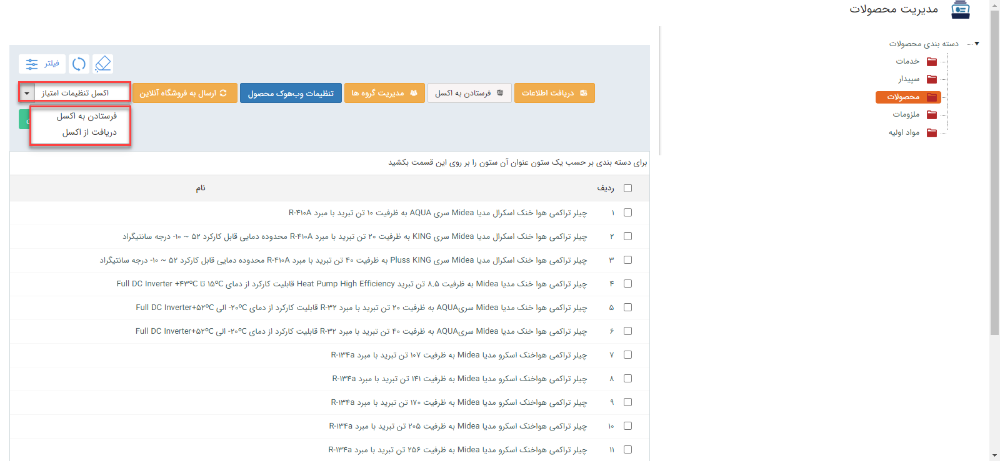
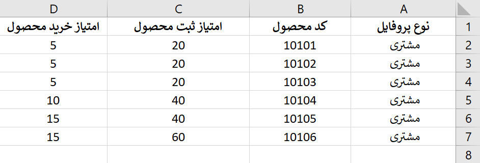
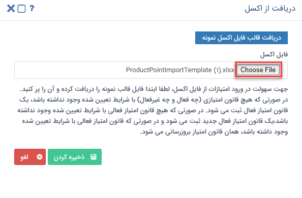

# امتیازدهی محصولات از طریق اکسل

در صورت نیاز به بارگذاری امتیازات محصولات به صورت یکجا، می‌توانید از روش ورود اکسلی استفاده نمایید. بدین ترتیب می‌توانید اطلاعات امتیازات مورد نظر را در اکسل درج نمایید و سپس بارگذاری کنید. همچنین از این روش می‌توانید برای ویرایش لیست امتیازات موجود استفاده نمایید. 
برای اینکه بارگذاری لیست امتیازات بدون مواجهه با خطا و با موفقیت به اتمام برسد، لازم است که قوانین تهیه و بارگذاری اکسل را رعایت کنید. در این راهنما تمامی موارد لازم برای تنظیم صحیح فایل اکسل، به همراه شیوه بارگذاری آن مطرح شده‌است. بدین منظور در این راهنما به موارد زیر می‌پردازیم: 

- [شیوه‌ی تهیه و تنظیم فایل اکسل امتیازات](#ProductsScoreExcel)
- [روش بارگذاری فایل اکسل امتیازات](#ProductsScoreExcelUploading)
- [مجوزهای لازم برای بارگذاری اکسل امتیازات](#ProductsScoreExcelPermision)

## تنظیمات فایل اکسل{#ProductsScoreExcel}
برای بارگذاری و ورود اطلاعات  مربوط به امتیازات محصولات از طریق اکسل، ابتدا باید اکسل مورد نظر را بر اساس فرمت مورد پذیرش نرم‌افزار تنظیم کنید. بدین منظور می‌توانید از فایل نمونه آماده شده در نرم‌افزار استفاده کنید و یا اکسلی مشابه تصویر نمونه ایجاد کنید.  برای دسترسی به فایل نمونه از **مدیریت محصولات** > **اکسل تنظیمات امتیاز** > **دریافت از اکسل** می‌توانید فایل نمونه را دانلود کنید.
علاوه بر آن می‌توانید ابا کلیک بر روی **اکسل تنظیمات امتیاز** > **فرستادن به اکسل** یک خروجی اکسل بگیرید و از قالب آن برای ورود اطلاعات خود استفاده کنید.

برای تکمیل فایل اکسل، به موارد زیر توجه فرمایید:

برای امتیازات محصولات و خدمات هر دسته‌بندی، اکسل جداگانه‌ای تهیه کنید. به عنوان مثال اگر دو دسته‌بندی «مواداولیه» و «محصولات» در قسمت مدیریت محصولات ایجاد کرده‌اید، برای بارگذاری اقلامی که می‌خواهید در دسته‌بندی محصولات قرار بگیرند یک فایل اکسل و برای اقلام دسته‌بندی مواد‌اولیه یک فایل اکسل دیگر تهیه نمایید.
در تهیه اکسل توجه داشته‌باشید که تمامی اطلاعات در یک Sheet قرار گیرد. در غیر این صورت بارگذاری اکسل با موفقیت انجام نخواهدشد.

تصویر فوق،‌ ستون‌های مورد نیاز برای بارگذاری  امتیازات محصولات و خدمات را بر اساس فیلدهای پیش‌فرض نرم‌افزار نشان می‌دهد. برای تکمیل اطلاعات مربوط به این فیلدها، به راهنمایی‌های زیر توجه داشته‌باشید: 
- **نوع پروفایل:** نوع پروفایلی که می‌خواهید این امتیاز به آن تعلق گیرد را تعیین کنید. انواع پروفایل در پیام‌گستر شامل مشتری، اپراتور، نماینده، رقیب، تامین کننده می‌باشد. 
- **کد محصول:** در این سلول، کد محصولی را که قصد دارید به ازای خرید یا ثبت سریال آن محصول، پروفایل مورد‌نظر امتیاز دریافت کند را وارد می‌کنید. 
- **امتیاز ثبت سریال محصول:** در این قسمت می‌بایست میزان امتیازی که پروفایل مورد نظر به ازای ثبت سریال محصول کسب می‌کند را تعیین نمایید. ثبت سریال محصول به این معنی است که هر بار که سریال این محصول از طریق پیامک برای یک مشتری فعال شود(اصالت کالا)، نرم افزار امتیاز تعیین شده در این قسمت را به حساب او اضافه خواهد کرد. 
- **امتیاز خرید محصول:** در این قسمت می بایست میزان امتیازی که قصد دارید پروفایل انتخاب شده، به ازای خرید محصول موردنظر دریافت کند را تعیین نمایید. به عبارت دیگر تعیین نمایید که خرید این محصول چند امتیاز دارد. 

بعد از آپلود فایل اکسل اطلاعات امتیاز بر روی ذخیره کردن کلیک می‌کنید تا تنظیمات امتیازات بر روی محصولات اعمال گردد.

> **نکته**  
در نظر داشته باشید دریافت امتیازات از طریق کد محصول انجام می‌شود و در صورت خالی بودن کد محصول امتیازی از طریق اکسل دریافت نمی‌شود.

در هنگام دریافت اطلاعات امتیاز، فقط می‌توانید از طریق فعالیت‌های خرید محصول و ثبت سریال محصول برای پروفایل‌های موردنظر امتیازات را تعریف کنید. برای کسب اطلاعات قوانین امتیازدهی می‌توانید به قسمت تنظیمات امتیاز مراجعه کنید.

****
در نظر داشته باشید در صورتی که هیچ قانون امتیازی (چه فعال و چه غیرفعال) با شرایط تعیین شده وجود نداشته باشد، یک قانون امتیاز فعال ثبت می‌شود. در صورتی که هیچ قانون امتیاز فعالی با شرایط تعیین شده وجود نداشته باشد، یک قانون امتیاز فعال جدید ثبت می‌شود و در صورتی که قانون امتیاز فعالی با شرایط تعیین شده وجود داشته‌باشد، همان قانون امتیاز بروزرسانی می‌شود.
*****

## مراحل بارگذاری فایل اکسل{#ProductsScoreExcelUploading}
بارگذاری امتیازات محصولات از طریق اکسل از طریق مرحله زیر انجام می‌گیرد.

### دریافت از اکسل 
برای ورود اطلاعات امتیازات محصولات از طریق اکسل، ابتدا باید محصولات را در مدیریت محصولات  تعریف کنید و قوانین مشخصی را برای امتیازدهی مشخص کنید.
برای ایجاد لیست امتیازات از طریق **اطلاعات پایه** > **مدیریت محصولات** > **اکسل تنظیمات امتیاز**  می‌توانید امتیازات مرتبط با هر محصول را براساس کد محصول و نوع پروفایل تعیین کنید.

 با ورود به این بخش و تکمیل فایل اکسل می‌توانید فایل اکسل موردنظر را از طریق choose file انتخاب کرده و در این بخش بارگذاری کنید.

فایل اکسل نامعتبر است

## مجوز مورد نیاز برای بارگذاری امتیازات از طریق اکسل{#ProductsScoreExcelPermision}
برای ایجاد لیست امتیازات از طریق اکسل،‌ کاربر باید مجوز مدیریت محصولات را داشته باشد. 
