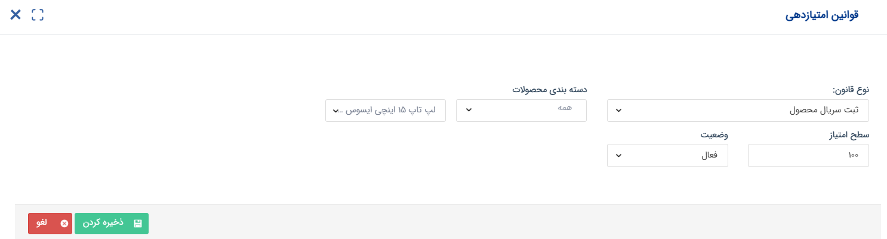
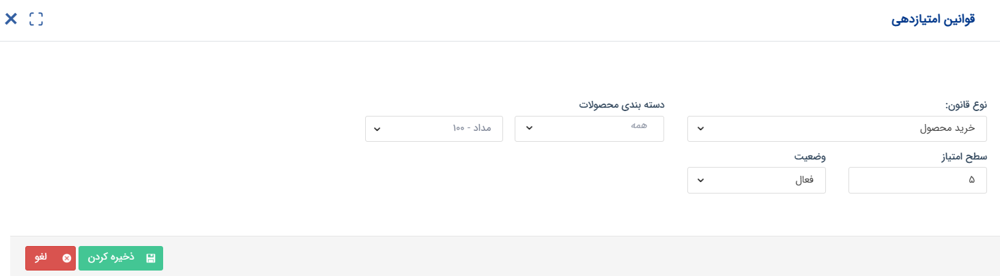
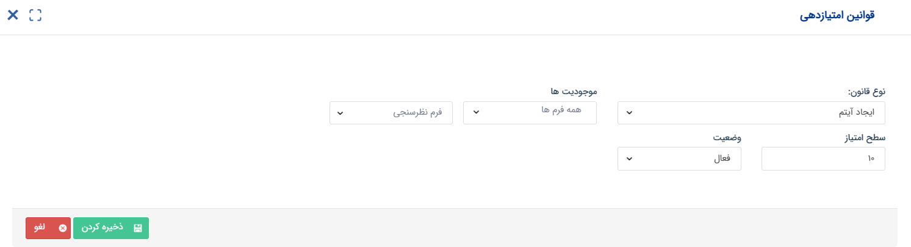
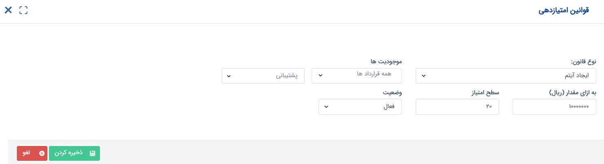
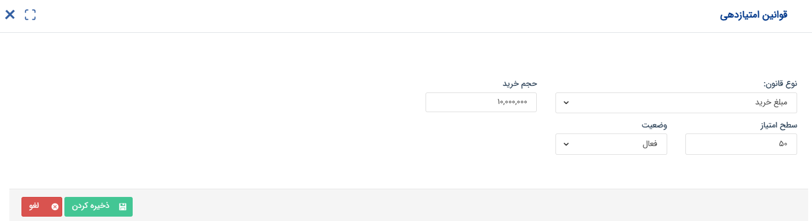

# قوانین امتیازدهی
برای تنظیم قوانین امتیازدهی، لازم است که نوع قانون و سطح امتیاز را برای هر نوع پروفایل مشخص کنید. در صفحه قوانین امتیازدهی، قوانینی که تا کنون تنظیم شده را مشاهده نموده و با استفاده از فیلترهای بالای صفحه، قوانین مورد نظر را بیابید. در صورت نیاز می‌توانید این قوانین را ویرایش، غیرفعال و یا حذف کنید. 

به صورت کلی، شما می توانید از ۵ نوع قانون امتیازدهی برای سیستم امتیازدهی خود استفاده کنید: 
- امتیازدهی بر اساس ثبت سریال محصول
- امتیازدهی بر اساس خرید محصول
- امتیازدهی بر اساس ایجاد آیتم
- امتیازدهی بر اساس ثبت‌نام در باشگاه
- امتیازدهی بر اساس مبلغ خرید

برای تنظیم قانون جدید، کافیست که بر روی کلید «افزودن» کلیک کنید و نوع قانون را انتخاب کنید تا تنظیمات مورد نیاز برای هر یک از آن‌ها به شما نمایش داده شود. در ادامه‌، به بررسی عملکرد و نحوه تنظیم هر یک از این قوانین می‌پردازیم.

## ثبت سریال محصول
در صورت استفاده از انبارداری سریالی و اعمال تنظیمات لازم برای اصالت کالا، می‌توانید از ثبت سریال برای امتیازدهی استفاده کنید. بدین ترتیب و بر اساس امتیازی که برای هر محصول تعریف کرده‌اید، زمانی که مشتری سریال محصول را برای شما ارسال می‌کند (تنظیمات لازم جهت دریافت سریال در بخش [تنظیمات اصالت کالا](https://github.com/1stco/PayamGostarDocs/blob/master/Help/Settings/Product-originality-management/Product-originality-management.md) تعیین شده‌است)، به میزان تعیین شده، امتیاز کسب می‌کند. 

امکان تعیین امتیاز برای گروه محصول وجود ندارد و لازم است که برای هر محصول، به صورت جداگانه امتیاز تعیین کنید.

## خرید محصول
بر اساس این قانون امتیازدهی، می‌توانید بابت خرید هر یک عدد از محصول مشخص شده، به مشتری امتیاز دهید. در این تنظیمات کافیست دسته‌بندی محصول را انتخاب و سپس محصول مورد نظر را مشخص کنید. توجه داشته‌باشید که امکان تعیین امتیاز برای دسته‌بندی وجود ندارد و لازم است که برای هر محصول، به صورت جداگانه اقدام به تنظیم امتیاز نمایید. بر اساس این قانون امتیازدهی، در صورت درج محصول مذکور در فاکتور فروش تایید شده، به ازای تعداد محصول موجود در فاکتور، به مشتری امتیاز اعطا می‌شود.  به عنوان مثال، اگر برای محصول مداد، امتیاز ۵ در نظر گرفته شده‌باشد، مشتری با خرید ۴ مداد، ۲۰ امتیاز کسب می‌کند.

امتیاز مذکور بر اساس فاکتور تایید شده به مشتری اعطا می‌شود. به همین سبب چنانچه فاکتور پس از تایید رد شود، امتیاز اعطا شده از مشتری کسر می‌شود. اگر پس از تایید فاکتور، فاکتور به حالت در انتظار تایید بازگردانده شود، امتیاز تا مشخص شدن وضعیت فاکتور، باقی مانده و از امتیاز مشتری کسر نمی‌شود. همچنین، در صورت ثبت فاکتور برگشتی برای محصول مذکور، به میزان مرجوعی، از امتیاز وی کاسته می‌شود.

## ایجاد آیتم
بر اساس این قانون امتیازدهی، به سبب ثبت آیتم، امتیازی برای مشتری در نظر گرفته می‌شود. پس از انتخاب موجودیت، زیرنوع مورد نظر برای تعیین قانون امتیازدهی را انتخاب نمایید. به عنوان مثال، اگر می‌خواهید برای ثبت فرم نظرسنجی برای مشتری امتیازی در نظر بگیرید، موجودیت فرم را انتخاب و سپس زیرنوع نظرسنجی را مشخص کنید. لازم به ذکر است که قانون امتیازدهی در این نوع، برای موجودیت‌های مالی و سایر موجودیت‌ها، کمی متفاوت است.

- اگر موجودیت انتخابی از نوع مالی نباشد (مثل انواع فرم، درخواست ایمیلی و سایر موارد که دارای فیلد مبلغ نمی باشند)، باید مشخص کنید با ثبت هر یک آیتم، چه مقدار امتیاز برای مشتری در نظر گرفته شود. به عنوان مثال، با ثبت هر فرم نظرسنجی، ۱۰ امتیاز به مشتری اختصاص داده شود. توجه داشته‌باشید که در صورت حذف آیتم، امتیاز اعطا شده، کسر می‌شود.

- اگر موجودیت انتخابی از نوع مالی است (انواع فاکتور، قرارداد مالی و حقوقی، دریافت و پرداخت که دارای فیلد مبلغ می‌باشند)، باید مشخص کنید که به ازای ثبت و تایید چه مقدار (ریالی) از آیتم مذکور، چه مقدار امتیاز برای مشتری در نظر گرفته شود. به عنوان مثال، به ازای هر ۱۰ میلیون ریال قرارداد پشتیبانی، ۲۰ امتیاز به مشتری اعطا شود.

در صورت رد آیتم مالی، امتیاز اعطا شده از مشتری کاسته می‌شود و چنانچه ویرایش آیتم بر امتیاز اعطا شده تاثیری داشته‌باشد، امتیاز اصلاح می‌شود.

## ثبت‌نام
اگر از باشگاه وفاداری (باشگاه مشتریان و نمایندگان) استفاده می‌کنید، می‌توانید از این قانون امتیازدهی برای ترغیب مشتریان و نمایندگان به ثبت‌نام در باشگاه استفاده کنید. با فعال‌سازی این قانون امتیازدهی، چنانچه نماینده ییا مشتری، خود از صفحه ثبت‌نام اقدام به ثبت‌نام در باشگاه نماید، به مقدار مندرج، امتیاز کسب می‌کند.

توجه داشته‌باشید که بر اساس این قانون امتیازدهی، امتیاز تنها به کاربرانی تعلق می‌گیرد که خودشان در باشگاه ثبت‌نام کرده‌اند و ایجاد کاربری باشگاه از طریق فرآیند یا پرسنل، شامل امتیاز نمی‌شود. 

## مبلغ خرید {#PurchaseVolume}
بر اساس این قانون، مشتری بر حسب حجم خریدی که از شما داشته‌است، امتیاز دریافت می‌کند. در تنظیمات این قانون می‌توانید مشخص کنید که مشتری، با هر n ریال خرید، X امتیاز دریافت کند. به عنوان مثال با هر ۱۰ میلیون ریال خرید، ۵۰ امتیاز کسب کند. در این قانون، نوع کالا یا خدمت خریداری شده مهم نمی‌باشد و امتیازدهی بر اساس مبلغ نهایی فاکتور تایید شده به مشتری تعلق می‌گیرد.  توجه داشته‌باشید که این مدل امتیازدهی به صورت بسته‌ای روی هر فاکتور عمل می‌کند، نه مجموع خریدهای مشتری! این بدین معناست که در مثال فوق، چنانچه مشتری در یک فاکتور ۶ میلیون خرید و در فاکتور دیگر ۵ میلیون خرید داشته‌باشد، هیچ امتیازی دریافت نمی‌کند. از طرف دیگر، چنانچه یک فاکتور ۱۵ میلیونی داشته‌باشد، ۵۰ امتیاز از خرید خود دریافت می‌کند.

به این نکته توجه داشته‌باشید که امتیاز پس از تایید فاکتور به مشتری اعطا می‌شود و پس از آن، چنانچه به هر دلیلی فاکتور رد شود، امتیاز اعطا شده کسر می‌شود. اما چنانچه یک فاکتور که پیش‌تر تایید و امتیاز آن به مشتری اعطا شده، به حالت در انتظار تایید بازگردانده شود، امتیاز مذکور از مشتری کسر نمی‌شود، تا فاکتور تعیین وضعیت شود. همچنین، اگر مرتبط با فاکتور مذکور، فاکتور برگشت از فروش ثبت شود، از امتیاز اعطا شده، کاسته می‌شود. فاکتور برگشت از فروش (بر حسب مقدار مرجوعی) می‌تواند کل امتیاز و یا بخشی از آن را ابطال کند. به طور مشابه، ویرایش فاکتور می‌تواند باعث تغییر در امتیاز مشتری شود.

> **نکته** 
>‌ توجه داشته‌باشید که پس از تعریف هر قانون، آن را در وضعیت فعال ذخیره کنید. قوانین امتیازدهی در صورت غیرفعال بودن، عملکردی در سیستم نخواهند داشت. 