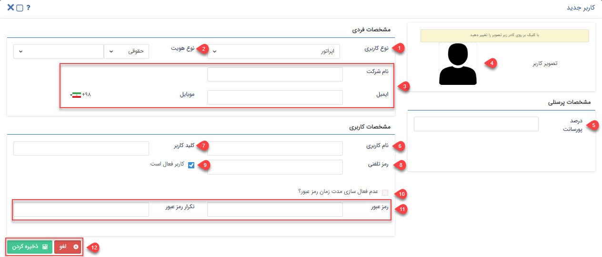

# ایجاد کاربر جدید 

برای ساخت کاربر جدید از منوی سه‌خط (همبرگری) که در سمت چپ نوار بالایی نرم‌افزار قرار گرفته، مسیر **تنظیمات** > **مدیریت گروه‌ها و کاربران** > **کاربران** > **کاربر جدید** را طی کرده و پس از باز شدن پنجره زیر، فیلدهای موجود را به شرحی که در ادامه بیان  می‌شود، پر می‌کنید.

### 1. نوع کاربری:
کاربر می‌تواند یکی از سه نوع زیر باشد: 
**اپراتور:**  کاربر عادی نرم افزار یا به‌عبارت‌دیگر، کارمند شرکت شما بوده که می‌بایست با توجه به چارت کاری‌اش با نرم‌افزار کار کند.  
**نماینده:**  یک نوع کاربر یا هویت بوده که نقش نمایندگی شرکت و مجموعه شما را برای مشتریان ایفا می‌کند مثلا نمایندگی شرکت شما در شهر شیراز از این دسته کاربر به‌شمار می‌آید. 
**مشتری:** در واقع کاربری است که مشتری و خریدار محصولات یا خدمات شرکت شما بوده و با توجه به سطح دسترسی‌ای که برایش تعیین کرده‌اید می‌تواند به [ پنل باشگاه مشتریان](https://github.com/1stco/PayamGostarDocs/blob/master/Help/Supplementary-modules/customer-club/Customer-dashboard/Customer-dashboard.md) دسترسی داشته باشد. (توجه کنید که این نوع از کاربران جزء کاربران فعال شما محسوب نمی‌شوند.) 
### 2. نوع هویت:
 شما در این فیلد می‌بایست مشخص کنید که هویت این کاربرتان حقیقی (فرد)  و یا حقوقی (شرکت) است. 
### 3. اطلاعات کاربر:
 در این فیلد مشخصات فردی کاربرتان اعم از نام و نام‌خانوادگی (در صورتی که در قسمت دوم، هویت‌تان را حقوقی انتخاب کرده باشید به‌جای نام و نام‌خانوادگی، نام شرکت) و اطلاعات تماسی مثل آدرس ایمیل و شماره موبایل را می‌بایست وارد کنید. توجه داشته باشید از آن‌جا که نرم افزار برای ارسال پیام‌های مختلف (از جمله پیام‌های داخل فرآیند، یا زمانی که یک وظیفه یا درخواست تایید می‌شود) نیاز به اطلاعات تماسی کاربر دارد، بنابراین لازم است این اطلاعات دقیق و صحیح لحاظ شوند. 
### 4. تصویر کاربر:
 شما می‌توانید با کلیک بر روی کادر تصویر فرضی، عکس مدنظر برای کاربرتان را انتخاب و آپلود کنید؛ همچنین هر کاربر می‌تواند در قسمت **پروفایل من**، تصویر کاربری خود را عوض کند. 
### 5. درصد پورسانت:
 اگر قرار باشد کاربر پورسانتی از فروش‌هایی که انجام می‌دهد (فاکتورها و قراردادهایی که در نرم‌افزار با نام او ثبت می‌شوند) را دریافت کند، برای اعمال درصد پورسانت کاربر، باید میزان درصد را در این فیلد وارد کنید. 
### 6. نام کاربری:
 شما می‌بایست یک عنوان برای حساب کاربری خود انتخاب نمایید. در نرم‌افزار هنگام انجام عملیات‌های مختلف، به‌جای نشان‌دادن نام و نام‌خانوادگی هویت، نام کاربری‌ برای سایر افراد نمایش داده می‌شود. در تعیین نام کاربری، استفاده از حروف و اعداد فارسی امکان‌پذیر نبوده و شما فقط می‌توانید از حروف و اعداد انگلیسی و نشان‌های نگارشی چون نقطه، کاما، اسلش و آندرلاین استفاده کنید؛ همچنین نام کاربری می‌بایست بیشتر از پنج کاراکتر باشد. باید این نکته را در نظر داشته باشید که پس از ایجاد کاربر، به‌هیچ‌وجه، امکان تغییر و ادیت نام کاربری وجود نخواهد داشت. 
### 7. کلید کاربر:
 برای مباحث ارتباط از طریق وب سرویس، برنامه‌نویسان از این فیلد استفاده می‌کنند و کاربرد خاصی برای کاربران عادی ندارد. در پر کردن فیلد کلید کاربر می‌بایست این نکته را در نظر داشته باشید که نوشتن حروف و اعداد فارسی و همچنین استفاده از اسپیس (فاصله) در بین کاراکترها ممنوع بوده و باید  از حروف و اعداد انگلیسی استفاده کنید. 
### 8. رمز تلفنی:
 شما می‌توانید از این فیلد *رمز عبور سیستم تلفنی* را برای کاربران خود تعیین کنید تا هنگامی که مشتریان با سیستم تلفن گویا مجموعه شما تماس می‌گیرند از آن برای برقراری ارتباط استفاده کنند.  
### 9. کاربر فعال است:
 ممکن است بنا به هر دلیلی یکی از کاربران (موقتا و یا دائم) دیگر با مجموعه شما همکاری نداشته باشد و یا بنا به دلایلی چون عوض شدن عنوان شغلی، دیگر نیازی به استفاده از نرم‌افزار نداشته باشد؛ در این موارد می‌توانید به‌جای حذف کلی کاربر (در صورتی که کاربر قبلا فعالیت خاصی را در نرم‌افزار انجام داده باشد، سیستم امکان حذف آن را به شما نمی‌دهد)، حساب کاربری آن را به‌طور موقت و یا دائم غیرفعال نمایید. همان‌طور که می‌دانید برای تعداد کاربران یک محدوده و بازه‌ی تعدادی دارید (تعداد کاربران دیفالت سیستم پنج کاربر فعال بوده که برای افزایش آن باید جداگانه اقدام کرد. شما می‌توانید با توجه به بسته خریداری شده تعداد خاصی کاربر فعال و تعداد نامحدودی کاربر غیرفعال داشته باشید.) و این‌گونه با غیرفعال کردن کاربران اضافی، امکان ایجاد کاربر فعال را برای مجموعه‌تان فراهم می‌کنید. گفتنی است که با غیرفعال کردن کاربر، دیگر امکان انتخاب آن کاربر از لیست کاربران وجود نخواهد داشت. 
> **نکته‌** 
لازم به ذکر است در صورتی‌که حساب کاربری از این بخش فعال شود و کاربر ایجاد گردد، حتی در صورت تعریف قالب پیام برای فعال‌سازی سیستم، کاربر پیام فعال‌سازی را دریافت نمی‌کند چون در این بخش شما به‌صورت دستی آن را فعال کرده‌اید. 
 ### 10. عدم فعال‌سازی مدت زمان عبور:
  با فعال کردن این گزینه، رمز عبور این کاربر در نرم افزار، هیچ زمانی منقضی نمی‌‌شود و برای آن تاریخ انقضایی مفروض نخواهد بود.
 برای تنظیم مقدار پیش‌فرض زمان منقضی شدن رمز عبور، به قسمت [تنظیمات امنیتی ](https://github.com/1stco/PayamGostarDocs/blob/master/Help/Settings/General-settings/security/security.md)مراجعه کنید. 
 ### 11. رمز عبور:
  در این فیلد، رمز عبور کاربرتان را می‌توانید مشخص نمایید. (تعداد حروف رمز عبور، امکان منقضی شدن رمز عبور و الزام رمز پیچیده بودن آن را در قسمت [تنظیمات امنیتی ](https://github.com/1stco/PayamGostarDocs/blob/master/Help/Settings/General-settings/security/security.md)می‌توانید تنظیم کنید.) 
 در صورت فعال‌سازی الزام رمز عبور پیچیده از تنظیمات بخش امنیتی، رمز عبور می‌بایست شامل حداقل یک حرف بزرگ، یک حرف کوچک و یک عدد باشد. 
### 12. لغو & ذخیره کردن:
 شما با استفاده از  گزینه‌‌ی *لغو* می‌توانید از ثبت کاربر انصراف دهید و یا با *ذخیره کردن* آن، کاربر را ایجاد کرده و اطلاعات وارد شده را ثبت نمایید. 
> **نکته‌** 
 لازم به ذکر است که با ایجاد کاربر، هویتی مرتبط با آن کاربر در بانک اطلاعاتی ساخته می‌شود که مسیر ذخیره آن از طریق[ دسته‌بندی پیش‌فرض کاربران ](https://github.com/1stco/PayamGostarDocs/blob/master/Help/Settings/General-settings/User-category/User-category.md)مشخص می‌گردد.  
