# تعیین دسترسی‌های عمومی

قسمتی از مجوزها که جنبه‌ مدیریتی و کلی در بخش‌های اصلی سیستم دارد، در سربرگ **دسترسی‌های عمومی** قرار دارد.

> **نکته** 
> مجوز **مدیر سیستم**، تمام مجوزهای نرم‌افزار را شامل می‌شود.

عملکرد مجوزهای قسمت عمومی به شرح زیر است:

## بانک اطلاعاتی

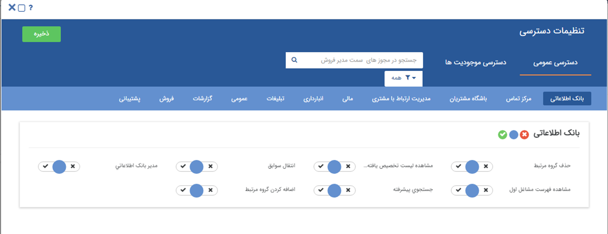

**حذف از گروه مرتبط:** با این مجوز کاربر می‌تواند هویتی را از گروه هدف حذف کند. 
**مشاهده فهرست مشاغل اول:** منوی **بانک اطلاعتی** در قسمت بانک یکپارچه برای کاربر قابل مشاهده خواهد بود و به بانک فهرست مشاغل اول (ماژول فهرست مشاغل اول) و [دسته‌بندی‌های بانک اطلاعاتی](https://github.com/1stco/PayamGostarDocs/blob/master/Help/Integrated-bank/Database/Grouping/mafhome-grouping.md) دسترسی خواهد داشت. 
**مشاهده لیست تخصیص یافته‌ها:**  به منوی[ تخصیص یافته](https://github.com/1stco/PayamGostarDocs/blob/master/Help/Customer-relationship-management/Allocation-of-findings/Allocation-of-findings.md)‌ها در مدیریت ارتباط با مشتری دسترسی پیدا می‌کند. 
**جستجوی پیشرفته:**  به منوی[ جستجوی پیشرفته ](https://github.com/1stco/PayamGostarDocs/blob/master/Help/Integrated-bank/Advanced-search/Advanced-search.md)در بانک یکپارچه دسترسی پیدا می‌کند. 
**انتقال سوابق:** با این مجوز امکان انتقال سوابق پروفایل‌ها از طریق دکمه انتقال سوابق موجود در تب مشخصات هویت‌ها وجود دارد. 
**مدیر بانک اطلاعاتی:** با این مجوز دسترسی‌های زیر برای کاربر فعال می‌شود:

- بدون داشتن مجوز **مشاهده فهرست مشاغل اول**، کاربر می‌تواند دسته‌بندی‌های بانک اطلاعاتی را مشاهده کند. 
- دسته‌بندی‌های **اختصاصی شده** توسط سایر کاربران در بانک اطلاعاتی، برای این کاربر قابل نمایش است.  
- گروه‌های هدف **اختصاصی شده** توسط سایر کاربران را می‌تواند مشاهده کند. 
- تخصیص **مسئول‌های فروش، پشتیبانی و متفرقه** از طریق راست کلیک روی هویت‌ها امکان‌پذیر خواهد بود. همچنین در صورتی که کاربر مجوز مشاهده آیتم روی هویت را داشته باشد، از صفحه مشخصات هویت نیز می‌تواند مسئولین پروفایل را تغییر دهد. 
- می‌تواند از طریق راست کلیک روی هویت‌ها **حذف با سوابق** را انجام دهد. 

## مرکز تماس

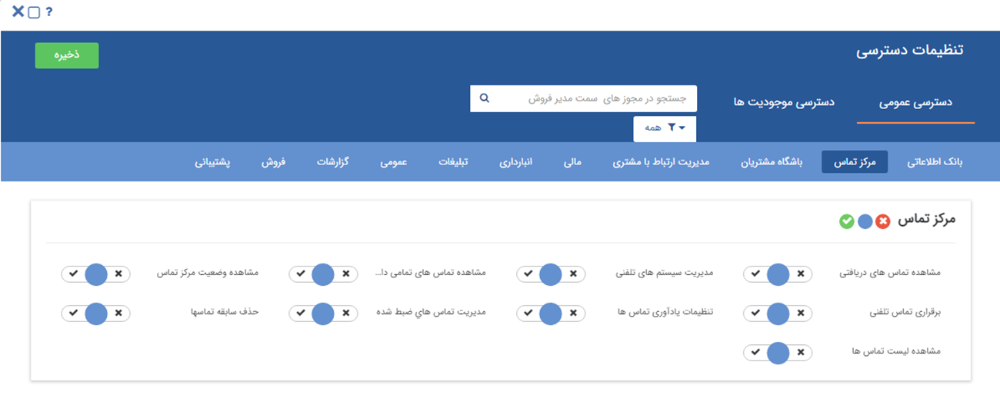

**برقراری تماس تلفنی:** اگر سیستم تلفنی VOIP در اختیار داشته باشید و آن را به نرم‌افزار پیام گستر به‌درستی متصل کرده باشید، با فعال کردن این مجوز به کاربران اجازه داده می‌شود که بتوانند از داخل نرم افزار با کلیک بر روی شماره تلفن، موبایل یا تلفکس با مخاطب ارتباط برقرار کنند.

**تنظیمات یادآوری تماس‌ها:** به منوی[ تنظیمات یادآوری تماس ](https://github.com/1stco/PayamGostarDocs/blob/master/Help/Basic-Information/Telephone-systems/Call-reminder-settings/Call-reminder-settings.md)ها دسترسی می‌دهد.

**حذف سابقه تماس‌ها:** اجازه حذف سابقه تماس‌ها را از منوی[ تماس‌ها ](https://github.com/1stco/PayamGostarDocs/blob/master/Help/Customer-relationship-management/calls/calls.md)و  تب[ تماس‌ها ](https://github.com/1stco/PayamGostarDocs/blob/master/Help/Integrated-bank/Database/calls-h/calls-h.md)در پروفایل مخاطب می‌دهد.

**مدیریت تماس‌های ضبط شده:** به کاربر اجازه می‌دهد که تماس‌های ضبط شده را در اختیار داشته باشد.

**مدیریت سیستم‌های تلفنی:** دسترسی به منوی [مدیریت سیستم‌های تلفنی](https://github.com/1stco/PayamGostarDocs/blob/master/Help/Basic-Information/Telephone-systems/telephone-systems-Management/telephone-systems-Management.md) را در اختیار کاربر قرار میدهد. (در این منو میتوانید تنظیمات مرتبط با سیستم تلفن‌های خود -تعریف داخلی و ...- را انجام دهید.)

**مشاهده تماس‌های تمامی‌داخلی‌ها:** به کاربر اجازه می‌دهد در ویجت تماس خود تمامی‌تماس‌های ورودی را مشاهده کند. (با توجه به داخلی‌های تنظیم شده در [مدیریت سیستم‌های تلفنی ](https://github.com/1stco/PayamGostarDocs/blob/master/Help/Basic-Information/Telephone-systems/telephone-systems-Management/telephone-systems-Management.md)و تنظیمات قسمت [امنیتی ](https://github.com/1stco/PayamGostarDocs/blob/master/Help/Settings/General-settings/security/security.md)می‌توانید مشاهده تماس‌های ورودی را برای کاربران محدود کنید.)

**مشاهده تماس‌های دریافتی:** به کاربر اجازه می‌دهد که از منوی[ تلفن ](https://github.com/1stco/PayamGostarDocs/blob/master/Help/home/Storytelling/Phone/Phone.md) استفاده کند. (تماس‌های ورودی را ببیند و بتواند شماره مخاطب یا سوابق او را ثبت کند.)

**مشاهده لیست تماس‌ها:** اجازه مشاهده سوابق تماسی در منوی[ تماس](https://github.com/1stco/PayamGostarDocs/blob/master/Help/Customer-relationship-management/calls/calls.md)‌ها  در قسمت مدیریت ارتباط با مشتریان را به کاربر می‌دهد.

**مشاهده وضعیت مرکز تماس:** به [داشبورد مرکز تماس ](https://github.com/1stco/PayamGostarDocs/blob/master/Help/connections/Contact-center-status/call-center.md)دسترسی می‌دهد. (میتوانید وضعیت داخلی‌ها را مشاهده کنید و یا درصورت نیاز با کاربر خود از طریق سیستم در حین مکالمه صحبت کنید.)

## باشگاه مشتریان

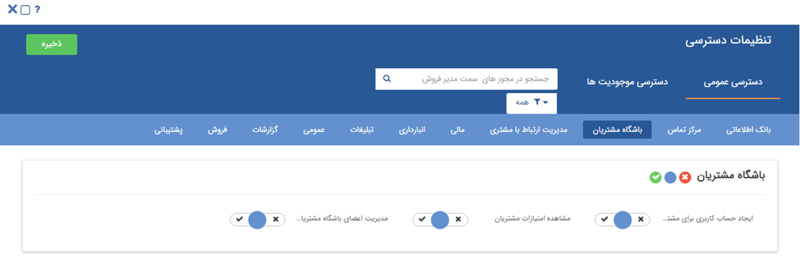

ایجاد حساب کاربری برای مشتری: ***حالت آزمایشی است.***

**مدیریت اعضای باشگاه مشتریان:** دسترسی‌های زیر فعال می‌شوند:
- دسترسی به منوی[ مدیریت اعضای باشگاه مشتریان ](https://github.com/1stco/PayamGostarDocs/blob/master/Help/Settings/Management-of-customer-club-members/Management-of-customer-club-members.md); 
- امکان **ورود به سیستم** بجای کاربر دیگری در محیط **مدیریت گروه‌ها و کاربران**

**مشاهده امتیازات مشتریان:** به صفحه[ امتیازات مشتری](https://github.com/1stco/PayamGostarDocs/blob/master/Help/Integrated-bank/Database/Customer-ratings/Customer-ratings.md) در پروفایل هویت‌ها دسترسی پیدا کرده و می‌تواند تراکنش امتیاز جدید ایجاد کند.

## مدیریت ارتباط با مشتری

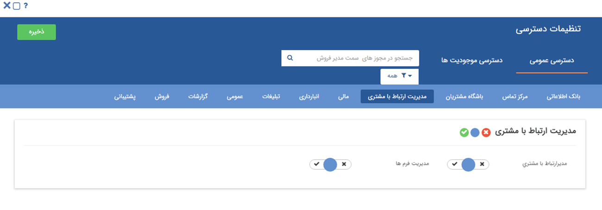

با مجوز **مدیر ارتباط با مشتری**،  کاربر به موارد زیر دسترسی خواهد داشت: 
- گزارشات فرآیندی
  - کانبان
  - چارت
  - نمایش دیاگرام
  - به تفکیک فعالیت‌ها
  - بر اساس کاربر
  - گزارش شرح شغل
- گزارشات CRM
  - جزئیات تماس
  - مجموع تماس به تفکیک کارشناس
  - مجموع تماس به تفکیک تاریخ
  - مجموع تماس به تفکیک شماره تلفن
  - عملکرد کاربر
  - عملکرد شرکت

**مدیریت فرم‌ها:** دسترسی به منوی [مدیریت فرم](https://github.com/1stco/PayamGostarDocs/blob/master/Help/Settings/Personalization-crm/Form-management/2.6.0/Form-customize-setting.md)‌ها در شخصی‌سازی را به کاربر می‌دهد.

## مالی

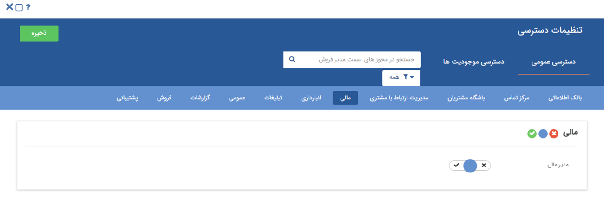

**مدیر مالی:** کاربر با این مجوز به موارد زیر دسترسی دارد: 
- جزیئات فروش
  - مانده حساب مشتریان
  - متشریان غیرفعال
  - جزئیات فروش
  - جزئیات خرید
  - جزئیات قراردادها
  - درآمدها
  - دریافت‌‌ها
  - جزئیات پرداخت‌ها
  - جزئیات اسناد دریافتی
  - جزئیات اسناد پرداختی
- مجموع فروش
  - مجموع فروش
  - مجموع خرید
  - مجموع قراردادها
  - مجموع درآمدها
  - مجموع دریافت‌ها
  - مجموع پرداخت‌ها
  - مجموع اسناد دریافتی
  - مجموع اسناد پرداختی
  - میزان دریافت ماهانه فاکتور
- با دارا بودن این مجوز، در لیست دریافت‌ها و پرداخت‌ها، امکان حذف چند آیتم دریافت و پرداخت باهم وجود دارد.

## انبارداری

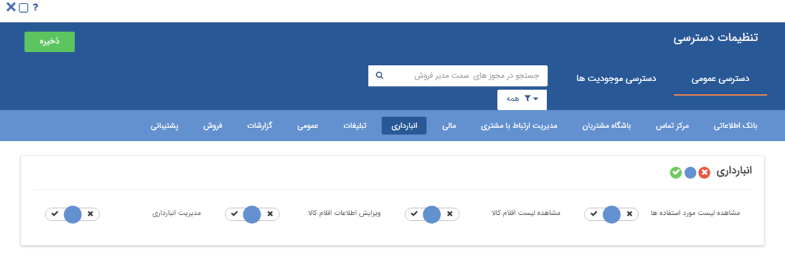

**مدیریت انبارداری:** به منوی[ مدیریت انبارها ](https://github.com/1stco/PayamGostarDocs/blob/master/Help/Settings/Warehouse-management/Warehouse-management.md)و گزارشات انبار دسترسی پیدا می‌کند.

**مشاهده لیست اقلام کالا:** حالت آزمایشی است.

**مشاهده لیست مورد استفاده‌ها:** حالت آزمایشی است.

**ویرایش اطلاعات اقلام کالا:** در صورت داشتن این مجوز در[ صفحه ویرایش قلم کالا](https://github.com/1stco/PayamGostarDocs/blob/master/Help/Buy-warehouse-sales/Search%20for%20item%20pen/ProductSerial.md) دکمه ذخیره ظاهر خواهد شد.

## تبلیغات

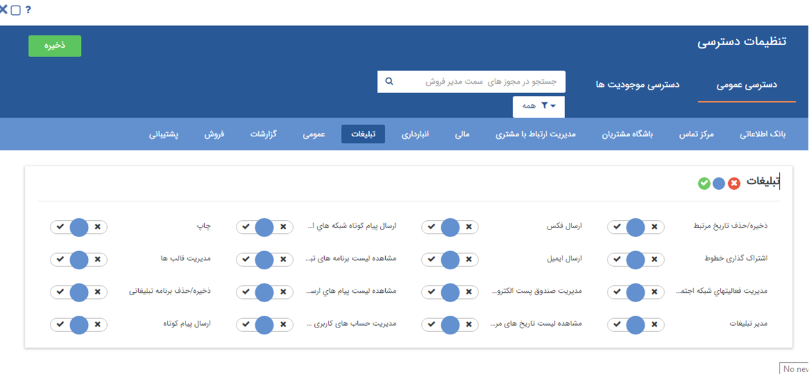

**ارسال ایمیل:** با استفاده از این مجوز کاربر امکان ارسال ایمیل از طریق خطوطی که دسترسی به آن را دارد، دارد.  

**ارسال پیام کوتاه:** اجازه ارسال پیامک با خطوطی که دسترسی به آن را دارد، پیدا می‌کند.

**ارسال فکس:** اجازه ارسال فکس با خطوطی که دسترسی به آن را دارد، پیدا می‌کند.

**اشتراک گذاری خطوط:** در هنگام تعریف خطوط مانند خطوط پیام کوتاه اجازه به اشتراک گذاری آن با سایر کاربران را در اختیار یک کاربر قرار میدهد.

**چاپ:** اجازه ارسال چاپ با خطوطی که دسترسی به آن را دارد، پیدا می‌کند.

**ذخیره/حذف برنامه تبلیغاتی:** در قسمت تبلیغات بخش مدیریت کمپین‌های تبلیغاتی امکان ایجاد و ویرایش کمپین  را برای کاربر فراهم می‌کند.

**ذخیره/حذف تاریخ مرتبط:** اجازه ذخیره کردن یک تاریخ مرتبط در قسمت [تاریخ‌های مهم](https://github.com/1stco/PayamGostarDocs/blob/master/Help/Integrated-bank/Database/Important-dates/Important-dates.md) پروفایل یک مخاطب یا سرنخ می‌یابد.

**مدیر تبلیغات:** به موارد زیر دسترسی خواهد داشت:
- [گزارش بازاریابی و فروش در یک نگاه](https://github.com/1stco/PayamGostarDocs/blob/master/Help/Management-and-reports/Analysis-reports/Marketing-and-sales-at-a-glance/Marketing-and-sales-at-a-glance.md) 
- [نمودار وضعیت بازاریابی](https://github.com/1stco/PayamGostarDocs/blob/master/Help/Management-and-reports/Analysis-reports/Marketing-Status-Chart/Marketing-Status-Chart.md) 
- [نمودار تحلیل کمپین](https://github.com/1stco/PayamGostarDocs/blob/master/Help/Management-and-reports/Analysis-reports/Campaign-Analysis-Chart/Campaign-Analysis-Chart.md) 
- مشاهده لیست برنامه‌های تبلیغاتی ایجاد شده توسط سایر کاربران 
- کاربر در صورت داشتن مجوز **مدیریت تنظیمات** در مجوز‌های عمومی به همراه این مجوز می‌تواند در بخش تنظمیات کلی، تمام خطوط پیامکی،ایمیل و فکس  تعریف شده در نرم افزار را مشاهده کند، در صورت نداشتن این مجوز فقط می‌تواندخطوطی که روی آن مجوز دارد را مشاهده کند . 

 **مدیریت حساب‌های کاربری پرتال اول:** این مجوز امکان دسترسی به مشخصات کاربری در منوی 1st.ir را فراهم می‌کند. 

· **مدیریت صندوق پست الکترونیک:** دسترسی منوی[ مدیریت صندوق پست الکترونیک](https://github.com/1stco/PayamGostarDocs/blob/master/Help/connections/Mailbox/mailbox.md) پیدا می‌کند.

·**مدیریت قالب‌ها:** دسترسی به منوی [مدیریت پیام‌های الگو ](https://github.com/1stco/PayamGostarDocs/blob/master/Help/Basic-Information/Model-message-management/Model-message-management.md)پیدا می‌کند.

   **مشاهده لیست برنامه‌های تبلیغاتی:** امکان مشاهده برنامه‌های تبلیغاتی که توسط سایر کاربران در نرم افزار ایجاد شده است را نیز دارد و همچنین امکان مشاهده صفحه مدیریت کمپین‌های تبلیغاتی را فراهم می‌کند. 

· **مشاهده لیست برنامه‌های تبلیغاتی:** امکان مشاهده برنامه‌های تبلیغاتی که توسط سایر کاربران در نرم افزار ایجاد شده است را نیز دارد و همچنین امکان مشاهده صفحه مدیریت کمپین‌های تبلیغاتی و ایجاد و ویرایش کمپین‌ها و تعریف برنامه‌های تبلیغاتی برای کمپین‌ها

·**مشاهده لیست تاریخ‌های مرتبط:** به منوی[ تاریخ‌های مرتبط ](https://github.com/1stco/PayamGostarDocs/blob/master/Help/Customer-relationship-management/Related-dates/Related-dates.md)در مدیریت ارتباط با مشتریان دسترسی پیدا  می‌کند.

## عمومی 

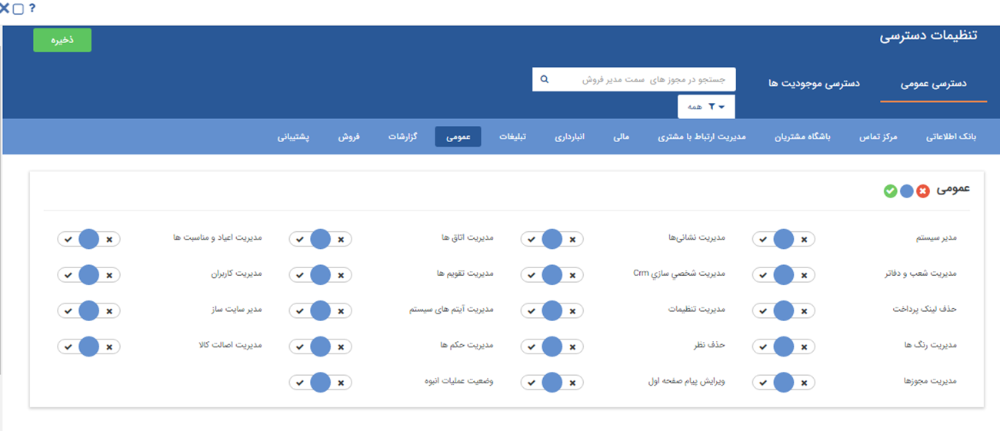

**حذف نظر:**  امکان حذف نظرات ایجاد شده توسط سایر کاربران را پیدا می‌کند. 

**مدیر سیستم:** به عنوان راهبر نرم افزار تعیین می‌شود و به تمامی‌قسمت‌های نرم افزار دسترسی بدون قید و شرط دارد. اجازه حذف و یا ویرایش تمامی‌آیتم‌ها و دسترسی به تمامی‌منو‌ها دارد. توجه داشته باشید که مدیر انبارها به صورت جداگانه در منوی [مدیریت انبارها](https://github.com/1stco/PayamGostarDocs/blob/master/Help/Settings/Warehouse-management/Warehouse-management.md) تعیین می‌شود.

**مدیریت تقویم‌ها:** دسترسی به منوی[ مدیریت تقویم‌ها ](https://github.com/1stco/PayamGostarDocs/blob/master/Help/Basic-Information/Calendar-management/Calendar-management.md)می‌یابد.

**مدیریت شخصی‌سازی CRM:** دسترسی به[ منوی شخصی سازی](https://github.com/1stco/PayamGostarDocs/blob/master/Help/Settings/Personalization-crm/Overview/General-information/General-information.md) CRM  در قسمت نمای کلی دسترسی پیدا می‌کند. با این مجوز امکان ایجاد زیرنوع جدید از **تمامی موجودیت‌ها**، ویرایش آنها و ساخت چرخه کاری بر روی آیتم‌ها فراهم می‌شود..

**مدیر سایت ساز:** می‌تواند به امکاناتسایت ساز در نرم افزار دسترسی پیدا کند.

**مدیریت آیتم‌های سیستم:** به منوی [مدیریت آیتم‌های سیستم](https://github.com/1stco/PayamGostarDocs/blob/master/Help/Basic-Information/Management-of-system-items/Management-of-system-items.md) دسترسی می‌یابد.

**مدیریت اتاق‌ها:** به منوی [مدیریت اتاق‌ها](https://github.com/1stco/PayamGostarDocs/blob/master/Help/Basic-Information/Room-management/Room-management.md) دسترسی می‌یابد. 
**مدیریت اصالت کالا:** به منوی [مدیریت اصالت کالا ](https://github.com/1stco/PayamGostarDocs/blob/master/Help/Settings/Product-originality-management/Product-originality-management.md)دسترسی پیدا می‌کند. 
**مدیریت اعیاد و مناسبت‌ها:** به منوی [مدیریت اعیاد و مناسبت‌ها](https://github.com/1stco/PayamGostarDocs/blob/master/Help/Basic-Information/Holiday-management-and-occasions/Holiday-management-and-occasions.md)در دسترسی پیدا می‌کند. 
**مدیریت تنظیمات:** به منوی **تنظیمات کلی** نرم‌افزار دسترسی پیدا می‌کند و کاربر می‌تواند تنظیمات پایه‌ای سیستم اعم از تنظیم ایمیل‌ها، خطوط پیام کوتاه، تنظیمات امنیتی و ... را تغییر دهید.

> **نکته** 
> مسیر دسترسی در نسخه استاندارد: **تنظیمات** > **تنظیمات کلی**
>مسیر دسترسی در نسخه سازمانی: **تنظیمات** > **تنظیمات سیستم** > **راهبری** > **تنظیمات کلی**

**مدیریت حکم‌ها:** دسترسی منوی [مدیریت حکم‌های پرسنلی ](https://github.com/1stco/PayamGostarDocs/blob/master/Help/Settings/Personnel-command-management/Personnel-command-management.md)در اختیار کاربر قرار می‌دهد. (میتوانید حکم‌های مختلف -مانند کارمند فروش، مدیر مالی و ... - ایجاد و واگذار کنید.)

**مدیریت رنگ‌ها:** به منوی [مدیریت رنگ‌ها](https://github.com/1stco/PayamGostarDocs/blob/master/Help/Basic-Information/Color-management/Color-management.md) دسترسی می‌دهد. (میتوانید ترتیب نمایش رنگ‌های استفاده شده در نرم افزار را تغییر دهید و یا رنگ جدید اضافه کنید.)

**مدیریت شعب و دفاتر:** دسترسی به [مدیریت شعب - دپارتمان و سمت  ](https://github.com/1stco/PayamGostarDocs/blob/master/Help/Basic-Information/Management-of-countries%2C%20provinces-and-cities/Management-of-countries%2C%20provinces-and-cities.md)ایجاد می‌کند. ( میتوانید شعب و دفاتر و سمت‌های مختلف ایجاد کنید و براساس آن‌ها مجوزهای مختلف تعیین کنید.)

**مدیریت فیلدها:** حالت آزمایشی است.

**مدیریت کاربران:** منوی [مدیریت گروه‌ها و کاربران ](https://github.com/1stco/PayamGostarDocs/blob/master/Help/Settings/Manage-groups-and-users/users/users.md)را در اختیار کاربر قرار می‌دهد و کاربر می‌تواند گروه‌ و کاربر جدید بسازد و اطلاعات کاربران و گروه‌های فعلی را ویرایش کند.

**ویرایش پیام صفحه اول:** به ویرایش پیام ویجت اعلان عمومی در داشبورد صفحه خانه دسترسی می‌دهد. (می‌توانید یک پیام برای نمایش بر روی صفحه خانه تمامی‌کاربرانی که این ویجت را دارند تنظیم کنید.) 

 **مدیریت نشانی‌ها:**  دسترسی به منو [مدیریت نشانی‌ها ](https://github.com/1stco/PayamGostarDocs/blob/master/Help/Basic-Information/Address-management/Address-management.md)را ایجاد میکند. در این بخش امکان مشاهده لیست نشانی‌ها، ایجاد،ویرایش و حذف نشانی وجود دارد.

## فروش

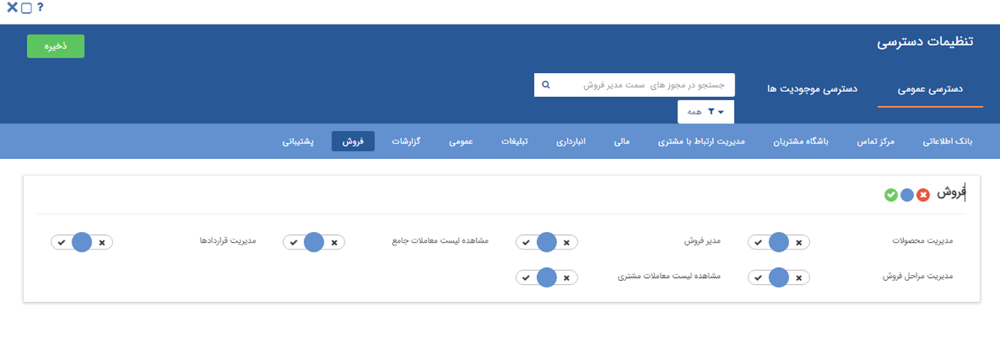

**مدیر فروش:** کاربر با استفاده از این مجوز به موارد زیر دسترسی دارد: 
-  گزارش‌های تحلیلی
  - بازاریابی و فروش در یک نگاه
  - نمودار وضعیت بازاریابی
  - نمودار وضعیت فروش
  - تحلیل کمپین تبلیغاتی
- جزئیات فروش
  - مانده حساب مشتریان
  - متشریان غیرفعال
  - جزئیات فروش
  - جزئیات خرید
  - جزئیات قراردادها
  - درآمدها
  - دریافت‌‌ها
  - جزئیات پرداخت‌ها
  - جزئیات اسناد دریافتی
  - جزئیات اسناد پرداختی
- مجموع فروش
  - مجموع فروش
  - مجموع خرید
  - مجموع قراردادها
  - مجموع درآمدها
  - مجموع دریافت‌ها
  - مجموع پرداخت‌ها
  - مجموع اسناد دریافتی
  - مجموع اسناد پرداختی
  - مجموع فروش به تفکیک کارشناس
  - مجموع فروش به تفکیک محصولات
- محاسبه پورسانت
  - پورسانت محصول محور
  - پورسانت فرد محور
  - میزان دریافت ماهانه فاکتور
- گزارشات CRM
  - جزئیات تماس
  - مجموع تماس به تفکیک کارشناس
  - مجموع تماس به تفکیک تاریخ
  - مجموع تماس به تفکیک شماره تلفن
  - عملکرد کاربر
  - عملکرد شرکت
  - ‌‌فرصت‌ها
- تعیین **مسئول فروش** در اطلاعات هویت‌ها؛ کاربر با این مجوز می‌تواند مسئول فروش هویت‌ها را ویرایش نماید.

**مدیریت قراردادها:** به منوی [مدیریت قراردادها ](https://github.com/1stco/PayamGostarDocs/blob/master/Help/Settings/Personalization-crm/Contract-management/Contract-management.md)در شخصی سازی دسترسی پیدا می‌کند.

**مدیریت محصولات:**  به منوهای زیر دسترسی پیدا می‌کند:
- [ مدیریت محصولات ](https://github.com/1stco/PayamGostarDocs/blob/master/Help/Basic-Information/Product%20management/Product-management.md)؛ کاربر با این دسترسی می‌تواند محصولات جدید را به صورت تکی و گروهی در نرم‌افزار وارد کند. اطلاعات محصولات را ویرایش و یا حذف نماید و همچنین از لیست محصولات خروجی اکسل بگیرد.  
- [مدیریت لیست قیمت](https://github.com/1stco/PayamGostarDocs/blob/master/Help/Settings/Price-list-management/Price-list-management.md)، کاربر با این دسترسی می‌تواند لیست قیمت جدید ایجاد کند و حتی لیست قیمت‌های قدیم را ویرایش و حذف نماید.

**مشاهده لیست معاملات جامع:** اجازه دسترسی به [مورد معامله](https://github.com/1stco/PayamGostarDocs/blob/master/Help/Buy-warehouse-sales/Transaction/Case-of-transaction/Case-of-transaction.md) و [مورد مذاکره ](https://github.com/1stco/PayamGostarDocs/blob/master/Help/Buy-warehouse-sales/Transaction/Negotiated/negotiates.md)در منوی خرید، فروش و انبار را در اختیار کاربر قرار میدهد.

**مشاهده لیست معاملات مشتری:** دسترسی به منوی [معاملات ](https://github.com/1stco/PayamGostarDocs/blob/master/Help/Integrated-bank/Database/Trades/Trades.md)را در پروفایل مخاطبان و سرنخ‌ها در اختیار کاربر می‌گذارد.

## گزارشات

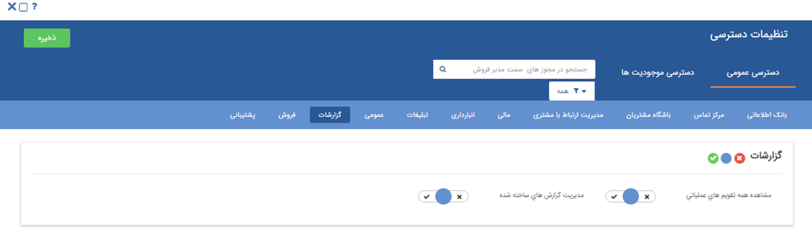

**مدیریت گزارش‌های ساخته شده:**  امکان استفاده از مدیریت گزارش‌ها در همه لیست‌های موجود در پیام گستر و امکان حذف،ویرایش،مجوز‌های گزارش ساخته شده در منوی دسته بندی گزارش‌ها

مشاهده همه تقویم‌های عملیاتی: ***حالت آزمایشی است.***

## پشتیبانی

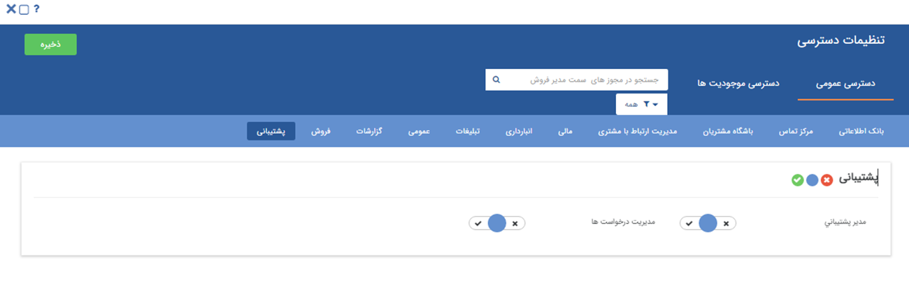

**مدیر پشتیبانی:** اجازه مشاهده گزارشات CRM را به شرح زیر به کاربر می‌دهد:

- **گزارش تماس‌ها**
  - [گزارش اطلاعات تماس تکراری](https://github.com/1stco/PayamGostarDocs/blob/master/Help/Management-and-reports/reports-crm/report-calls/Duplicate-contact-information/Duplicate-contact-information.md) 
  - [جزئیات تماس‌ها](https://github.com/1stco/PayamGostarDocs/blob/master/Help/Management-and-reports/reports-crm/report-calls/Call-details/Call-details.md) 
  - [مجموع تماس‌ها به تفکیک تاریخ](https://github.com/1stco/PayamGostarDocs/blob/master/Help/Management-and-reports/reports-crm/report-calls/Total-calls-by-date/Total-calls-by-date.md) 
  - [مجموع تماس‌ها به تفکیک کارشناسان](https://github.com/1stco/PayamGostarDocs/blob/master/Help/Management-and-reports/reports-crm/report-calls/Total-calls-by-expert/Total-calls-by-expert.md) 
  - [مجموع تماس‌ها به تفکیک شماره تلفن](https://github.com/1stco/PayamGostarDocs/blob/master/Help/Management-and-reports/reports-crm/report-calls/Total-phone-calls/Total-phone-calls.md)

- **گزارش عملیات CRM**
  - [عملکرد هر کاربر](https://github.com/1stco/PayamGostarDocs/blob/master/Help/Management-and-reports/reports-crm/operation-CRM/Each-user's-performance/Each-user's-performance.md) 
  - [عملکرد شرکت](https://github.com/1stco/PayamGostarDocs/blob/master/Help/Management-and-reports/reports-crm/operation-CRM/company's-performance/company's-performance.md)

**مدیریت درخواست‌ها:** اجازه مشاهده لیست‌های درخواست‌های ایجاد شده در[ مدیریت درخواست‌ها ](https://github.com/1stco/PayamGostarDocs/blob/master/Help/Settings/Personalization-crm/Manage-requests/Manage-requests.md) را در بخش شخصی‌سازی به کاربر میدهد.

