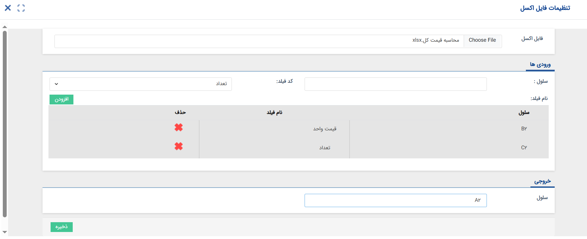

# تنظیمات اختصاصی فاکتورها 

برای شخصی‌سازی فاکتورها و ایجاد زیرنوع‌هایی که مطابق با نیاز سازمان شما باشند، علاوه بر [تنظیمات مشترک موجودیت‌ها](https://github.com/1stco/PayamGostarDocs/blob/master/Help/Settings/Personalization-crm/CustomizationCommonSettings/ItemsCommonCustomizationSettings_2.8.6.md)، لازم است که با تنظیمات اختصاصی که در صفحه شخصی‌سازی انواع فاکتورها مشاهده می‌کنید، آشنا شوید. پیش از پرداختن به تنظیمات آیتم، بیایید مروری بر عملکرد این آیتم‌ها داشته‌باشیم. 
برای مدیریت سیستم خرید در نرم‌افزار، به ۳ نوع فاکتور نیاز دارید:  
- **پیش‌فاکتور خرید:** برای استعلام قیمت استفاده می‌شود و نه تاثیری بر موجودی می‌گذارد و نه بر بستانکاری تامین‌کننده می‌افزاید.
- **فاکتور خرید:** برای ثبت خرید استفاده می‌شود و به میزان نهایی فاکتور، بر مبلغ بستانکاری تامین‌کننده افزوده می‌شود. در صورت استفاده از انبارداری تعدادی موجودی محصولات مندرج در فاکتور افزایش می‌یابد.
- **فاکتور برگشت از خرید:** برای اعلام مرجوع کالای خریداری شده به تامین‌کننده استفاده می‌شود و به میزان مبلغ فاکتور برگشت از خرید، به بدهکاری تامین‌کننده افزوده یا از بستانکاری او کم می‌شود. در صورت استفاده از انبارداری تعدادی، از موجودی انبار کاسته می‌شود. 
به طور مشابه، برای مدیریت سیستم فروش در نرم‌افزار، به ۳ نوع فاکتور نیاز دارید:  
- **پیش‌فاکتور فروش:** برای اعلام قیمت استفاده می‌شود و نه تاثیری بر موجودی انبار می‌گذارد و نه مشتری را بدهکار می‌کند. صرفاً موجودی محصول را در انبار فریز می‌کند.
- **فاکتور فروش:** برای ثبت فروش استفاده می‌شود و به میزان مبلغ نهایی فاکتور، بر مبلغ بدهی مشتری افزوده می‌شود. در صورت استفاده از انبارداری تعدادی موجودی محصولات مندرج در فاکتور کاهش می‌یابد.
- **فاکتور برگشت از فروش:** برای اعلام مرجوع کالای فروخته شده از طرف مشتری استفاده می‌شود و به میزان مبلغ فاکتور برگشت از فروش، به بستانکاری مشتری افزوده یا از بدهکاری او کم می‌شود. در صورت استفاده از انبارداری تعدادی، بر موجودی انبار افزوده می‌شود.  

به طور پیش‌فرض، برای هر یک از سیستم‌‌های خرید و فروش، یک پیش‌‌فاکتور، یک فاکتور و یک فاکتور برگشتی در نرم‌افزار وجود دارد. در صورت نیاز می‌توانید این زیرنوع‌ها را شخصی‌سازی کنید و یا زیرنوع‌‌های بیشتری برای هر یک از این موجودیت‌ها ایجاد نمایید.

## تنظیمات مشترک انواع فاکتور
در تمامی انواع فاکتور خرید و فروش، تنظیمات زیر در صفحه شخصی‌سازی قابل مشاهده‌است. در ادامه به توضیحات هر یک از این قابلیت‌ها می‌پردازیم: 

- **الگوی شماره‌گذاری:** از بین الگوهای تعریف شده در نرم‌افزار، الگوی شماره‌گذاری مورد نظر را برای آیتم انتخاب نمایید. در صورت نیاز می‌توانید از راهنمای [تنظیمات الگوی شماره‌گذاری](https://github.com/1stco/PayamGostarDocs/blob/master/Help/Settings/Numbering-template/Numbering-template.md) آیتم‌ها برای آشنایی با نحوه‌ی تعریف الگوهای جدید استفاده نمایید. توجه داشته‌باشید که اگر از یک الگوی شماره‌گذاری برای دو زیرنوع متفاوت استفاده نمایید (مثلا از الگوی A هم برای پیش‌فاکتور نوع اول و هم برای پیش‌فاکتور نوع دوم استفاده کنید)، شماره این آیتم‌ها از یک توالی مشترک پیروی خواهدکرد. یعنی اگر یک پیش‌فاکتور از نوع اول با شماره‌ی ۱ ثبت شود، چنانچه پیش‌فاکتور بعدی را از نوع دوم ثبت کنید، شماره‌ی ۲ را می‌گیرد. در حالی که اگر از الگوهای شماره‌گذاری مجزا برای آن‌ها استفاده کرده‌باشید، شماره‌ی پیش‌فاکتور نوع دوم نیز ۱ می‌شود.
- **نیاز به تایید دارد:** به صورت پیش‌فرض آیتم‌های مالی ثبت شده در نرم‌افزار بلافاصله پس از ثبت به صورت خودکار تایید می‌شوند. در صورتی که در سازمان شما، فاکتور نیاز به بررسی توسط شخص/سمت خاصی دارد، این گزینه را برای آیتم فعال نمایید. با فعال شدن این گزینه، فاکتور پس از ثبت، برای بررسی به کارتابل کاربری انتقال داده‌می‌شود که مجوز تایید/رد آن آیتم را داشته‌باشد. به خاطر داشته‌باشید که پیش از تایید آیتم، فاکتور بر روی موجودی انبار تعدادی و مانده حساب مشتری/تامین‌کننده تاثیر نداشته، در گزارش‌ها لحاظ نمی‌شود و در صورت دریافت پیش‌نمایش از آن، خروجی بدون درج امضا به کاربر ارائه می‌شود.
- **نیاز به شماره‌گذاری دارد:** به مشابه تایید، شماره‌گذاری آیتم نیز می‌تواند به صورت دستی انجام شود. به صورت پیش‌فرض، آیتم‌های مالی ثبت شده در نرم‌افزار بلافاصله پس از ثبت به صورت خودکار شماره‌گذاری نیز می‌شوند. در صورت نیاز می‌توانید با فعال کردن این گزینه آن را به حالت شماره‌گذاری دستی تغییر دهید. در این شرایط، آیتم پس از ثبت برای شماره‌گذاری به کارتابل کاربری هدایت می‌شود که مجوز شماره‌گذاری آن آیتم را داشته‌باشد. 

> **نکته** 
> در صورت فعال بودن گزینه‌های نیاز به تایید و یا شماره‌گذاری، می‌توانید تایید، رد و  شماره‌گذاری را طی چرخه کاری (فرآیند) به انجام برسانید. با استفاده از فعالیت‌های تایید/رد آیتم‌های مالی می‌توانید در مرحله‌ی مورد نظر این آیتم‌ها را تایید یا رد نمایید. 

- **تخصیص شماره مشتری در هنگام تایید:** در صورت فعال بودن این گزینه، چنانچه هویت مرتبط با آیتم، شماره مشتری نداشته‌باشد، به محض تایید شدن آیتم مربوطه، سیستم به صورت خودکار به وی شماره مشتری اختصاص خواهد‌داد. به طور مثال اگر می‌خواهید مخاطبان شما، پس از تایید شدن اولین فاکتور فروش صادر شده برای آن‌ها شماره مشتری دریافت کنند، می‌توانید در تنظیمات فاکتور فروش این گزینه را فعال کنید.
- **تغییر وضعیت به "در انتظار تایید و شماره‌گذاری" پس از ویرایش:** چنانچه گزینه‌ نیاز به تایید آیتم به صورت دستی فعال شده‌باشد، با فعال کردن این گزینه، در صورت ویرایش آیتم پس از تایید، آیتم مذکور دوباره به حالت در انتظار برمی‌گردد و باید توسط یکی از کاربرانی که مجوز مربوطه را دارد، تایید شود. 
- **امضا:** در صورت تعریف قالب پیش‌نمایش برای آیتم، تصویر امضا‌ی مورد نظر را در این قسمت بارگذاری نمایید و بر اساس [راهنمای تنظیم قالب چاپ](https://github.com/1stco/PayamGostarDocs/blob/master/Help/Settings/Personalization-crm/CustomizationCommonSettings/PrintTemplateSetting.md) آن را در قالب پیش‌نمایش فراخوانی کنید. با اعمال این تنظیمات، چنانچه کاربران پس از تایید از آیتم پیش‌نمایش دریافت‌کنند، امضا‌ی مورد نظر در بخش تعیین شده در قالب پیش‌نمایش درج می‌شود. لازم به ذکر است که پیش از تایید آیتم، قالب پیش‌نمایش بدون درج امضا خروجی داده‌می‌شود.
- **مالیات و عوارض:** در این قسمت درصد مورد نظر برای مالیات و عوارض را مشخص کنید. درصد مالیات و عوارض درج شده در این بخش، برای محصولاتی که در صفحه اطلاعات آن‌ها گزینه اعمال مالیات و عوارض فعال باشد، اعمال می‌شود.
- **مجموع مالیات/عوارض قابل ویرایش باشد:** به صورت کلی، مقدار اعمال شده برای مالیات و عوارض امکان ویرایش توسط کاربران را ندارد. لکن با فعال کردن این گزینه‌ها می‌توانید به کاربران خود این امکان را بدهید که مقدار و همچنین درصد مجموع مالیات و/یا عوارض را به صورت دستی در فاکتور تغییر دهند. توجه داشته‌باشید که با فعال کردن این گزینه فقط ویرایش مجموع مالیات و عوارض امکان‌پذیر شده و کماکان امکان ویرایش مالیات/عوارض هر ردیف محصول وجود ندارد. 
- **مجموع تخفیف قابل ویرایش باشد:** مقدار و یا درصد تخفیف هر ردیف محصول، هنگام افزودن محصول به جدول مشخص می‌شود. در حالت پیش‌فرض، درصد و مقدار تخفیف نهایی بر اساس مقادیر وارده مشخص شده و غیرقابل ویرایش می‌باشد. با فعال کردن این گزینه می‌توانید این امکان را به کاربران خود بدهید که درصد یا مقدار مجموع تخفیف را در در فاکتور ویرایش کنند.
- **تعداد رقم اعشار مقدار:** تعداد رقم اعشاری که برای مقدار محصول نیاز دارید را در این قسمت وارد نمایید. چنانچه تمامی محصولات شما تعدادی و با واحد صحیح محاسبه می‌شوند، می‌توانید این عدد را صفر در نظر بگیرید تا با نمایش اعشاری که برایتان ناکارامد است، خطای کاربری ایجاد نکنید. لکن چنانچه محصولاتی با مقادیر پیوسته دارید (مثلاً ۱/۶۵۷ گرم)، می‌توانید به تعداد مورد نیاز برای مقادیر خود اعشار در نظر بگیرید. توجه داشته‌باشید که عدد مندرج در این بخش صرفاً اعشار مقدار محصول/خدمت را تعیین می‌کند و بر تعداد اعشار مبالغ تاثیری ندارد.
- **تعداد رقم اعشار:** {#CostDecimalSettings} از این قسمت می‌توانید تعداد ارقام اعشار مورد نظر برای مبالغ مندرج در فاکتور (قیمت واحد، مبلغ نهایی و...) را تنظیم نمایید. در صورت انتخاب گزینه‌ی «پیش‌فرض»، تعداد اعشار فیلدهای مبلغ، بر اساس تعداد اعشار تنظیم شده در بخش تنظیمات ارز (در تنظیمات کلی)، لحاظ می‌شود. در صورت نیاز به نمایش اعداد به صورت عدد صحیح می‌توانید گزینه‌ی «صفر» را به عنوان تعداد ارقام اعشار مورد نظر انتخاب کنید. توجه داشته‌باشید که تعداد ارقام اعشار تنظیم شده در این بخش، بر روی مبالغ نمایش داده شده به کاربر هنگام ثبت و مشاهده آیتم، لیست آیتم و همچنین قالب پیش‌نمایش آیتم تاثیر می‌گذارد. با این وجود در صورت تعیین تعداد ارقام اعشار بیش‌تر از صفر، در قالب پیش‌نمایش با استفاده از پارامترهای مبالغ به صورت صحیح، می‌توانید مبالغ را به صورت صحیح نیز در پیش‌نمایش داشته‌باشید.

> **نکته** 
> با توجه به اینکه تعداد ارقام اعشار مبالغ، در لیست آیتم نیز تاثیر می‌گذارد، چنانچه لیست آیتم بر روی حالت همه انواع قرار داشته‌باشد (مثلاً همه فاکتورها) و تعداد اعشار در آن‌ها به صورت متفاوت تنظیم شده‌باشد، تعداد اعشار مبالغ، بر اساس تنظیمات ارز درج می‌شود. 

- **قابلیت اضافه کردن محصول تکراری:**{#AddingDuplicateProduct} در صورت فعال بودن این گزینه، می‌توان یک محصول را (حتی بدون تغییر هیچ یک از مشخصات آن) در دو یا چند ردیف فاکتور به صورت مجزا به به ردیف فاکتور اضافه کرد. فرض کنید در طرح فروش شما، مشتری با خرید ۵ عدد از محصول A، یک عدد محصول A رایگان از شما دریافت می‌کند. برای ثبت این اقلام در فاکتور، شما نیاز دارید که در یک ردیف محصول A را با قیمت واحد و در یک ردیف دیگر با قیمت صفر درج نمایید. با فعال بودن این گزینه می‌توانید یک محصول را با قیمت، تخفیف، عنوان (در صورت قابل ویرایش تعریف شدن محصول در مدیریت محصولات) و یا توضیحات متفاوت در ردیف‌های مجزا به فاکتور اضافه نمایید. در صورت غیرفعال بودن گزینه، چنانچه محصولی را در چند نوبت (حتی با قیمت‌ها یا مشخصات متفاوت) به فاکتور اضافه نمایید، محصول به ردیف قبلی اضافه می‌شود. در چنین حالتی، محصول با مشخصات اولین ردیف افزوده شده به فاکتور در جدول اقلام فاکتور ثبت می‌شود لکن در صورت تغییر هر ردیف، با وجود اینکه در مشخصات ردیف، قیمتی که در بار اول افزودن محصول لحاظ شده درج می‌شود، لکن قیمت نهایی بر اساس برایند قیمت‌های مختلف محاسبه می‌شود. به عنوان مثال فرض کنید محصول A را با قیمت واحد ۱ میلیون ریال به فاکتور اضافه می‌کنید. در انتخاب بعدی، همین محصول را با قیمت ۵۰۰ هزار ریال به فاکتور اضافه می‌کنید. در جدول اقلام فاکتور محصول A با قیمت واحد ۱ میلیون ریال درج شده (قیمت محصول در اولین ورود به فاکتور) لکن قیمت نهایی دو عدد از محصول A، مقدار ۱میلیون و ۵۰۰ هزار ریال محاسبه می‌شود. 

- **اضافات:** در صورت نیاز می‌توانید یک مبلغ اضافات به فاکتور‌های خود اضافه نمایید. این هزینه می‌تواند هزینه بسته‌بندی، ارسال یا هر هزینه‌ای باشد که ممکن است لازم شود کاربر به مبلغ نهایی فاکتور اضافه کند. با افزودن این فیلد، یک فیلد مبلغ به ردیف انتهای جدول اقلام اضافه می‌شود.  
در صورت فعال نمودن اضافات برای فاکتور، علاوه بر عنوان فیلد، باید نوع آن را نیز مشخص نمایید که می‌تواند مبلغ ثابت (قابل تغییر در هنگام صدور فاکتور) و یا درصدی از مبلغ فاکتور (مبلغ نهایی، مبلغ قبل از تخفیف یا مبلغ قبل از مالیات/عوارض) باشد. در هر دو حالت «درصد» و «مقدار ثابت» شما می‌توانید مقداری را به عنوان پیش‌فرض برای اضافات خود در نظر بگیرید. این مبلغ توسط کاربر ثبت‌کننده‌ی فاکتور قابل ویرایش خواهدبود. در صورت خالی بودن کادر مقابل مبلغ/درصد اضافات، مقدار پیش‌فرضی درج نشده و کاربر باید خودش مقدار مورد نظرش را وارد نماید. توجه داشته‌باشید که «نحوه محاسبه اضافات»، که در واقع جایگاه قرارگیری فیلد محاسبات را مشخص می‌کند، به درستی انتخاب نمایید چرا که جایگاه قرارگیری این مبلغ می‌تواند در محاسبه مبلغ نهایی فاکتور تاثیر بگذارد.  
با فعال کردن گزینه‌های مربوطه مشخص نمایید که اضافات مشمول مالیات بشود یا خیر. در صورت فعال کردن این گزینه، اضافات نیز نظیر تمامی اقلام فاکتور شامل عوارض و مالیاتی می‌شود که برای آن فاکتور تعیین کرده‌اید. 

در صورت نیاز به افزودن فیلد به ردیف فاکتورها، می‌توانید از این قسمت اقدام به تعریف و تنظیم آن‌ها نمایید. توجه داشته‌باشید که فیلدهایی که در این قسمت تعریف می‌کنید، به ردیف فاکتورها (که محصولات را در آن به فاکتور اضافه می‌کنید) اضافه می‌شود و با فیلدهایی که در گروه‌فیلدها تعریف می‌کنید متفاوت هستند. این فیلدها در هر ردیف فاکتور، برای هر محصول/خدمت در فاکتور در نظر گرفته می‌شوند و می‌توان از آن‌ها در محاسبه تعداد و قیمت کل استفاده کرد. 
- **فیلدهای ردیف‌های فاکتور:** با استفاده از این گزینه می‌توانید به ردیف‌های فاکتور، فیلد‌هایی از نوع عدد، متن یا عبارت دلخواه اضافه کنید و از آن در فرمول محاسبه تعداد و یا فرمول محاسبه قیمت کل استفاده نمایید.
- **افزودن:** در برای افزودن فیلد از نوع متن یا عدد، بر روی این گزینه کلیک کنید و سپس در پنجره‌ی باز شده، عنوان، نوع نمایش (متن/عدد) و تعداد اعشار مورد نظر را برای آن تعیین کنید. در صورت فعال کردن گزینه‌ی «فیلد در ردیف فاکتور نمایش داده‌شود»، مقادیر مندرج در این فیلد در جدول اقلام فاکتور (در سمت چپ صفحه) نیز نمایش داده می‌شود. در غیر این صورت، ستونی در جدول اقلام فاکتور به آن اختصاص داده نمی‌شود.
- **افزودن عبارت:** عبارت نیز یک فیلد ردیف فاکتور محسوب می‌شود. با این تفاوت که می‌تواند بر اساس فرمولی از فیلدهای ردیف فاکتور محاسبه شود. یعنی می‌توان فیلدی به ردیف فاکتور اضافه کرد که مقدارش با فرمولی براساس فیلد‌های دیگر محاسبه شود .
- **فرمول محاسبه تعداد:** از این بخش می‌توانید فرمول محاسبه مقدار را تغییر دهید و حتی از فیلدهایی که تعریف کرده‌اید در محاسبه مقدار استفاده کنید. لازم به ذکر است که با استفاده از این گزینه، فیلد «مقدار» در هنگام صدور این نوع از فاکتور غیرفعال می‌گردد. به عنوان مثال، برای کالاهایی که مقدار آن‌ها بر حسب مساحت (مترمربع) محاسبه می‌شود، می‌توانید فرمول محاسبه تعداد را به صورت [طول]*[عرض] تعیین نمایید (طول و عرض، فیلدهایی هستند که به ردیف فاکتور اضافه شده‌اند).
- **فرمول محاسبه قیمت کل:** از این بخش می‌توانید فرمول محاسبه قیمت کل را تغییر دهید و حتی از فیلدهایی که تعریف کرده‌اید در محاسبه‌ی قیمت کل استفاده نمایید. به عنوان مثال فرض کنید که شما قیمت واحد محصولات را بر اساس دلار در سیستم ثبت می‌کنید و نیاز دارید که ضرب قیمت واحد در تعداد در قیمت دلار، قیمت کل را بر حسب ریال محاسبه نمایید. 
- **بازخوانی فرمول پیش‌فرض:** با استفاده از این کلید می‌توانید فرمول‌های محاسبه تعداد و قیمت کل را به حالت پیش فرض سیستم باز گردانید. بر این اساس، تعداد بر حسب مقدار وارد شده توسط کاربر و قیمت کل بر مبنای حاصل ضرب تعداد در قیمت واحد محاسبه می‌شود.
- **روش محاسبه بر اساس اکسل:** اگر تعداد و قیمت کل مورد نظر شما، با چهار عمل اصلی قابل محاسبه نمی‌باشند و نیاز به محاسبات پیچیده‌تری دارند، می‌توانید از اکسل استفاده نمایید. کافیست که در بخش مورد نظر (محاسبه تعداد یا قیمت کل)، چک‌باکس "روش محاسبه بر اساس اکسل" را فعال نمایید تا گزینه تنظیمات برای شما فعال شود. با کلیک بر روی این کلید، وارد صفحه «تنظیمات فایل اکسل» می‌شوید.

فایل اکسل مورد نظر را با استفاده از راهنمایی‌های زیر تنظیم، ذخیره و بارگذاری نمایید. سپس ورودی‌(ها) و خروجی مورد نظر را تعیین نمایید. 
فرض کنید برای محاسبه‌ی قیمت کل، چنین قانونی تعریف شده‌است: 
*اگر حاصل ضرب تعداد در قیمت واحد، بزرگ‌تر از ۱۰۰۰ باشد، این مقدار در ۰.۹۵ ضرب شود. در غیر این صورت، همان مقدار حاصل شده به عنوان قیمت کل نمایش داده‌شود.* 
برای تعریف چنین فرمولی، کافیست که اکسلی مشابه تصویر زیر تنظیم نمایید که در آن قیمت واحد در سلول [B2] و تعداد محصول در سلول [C2] به عنوان ورودی تعریف شده‌اند. توجه داشته‌باشید که سطر اول جدول صرفاً جهت شفاف‌سازی درج شده و وجود آن الزامی نمی‌باشد. شما می‌توانید صرفاً فرمول محاسباتی خود را در اکسل تنظیم نمایید. 

- **ورودی:** در بخش کد فیلد، فیلدی را که مقدارش به عنوان ورودی به اکسل در نظر گرفته می‌شود، انتخاب کنید و در قسمت سلول نیز تعیین کنید که مقدار فیلد انتخاب شده باید در کدام یک از سلول‌های اکسل قرار گیرد. برای تعرریف ورودی‌ مورد نظر، نام سلول را درج، فیلد ورودی را انتخاب و با کیک بر روی کلید افزودن، آن را به لیست اضافه نمایید. به همین ترتیب می‌توانید یک یا چند ورودی مورد نظر را در لیست تعریف کنید. لازم به ذکر است در این حالت می‌توان از فیلدهای اضافه ردیف فاکتور به عنوان ورودی استفاده نمود. به علاوه، در محاسبه‌ی قیمت کل، فیلد تعداد و قیمت واحد نیز به عنوان ورودی قابل انتخاب می‌باشند.
- **خروجی:** خروجی نهایی در واقع همان سلول از فایل اکسل شماست که فرمول مورد نظر برای آن تعریف شده‌است. این سلول که خروجی محاسبات را نمایش می‌دهد، باید به عنوان خروجی در قسمت مربوطه معرفی شود. بدین منظور، نام سلول مورد نظر را وارد نمایید.

## تنظیمات اختصاصی پیش‌فاکتور 
با توجه به قابلیت صدور فاکتور از روی پیش‌فاکتور و اتصال آن به پیش‌فاکتور مربوطه، در صورت نیاز می‌توانید با فعال کردن گزینه «جلوگیری از صدور بیش از یک فاکتور»، از صدور بیش از یک فاکتور برای هر فاکتور جلوگیری کنید.

## تنظیمات اختصاصی فاکتور 
در صورت استفاده از انبارداری سریالی، می‌توانید تنظیمات صدور رسید و حواله خودکار را به ترتیب برای فاکتورهای خرید و فروش فعال کنید. در این حالت: 
- با فعال کردن این گزینه در فاکتورهای خرید، برای هر فاکتور خرید تایید شده، یک رسید انبار از نوعی که در بخش «نوع رسید انبار خودکار» مشخص‌ کرده‌اید ایجاد می‌شود. توجه داشته‌باشید که در این بخش صرفاً می‌توانید یکی از رسیدهای نوع معمولی را برای ثبت انتخاب نمایید. بر این اساس پس از تایید هر فاکتور خرید، برای انباری که کاربر هنگام ثبت فاکتور انتخاب کرده، یک رسید معمولی (از نوع تعیین شده) ثبت می‌شود که حاوی محصولات مندرج در فاکتور است.
- با فعال کردن این گزینه در فاکتورهای فروش، برای هر فاکتور فروش تایید شده، یک حواله انبار از نوعی که در بخش «نوع حواله انبار خودکار» مشخص‌ کرده‌اید ایجاد می‌شود. توجه داشته‌باشید که در این بخش صرفاً می‌توانید یکی از حواله‌های نوع فروش را برای ثبت انتخاب نمایید. بر این اساس پس از تایید هر فاکتور فروش، برای انباری که کاربر هنگام ثبت فاکتور انتخاب کرده، یک حواله فروش (از نوع تعیین شده) ثبت می‌شود که حاوی محصولات مندرج در فاکتور است. 

با فعال کردن گزینه‌ی صدور رسید/حواله خودکار، گزینه‌‌ی «تخصیص سریال به صورت خودکار» نیز در مقابل آن به شما نمایش داده‌می‌شود. در صورت غیرفعال بودن این گزینه، چنانچه تنظیمات را در فاکتور خرید اعمال می‌کنید، رسید خودکار بدون درج سریال ذخیره می‌شود لکن در صورت فعال بودن این گزینه، سریال‌های تصادفی برای محصولات مندرج در رسید در نظر گرفته شده و در رسید ثبت می‌شود.
در سیستم فروش، چنانچه این گزینه غیرفعال باشد، حواله‌ی خودکار بدون درج سریال محصولات ثبت می‌شود. لکن در صورت فعال بودن این گزینه، از بین سریال‌های موجود برای محصولات مندرج در فاکتور،‌ تعداد مورد نیاز انتخاب و در حواله ثبت می‌شود. 