# اضافه کردن فیلد (افزودن مشخصه)

همه آیتم‌های موجود در پیام‌گستر (به جز فرم) شامل فیلدهای (مشخصه‌های) متناسب با خود می‌باشند، شما می‌توانید با توجه به نیاز سازمان خود انواع فیلد‌های موجود در سیستم را به آیتم‌های مورد نظر خود اضافه کنید. 
با استفاده از افزودن مشخصه می‌توانید به هر آیتم (موجودیت‌ها مانند فرم، فاکتور، هویت و ... ) فیلدهای اطلاعاتی دلخواه را اضافه کنید 
نام فیلد‌های ساخته شده در هر آیتم نباید دقیقا با فیلدهایی که به صورت پیشفرض در هویت‌ها (مانند: وب سایت، ایمیل، نام خانوادگی و ... ) وجود دارد، همنام باشد. 
امکان ایجاد فیلد با نام تکراری در یک زیر نوع آیتم و همچنین فیلد با نام تکراری بین زیر نوع آیتم و همان آیتم وجود ندارد

> نکته: فیلدهایی که به هویت‌های اضافه می‌شوند در قسمت جستجوی پیشرفته می‌توانند مورد استفاده قرار بگیرند. (برای مثال اگر یک فیلد برای کد/شناسه ملی اضافه کنید، در جستجوی پیشرفته می‌توانید بر اساس آن بین مخاطبان و سرنخ‌های خود جستجو انجام دهید)

> نکته: لازم به ذکر است حداکثر تعداد فیلدهای قابل ایجاد بر روی آیتم 200 فیلد می‌باشد.
 

**1  . اضافه کردن گروه:** می‌توانید گروه فیلدی جدید اضافه کنید. برای نمایش نحوه ایجاد و استفاده گروه فیلد بهتر است از گیف استفاده شود .

**2  .جا به جایی فیلدها:** با استفاده از اشاره گر‌ها میتوانید ترتیب نمایش فیلدها را تغییر دهید. 

**3  . فیلتر:**  می‌توانید برای یافتن فیلد/فیلدهای مورد نظر خود از بین فیلدهای ساخته شده، نام آن را فیلتر کنید.

**4  . افزودن عبارت:**  می‌توانید عبارت مورد نظر خود را به آیتم اضافه کنید. این عبارت به عنوان یکی از فیلدهای آیتم نمایش داده نخواهد شد و تنها می‌توانید از پارامتر هوشمند آن برای تنظیم قالب چاپی (پیش نمایش) آیتم‌ها استفاده کنید.

**5  . افزودن مشخصه:**  می‌توانید یک مشخصه یا همان فیلد دلخواه را به آیتم اضافه کنید، نوع نمایش آن را بسته به کاربرد پارامتر می‌توانید متن، تاریخ، لیست،چک باکس یا سایر موارد موجودمشخص کنید. همچنین می‌توان مشخص کرد این پارامتر اضافه شده، در صفحه مشخصات آیتم، در چه گروهی نمایش داده شود. به طور مثال با انتخاب گروه اطلاعات درخواست ، این پارامتر در آیتم در گروه اطلاعات درخواست قابل مشاهده خواهد بود.

**6  . استفاده از مشخصه موجود:** برای کپی کردن فیلدهایی که در آیتم دیگه ای ایجاد شده اند می‌توانید از این ویژگی استفاده کنید. (برای مثال در آیتم فرم فیلد‌هایی ایجاد شده است و نیاز است همان فیلد‌ها در آیتم دیگری وجود داشته باشد با استفاده از این قابلیت امکان کپی کردن فیلد‌ها وجود دارد)

به طوری که موجودیت (آیتم )مورد نظر و فیلدی که از این ایتم نیاز داریم انتخاب میکنیم ، عنوانی برای فیلد انتخاب و ذخیره می‌کنیم.

 
### انواع فیلدها به 3 دسته تقسیم می‌شوند:

**فیلدهای ساده:**  این امکان را به شما می‌دهند که بر اساس نوع فیلد، مقادیری به آن‌ها اختصاص دهید (متن و عدد و چک باکس و فایل و...) و یا اینکه از بین مقادیری که برای آن‌ها از قبل داده شده است انتخاب کنید (لیست گروه و کاربر و دپارتمان و سمت و مشخصه ... )

**فیلدهای سی آر ام:**  این امکان را به شما می‌دهند که بر اساس نوع فیلد، آیتمی‌از همان نوع فیلد که برای همان مرتبط با ایجاد شده است انتخاب کرده و یا اینکه آیتم جدید ایجاد کرده و به فیلد متصل کنید.

**فیلدهای لیستی:**  این امکان را به شما می‌دهند که بر اساس نوع فیلد، بیش از یک مقدار به فیلد مورد نظرتان اختصاص دهید. در واقع لیستی از مقادیر مرتبط با فیلد در آیتم ذخیره می‌شود.

### فیلدهای ساده:

**HTML:**

یک فیلد متنی با قابلیت استفاده از ابزارهای HTML می‌توانید بیافزایید. 

**HTML:**

یک فیلد متنی با قابلیت استفاده از ابزارهای HTML می‌توانید بیافزایید. 

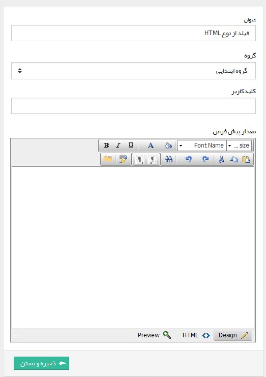

***نمونه:***

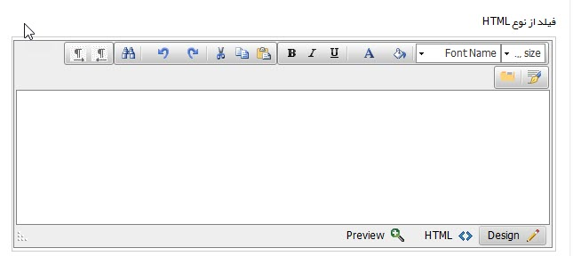

**برچسب:**
 
می‌توانید یک متن رنگی یا یک آیکون را برای نمایش در آیتم اضافه کنید. (مانند توضیح نحوه پر کردن فرم، یا نکات مهمی‌که کاربر باید همیشه مد نظر داشته باشد.)

برای نمایش متن مورد نظر باید از گزینه نمایش عنوان و برای نمایش یک آیکون از گزینه نمایش آیکون استفاده کرد .

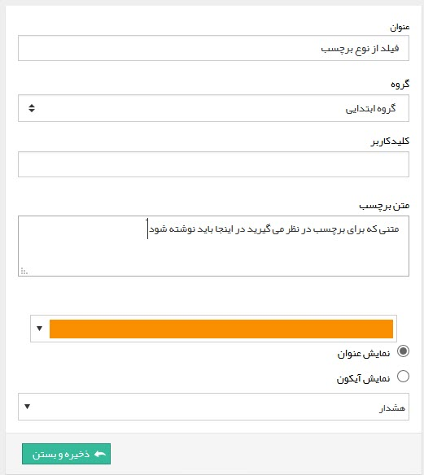

***نمونه برای نمایش برچسب از نوع عنوان:***

***نمونه برای نمایش آیکون:***

 **پول:**
یک فیلد برای وارد کردن مقادیر مثبت و منفی پولی را می‌توانید اضافه کنید

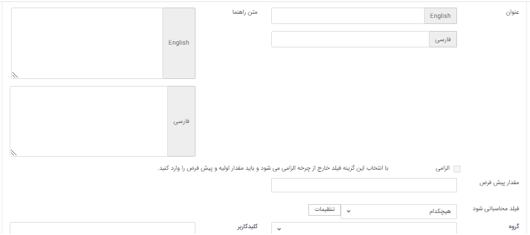

***نمونه فیلد از نوع پول:***

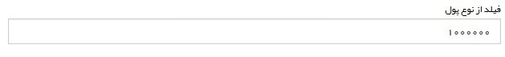

 **تاریخ شمسی:**
 
 یک فیلد از نوع تاریخ شمسی می‌توانید اضافه کنید .

**تاریخ میلادی:**

یک فیلد از نوع تاریخ میلادی می‌توانید اضافه کنید.

**تصویر:**

یک فیلد برای انتخاب تصویر اضافه می‌کند. میتوانید اندازه، پسوندهای مجاز و اندازه نمایش تصویر در صفحه را مشخص کنید.

***نمونه فیلد از نوع تصویر:***

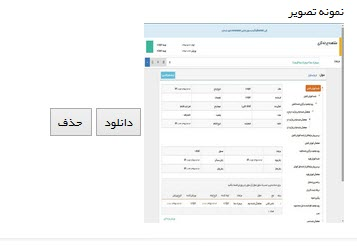

**دپارتمان:**
 
این فیلد لیست دپارتمان‌های تعریف شده در مدیریت دپارتمان‌ها و سمت‌ها را شامل می‌شود که کاربر می‌تواند یکی از دپارتمان‌ها را از لیست انتخاب کند

**ساعت:**

فیلدی با قابلیت انتخاب ساعت را می‌توانید بیافزایید.
 
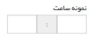

**سمت:**
 
این فیلد لیست سمت‌های تعریف شده در مدیریت دپارتمان‌ها و سمت‌ها را شامل می‌شود که کاربر می‌تواند یکی از سمت‌ها را از لیست انتخاب کند.

**شناسه خودکار:**

با استفاده از این فیلد ميتوانيد يک شمارنده خودکار (Indicator) به آيتم‌ها اضافه کنيد، ميتوانيد پيشوند و پسوند اين شمارنده و تعداد رقم آن را مشخص کنيد.

> نکته: زمانی که از فیلد شناسه خودکار در موجودیتی مثلا فرم استفاده می‌شود ، فرم‌های ایجاد شده از اون نوع بصورت خودکار شماره میگیرند و فرم‌های جدیدی که از این نوع ایجاد می‌شود براساس فرم‌های قبلی شماره دهی می‌شود.

> نکته: برای استفاده از فیلد شماره خودکار نیاز به ماژول فرم ساز پیش رفته می‌باشد .

 
***نمونه فیلد از نوع شناسه خودکار:***

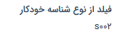

**عدد:**

یک فیلد عددی را می‌توانید اضافه کنید. مقدار پیشفرض، تعداد رقم اعشار و بازه تعداد رقم صحیح عدد وارد شده (عدد چند رقمی‌باید باشد) را می‌توانید تعیین کنید. 
زمانی که در تنظیمات فیلد از نوع عدد مشخص شود تعداد ارقام صحیح از 1 به 3 باشد ، عدد باید سه رقمی‌باشد ، در غیر این صورت در فیلد خطای نامعتبر بودن بازه وارد شده را دارد.

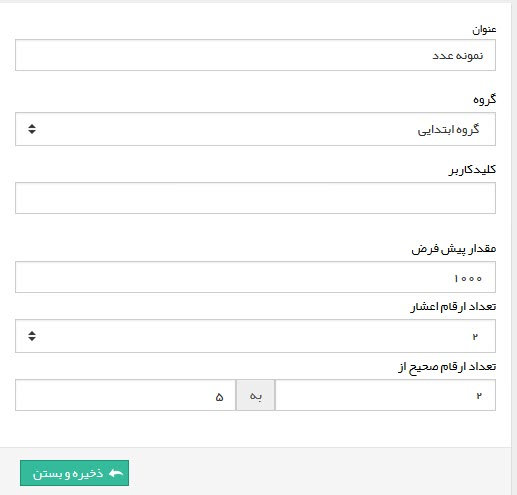

***نمایش فیلد عدد در آیتم:***

**فایل:**

با استفاده از فیلد از نوع فایل امکان اضافه کردن فایل به آیتم مورد نظر فراهم می‌شود . پسوندهای مجاز و حداکثر حجم فایل را نیز می‌توانید تعیین کنید.

***نمایش فیلد از نوع فایل در آیتم: ***

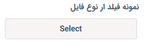

**کاربر:**

فیلد از نوع کاربر امکان انتخاب یکی از کاربران سیستم را فراهم می‌کند.

**کاربر/گروه:**

 فیلد از نوع کاربر/گروه امکان انتخاب یکی از کاربران سیستم و یا یک گروه از کاربران که در مدیریت گروه‌ها و کاربران تعریف شده است را فراهم می‌کند.

**کمپین تبلیغاتی:**

فیلد از نوع کمپین تبلیغاتی امکان انتخاب یکی از کمپین‌های تبلیغاتی سیستم را فراهم می‌کند.

**گروه:**

 فیلد از نوع گروه امکان انتخاب یکی از گروه‌های کاربران که در مدیریت گروه‌ها تعریف شده را فراهم می‌کند.

نمونه فیلد از نوع گروه:

**لیست کشویی:**

با استفاده از این فیلد می‌توان فیلد لیستی ایجاد کرد و مقادیر دلخواه را برای این لیست تعریف نمود .

> نکته: برای اضافه کردن مقادیر این لیست باید ابتدا فیلد را ذخیره نمود،سپس با استفاده از کلید افزودن مقادیر مورد نظر را می‌توان اضافه کرد .

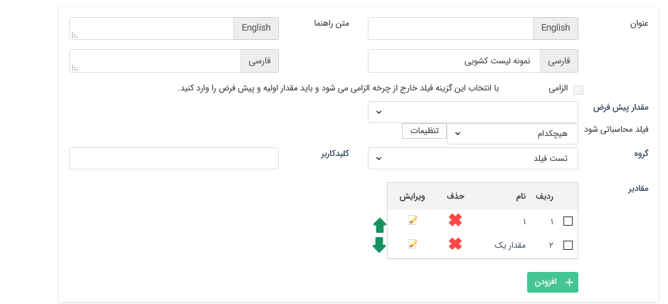

**لینک:**

 فیلد از نوع لینک امکان اضافه نمودن یک لینک به آیتم را فراهم کند .

**متن:**

یک فیلدی از نوع متن می‌توانید اضافه کنید. این فیلد میتواند تک خطی یا چند خطی باشد. فیلد چند خطی برای مواردی که نیاز به وارد کردن چندین خط توضیحات است، مناسب است.

نمونه فیلد از نوع متن:

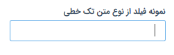

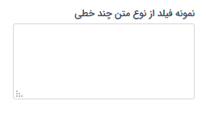

**مشخصه:**

یکی از مشخصات تعریف شده در مدیریت آیتم‌های سیستم (مانند نوع برخورد، اعتبار فرد و...) را می‌توانید به آیتم مورد نظر اضافه کنید.

***نمونه فیلد مشخصه خودکار***

> نکته: مقادیر این فیلد از قسمت مدیریت آیتم‌های سیستم قابل ویرایش می‌باشد .

### انواع فیلدهای سی آر ام:

**پرداخت:**

 مکان ایجاد یک پرداخت و یا انتخاب یکی از پرداخت‌های ثبت شده برای مخاطب (هویت مرتبط با) را فراهم می‌کند

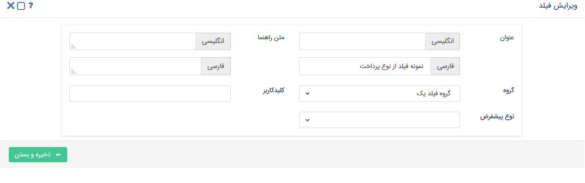

***نمایش فیلد پرداخت***

 **پیش فاکتور:**
 
 امکان ایجاد یک پیش فاکتور جدید و یا انتخاب یکی از پیش فاکتور‌های صادر شده برای مخاطب را فراهم می‌کند .

**پیش فاکتور خرید:**

 امکان ایجاد یک پیش فاکتور خرید جدید و یا انتخاب یکی از پیش فاکتور‌های خرید صادر شده برای مخاطب را فراهم می‌کند 

**حواله انبار:**

 امکان ایجاد یک حواله انبار جدید و یا انتخاب یکی از حواله‌های انبار صادر شده را فراهم می‌کند .

**دریافت:**

 امکان ایجاد یک دریافت جدید و یا انتخاب یکی از دریافت‌های ثبت شده برای مخاطب را فراهم می‌کند .

**رسید انبار:**

امکان ایجاد یک رسید انبار و یا انتخاب یکی از رسید انبارهای ثبت شده را فراهم می‌کند.

**شرکت/شخص:**

با استفاده از فیلد شخص/شرکت امکان انتخاب و یا ایجاد یک هویت (سرنخ/مخاطب) از بانک اطلاعاتی فراهم می‌شود.

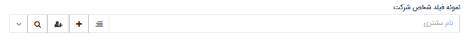

**فاکتور:**

امکان ایجاد یک فاکتور فروش جدید و یا انتخاب یکی از فاکتور فروش‌های صادر شده برای مخاطب را فراهم می‌کند 

**فاکتور خرید:**

 امکان ایجاد یک فاکتور خرید جدید و یا انتخاب یکی از فاکتور خرید‌های صادر شده برای مخاطب را فراهم می‌کند .

**فرم:**

 امکان ایجاد فرم جدید و یا انتخاب یکی از فرم‌های ثبت شده برای مخاطب (هویت مرتبط با) فراهم می‌کند.

**قرار ملاقات:**

 امکان ایجاد قرارملاقات جدید و یا انتخاب یکی از قرارملاقات‌های ثبت شده برای مخاطب را فراهم می‌کند.

**قرارداد:**

امکان ایجاد یک قرار داد جدید و یا انتخاب یکی از قراردادهای ثبت شده برای مخاطب(هویت مرتبط با) را فراهم می‌کند.

> نکته: هنگامی‌که از فیلد آیتم‌های سی آر ام(غیر از حواله انبار،رسید انبار) برای نمونه فرم در یک آیتم استفاده شود اگر آیتم "مرتبط با" داشته باشد، فرم‌های مربوط به اون "مرتبط با" نمایش داده می‌شود و اگر
 "مرتبط با" برای آیتم انتخاب نشود تمام فرم‌های ثبت شده در سیستم برای انتخاب نمایش داده می‌شود
 
 
### انواع فیلدهای لیستی: 

**لیست آیتم سی آر ام:**

با استفاده از این فیلد می‌توانید جدولی داشته باشید که محتوای آن لیستی از یک نوع آیتم باشد که هنگام تعریف فیلد مشخص کرده اید. 

**1.** ابتدا یک نام به فیلد اختصاص دهید.

**2.** در این قسمت آیتمی‌که می‌خواهید لیستی از آن نوع داشته باشید را انتخاب کنید (فاکتور فروش، فرم، قرارداد، فرصت و...)

**3.** در این قسمت زیرنوع آیتمی‌که در بالا انتخاب کرده اید را انتخاب کنید.(در این قسمت هنگامیکه زیر نوعی انتخاب و فیلد ذخیره شود دیگر این تنظیم قابل ویرایش نخواهد بود اما هنگام استفاده از فیلد امکان
 انتخاب زیرنوع مورد نظر هست)

**4.** هر یک از فیلدهایی که در این قسمت فعال باشند، در جدول به عنوان یک ستون نمایش داده می‌شوند. (فیلدهای نمایش داده شده در این قسمت به نوع آیتم بستگی دارد)

**5.** گروه فیلد مرتبط با فیلد را انتخاب کنید.

**لیست تاریخ شمسی:**

 با استفاده از این فیلد امکان انتخاب چندین تاریخ شمسی بصورت لیست در آیتم فراهم می‌شود .

**لیست تاریخ میلادی:**

 هنگام استفاده از این فیلد ، لیستی از تاریخ‌های میلادی را می‌توان مقدار دهی کرد .

**لیست دپارتمان:**

 هنگام استفاده از این فیلد ، لیستی از دپارتمان‌هایی که در قسمت مدیریت دپارتمان، سمت تعریف شده اند را در این فیلد می‌توان مقدار دهی کرد .

**لیست سمت:**

لیستی از سمت‌هایی که در قسمت مدیریت دپارتمان، سمت تعریف شده اند را در این فیلد می‌توانید مقداردهی کنید.

**لیست عدد:**

لیستی از اعداد را با در نظر گرفتن تعداد ارقام صحیح و تعداد اعشار مشخص شده در زمان ایجاد فیلد ، می‌توان مقدار دهی کرد .

**لیست فایل:**

 هنگام استفاده از این فیلد لیستی از فایل‌ها را با در نظر گرفتن حجمی‌که هنگام طراحی فیلد مشخص شده می‌توان پیوست کرد.

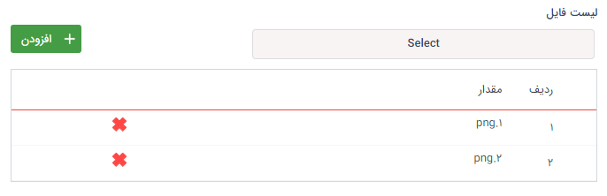

**لیست کاربر:**

هنگام استفاده از این فیلد امکان ایجاد لیستی با مقادیر نام کاربران سیستم را فراهم می‌کند (درحال حاضر فقط امکان انتخاب کاربران فعال وجود دارد.)

گزینه نمایش کاربر غیر فعال در تنظمیات فیلد قرار داده شده ام عمل نمی‌کند .

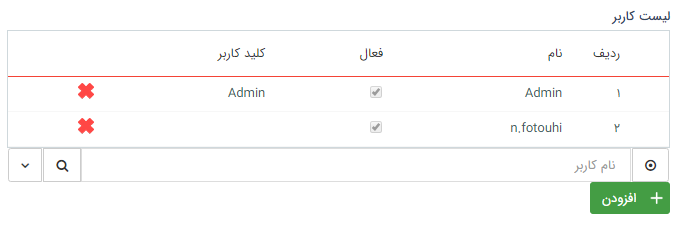

**لیست گروه:**

هنگام استفاده از این فیلد امکان ایجاد لیستی با مقادیر نام گروه‌های کاربری ایجاد شده در مدیریت گروه‌ها را در فراهم می‌کند . (فقط امکان انتخاب گروه‌های فعال وجود دارد)

**لیست گروه‌ها و کاربران:**

 هنگام استفاده از این فیلد امکان ایجاد لیستی با مقادیر نام گروه‌ها و یا کاربران را فراهم میکند (فقط امکان انتخاب گروه‌ها و کاربران فعال وجود دارد)

**لیست لینک:**

هنگام استفاده از این فیلد امکان ایجاد لیستی از نوع لینک وجود دارد.  (لینک‌ها باید با یک پروتکل شروع شوند برای مثال: //:http یا //:https یا //:ftp و ... )

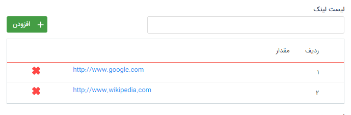

**لیست مبلغ:**

 هنگام استفاده از این فیلد امکان ایجاد لیستی از اعداد که ماهیت مبلغ (پول) دارند با مقادیر مثبت و منفی را فراهم می‌کند .

**لیست متن:**

 هنگام استفاده از این فیلد امکان درج لیستی با ماهیت متن را در اختیار شما قرار می‌دهد.

**لیست محصول:**

با استفاده از این فیلد می‌توانید یک جدول محصول به آیتم اضافه کنید. می‌توان مشخص کرد که در این جدول محصول چه اطلاعاتی (مقدار، تخفیف، قیمت واحد و قیمت نهایی) نمایش داده
شود و همچنین تعداد رقم اعشار در مقدار و مبالغ قابل تعریف است . (محصولات تعریف شده در مدیریت محصولات می‌توانند در این لیست انتخاب شوند)

***نمونه فیلد لیست محصول: ***

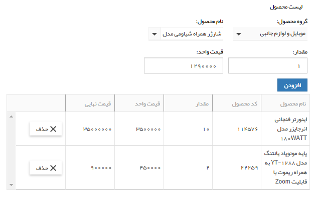

**لیست مشتری:**

امکان جستجو و انتخاب هویت‌هایی که قبلا در بانک اطلاعاتی ایجاد شده اند و یا ایجاد هویت و سپس انتخاب آن‌ها بصورت لیست وجود دارد.

**لیست مرتبط:**

 می‌توان یک لیست به هم پیوسته در آیتم ایجاد کرد.

ابتدا بر روی دکمه "تعریف لیست مرتبط کلیک کنید".

!

سپس طبق مراحل زیر اقدام کنید:

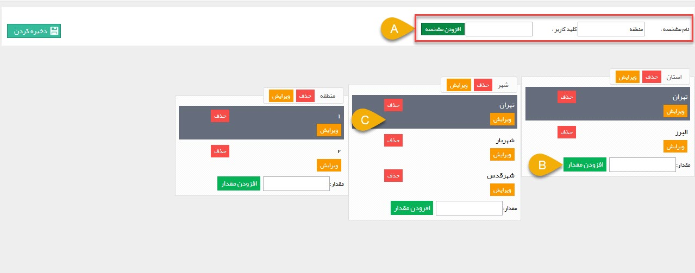

**A. نام مشخصه:** ستون‌های مختلف را از این قسمت اضافه کنید. (برای مثال طبق تصویر ما سه مشخصه استان، شهر و منطقه را اضافه کرده ایم.)

**B. افزودن مقدار:** نام مقدار را اضافه کنید. (برای مثال ما در ستون اول -استان- دو مقدار "تهران" و "البرز" را وارد کرده ایم.)

**C.** با کلیک بر روی هر مقدار می‌توانید، مقادیر ستون بعد را در آن وارد کنید. (برای مثال طبق تصویر ما برای تهران که در ستون اول وارد شده است، در ستون دوم سه مقدار تهران، شهریار و شهرقدس را وارد کرده ایم.)

نمونه:

> نکته: امکان استفاده از فیلد‌های لیست مرتبط در قالب پیش نمایش وجود ندارد .
