# افزودن فیلد اضافه (افزودن مشخصه)
در این بخش به موضوعات زیر می‌پردازیم:
- [**فیلد اضافه چیست و در کجا از آن‌ها استفاده می‌شود؟** ](#ٌWhatIsCustomFields)
- [**نحوه افزودن فیلد اضافه چگونه است؟**](#HowToAddCustomFields)
- [**انواع فیلدهای اضافه و ویژگی‌های هر فیلد**](#TypesOfCustomFields)

## فیلد اضافه چیست و در کجا از آن‌ها استفاده می‌شود؟{#ٌWhatIsCustomFields}
همه‌ی آیتم‌های موجود در پیام‌گستر شامل فیلدهای (مشخصه‌های) متناسب با ماهیت خود هستند که بتوانید اطلاعات مورد نیاز خود را وارد کنید. ولی گاهی لازم است اطلاعاتی بیشتر از فیلدهای پیش‌فرض آیتم، هنگام ذخیره سابقه وارد کنید. مثلا برای پیاده‌سازی فرآیندهای کاری روی آیتم‌ها فیلدهای اضافه برای ثبت جزئیات فعالیت‌ها کاربرد دارد. 
برای پیاده‌سازی فرم‌ها و فرآیندهای هر کسب‌وکاری باید شخصی‌سازی آیتم‌های CRM روی آیتم‌ها انجام شود که بخش اصلی شخصی‌سازی آیتم، فیلدهای اضافه است.

> **نکته** 
> - لازم به ذکر است **حداکثر** تعداد فیلدهای قابل ایجاد روی هر آیتم، **200 فیلد** می‌باشد.
> - نام فیلد‌های ساخته شده در هر آیتم **نباید** دقیقا با فیلدهایی که به صورت پیشفرض در هویت‌ها (مانند: وب سایت، ایمیل، نام خانوادگی و ... ) وجود دارد، همنام باشد.
 
با استفاده از افزودن مشخصه می‌توانید به هر آیتم (موجودیت‌ها مانند فرم، فاکتور، هویت و ... ) فیلدهای اطلاعاتی دلخواه را اضافه کنید. 
امکان ایجاد فیلد با نام تکراری در یک زیر نوع آیتم و همچنین فیلد با نام تکراری بین زیر نوع آیتم و همان آیتم وجود ندارد. 

> **نکته** 
> فیلدهایی که به هویت‌ها اضافه می‌شوند در قسمت جستجوی پیشرفته می‌توانند مورد استفاده قرار بگیرند. برای مثال اگر یک فیلد برای هویت حقیقی با عنوان "تحصیلات" اضافه کنید، در جستجوی پیشرفته می‌توانید بر اساس آن بین مخاطبان و سرنخ‌های حقیقی خود جستجو انجام دهید.

## نحوه افزودن فیلد اضافه چگونه است؟{#HowToAddCustomFields}
برای ایجاد یک فیلد اضافه به آیتم مورد نظر خود، ابتدا از مسیر **تنظیمات** > **شخصی‌سازی CRM** > **نمای کلی** وارد شوید و از لیست آیتم‌های موجود، آیتمی که قصد شخصی‌سازی آن را دارید، انتخاب کنید. سپس طبق مراحل زیر عمل کنید: 
1. چیدمان اطلاعاتی فیلدها را از قبل تعیین کنید تا بهترین فیلدها را برای شخصی‌سازی استفاده کنید.
2. ابتدا نوع مقداری که میخواهید ورود اطلاعات کنید را تعیین کنید. به عنوان مثال برای ثبت شماره پیگیری سند در یک فرم، می‌توانید از دو فیلد عدد و متن استفاده کنید. ولی مهم است که به قابلیت هرکدام آگاه بوده تا انتخاب مناسبی برای فیلد مورد نظر خود داشته باشید.
3. گروه‌های فیلدی مرتبط با مجموعه فیلدها را ایجاد نمایید. شکل زیر نمونه‌ای از گروه‌های فیلدی مورد نیاز برای یک فرصت فروش است.

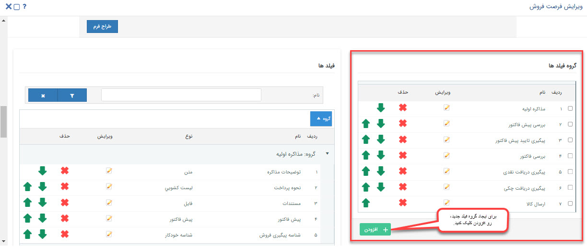

### ایجاد گروه فیلد جدید
در محیط شخصی‌سازی آیتم، در بخش گروه فیلدها، روی دکمه **افزودن** کلیک کنید.

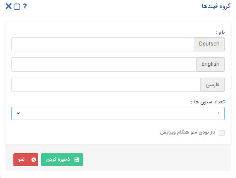

- **نام:** عنوان مناسبی برای گروه فیلدی انتخاب کنید. دقت داشته باشید که اگر ماژول مدیریت زبان‌ها را داشته و زبان دیگری در سیستم تعریف کرده باشید، می‌توانید معادل آن را نام‌گذاری کنید.
- **تعداد ستون:** از این طریق می‌توانید تعیین کنید آرایش فیلدها در آیتم به صورت تک یا دو ستون باشد.
- **باز بودن منو هنگام ویرایش:** در صورت فعال کردن این چک باکس، وضعیت باز یا بسته بودن این گروه فیلدی را هنگام ثبت/ویرایش آیتم تعیین می‌کنید.

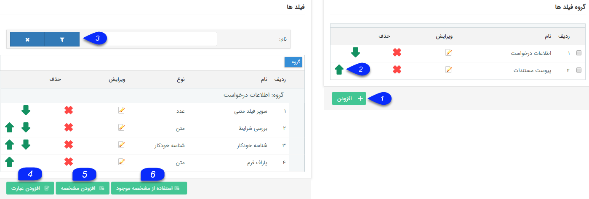

**1  . اضافه کردن گروه:** می‌توانید گروه فیلدی جدید اضافه کنید. برای نمایش نحوه ایجاد و استفاده گروه فیلد بهتر است از گیف استفاده شود. 
**2  .جا به جایی فیلدها:** با استفاده از اشاره گر‌ها میتوانید ترتیب نمایش فیلدها را تغییر دهید. 
**3  . فیلتر:**  می‌توانید برای یافتن فیلد/فیلدهای مورد نظر خود از بین فیلدهای ساخته شده، نام آن را فیلتر کنید. 
**4  . افزودن عبارت:**  می‌توانید عبارت مورد نظر خود را به آیتم اضافه کنید. این عبارت به عنوان یکی از فیلدهای آیتم نمایش داده نخواهد شد و تنها می‌توانید از پارامتر هوشمند آن برای تنظیم قالب چاپی (پیش نمایش) آیتم‌ها استفاده کنید. 
**5  . افزودن مشخصه:**  می‌توانید یک مشخصه یا همان فیلد دلخواه را به آیتم اضافه کنید، نوع نمایش آن را بسته به کاربرد پارامتر می‌توانید متن، تاریخ، لیست، چک باکس یا سایر موارد موجودمشخص کنید. همچنین می‌توان مشخص کرد این پارامتر اضافه شده، در صفحه مشخصات آیتم، در چه گروهی نمایش داده شود. به طور مثال با انتخاب گروه اطلاعات درخواست ، این پارامتر در آیتم در گروه اطلاعات درخواست قابل مشاهده خواهد بود. 
**6  . استفاده از مشخصه موجود:** برای کپی کردن فیلدهایی که در آیتم دیگری ایجاد شده‌اند می‌توانید از این ویژگی استفاده کنید. (برای مثال در آیتم فرم فیلد‌هایی ایجاد شده است و نیاز است همان فیلد‌ها در آیتم دیگری همچون وظیفه وجود داشته باشد. با استفاده از این قابلیت امکان کپی کردن فیلد‌ها وجود دارد)
به این منظور موجودیت و همچنین زیرنوع آن آیتم که فیلد مورد نظر پیش‌تر در آن ایجاد شده را مشخص کرده، نوع فیلد مورد نیاز را انتخاب نموده و پس از درج عنوان مناسب، تعیین گروه فیلد و کدکاربری برای آن، فیلد را ذخیره می‌کنیم.

 ## انواع فیلدهای اضافه و ویژگی‌های هر فیلد{#TypesOfCustomFields}

## انواع فیلدها به 3 دسته تقسیم می‌شوند:

### **فیلدهای ساده** 
  این امکان را به شما می‌دهند که بر اساس نوع فیلد، مقادیری به آن‌ها اختصاص دهید (متن و عدد و چک باکس و فایل و...) و یا اینکه از بین مقادیری که برای آن‌ها از قبل داده شده است انتخاب کنید (لیست گروه و کاربر و دپارتمان و سمت و مشخصه ... ) 
### **فیلد آیتم‌های CRM:** 
  این امکان را به شما می‌دهند که بر اساس نوع فیلد، آیتمی‌ از همان نوع فیلد که پیش‌تر برای همان هویت ایجاد شده است را انتخاب کرده و یا اینکه آیتم جدید ایجاد کرده و به فیلد متصل کنید. 
### **فیلدهای لیستی:** 
  این امکان را به شما می‌دهند که بر اساس نوع فیلد، بیش از یک مقدار به فیلد مورد نظرتان اختصاص دهید. در واقع لیستی از مقادیر مرتبط با فیلد در آیتم ذخیره می‌شود.

پیش از بررسی تنظیماتی که به صورت مشترک در همه فیلدها وجود دارند ابتدا نحوه[ افزودن مشخصه  ](https://github.com/1stco/PayamGostarDocs/blob/master/Help/Settings/Personalization-crm/Overview/General-information/Add-features/Add-features.md)را مطالعه کنید.

**1. عنوان:** انتخاب نام برای فیلد الزامی می باشد.

**2. متن راهنما:** انتخاب متن راهنما برای فیلد این امکان را فراهم می کند تا برای فیلد مورد نظر راهنمایی تعریف نمود که با قراردادن ماوس روی فیلد این راهنما نمایش داده میشود .

**3. الزامی:** با استفاده از این بخش برای برخی فیلد ها قابلیت الزامی شدن وجود دارد .

هنگام الزامی کردن فیلد چنانچه از قبل آیتم هایی در سیستم وجود داشته باشند که مقدار آن فیلد در آنها خالی باشد،  در هنگام ذخیره فیلد، ثبت مقدار پیش فرض برای آن الزامی میگردد،در غیر این صورت نیازی به ثبت مقدار پیش فرض نیست.

> نکته: در صورتی که یک فیلد  الزامی تعریف شده است و تمام  آیتم های دارای آن فیلد با مقدار پیش فرض آن، مقدار دهی شدند، میتوانید در صورت نیاز فیلد را  ویرایش و مقدار پیش فرض آن را پاک کرد.

> نکته: وقتی یک فیلد  الزامی میشود  همیشه و تحت هر شرایطی در چرخه و خارج از چرخه الزامی میگردد.

> نکته: چنانچه یک فیلد مقدار پیش فرض داشته باشد، مقادیر پیش فرض  فیلد های اضافه فقط بعد از ذخیره شدن آیتم نمایش داده میشود.

**4. فیلد محاسباتی شود:** قابلیت ورود اکسل محاسباتی و یا اینکه فیلد را به فیلدی از نوع وب سرویس تبدیل کنیم

**5. گروه:** گروه فیلدی که فیلد مورد نظر در اون نمایش داده می شود.

**6. کلید کاربر:** برای وب سرویس تعریف و استفاده می شود .

در صورتیکه در فیلد محاسباتی گزینه فایل اکسل را انتخاب کنید،
 وارد قسمت تنظیمات شوید.

**1**. ابتدا فایل اکسلی که حاوی فرمول مورد نظرتان هست را پیوست کنید.

**2**. می توانید تعیین کنید که قبل از هر ذخیره، یکبار این محاسبه انجام شود.

**3**. در این قسمت می توانید سلول های ورودی را تعریف کنید.

**4**. در این قسمت می توانید سلول خروجی را تعریف کنید.

برای مثال در تصویر بالا یک فایل اکسل که در آن سلول C1 با فرمول A1*B1 پر شده است، قرار داده شده است.

در سلول های ورودی A1  را برای تعداد دستگاه و B1 را برای وزن دستگاه در نظر گرفته ایم.

در سلول خروجی هم عبارت C1 وارد شده است تا نرم افزار نتیجه محاسبه فرمول را بتواند تشخیص دهد.

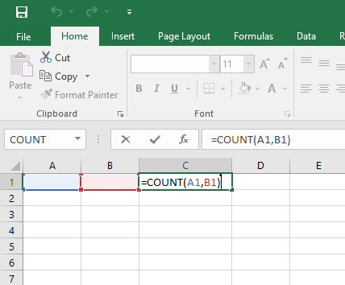

### نمونه فیلد :

درصورت انتخاب وب سرویس در فیلد محاسباتی،امکان گرفتن مقدار از یک برنامه یا وب سرویس دیگر وجود دارد. (قابل استفاده توسط برنامه نویسان)

برای مثال میتواند هزینه را از یک وب سرویس دیگر دریافت کند و در این فیلد قرار دهد.

برای این کار آدرس وب سرویس مورد نظر را در فیلد "آدرس سرویس" وارد کنید.

 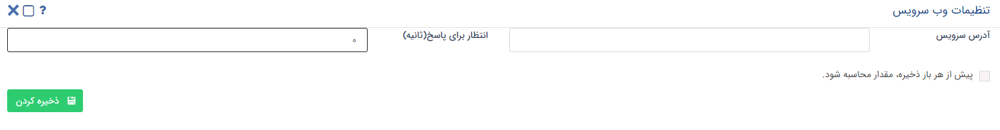
 
#### فیلدهای ساده

**HTML:**

یک فیلد متنی با قابلیت استفاده از ابزارهای HTML می‌توانید بیافزایید. 

***نمونه:***

**برچسب:**
 
می‌توانید یک متن رنگی یا یک آیکون را برای نمایش در آیتم اضافه کنید. (مانند توضیح نحوه پر کردن فرم، یا نکات مهمی‌که کاربر باید همیشه مد نظر داشته باشد.)

برای نمایش متن مورد نظر باید از گزینه نمایش عنوان و برای نمایش یک آیکون از گزینه نمایش آیکون استفاده کرد .

***نمونه برای نمایش برچسب از نوع عنوان:***

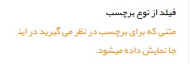

***نمونه برای نمایش آیکون:***

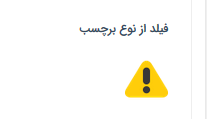

 **پول:**
یک فیلد برای وارد کردن مقادیر مثبت و منفی پولی را می‌توانید اضافه کنید

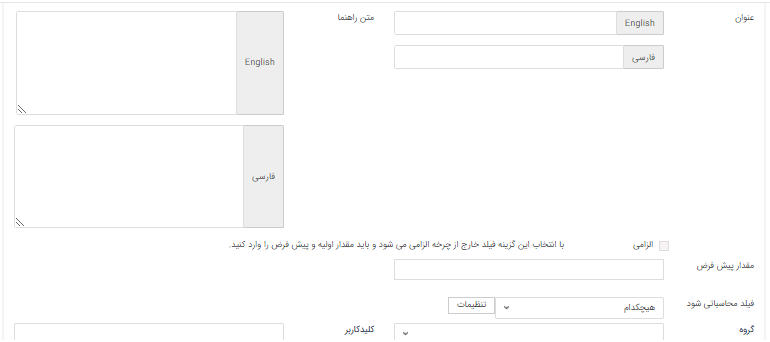

***نمونه فیلد از نوع پول:***

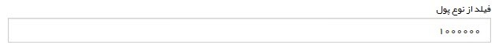

 **تاریخ شمسی:**
 
 یک فیلد از نوع تاریخ شمسی می‌توانید اضافه کنید .

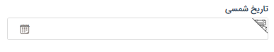

**تاریخ میلادی:**

یک فیلد از نوع تاریخ میلادی می‌توانید اضافه کنید.

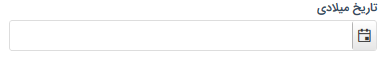

**تصویر:**

یک فیلد برای انتخاب تصویر اضافه می‌کند. میتوانید اندازه، پسوندهای مجاز و اندازه نمایش تصویر در صفحه را مشخص کنید.

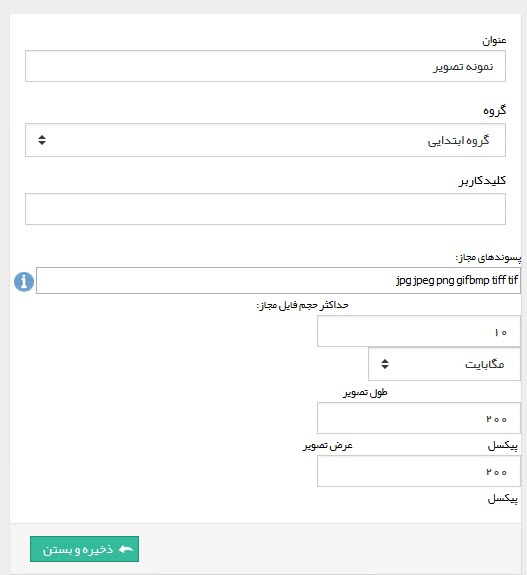

***نمونه فیلد از نوع تصویر:***

 **دپارتمان**
 
 این فیلد لیست دپارتمان‌های تعریف شده در مدیریت دپارتمان‌ها و سمت‌ها را شامل می‌شود که کاربر می‌تواند یکی از دپارتمان‌ها را از لیست انتخاب کند.

**ساعت**

 فیلدی با قابلیت انتخاب ساعت را می‌توانید بیافزایید..
 
 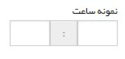
 
 
 **سمت**
 
 این فیلد لیست سمت‌های تعریف شده در مدیریت دپارتمان‌ها و سمت‌ها را شامل می‌شود که کاربر می‌تواند یکی از سمت‌ها را از لیست انتخاب کند.

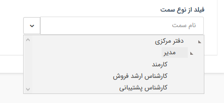

**شناسه خودکار**

 با استفاده از این فیلد ميتوانيد يک شمارنده خودکار (Indicator) به آيتم‌ها اضافه کنيد، ميتوانيد پيشوند و پسوند اين شمارنده و تعداد رقم آن را مشخص کنيد.

>**نکته:** 
> زمانی که از فیلد شناسه خودکار در موجودیتی مثلا فرم استفاده می‌شود ، فرم‌های ایجاد شده از اون نوع بصورت خودکار شماره می‌گیرند و فرم‌های جدیدی که از این نوع ایجاد می‌شود براساس فرم‌های قبلی شماره دهی می‌شود.

 
 
 نمونه فیلد از نوع شناسه خودکار:

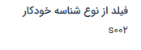

>**نکته:** 
> برای استفاده از فیلد شماره خودکار نیاز به ماژول فرم ساز پیش رفته می‌باشد .

**عدد**

یک فیلد عددی را می‌توانید اضافه کنید. مقدار پیشفرض، تعداد رقم اعشار و بازه تعداد رقم صحیح عدد وارد شده (عدد چند رقمی‌باید باشد) را می‌توانید تعیین کنید. 
زمانی که در تنظیمات فیلد از نوع عدد مشخص شود تعداد ارقام صحیح از 1 به 3 باشد ، عدد باید سه رقمی‌باشد ، در غیر این صورت در فیلد خطای نامعتبر بودن بازه وارد شده را دارد.

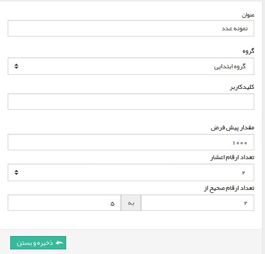

***نمایش فیلد عدد در آیتم:***

**فایل**

با استفاده از فیلد از نوع فایل امکان اضافه کردن فایل به آیتم مورد نظر فراهم می‌شود . پسوندهای مجاز و حداکثر حجم فایل را نیز می‌توانید تعیین کنید.

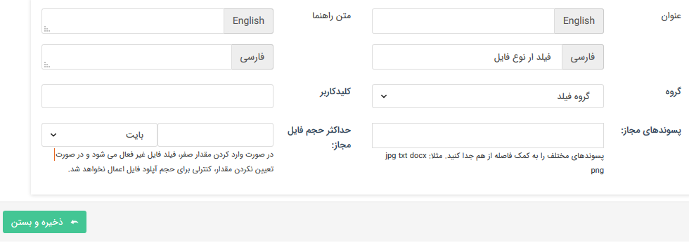

***نمایش فیلد از نوع فایل در آیتم: ***

**کاربر**

فیلد از نوع کاربر امکان انتخاب یکی از کاربران سیستم را فراهم می‌کند.

**کاربر/گروه**

 فیلد از نوع کاربر/گروه امکان انتخاب یکی از کاربران سیستم و یا یک گروه از کاربران که در مدیریت گروه‌ها و کاربران تعریف شده است را فراهم می‌کند.

**کمپین تبلیغاتی**

فیلد از نوع کمپین تبلیغاتی امکان انتخاب یکی از کمپین‌های تبلیغاتی سیستم را فراهم می‌کند.

**گروه کاربر**

فیلد از نوع گروه امکان انتخاب یکی از گروه‌های کاربران که در مدیریت گروه‌ها تعریف شده را فراهم می‌کند.

***نمونه فیلد از نوع گروه:***

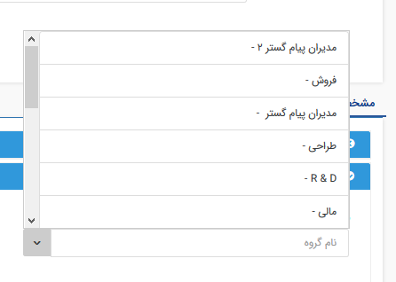

**لیست کشویی**

با استفاده از این فیلد می‌توان فیلد لیستی ایجاد کرد و مقادیر دلخواه را برای این لیست تعریف نمود . 
> نکته: برای اضافه کردن مقادیر این لیست باید ابتدا فیلد را ذخیره نمود،سپس با استفاده از کلید افزودن مقادیر مورد نظر را می‌توان اضافه کرد .

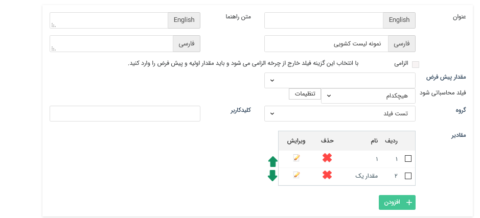

**لینک**

 فیلد از نوع لینک امکان اضافه نمودن یک لینک به آیتم را فراهم کند .

**متن**

یک فیلدی از نوع متن می‌توانید اضافه کنید. این فیلد میتواند تک خطی یا چند خطی باشد. فیلد چند خطی برای مواردی که نیاز به وارد کردن چندین خط توضیحات است، مناسب است.

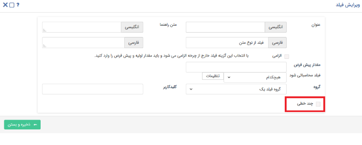

نمونه فیلد از نوع متن:

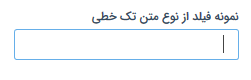

**مشخصه**

یکی از مشخصات تعریف شده در مدیریت آیتم‌های سیستم (مانند نوع برخورد، اعتبار فرد و...) را می‌توانید به آیتم مورد نظر اضافه کنید. 

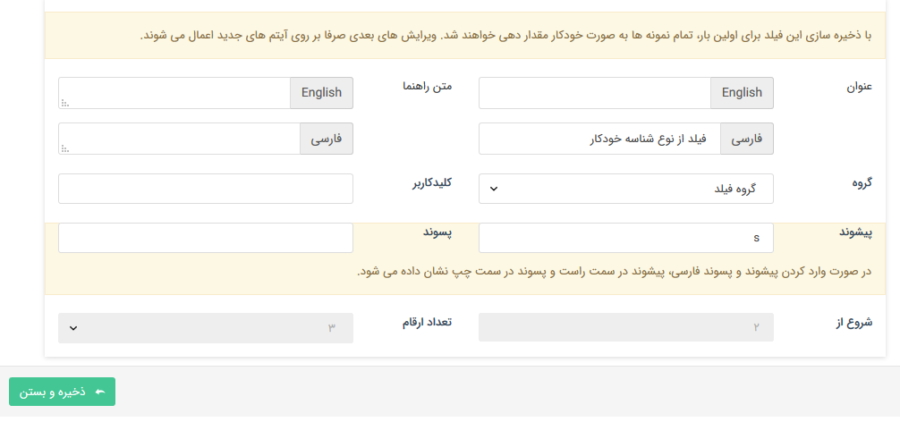

***نمونه فیلد مشخصه خودکار***

>**نکته:** 
 مقادیر این فیلد از قسمت مدیریت آیتم‌های سیستم قابل ویرایش می‌باشد.

#### فیلدهای CRM
قرار دادن فیلد CRM در یک آیتم به کاربر این امکان را می‌دهد تا از همان قسمت، آیتمی از نوع آن فیلد ثبت نماید. به عنوان مثال شما می‌توانید از قسمت شخصی‌سازی فاکتور، فیلد دریافت را به آن اضافه نمایید. در نتیجه کاربر می‌تواند با کلیک بر روی دریافت، سند دریافتی مرتبط با فاکتور را نیز در همان صفحه ایجاد نموده و یا دریافت از پیش ثبت شده‌ای را به آن متصل نماید. به منظور ثبت آیتم جدید از گزینه "آیتم جدید" و به منظور انتخاب یکی از سوابق ثبت‌ شده از آن نوع از گزینه  "انتخاب آیتم"
استفاده کنید.

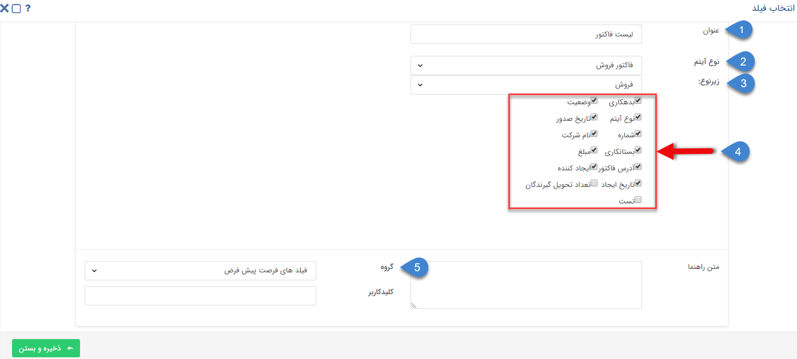

> **نکته** 
>[ایجاد آیتم‌های CRM](https://github.com/1stco/PayamGostarDocs/blob/master/Help/Integrated-bank/Database/General-specifications/Specifications-toolbar/Specifications-toolbar.md#AddingRelatedRecord) و [اتصال سوابق از پیش ثبت شده](https://github.com/1stco/PayamGostarDocs/blob/master/Help/Integrated-bank/Database/Records/Joint-record-information/Joint-record-information.md#RelatingRecords)، از روش‌های دیگر نیز امکان‌پذیر است. 

**شرکت/شخص**

با استفاده از فیلد شخص/شرکت امکان انتخاب و یا ایجاد یک هویت (سرنخ/مخاطب) از بانک اطلاعاتی فراهم می‌شود.

**پرداخت**

 امکان ایجاد یک پرداخت و یا انتخاب یکی از پرداخت‌های ثبت شده برای مخاطب (هویت مرتبط با) را فراهم می‌کند

***نمایش فیلد پرداخت***

 **پیش فاکتور**
 
 امکان ایجاد یک پیش فاکتور جدید و یا انتخاب یکی از پیش فاکتور‌های صادر شده برای مخاطب را فراهم می‌کند.

**پیش فاکتور خرید**

 امکان ایجاد یک پیش فاکتور خرید جدید و یا انتخاب یکی از پیش فاکتور‌های خرید صادر شده برای مخاطب را فراهم می‌کند 

**حواله انبار**

 امکان ایجاد یک حواله انبار جدید و یا انتخاب یکی از حواله‌های انبار صادر شده را فراهم می‌کند .

**دریافت**

 امکان ایجاد یک دریافت جدید و یا انتخاب یکی از دریافت‌های ثبت شده برای مخاطب را فراهم می‌کند .

**رسید انبار**

امکان ایجاد یک رسید انبار و یا انتخاب یکی از رسید انبارهای ثبت شده را فراهم می‌کند.

**فاکتور**

امکان ایجاد یک فاکتور فروش جدید و یا انتخاب یکی از فاکتور فروش‌های صادر شده برای مخاطب را فراهم می‌کند 

**فاکتور خرید**

 امکان ایجاد یک فاکتور خرید جدید و یا انتخاب یکی از فاکتور خرید‌های صادر شده برای مخاطب را فراهم می‌کند.

**فرم**

 امکان ایجاد فرم جدید و یا انتخاب یکی از فرم‌های ثبت شده برای مخاطب (هویت مرتبط با) فراهم می‌کند.

**قرار ملاقات**

 امکان ایجاد قرارملاقات جدید و یا انتخاب یکی از قرارملاقات‌های ثبت شده برای مخاطب را فراهم می‌کند.

**قرارداد**

امکان ایجاد یک قرار داد جدید و یا انتخاب یکی از قراردادهای ثبت شده برای مخاطب(هویت مرتبط با) را فراهم می‌کند.

> نکته: هنگامی‌که از فیلد آیتم‌های سی آر ام(غیر از حواله انبار،رسید انبار) برای نمونه فرم در یک آیتم استفاده شود اگر آیتم "مرتبط با" داشته باشد، فرم‌های مربوط به اون "مرتبط با" نمایش داده می‌شود و اگر
 "مرتبط با" برای آیتم انتخاب نشود تمام فرم‌های ثبت شده در سیستم برای انتخاب نمایش داده می‌شود
 
##### توضیحات مشترک فیلدهای CRM
فیلدهای CRM که در قسمت بالا در مورد آن‌ها توضیح داده شده، دارای تنظیمات مشترک است. 
1. **عنوان:** با استفاده از این قسمت می‌توانید عنوان مورد نظر را برای فیلد خود انتخاب نمایید. 
2. **کلیدکاربر:** در این قسمت باید یک کد به آیتم اختصاص دهید. این کلید می‌تواند شامل حروف انگلیسی و عدد باشد. توجه داشته باشید که کد درج شده پیش‌تر در نرم‌افزار استفاده نشده باشد. 
3. **زیرنوع:** در صورتی که آیتم انتخاب شده دارای چند زیرنوع باشد، از این قسمت می‌توانید یکی از آن‌ها را انتخاب نمایید. در این حالت کاربر از طریق فیلد، صرفا می‌تواند زیرنوع تعیین شده را ایجاد نماید. به عنوان مثال فرض کنید فاکتور در سیستم شما دارای ۲ زیرنوع رسمی و غیررسمی می‌باشد و شما به هنگام ایجاد فیلد فاکتور در موجودیت، نوع پیش‌فرض را بر روی رسمی تنظیم می‌کنید. در این حالت با کلیک برروی گزینه "فاکتور جدید" فاکتور ثبت شده از نوع رسمی بوده و کاربر قادر به تغییر آن به غیررسمی نمی‌باشد. همچنین به خاطر داشته باشید که پس از ثبت اولین سند، شما دیگر قادر به ویرایش نوع پیش‌فرض نخواهید بود.{#NotSavedToParentStory}
4. **چک باکس سابقه در نظر گرفته نشود:** در حالت کلی و در صورت عدم انتخاب این گزینه، آیتمی که با استفاده از این فیلدها ایجاد می‌شوند، به آیتم اصلی متصل بوده و در سوابق آن درج می‌شود. این بدین معناست که اگر از طریق فیلد دریافت تعبیه شده در فاکتور، دریافتی ثبت شود، این دریافت متصل به فاکتور ثبت خواهد شد. دریافت، مرتبط با فاکتور ثبت شده و این اتصال در قسمت "مرتبط با" مشاهده می‌شود. اما با فعال کردن این گزینه، دریافت به صورت مجزا ثبت شده و درقسمت "مرتبط با" به فاکتور متصل **نیست**. 
***نمونه سوابق متصل شده:***

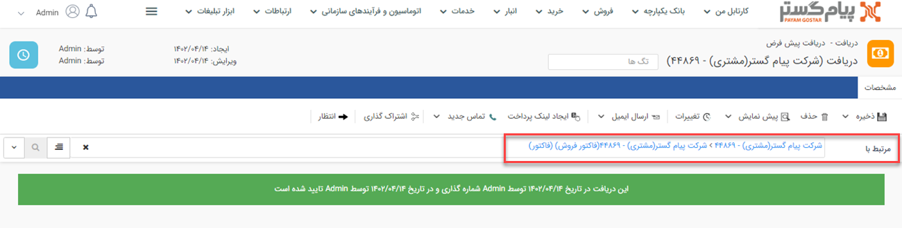

***نمونه سوابق متصل نشده:***

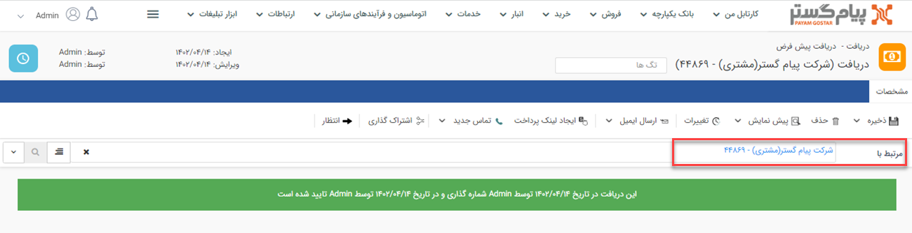‌
####  فیلدهای لیستی

**لیست آیتم‌های CRM**

 با استفاده از این فیلد می‌توانید جدولی داشته باشید که محتوای آن لیستی از یک نوع آیتم باشد. نوع آیتم به هنگام تعریف فیلد مشخص شده است. به منظور اعمال تنظیمات به شیوه زیر عمل کنید:

**1.** ابتدا یک نام به فیلد اختصاص دهید. 
**2.** در این قسمت آیتمی‌ که می‌خواهید لیستی از آن نوع داشته باشید را انتخاب کنید (فاکتور فروش، فرم، قرارداد، فرصت و...) 
**3.** در این قسمت زیرنوع آیتمی‌ که در بالا انتخاب کرده اید را انتخاب کنید. توجه داشته باشید، در این قسمت هنگامیکه زیر نوعی انتخاب و فیلد ذخیره شود دیگر این تنظیم قابل ویرایش نخواهد بود اما هنگام استفاده از فیلد امکان انتخاب زیرنوع مورد نظر فراهم است. 
**4.** هر یک از فیلدهایی که در این قسمت فعال باشند، در جدول به عنوان یک ستون نمایش داده می‌شوند. (فیلدهای نمایش داده شده در این قسمت به نوع آیتم بستگی دارد) 
**5.** گروه فیلد مرتبط با فیلد را انتخاب کنید.

**لیست تاریخ شمسی**

 با استفاده از این فیلد امکان انتخاب چندین تاریخ شمسی بصورت لیست در آیتم فراهم می‌شود .

**لیست تاریخ میلادی**

 هنگام استفاده از این فیلد ، لیستی از تاریخ‌های میلادی را می‌توان مقدار دهی کرد .

**لیست دپارتمان**

 هنگام استفاده از این فیلد ، لیستی از دپارتمان‌هایی که در قسمت مدیریت دپارتمان، سمت تعریف شده اند را در این فیلد می‌توان مقدار دهی کرد .

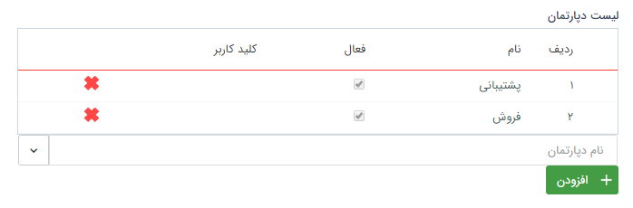

**لیست سمت**

لیستی از سمت‌هایی که در قسمت مدیریت دپارتمان، سمت تعریف شده اند را در این فیلد می‌توانید مقداردهی کنید.

**لیست عدد**
لیستی از اعداد را با در نظر گرفتن تعداد ارقام صحیح و تعداد اعشار مشخص شده در زمان ایجاد فیلد ، می‌توان مقدار دهی کرد .

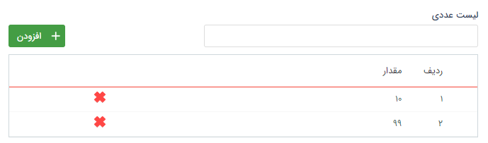

**لیست فایل:**

 هنگام استفاده از این فیلد لیستی از فایل‌ها را با در نظر گرفتن حجمی‌که هنگام طراحی فیلد مشخص شده می‌توان پیوست کرد.

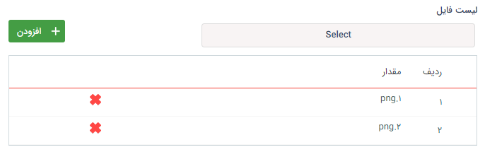

**لیست کاربر:**

هنگام استفاده از این فیلد امکان ایجاد لیستی با مقادیر نام کاربران سیستم را فراهم می‌کند (درحال حاضر فقط امکان انتخاب کاربران فعال وجود دارد.)

گزینه نمایش کاربر غیر فعال در تنظمیات فیلد قرار داده شده ام عمل نمی‌کند .

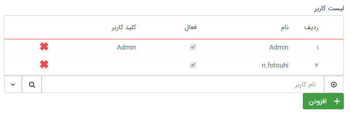

**ليست کشويي چند انتخابي:**

 استفاده از این فیلد امکان انتخاب مقادیر مختلف به صورت چند تایی از مقادیر تعریف شده در لیست کشویی را فراهم می‌کند.

**لیست گروه:**

هنگام استفاده از این فیلد امکان ایجاد لیستی با مقادیر نام گروه‌های کاربری ایجاد شده در مدیریت گروه‌ها را در فراهم می‌کند . (فقط امکان انتخاب گروه‌های فعال وجود دارد)

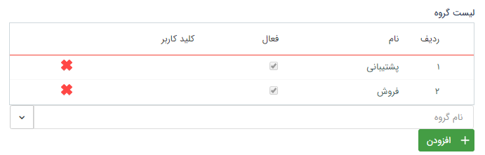

**لیست گروه‌ها و کاربران:**

 هنگام استفاده از این فیلد امکان ایجاد لیستی با مقادیر نام گروه‌ها و یا کاربران را فراهم میکند (فقط امکان انتخاب گروه‌ها و کاربران فعال وجود دارد)

**لیست لینک:**

هنگام استفاده از این فیلد امکان ایجاد لیستی از نوع لینک وجود دارد.  (لینک‌ها باید با یک پروتکل شروع شوند برای مثال: //:http یا //:https یا //:ftp و ... )

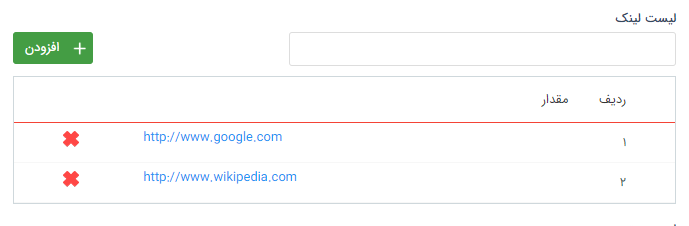

**لیست مبلغ:**

 هنگام استفاده از این فیلد امکان ایجاد لیستی از اعداد که ماهیت مبلغ (پول) دارند با مقادیر مثبت و منفی را فراهم می‌کند .

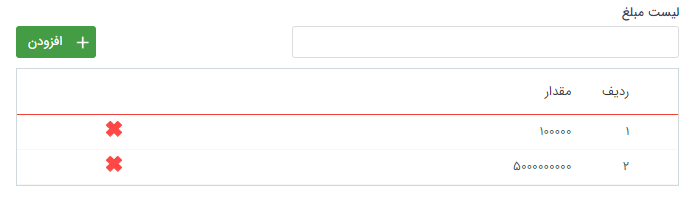

**لیست متن:**

 هنگام استفاده از این فیلد امکان درج لیستی با ماهیت متن را در اختیار شما قرار می‌دهد.

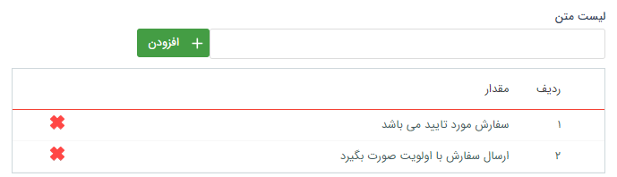

**لیست محصول:**

با استفاده از این فیلد می‌توانید یک جدول محصول به آیتم اضافه کنید. می‌توان مشخص کرد که در این جدول محصول چه اطلاعاتی (مقدار، تخفیف، قیمت واحد و قیمت نهایی) نمایش داده
شود و همچنین تعداد رقم اعشار در مقدار و مبالغ قابل تعریف است . (محصولات تعریف شده در مدیریت محصولات می‌توانند در این لیست انتخاب شوند)

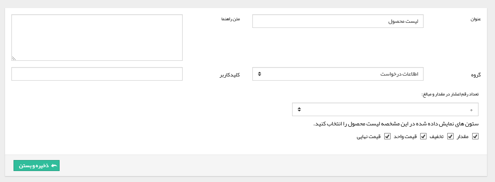

***نمونه فیلد لیست محصول: ***

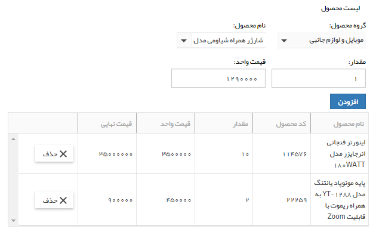

**لیست مشتری:**

امکان جستجو و انتخاب هویت‌هایی که قبلا در بانک اطلاعاتی ایجاد شده اند و یا ایجاد هویت و سپس انتخاب آن‌ها بصورت لیست وجود دارد.

**لیست مرتبط:**

 می‌توان یک لیست به هم پیوسته در آیتم ایجاد کرد.

ابتدا بر روی دکمه "تعریف لیست مرتبط کلیک کنید".

سپس طبق مراحل زیر اقدام کنید:

**A. نام مشخصه:** ستون‌های مختلف را از این قسمت اضافه کنید. (برای مثال طبق تصویر ما سه مشخصه استان، شهر و منطقه را اضافه کرده ایم.)

**B. افزودن مقدار:** نام مقدار را اضافه کنید. (برای مثال ما در ستون اول -استان- دو مقدار "تهران" و "البرز" را وارد کرده ایم.)

**C.** با کلیک بر روی هر مقدار می‌توانید، مقادیر ستون بعد را در آن وارد کنید. (برای مثال طبق تصویر ما برای تهران که در ستون اول وارد شده است، در ستون دوم سه مقدار تهران، شهریار و شهرقدس را وارد کرده ایم.)

نمونه:

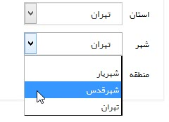

>**نکته:** 
> امکان استفاده از فیلد‌های لیست مرتبط در قالب پیش نمایش وجود ندارد .
