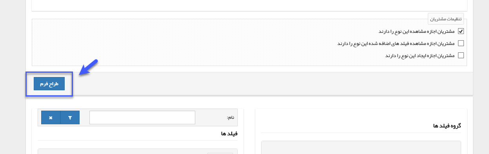

# افزودن فیلد از طریق طراح فرم 

این ابزار اجازه ویرایش و طراحی فرم یا سایر آیتم ها را به صورت شماتیک (تصویری) در اختیار کاربر قرار می دهد.

میتوانید گروه فیلدی و فیلدهای مورد نظر را با کشیدن و جایگذاری (Drag&Drop) کردن در صفحه  به صورت دلخواه بچینید.

**1. ذخیره:** فیلدهای تغییر یافته و اضافه شده را ذخیره می کند. 
**2. گروه فیلد:** برای اضافه کردن فیلد باید ابتدا گروه آن را ایجاد کنید، بر روی گروه کلیک کرده و آن را به داخل صفحه طراحی بکشید. برای هر گروه باید عنوان و تعداد ستونی که فیلدهای اضافه شده در کنار هم باید به نمایش درآیند را مشخص کنید. 
**3. فیلدها:** انواع فیلدها در این قسمت وجود دارد که میتوانید آنها را به داخل صفحه بکشید. برای هر فیلد باید عنوان آن را وارد کنید.
 
> **نکته** 
> - قسمت طراحی فرم صرفا برای افزودن فیلد و چیدمان آسان فیلدهاست، بنابراین برای تنظیمات فیلدهایی مثل فیلد لیست کشویی، فیلدهای مشخصه خودکار و ... که تنظیمات تکمیلی دارند، باید مجددا به صفحه **شخصی‌سازی آیتم** > **افزودن مشخصه** رفته و از بخش **ویرایش فیلد**، تنظیمات را تکمیل کنید.
> - برای آشنایی بیشتر با انواع فیلدهای موجود و کاربرد آنها، قسمت [افزودن مشخصه](https://github.com/1stco/PayamGostarDocs/blob/master/Help/Settings/Personalization-crm/Overview/General-information/Add-features/Add-features.md) را مطالعه کنید.

**4. تعداد ستون ها:** با کلیک بر روی علامت ویرایش، تعداد ستون هر گروه فیلد را مشخص کنید. 
**5. عنوان:** با کلیک بر روی علامت ویرایش، نام فیلد یا گروه فیلد مورد نظر را وارد کنید. 
**6. حذف:** هر فیلد را در صورت نیاز می توانید حذف کنید

