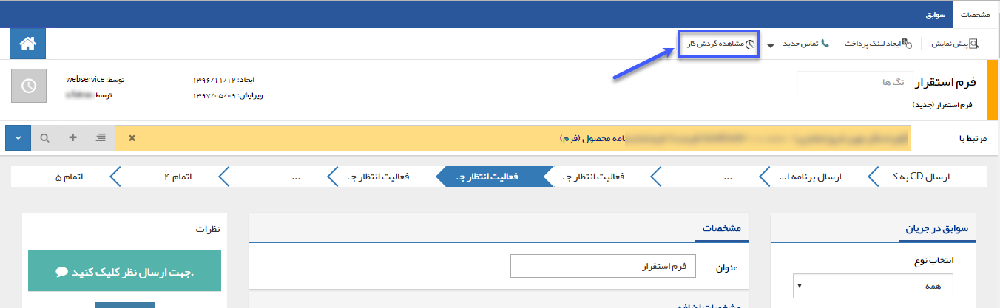
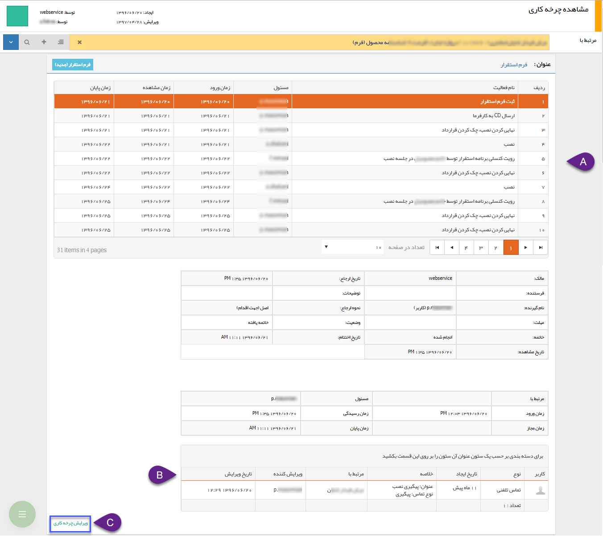
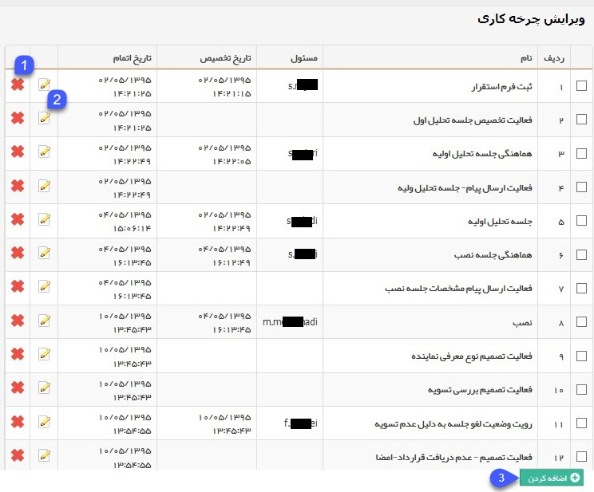
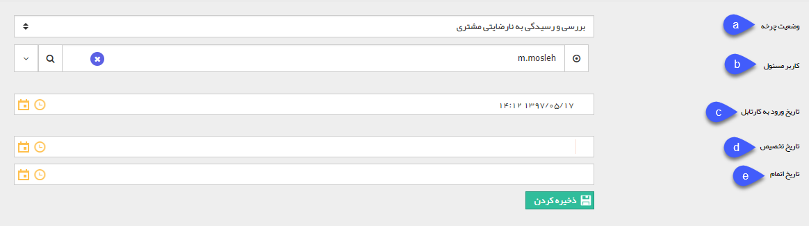

# مالک آیتم

مالک آیتم کسی است که علاوه بر مدیران و راهبران سیستم می تواند گردش کار آیتم مربوطه را ویرایش کند و مجوزی همانند مدیر ارتباط با مشتریان در آن آیتم را کسب می کند . در هر چرخه می توانید گردش کار آیتم تحت چرخه را مشاهده کرده و تغییر دهید. از این قابلیت زمانی استفاده می شود که چرخه کاری یکی از سوابق ثبت شده به دلیل خطای کاربری وارد مرحله اشتباهی از فرایند گردد یا به هر دلیلی بخواهید گردش کار سابقه ثبت شده برای یکی از هویت ها، روال فرایندی تعریف شده را طی نکند. 
تصویر زیر را برای مثال در نظر داشته باشید.

در هر آیتم تحت چرخه کاری با کلیک کردن بر روی گزینه مشاهده گردش کار اطلاعات چرخه طبق تصویر زیر نمایش داده می شود.

**A**. اطلاعات مراحل مختلف گردش کار را میتوانید در این قسمت مشاهده کنید. 
**B**. با کلیک بر روی هریک از مراحل گردش کار، در صورتی که سابقه ای در سوابق این آیتم ثبت شده باشد (مثلا ثبت یک تماس تلفنی در سوابق یک فرم، مانند تصویر بالا)، سوابق ثبت شده در این قسمت نمایش داده خواهد شد. 
**C. ویرایش چرخه:** با کلیک بر روی ویرایش چرخه در صورت فهال بودن فرآیند بر روی آیتم، می توانید گردش کار انجام شده بر روی آیتم مورد نظر را به دلخواه ویرایش کنید.
 
> **نکته** 
جهت ویرایش چرخه کاری آیتم در حالت انتظار ابتدا می بایست آیتم مورد نظر از حالت انتظار خارج و وارد کارتابل شود، سپس این ویرایش در گردش کار اعمال گردد.
 
 
 
**1. حذف:** با حذف هر مرحله چرخه از انتها، جرخه به عقب بر می گردد. 
**2. ویرایش:** می توانید هر مرحله از چرخه را ویرایش کنید. 
**3. اضافه کردن:** می توانید مرحله بعدی چرخه را به دلخواه تعیین کنید.

**a**. می توانید مرحله مورد نظر (یکی از کارتابل ها یا فعالیت های تعریف شده) را انتخاب کنید. 
**b**. کاربری مسئول مرحله تعیین شده در گام قبل را تعیین کنید. (به زبان دیگر تعیین کنید که فرایند وارد کارتابل چه کاربری شود) 
**c**. تاریخ ورود به کارتابل را تعیین کنید. 
**d**. تکمیل این فیلد برای اضافه کردن وضعیت جدید نیازی نیست، تاریخ تخصیص به معنی زمانی است که کار به کاربر مسئول کارتابل تخصیص داده می شود (با توجه به اینکه مسئول یک کارتابل می تواند گروهی از کاربران باشد، تاریخ ورود به کارتابل و تاریخ تخصیص به یکی از کاربران آن گروه که به عنوان مسئول کارتابل شناخته خواهد شد، می تواند متفاوت باشد) 
**e**. تکمیل این فیلد برای اضافه کردن وضعیت جدید نیازی نیست، تاریخ اتمام به معنی زمانی است که کار از این وضعیت چرخه، خارج می شود و وارد مرحله بعدی می شود.

