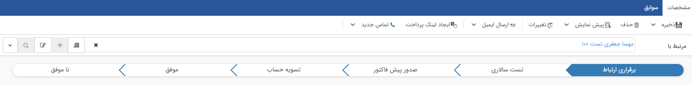
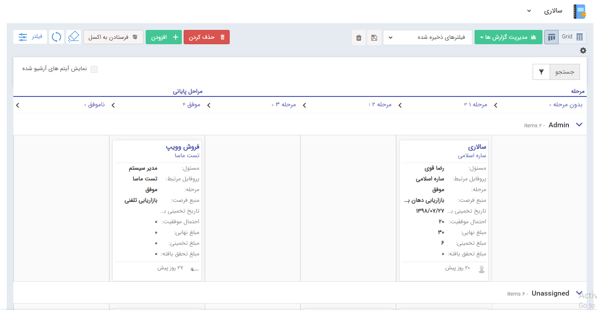
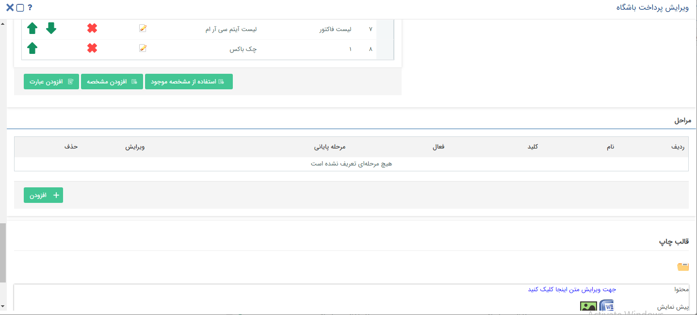
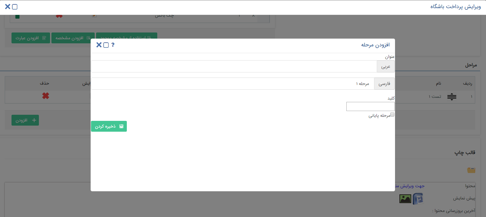
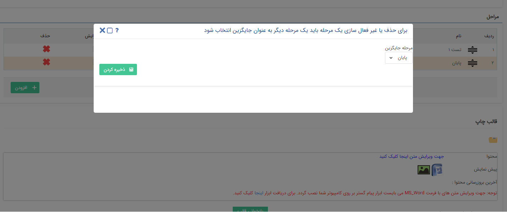

##  تنظیمات مرحله بندی آیتم‌ها 

قابلیت مدیریت انواع موجودیت ها در پیام‌گستر (به غیر از هویت و وظیفه) از طریق سازوکار کانبان است. 
از این طریق می‌توان تمامی ‌آیتم‌های موجود در پیام‌گستر را مرحله‌بندی نمود و چرخه عمری برای آن‌ها در نظر گرفت تا به نتیجه دلخواه برسند. 
در صورتی که آیتم تحت چرخه باشد، تغییر مرحله فقط از طریق فعالیت [تعیین مرحله](https://github.com/1stco/PayamGostarDocs/blob/master/Help/Settings/Personalization-crm/Overview/Process-design/Create-a-work-cycle/Activity/Determining-the-stage/Determining-the-stage.md) 
 
###  صورت می‌گیرد در غیر این‌صورت ۲ راه برای تغییر مرحله ایتم وجود دارد:

**1.** بر روی آیتم کلیک کرده و از طریق نمایش زنجیره ای مراحل، مرحله مورد نظر انتخاب کرده و دکمه ذخیره زده شود.
 
 
 
**2.** در لیست هر آیتم دو نوع حالت نمایشی وجود دارد : 1. نمایش لیستی 2. نمایش کانبان

امکان تغییر حالت نمایشی لیست ایتم ها از هر کدام از این حالت ها به حالت دیگر وجود دارد. 
در نمای کانبان میتوانید نام مراحل و تعداد ایتم های موجود در هر مرحله را بهمراه مشخصات آن ایتم مشاهده کنید. 
همچنین میتوان آیتم مورد نظر را از یک ستون به ستون دیگر کشیده و منتقل کرد و از این طریق میتوان مرحله و یا کاربر مسئول آن مرحله را تغییر داد. 
زمانی که برای یک آیتم مرحله تعریف میگردد، تمامی آیتم های از پیش تعریف شده از آن نوع آیتم در ستون بدون مرحله و unassigned قرار میگیرند.

> **نکته** 
 زمانی که آیتمی در یک مرحله قرار دارد امکان جابه جایی این آیتم به ستون بدون مرحله وجود ندارد.

> **نکته** 
 لازم به ذکر است تنها برای آیتم های از نوع فرصت مراحل پیش فرض توسط سیستم تعریف گردیده است و که لیست این مراحل از این بخش قابل مشاهده و ویرایش میباشد لذا ایتم های موجود از این نوع در سیستم از ابتدا دارای مرحله مشخص هستند.

> **نکته** 
 در ستون های مراحل پایانی تنها ایتم های 30 روز گذشته نمایش داده میشوند و رکورد های قبلی ارشیو میگردد.

برای نمایش آیتم های آرشیو شده بایستی تیک نمایش آیتم های آرشیو شده فعال گردد. 
قابلیت مخفی کردن جزییات مراحل برای بهتر شدن نمایش از طریق فلش کنار نام مراحل وجود دارد و همچنین برای نمایش مجدد جزییات از همان فلش اقدام کنید.

> **نکته**  
در پیش‌نمایش نام مرحله، تاریخ تغییر مرحله و تغییر دهنده مرحله قابل دسترسی می‌باشند.

### تعریف مرحله
برای تعریف مرحله برای آیتم های موجود در سیستم می توان از قسمت ویرایش آیتم موجود در تنظیمات ، بخش شخصی سازی crm قسمت نمای کلی اقدام کرد .

با کلیک بر روی بخش افزودن میتوانید مرحله جدیدی را تعریف نمایید و همچنین لیست مراحل تعریف شده به همراه وضعیت مرحله ( فعال / غیر فعال) نمایش داده میشود و امکان حذف و ویرایش مراحل وجود دارد. 
لازم به ذکر است که مشخص کردن یک مرحله پایانی برای ذخیره مراحل آیتم ضروری می‌باشد.

> **نکته** 
 امکان تغییر وضعیت مرحله ( فعال / غیر فعال ) از این بخش نیز وجود دارد. مرحله ای که وضعیت آن غیر فعال باشد در نمای زنجیره ای مرحله نمایش داده نمیشود.
> لازم به ذکر است امکان تعریف مرحله برای تراکنش‌های انبار وجود ندارد.

زمانی که در یک مرحله آیتم/ آیتم هایی وجود دارد امکان غیر فعالسازی و یا حذف آن مرحله بدون انتخاب یک مرحله جایگزین وجود ندارد.

### مرتب سازی مراحل

میتوان یک مرحله را از طریق کشیدن مکان ترتیب نمایش آن را در لیست جابه جا کرد.

