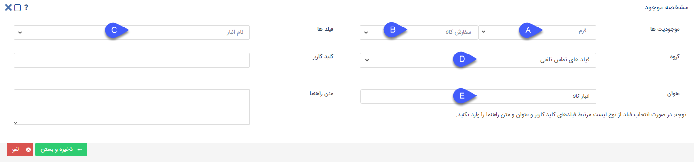

# تنظیمات مشترک شخصی‌سازی آیتم‌ها 

در این قسمت تنظیماتی که در شخصی‌سازی تمامی آیتم‌های CRM مشترک است را مشاهده می‌کنید. توجه داشته باشید که برای آیتم‌های فروش، خرید، دریافت، پرداخت، قرارداد، رسید و حواله انبار، درخواست پشتیبانی و وظیفه لازم است که علاوه بر این راهنما، راهنمای تنظیمات شخصی‌سازی مختص به آن موجودیت را نیز مطالعه نمایید. 

  
1. **نام:** نام آیتم (زیرنوع موجودیت) را تعیین کنید. در صورت استفاده از زبان‌های دیگر نرم‌افزار، عنوان آیتم را به زبان مورد نظر نیز درج نمایید. 
2. **توضیحات:** توضیحاتی که در این قسمت می‌نویسید راهنمایی برای راهبر نرم‌افزار است. به عنوام مثال می‌توانید هدف ایجاد این آیتم، یا موارد مهمی که باید از آن مطلع باشد را در این قسمت درج نمایید. مشابه عنوان، می‌توانید این اطلاعات را در زبان‌های دیگر نرم‌افزار نیز وارد نمایید. 
3. **ترتیب نمایش:**{#OrderedSetting} با این امکان، می‌توانید لیست آیتم‌ها (مثلاً فرم‌ها، خلاصه تماس تلفنی و...) را بر اساس فیلد مورد نظر خود مرتب‌سازی کنید. 
شما می‌توانید از فیلدهای **عدد** ،**شناسه خودکار**،**تاریخ شمسی** و **تاریخ میلادی** پیش‌فرض یا اضافه‌شده به آیتم (اگر الزامی تعریف شده‌باشند) برای مرتب‌سازی لیست استفاده نمایید.  

> **نکته** 
> اگر مقادیر فیلد انتخاب شده برای مرتب‌سازی، در بین آیتم‌ها یکسان باشد، حالت نمایش این آیتم‌ها در لیست، براساس تاریخ ایجاد و به صورت نزولی خواهدبود.  

برای نمونه فرض کنید به آیتم خلاصه تماس تلفنی یک فیلد با عنوان  «تاریخ اتمام پیگیری» اضافه کرده‌ایم و ترتیب نمایش آیتم را براساس این فیلد تنظیم کرده‌ایم. اگر چند رکورد ثبت شده با تاریخ اتمام یکسان در لیست وجود داشته‌باشد، ترتیب نمایش بین این چند خلاصه تماس در لیست براساس تاریخ ایجاد و به صورت نزولی می‌باشد. 
 
> **نکته** 
>  ترتیب نمایش آیتم‌ها در لیست‌ها به صورت پیش‌فرض براساس تاریخ ایجاد آیتم و به صورت نزولی است. 

لازم به ذکر است که ترتیب انتخابی در این بخش صرفاً ترتیب نمایش آیتم‌ها در لیست آن موجودیت را تحت تاثیر قرار داده و در سایر بخش‌ها مانند سوابق هویت تاثیری ندارد. 

4. **وضعیت:** با غیرفعال کردن هر آیتم، اجازه ذخیره آن را از کاربران خواهید‌گرفت. به این معنی که کاربران دیگر نمی‌توانند مورد جدیدی از آن آیتم را ذخیره کنند. برای مثال اکر یک فرم را غیرفعال کنید، کاربران نمی‌توانند مورد جدیدی از این فرم ذخیره کنند. این قابلیت برای جلوگیری از ثبت آیتم (بدون تغییر مجوزها) به صورت کوتاه/بلند مدت کاربرد دارد. در صورت غیرفعال شدن یک آیتم، هیچ یک از کاربران دیگر عنوان آن را در لیست مشاهده نخواهندکرد؛ لکن رکوردهای ثبت شده از آن در سوابق مشتری موجود و (بر اساس مجوزها) در دسترس کاربران است. 

> **نکته** 
> در نظر داشته‌باشید که اگر آیتم مورد نظر دارای فرآیند باشد، فرآیند همچنان به کار خود ادامه خواهد‌داد (برای غیرفعال کردن فرآیند آن به مورد ۶ در قسمت اطلاعات کلی مراجعه کنید) اما مورد جدید از آن نمی‌توان ثبت کرد. 

5. **کد:** کدی که در این قسمت تعیین می‌کنید شناسه‌ی این آیتم است. بنابراین باید منحصربه‌فرد بوده و نام آن با عنوان آیتم همخوانی داشته‌باشد. برای این قسمت از حروف انگلیسی و اعداد استفاده کنید. به عنوان مثال *Opportunity* می‌تواند کد مناسبی برای آیتم فرصت باشد. از این کد در وب سرویس و ارتباط با سایر نرم‌افزارها استفاده می‌شود. 

6. **مالک:** مالک آیتم کسی است که علاوه بر مدیران و راهبران سیستم می‌تواند گردش کار آیتم مربوطه را ویرایش کند و مجوزی همانند مدیر ارتباط با مشتریان در آن آیتم را کسب می‌کند . جزئیات مربوط به این قابلیت را در مقاله [مالک آیتم](https://github.com/1stco/PayamGostarDocs/blob/master/Help/Settings/Personalization-crm/Overview/General-information/Item-owner/Item-owner.md) مطالعه کنید. 

7. **نوع هویت مرتبط پیش‌فرض:** در این قسمت می‌توانید نوع هویت پیش‌فرض برای ایجاد هویت مرتبط با آیتم را که از قسمت مرتبط با در هر آیتم ایجاد می‌شود (ایجاد مخاطب چابک) را انتخاب کرد. توجه داشته‌باشید که هنگام ایجاد هویت چابک، کاربر می‌تواند هر نوع هویتی که مجوز ایجاد آن را دارد را انتخاب نماید. هویت انتخابی در این قسمت، گزینه‌ی اول پیشنهادی جهت ایجاد هویت چابک است که کاربر در صورت داشتن مجوز بر روی آن می‌تواند اقدام به ایجاد آن نماید. چنانچه کاربر مجوز ایجاد هویت پیش‌فرض تعیین شده در این قسمت را نداشته‌باشد، هنگام ایجاد هویت چابک از روی آیتم، این گزینه به وی نمایش داده‌نمی‌شود.  

8. **اجازه ویرایش تا:** در صورتی که فیلد "اجازه ویرایش تا" را با یک مقدار عددی به ساعت پر نمایید، تنها تا مدت زمان عددی قبل از این مقدار اجازه ویرایش به ایجادکننده آیتم داده خواهدشد. یعنی کاربر حتی با داشتن مجوز ویرایش آیتم نیز بعد از این زمان امکان ویرایش آیتم را نخواهدداشت. در صورت خالی بودن این فیلد، اجازه ویرایش برای کاربر ایجادکننده آیتم آزاد است. 

9. **اجازه حذف تا:** در صورتی که فیلد " اجازه حذف تا" را با یک مقدار عددی به ساعت پر نمایید، تنها تا مدت زمان عددی قبل از این مقدار اجازه حذف به ایجادکننده آیتم داده خواهد‌شد. توجه داشته‌باشید که این محدودیت برای کاربرانی که اجازه حذف آن آیتم را دارند صدق نمی‌کند. در صورت خالی بودن این فیلد، اجازه حذف برای کاربر ایجادکننده آیتم آزاد است. 

10. **محدود کردن ویرایش به کاربران چرخه کاری:** زمانی معنی پیدا می‌کند که بر روی این آیتم، فرآیند تعریف و فعال شده‌باشد و در غیر این صورت تاثیری نخواهد‌داشت. 
با فعال کردن این گزینه، فقط کاربری که مسئول کارتابل است می‌تواند آیتم را ویرایش کند. به عبارت دیگر حتی اگر کاربری مجوز ویرایش آیتم را داشته‌باشد، قادر به ویرایش آیتم خارج از کارتابلش (جایی که فرایند به دکارتابلش وارد شده‌باشد و او مسئول آن بخش از فرایند باشد) نخواهدبود. توجه داشته‌باشید که حتی اگر کاربر در فرایند دخیل باشد (مسئول یکی از کارتابل‌های فرایند باشد)، در هر مرحله‌ی دیگری غیر از کارتابلی که مسئول آن است، اجازه‌ی ویرایش آیتم را نخواهدداشت. 

11. **محدود کردن مشاهده به کاربر ایجادکننده/ مسئول:** با فعال کردن این گزینه تنها کاربر ایجادکننده و یا مسئول آیتم (مثلاً در فرصت کاربری که در فیلد "تخصیص داده شده به" وارد می‌شود به عنوان مسئول فرصت شناخته می‌شود) می‌توانند آیتم را مشاهده کنند. 

12. **نوع پیش‌نمایش:** می‌توانید فرمت پیش‌نمایش مرتبط با این آیتم را به صورت word، pdf یا عکس تنظیم کرد. 

13. **استفاده از پیش‌نمایش عمومی در اشتراک‌گذاری:** به صورت پیش‌فرض، لینک اشتراک‌گذاری آیتم‌ها، پیش‌نمایش (اصلی) آن را به اشتراک می‌گذارند. با فعال کردن این گزینه، قالب پیش‌نمایش عمومی به اشتراک گذاشته می‌شود. توجه داشته‌باشید که این تغییر هم در اشتراک‌گذاری دستی لینک توسط کاربر و هم استفاده از[ فعالیت اشتراک‌گذاری](https://github.com/1stco/PayamGostarDocs/blob/master/Help/Settings/Personalization-crm/Overview/Process-design/Create-a-work-cycle/Activity/ijad-link-eshtrakgozari/link%20eshtrakgozari.md) در طی فرایند اعمال می‌شود. 

14. **وب‌هوک:** به عنوان یکی از امکانات نرم‌افزار، شما از این قسمت می‌توانید تعیین کنید که پس از هر بار ایجاد، به روزرسانی و یا حذف این آیتم یک پیام مبنی بر تغییر آیتم به آدرسی که در این قسمت تعیین می‌کنید فرستاده شود. این امکان برای ارتباط این آیتم با یک وب‌سرویس بیرونی (مثلاً نرم‌افزار حسابداری) و برای استفاده برنامه‌نویسان در نظر گرفته شده‌است. 
برای درج تنظیمات وب‌هوک، پس از درج آدرس مورد نظر، نوع رویداد آن را مشخص کنید. رویداد انتخابی به این معناست که پیغام مورد نظر به هنگام حذف آیتم، ایجاد آیتم و یا ویرایش (به روزرسانی) آن برای آدرس مقصد ارسال شود. 

15. **تنظیمات مشتریان:** در صورت استفاده از [باشگاه مشتریان](https://github.com/1stco/PayamGostarDocs/blob/master/Help/Club/AboutClub-2.8.6.md)، باید تنظیمات مورد نیاز برای دسترسی کاربری مشتریان را تعیین نمایید. 
- **مشتریان اجازه ایجاد این نوع را دارند:** با فعال کردن این گزینه، مشتریان می‌توانند در باشگاه اقدام به ثبت این آیتم برای خود نمایند. 
- **مشتریان اجازه مشاهده این نوع را دارند:** با فعال کردن این گزینه، مشتریان با ورود به حساب کاربری‌شان در باشگاه می‌توانند تمامی رکوردهایی که از این آیتم در سوابقشان (به نام آن‌ها) ثبت شده را مشاهده کنند.
- **مشتریان اجازه مشاهده فیلدهای اضافه شده به این نوع را دارند:** در صورت غیرفعال بودن این گزینه، صرفاً فیلدهای پیش‌فرض آیتم به کاربران نمایش داده‌می‌شود. این موضوع در مورد وضعیت مشاهده آیتم و/یا ایجاد آیتم می‌تواند صادق باشد. در صورت نیاز به مشاهده فیلدهای اضافه‌شده طی شخصی‌سازی (برای مشاهده و یا ایجاد آیتم) پس از تعیین وضعیت گزینه‌های قبلی، این گزینه را نیز فعال نمایید.
- **نحوه نمایش به مشتری:** در این قسمت می‌توانید مدل نمایش آیتم به مشتری را مشخص کنید. با انتخاب حالت پیش‌فرض، مشتری آیتم را مشابه کاربران نرم‌افزار مشاهده می‌کند. اما در صورت تنظیم نحوه نمایش بر روی حالت «پیش‌نمایش» یا «پیش‌نمایش عمومی»، مشتری در صورت مشاهده آیتم (وقتی سوابق ثبت شده را مشاهده می‌کند)، صفحه‌ای مشابه قالب پیش‌نمایش تنظیم شده برای آیتم (پیش‌نمایش اصلی/عمومی)، به وی نمایش داده‌می‌شود. توجه داشته‌باشید که در این دو حالت، در شرایطی که مشتری اجازه ایجاد آیتم را داشته‌باشد و یا زمانی که آیتم طی فرایند به کاربر برسد، آیتم به حالت پیش‌فرض نرم‌افزار به وی نمایش داده‌می‌شود. 

16. **تنظیمات نمایندگان:** در صورت استفاده از [باشگاه نمایندگان](https://github.com/1stco/PayamGostarDocs/blob/master/Help/Club/AboutClub-2.8.6.md)، باید تنظیمات مورد نیاز برای دسترسی کاربری نمایندگان را تعیین نمایید. 
- **نمایندگان اجازه ایجاد این نوع را دارند:** با فعال کردن این گزینه، نمایندگان می‌توانند در باشگاه اقدام به ثبت این آیتم برای خود یا مشتریانشان (مشتریانی که خودشان ثبت کرده‌اند و یا به عنوان یکی از مسئولان پروفایل آن‌ها انتخاب شده‌اند) نمایند. 
- **نمایندگان اجازه مشاهده این نوع را دارند:** با فعال کردن این گزینه، نماینده با ورود به حساب کاربریش در باشگاه می‌تواند تمامی رکوردهایی که از این آیتم در سوابق خودش یا مشتریانش ثبت شده را مشاهده کند. توجه داشته‌باشید که آیتم‌هایی که نماینده ثبت کرده‌باشد، حتی در صورت غیرفعال بودن این گزینه، در لیست به وی نمایش داده‌می‌شود. لکن برای باز کردن رکوردها و البته برای مشاهده رکوردهایی که سایر کاربران برای مشتری‌اش ثبت کرده‌اند، به این مجوز نیاز دارد.
- **نمایندگان اجازه مشاهده فیلدهای اضافه شده به این نوع را دارند:** در صورت غیرفعال بودن این گزینه، صرفاً فیلدهای پیش‌فرض آیتم به نمایندگان نمایش داده‌می‌شود. این موضوع در مورد وضعیت مشاهده آیتم و/یا ایجاد آیتم می‌تواند صادق باشد. در صورت نیاز به مشاهده فیلدهای اضافه‌شده طی شخصی‌سازی (برای مشاهده و یا ایجاد آیتم) پس از تعیین وضعیت گزینه‌های قبلی، این گزینه را نیز فعال نمایید.
- **نحوه نمایش به نماینده:** در این قسمت می‌توانید مدل نمایش آیتم به نماینده را مشخص کنید. با انتخاب حالت پیش‌فرض، نماینده آیتم را مشابه کاربران نرم‌افزار مشاهده می‌کند. اما در صورت تنظیم نحوه نمایش بر روی حالت «پیش‌نمایش» یا «پیش‌نمایش عمومی»، نماینده در صورت مشاهده آیتم (وقتی سوابق ثبت شده را مشاهده می‌کند)، صفحه‌ای مشابه قالب پیش‌نمایش تنظیم شده برای آیتم (پیش‌نمایش اصلی/عمومی)، به وی نمایش داده‌می‌شود. توجه داشته‌باشید که در این دو حالت، در شرایطی که نماینده اجازه ایجاد آیتم را داشته‌باشد و یا زمانی که آیتم طی فرایند به کاربر برسد، آیتم به حالت پیش‌فرض نرم‌افزار به وی نمایش داده‌می‌شود. 

> **نکته** 
> برای آشنایی کامل با نحوه ثبت و مشاهده آیتم‌ها در باشگاه، به راهنمای [صفحه اصلی باشگاه](https://github.com/1stco/PayamGostarDocs/blob/master/Help/Club/ClubPanel-2.8.6.md) مراجعه نمایید. 

17. **طراح فرم:** اجازه اضافه کردن فیلدها با استفاده از یک ویرایشگر شماتیک (تصویری) را فراهم می‌کند. با توجه به سهولت کاربری در بخش گروه‌ فیلدها و فیلدها پیشنهاد می‌شود که از توضیحات بخش ۱۸ و ۱۹ استفاده نمایید. 
18. **گروه فیلدها:** در صورت نیاز به افزودن فیلد به آیتم، لازم است که ابتدا یک یا چند گروه فیلد برای آن ایجاد نمایید. گروه فیلدها در واقع دسته‌بندی‌هایی هستند که فیلدهای اضافه شده به آیتم را از هم تفکیک می‌کنند. برای ایجاد گروه فیلد بر روی کلید افزودن کلیک نمایید. 
- نام گروه فیلد را مشخص کنید. به عنوان مثال اگر می‌خواهید چند فیلد برای تعیین تاریخ و توضیحات پیگیری مجدد به آیتم اضافه کنید می‌توانید گروه فیلدی به نام «پیگیری» برای آن ایجاد نمایید.
- مشخص کنید که فیلدها در ستون زیر هم قرار بگیرند یا به صورت دو ستونه جایگیری شوند.
- اگر تمایل دارید که گروه فیلدهای قرار داده شده در این گروه فیلد هنگام ایجاد آیتم در یک گروه باز شده به کاربر نمایش داده شود، گزینه «باز بودن منو هنگام ویرایش» را فعال نمایید. در غیر این صورت گروه فیلد به صورت بسته خواهد بود و کاربران برای مشاهده فیلدهای درون این گروه باید با کلیک بر روی آن، گروه را باز نمایند. 
19. **فیلدها:** در این قسمت می‌توانید لیست فیلدهای اضافه شده به آیتم را مشاهده نمایید و یا اقدام به افزودن فیلدهای بیشتر به آیتم نمایید.  
A. **افزودن عبارت:** در این قسمت می‌توانید یک عبارت ثابت وارد کرده و از آن در تنظیم قالب چاپی استفاده نمایید. این عبارت به عنوان یکی از فیلدهای آیتم نمایش داده نخواهدشد و تنها می‌توانید از پارامتر هوشمند آن برای تنظیم قالب چاپی (پیش نمایش) آیتم‌ها استفاده کنید. به طور مثال اگر در پیش‌نمایش تعداد زیادی از فرم‌ها و آیتم‌های دیگر، آدرس شرکت را درج میکنید، می‌توانید آدرس را به عنوان یک عبارت در قسمت سوپرفیلدهای هویت تعریف نموده و از آن در تنظیم قالب چاپی تمامی آیتم‌ها استفاده کنید.  
B. **افزودن مشخصه (فیلد):** برای افزودن فیلدهای مورد نیاز به آیتم می‌توانید از این کلید استفاده نمایید. با کلیک بر روی این کلید، لیستی از فیلدهای قابل افزودن به آیتم به شما نمایش داده می‌شود و می‌توانید نوع فیلد مورد نظر خود را انتخاب و آن را به آیتم اضافه نمایید. لازم به ذکر است که این فیلدها علاوه بر نمایش در آیتم، به عنوان پارامتر هوشمند در قالب چاپ، تنظیم انواع پیام و... نیز قابل استفاده خواهدبود. برای کسب اطلاعات بیشتر در مورد انواع فیلدهای قابل استفاده می‌توانید به راهنمای [افزودن مشخصه](https://github.com/1stco/PayamGostarDocs/blob/master/Help/Settings/Personalization-crm/CustomFields/CustomFields_2.7.5.md) مراجعه کنید. 
C. **استفاده از مشخصه موجود:** برای استفاده مجدد از فیلدهایی که پیش‌تر در آیتم دیگری ساخته شده‌اند می‌توانید از این ویژگی استفاده کنید. بدین منظور: 

- آیتمی‌ که فیلد مورد نظرتان در آن قرار دارد (پیش‌تر در آن استفاده شده‌است) را انتخاب کنید.
- زیرنوع آیتم (که فیلد مورد نظر پیش‌تر در آن استفاده شده‌است) را انتخاب کنید.
- فیلد مورد نظر را انتخاب کنید.
- گروه فیلدی که می‌خواهید فیلد مورد نظر در آن کپی شود را انتخاب کنید.
- عنوان فیلد مورد نظر را انتخاب کنید.
- برای فیلد یک کلید کاربری در نظر بگیرید.
- در صورت نیاز برای آن یک متن راهنما درج کنید. بر این اساس، هنگامی که نمایشگر بر روی فیلد قرار بگیرد، متن راهنمای مندرج در این قسمت به کاربر نمایش داده‌می‌شود. 

> **نکته** 
> پس از کپی شدن فیلد، هیچ وابستگی‌ای بین فیلد اصلی و فیلد کپی شده وجود نخواهدداشت. به عبارت دیگر ویرایش روی هر یک از این فیلدها، بر روی فیلد دیگر اعمال نمی‌شود. 

20. **مراحل:** در این قسمت می‌توانید مراحل مورد نیاز برای آیتم مربوطه را ایجاد و مرتب کنید. این مراحل در نمایش کانبان لیست آیتم‌ها نمایش داده‌می‌شود. برای مطالعه بیشتر به [بخش مرحله‌بندی](https://github.com/1stco/PayamGostarDocs/blob/master/Help/Settings/Personalization-crm/CustomizationCommonSettings/ItemStageSettings_2.5.3.md) مراجعه کنید . 

21. **قالب پیش‌نمایش:** در این قسمت می‌توانید قالب چاپ (پیش‌نمایش) آیتم را تنظیم کنید. پیش‌نمایش در واقع قالبی است که کاربران با کلیک بر روی گزینه پیش‌نمایش (موجود در نوار بالای هر آیتم) از آن آیتم به صورت Word، PDF یا عکس (بنا بر تنظیمات بخش ۱۲) خروجی دریافت می‌کنند. این خروجی ممکن است برای پرینت و یا نسخه ارسالی به مشتری استفاده شود. برای اطلاع از چگونگی انجام این کار به راهنمای [تنظیم قالب چاپ ](https://github.com/1stco/PayamGostarDocs/blob/master/Help/Settings/Personalization-crm/CustomizationCommonSettings/PrintTemplateSetting.md)مراجعه کنید. 
برای برخی از آیتم‌ها (مانند پیش‌فاکتور و فاکتور فروش) یک قالب چاپی پیش‌فرض در نرم‌افزار پیام‌گستر طراحی شده‌است. با کلیدک بر روی «بازخوانی از قالب» می‌توانید قالب پیش‌فرض نرم‌افزار را جایگزین قالب چاپ فعلی کنید. 

22. **قالب پیش‌نمایش عمومی:**{#CustomerPrintTemplate} در این قسمت می‌توانید قالب چاپ (پیش نمایش) دیگری برای آیتم تنظیم نمایید. چنانچه قالب پیش‌نمایش مورد نظرتان برای نمایش در باشگاه (برای مشتریان و نمایندگان) متفاوت از قالب پیش‌نمایش چاپی‌تان است، می‌توانید قالب پیش‌نمایش باشگاه را در این قسمت بارگذاری نمایید. توجه داشته‌باشید که این قالب صرفاً برای نمایش باشگاه نمایندگان و مشتریان و لینک اشتراک‌گذاری (راهنمای ۱۳) قابل استفاده است. نحوه‌ی تنظیم و بارگذاری این قالب نیز دقیقاً مشابه قالب پیش‌نمایش (راهنمای ۲۱) می‌باشد. 

