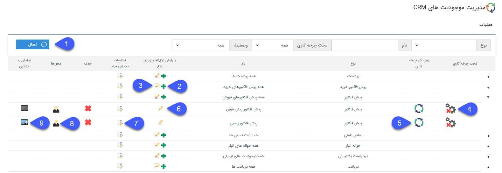

# شخصی‌سازی آیتم‌ها

از این صفحه می‌توانید تمام موجودیت‌های (آیتم‌های) پیام‌گستر را شخصی‌سازی کنید.

منظور از شخصی‌سازی امکان ایجاد و یا ویرایش آیتم‌ها، طراحی، فعالسازی، ذخیره و بارگذاری چرخه، تنظیمات نمایشی فیلد‌های آیتم‌ها و تنظیمات مجوز‌های مربوط به هر آیتم می‌باشد.

برای شخصی‌سازی موجودیت‌ها، کاربر نیازمند مجوز مدیریت شخصی‌سازی crmمی‌باشد و برای شخصی‌سازی زیر نوع موجودیت‌ها کاربر نیازمند مجوز شخصی‌سازی روی آن زیر نوع می‌باشد. 

**1. اعمال فیلتر:** می‌توانید انواع آیتم‌ها را فیلتر کنید. این فیلترها شامل نوع آیتم، نام آن‌ها، وضعیت فعال/غیرفعال بودن آیتم و اینکه چرخه فعال کاری دارند یا خیر، می‌شود.

**2. اضافه کردن:** با انتخاب آیکون + می‌توانید زیرنوع جدیدی را اضافه نماید. به طور مثال برای فاکتور امکان ساختن زیر نوع‌های مختلف فراهم شده است. زیر نوع‌هایی با مشخصات کاملاً متفاوت در درصد مالیات، شماره شروع فاکتور، مجوز تأیید و حتی قالب پیش نمایش آن‌ها.

**3. ویرایش فیلد‌های اضافه به موجودیت اصلی:** امکان تعریف فیلد اضافه را در اختیار شما قرار می‌دهد. هر فیلدی که در این قسمت اضافه شود. در تمامی ‌زیرنوع‌های آن آیتم اضافه خواهد شد. (برای مثال اگر شما یک فیلد به نام "محل تحویل" از نوع لیست در آیتم فاکتورها اضافه کنید، در تمامی ‌انواع فاکتورهایی که دارید، این فیلد نمایش داده می‌شود.)

این امکان برای تعریف کردن فیلدهای مشترک بین آیتم‌های مختلف بسیار مفید است.

**4. فعال/غیرفعال کردن چرخه:** با کلیک بر روی آیکون تحت چرخه‌کاری، فرآیند طراحی شده بر روی آیتم انتخاب شده فعال می‌گردد. تیک سبز رنگ در کنار آیکون چرخه به معنی فعال بودن چرخه‌کاری بر روی آیتم است و ضربدر قرمز رنگ به معنی غیرفعال بودن چرخه‌کاری برروی آیتم است. 

**5. ویرایش چرخه‌کاری:** با کلیک بر روی آیکون ویرایش چرخه‌کاری پنجره ای باز می‌شود و امکان طراحی فرآیند بر روی آیتم انتخاب شده فراهم می‌گردد.

(برای اطلاعات بیشتر به لینک طراحی چرخه‌کاری مراجعه نمایید.)

**6. ویرایش یک موجودیت:** با کلیک بر روی این آیکون می‌توانید موجودیت مورد نظر را ویرایش کنید.

**7. تنظیمات نمایش فیلد:** برای هر آیتم می‌توانید مشخص کنید که کدامیک از فیلدها جهت نمایش در لیست انتخاب شوند و یا اینکه در خلاصه نمایش داده شوند.

> **نکته:** امکان تغییر ترتیب قرار گرفتن ستون فیلدها در جداول از تب "ترتیب نمایش" امکان پذیر است.

**8. مجوزها:** مجوزهای هر آیتم را می‌توانید تعیین کنید. برای اطلاعات بیشتر در این خصوص قسمت‌های دسترسی‌های موجودیت‌ها و تعریف مجوزهای آیتم  را مطالعه کنید.

**9. نمایش به مشتری:** در صورتی فعال بودن ماژول باشگاه مشتریان و انتخاب آیکون نمایش به مشتری، مشتریان شما با مراجعه به داشبورد خود، در صورت داشتن این نوع آیتم می‌توانند آن را در پروفایل خود مشاهده نمایند.

 ### تنظیمات نمایشی فیلد در لیست

در این قسمت میتوانید تنظیمات نمایشی فیلد‌های آن آیتم برای نمایش در لیست و درقسمت خلاصه را تنظیم کنید.

> **نکنه** 
> - برای دسترسی به این بخش بایستی کاربر مجوز مدیریت شخصی سازی crm را داشته باشد.
> - امکان انجام این تنظیمات روی کلیه موجودیت‌های اصلی و زیر نوع‌های آنها وجود دارد.

با انتخاب این گزینه، میتوان تعیین کرد که چه فیلد‌هایی برای کاربر در لیست نمایش داده شود، کاربر میتواند از بخش تنظیمات لیست، از بین فیلد‌های مشخص شده در این بخش فیلد‌های مورد نظرش را برای نمایش در لیست و گزارش گیری از آن انتخاب کند. 
لازم به ذکر است کاربر امکان مشخص کردن ترتیب نمایش ستون‌های لیست را خواهد داشت. 
همچنین کاربر دارای مجوز می‌تواند مشخص کند که چه فیلدهایی در خلاصه سوابق نمایش داده شود.

1. **وضعیت:** در این قسمت می‌توانیم فیلدها را جهت نمایش در لیست آیتم‌ها انتخاب کنیم.

2. **ترتیب نمایش:** در این قسمت می‌توانیم ترتیب قرار گرفتن فیلدها را در لیست آیتم‌ها مشخص کنیم.

> **نکته** 
> ترتیب قرار گرفتن محل قرار گرفتن فیلدها روی لیست برای کاربرانی که لیست‌ها را مشاهده می‌کنند، توسط عملیات drag & dropقابل ویرایش است.

### امکان جابجا کردن ستون‌ها لیست

با استفاده از اشاره گر‌ها می‌توانید ترتیب قرار گرفتن فیلد را تغییر دهید. 
کاربرانی که به لیست آیتم‌ها دسترسی دارند می‌توانند با عملیات drag & drop محل قرار گرفتن ستون‌های جدول را جابجا کنند.

 برای مثال در شکل بالا با کلیک روی ستون"مبلغ باقیمانده" و کشیدن به یک ردیف عقبتر، اشاره گر آبی رنگی نمایش داده می‌شود که به محل جدید قرارگرفتن ستون "مبلغ باقیمانده" اشاره می‌کند.
