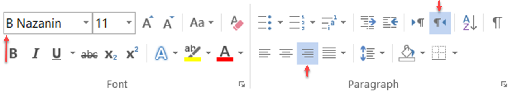

# تنظیم قالب چاپ

برای طراحی قالب چاپی آیتم بر روی لینک آبی " جهت ویرایش متن اینجا کلیک نمایید " کلیک کنید تا بتوانید قالب را به سلیقه خود طراحی نمایید. می‌توانید پارامترها را جابه‌جا نمایید و یا پارامترهایی را بسته به نیاز خود به صفحه اضافه کنید. همچنین می‌توانید لوگو و یا سربرگ خود را نیز به صفحه قالب اضافه کنید.

> **نکته** 
> تنظیم قالب چاپی با استفاده از ابزار webclient tool انجام می‌شود. در صورتی که برای اولین بار می‌خواهید قالب چاپی یک آیتم را در نرم‌افزار تنظیم کنید، از لینک قرمز برای نصب این ابزار استفاده کنید. بر روی سیستم‌هایی که برای طراحی قالب چاپ و یا ارسال فکس/چاپ استفاده می‌شوند، این ابزار را باید نصب و راه‌اندازی کنید.
>> تنظیم این قالب چاپ نیاز به نرم‌افزار MS-Word (2010/2013/2016) دارد.

**1. قالب:** برای انتخاب یک قالب چاپ از  قالب‌های تعریف شده در[ بخش مدیریت قالب پیام ](https://github.com/1stco/PayamGostarDocs/blob/master/Help/Basic-Information/Model-message-management/Model-message-management.md)ها  و یا تعریف یک قالب جدید با آپلود یک فایل برای قرارگیری در قالب چاپی، می‌توانید از این گزینه استفاده کنید.

**2. محتوا:** جهت ویرایش متن (تنظیم قالب چاپ) از این گزینه استفاده کنید. 
**3.  پیش نمایش:**  از این بخش می‌توانید پیش‌نمایش قالب طراحی شده را در قالب فایل ورد یا تصویر مشاهده کنید . 
**4. آخرین بروز رسانی محتوا:** در صورتی که در ابزار طراحی قالب چاپ، دکمه ذخیره و ارسال به سرور را بزنید، شمارنده این قسمت شروع به شمارش می‌کند. توجه کنید که اگر دکمه ذخیره را در این قسمت نزنید، طراحی که انجام داده اید ذخیره نخواهد شد. 
**5. بازخوانی قالب پیش فرض:** برای برخی از آیتم‌های (مانند پیش‌فاکتور یا فاکتور فروش) یک قالب چاپی پیش‌فرض در نرم‌افزار پیام‌گستر طراحی شده است، با استفاده از این دکمه می‌توان قالب پیش‌فرض نرم‌افزار را جایگزین قالب چاپ فعلی کرد.

ابتدا فایل محتوای پیام‌گستر (با پسوند pgcontent) را ذخیره کنید و سپس آن را باز کنید.

در مرحله بعد فایل ورد را باز کنید.

**A. فایل:** با استفاده از این گزینه می‌توانید یک قالب (با فرمت ورد) را ذخیره و یا بازخوانی کرد. 
**B. پارامترهای هوشمند:** می‌توانید از تمامی‌ پارامترهای هوشمند نرم‌افزار که شامل تمامی‌اطلاعات مرتبط با مخاطب یا فیلدهای هویتی (مانند نام، نام خانوادگی، شماره موبایل و ... ) و فیلدهای آیتمی‌ که در حال طراحی قالب چاپی آن هستید می‌باشد، در متن قالب چاپ استفاده کنید. با دوبار کلیک کردن بر روی هر پارامتر، آن پارامتر در متن در حال ویرایش وارد می‌شود. علاوه بر پارامترهای موجود در سیستم، تمامی‌ پارامترهای اضافه شده به آیتم نیز در این قسمت اضافه می‌شود. 
**C. ابزار ورد:** در این قسمت شما می‌توانید از تمامی‌ابزارهای ورد برای ویرایش قالب چاپی آیتم استفاده کنید. 
**D. ذخیره و ارسال به سرور:** پس از اتمام ویرایش، برای ارسال قالب آماده شده به سرور نرم‌افزار از این گزینه استفاده کنید. بعد از طراحی قالب و ذخیره آن، دکمه ذخیره کردن صفحه اصلی تنظیمات آیتم را نیز انتخاب کنید.

## نکات مرتبط با قالب چاپ 
در ویرایش قالب چاپ،‌ به نکات زیر توجه داشته باشید:
- برای ایجاد چیدمان مورد نظر خود،‌ از جدول استفاده نمایید. در صورت نیاز به عدم نمایش خطوط جدول،‌ از تنظیمات جدول ورود این خطوط را پنهان نموده و یا تغییر دهید. از استفاده از فاصله (Space)های متوالی بدین منظور اجتناب نمایید.
- به ازای هر فیلد از نوع **تاریخ**، دو پارامتر در سمت راست مشاهده می‌شود: ۱. تاریخ آن فیلد و ۲. تاریخ آن فیلد برعکس. 
- به ازای هر **پارامتر مبلغ** مانند مبلغ کل، مبلغ تخفیف و مبلغ مالیات و همچنین به ازای هر **فیلد مبلغ** اضافه شده در شخصی‌سازی در قالب چاپ سه پارامتر در سمت راست مشاهده می‌شود: ۱. فیلد مبلغ، ۲. فیلد مبلغ به حروف و ۳. فیلد مبلغ صحیح. 
- فونت، شکل جداول، اندازه خانه‌ها، لوگو و همه چیز کاملاً قابل تغییر می‌باشد. تمامی موارد مذکور دقیقا مشابه یک فایل ورد می‌تواند ویرایش شود. 
- برای اینکه عدد‌های درج شده در پیش‌نمایش، با زبان مورد نظر (فارسی/انگلیسی) مطابقت داشته باشد لازم است فونت انتخابی آن، از همان زبان باشد. به عنوان مثال برای درج تعداد به زبان فارسی باید از یک فونت فارسی (مثل B-Nazanin) استفاده کنید. علاوه بر این برای درج فونت فارسی به راست‌چین بودن و برای برای درج فونت انگلیسی به چپ‌چین بودن تنظیمات ورد توجه نمایید.

- فرمت (شمسی/میلادی بودن) فیلدهای تاریخی پیش‌فرض آیتم‌ها (مثل تاریخ صدور در فاکتور، تاریخ ثبت و...) بر اساس فرمت تاریخ سرور در قالب چاپ نمایش داده می‌شود. اما در خصوص فیلدهای تاریخی اضافه شده در شخصی‌سازی، می‌توانید به هنگام افزودن، نوع آن را شمسی و یا میلادی انتخاب کنید. فرمت نمایش  داده شده در قالب چاپ مطابق با نوع فیلد انتخابی شما خواهد بود.
- در جدول محصولات موجود در انواع فاکتورها، ردیف، نام محصول، تعداد، قیمت واحد و قیمت کل نمایش داده شده است. این جدول به طور کامل از پارامترهای هوشمند تشکیل شده و به طور خودکار به تعداد ردیف‌های جدول در قالب پیش‌نمایش و پرینت آن، اضافه می‌شود. بنا بر نیاز خود می‌توانید ستون‌هایی که مایل به درج آن‌ها در جدول نیستید را حذف نمایید. پارامترهای هوشمند مبالغ کلی مانند مبلغ کل، تخفیف، مالیات و ... را در سایر بخش‌های خارج از جدول نیز استفاده نمایید.
- در صورت استفاده از لیست محصول در افزودن فیلد، به مشابه جدول فاکتورها، جدول اضافه شده به قالب چاپ هوشمند بوده و ردیف‌های آن با توجه به تعداد محصولات اضافه شده افزایش می‌یابد. به هنگام انتخاب این پارامتر لیست محصول، در جدول اضافه شده ستون‌های نام محصول، کد محصول، مقدار، قیمت واحد، تخفیف و قیمت نهایی به صورت خودکار درج می‌شود. در صورت نیاز می‌توانید ستون‌های بلااستفاده را حذف نمایید. 

### اضافه کردن امضا

برای اضافه کردن امضا به قالب چاپ آیتم‌هایی که می‌توانند نیاز به تایید داشته باشند (مانند فاکتور، پرداخت، قرارداد و ...) به ترتیب زیر عمل کنید.

**1.** فایل تصویر امضای مورد نظر را در[  آیتم‌های حقوقی/مالی ](https://github.com/1stco/PayamGostarDocs/blob/master/Help/Settings/Personalization-crm/Overview/General-information/Legal-financial-items/Legal-financial-items.md#Signature) اضافه و ذخیره کنید

**2.** ابتدا یک Text Box ساده ایجادکنید. 
**3.** پس از تنظیم کردن مکان و اندازه Text Box، بر روی آن راست کلیک کرده و سپس Format Shape را انتخاب کنید.

**4.** در قسمت Alt Text در قسمت توضیحات (Description) کلمه‌ی "sign" را تایپ کنید.

**5.** پس از ذخیره کردن و ارسال به سرور، فایل تصویری که در تنظیمات این آیتم به عنوان امضا وارد شده است، پس از تایید آیتم در پیش نمایش آن درج خواهد شد.

> **نکته** 
> امضا پس از تایید آیتم، در پیش‌نمایش قابل رویت خواهد بود. به عبارت دیگر،‌ در صورت دریافت پیش‌‌نمایش از یک آیتم تایید نشده، امضا در فایل درج نخواهد شد. 