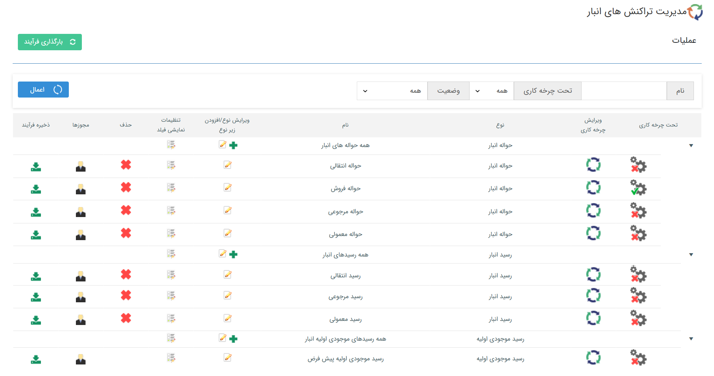
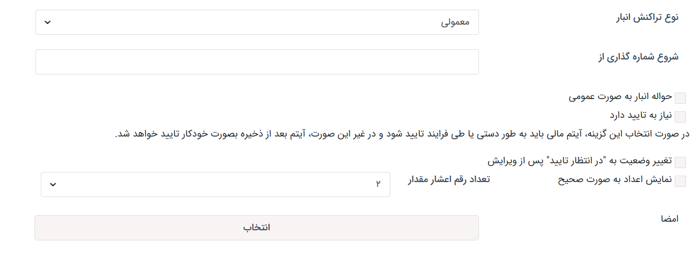

# تنظیمات اختصاصی تراکنش‌های انبار

در صورت استفاده از انبارداری سریالی (پیشرفته) لازم است که برای انواع اسناد تراکنش‌های انبار، زیرنوع‌های لازم را ایجاد و تنظیم نمایید. در صورت نیاز به آشنایی با سیستم انبارداری پیشرفته و انواع تراکنش‌های انبار می‌توانید از [راهنمای انبار](https://github.com/1stco/PayamGostarDocs/blob/master/Help/Buy-warehouse-sales/Store/Store.md) استفاده نمایید. به صورت کلی، برای ثبت ورود و خروج کالا به/از انبارها به موجودیت‌های زیر نیاز دارید: 
- **رسید موجودی اولیه** که صرفاً یک رکورد می‌توان از آن ثبت کرد.
- **رسید** انبار که می‌تواند در سه نوع معمولی، انتقالی و مرجوعی تعریف شود.
- **حواله** انبار که می‌تواند در چهار نوع معمولی، فروش، انتقالی و مرجوعی تعریف شود.
بنا بر نیاز سازمان، زیرنوع‌های مورد نیاز را ایجاد و طبق راهنمای زیر تنظیم نمایید.  

## تنظیمات رسید و حواله
هنگام ایجاد انواع رسید و حواله در نرم‌افزار، علاوه بر [تنظیمات مشترک موجودیت‌ها](https://github.com/1stco/PayamGostarDocs/blob/master/Help/Settings/Personalization-crm/CustomizationCommonSettings/ItemsCommonCustomizationSettings_2.8.6.md)، لازم است که تنظیمات اختصاصی تراکنش‌های انبار را نیز مشخص نمایید. در ادامه به بررسی تنظیمات قابل مشاهده در صفحه شخصی‌سازی رسید و حواله می‌پردازیم. 

- **نوع تراکنش انبار:** نوع رسید یا حواله‌ای که در حال تنظیم زیرنوع آن هستید را مشخص کنید. چنانچه پیش‌تر به آن اشاره شد، سه نوع رسید انبار (معمولی، انتقالی و مرجوعی) و چهار نوع حواله انبار (معمولی، انتقالی، فروش و مرجوعی) می‌توانید در سیستم تعریف کنید. در صورت نیاز به کسب اطلاعات بیشتر در مورد هر یک از انواع رسید و حواله، به [راهنمای انبار](https://github.com/1stco/PayamGostarDocs/blob/master/Help/Buy-warehouse-sales/Store/Store.md)، مراجعه نمایید. بدیهی است که این تنظیمات در رسید موجودی اولیه مشاهده نمی‌شود.
- **شروع شماره‌گذاری:** در این قسمت می‌توانید مشخص کنید که شماره‌گذاری این آیتم از چه عددی شروع شود. در صورت خالی بودن این فیلد، آیتم از شماره‌ی ۱ شروع به شماره‌گذاری می‌کند.
- **حواله/رسید به صورت عمومی:** شماره تمامی حواله/رسیدهایی که این گزینه برای آن‌ها فعال باشد، از یکدیگر پیروی می کنند. برای مثال، اگر این گزینه برای رسید A و B فعال باشد، چنانچه بالاترین شماره رسید A به ۱۵۰۰ برسد، رسید بعدی چه از نوع A ثبت شود چه از نوع B، شماره ۱۵۰۱ را دریافت خواهد کرد. به عبارت دیگر حواله/رسیدهای عمومی نمی‌توانند شماره یکسان داشته باشند و منبع شماره آن‌ها یکسان است.
- **الزام به تایید شدن:** به صورت پیش‌فرض تراکنش‌های ثبت شده در نرم‌افزار بلافاصله پس از ثبت به صورت خودکار تایید می‌شوند. در صورتی که در سازمان شما، رسید یا حواله نیاز به بررسی توسط شخص/سمت خاصی دارد، این گزینه را برای آیتم فعال نمایید. با فعال شدن این گزینه، رسید/حواله پس از ثبت، برای بررسی به کارتابل کاربری انتقال داده‌می‌شود که مجوز تایید/رد آن آیتم را داشته‌باشد. به خاطر داشته‌باشید که پیش از تایید آیتم، رسید/حواله بر روی موجودی انبار تاثیر نداشته، در گزارش‌های انبار لحاظ نمی‌شود، قابل [قیمت‌گذاری](https://github.com/1stco/PayamGostarDocs/blob/master/Help/Buy-warehouse-sales/Store/gheymatgozari-etesal/gheymatgozari.md) نمی‌باشد و در صورت دریافت پیش‌نمایش از آن، خروجی بدون درج امضا به کاربر ارائه می‌شود.

> **نکته** 
> توجه داشته‌باشید که برای تعیین مسئول بررسی (تایید/رد) تراکنش‌های انبار، کاربر علاوه بر مجوز «تایید/رد» زیرنوع رسید و حواله (تعریف مجوزها در قسمت[ دسترسی موجودیت‌ها](https://github.com/1stco/PayamGostarDocs/blob/master/Help/Settings/Manage-groups-and-users/permissions/Availability-of-entities/Availability-of-entities.md))، باید مجوز تایید/رد آیتم بر روی انبار (مجوزهای انبار در قسمت [مدیریت انبارها](https://github.com/1stco/PayamGostarDocs/blob/master/Help/Management-and-reports/Warehouse-reports/Warehouse-reports.md)) مورد نظر را نیز داشته‌باشد. 

- **تغییر وضعیت به "در انتظار تایید" پس از ویرایش:** با فعال کردن این گزینه، اگر این آیتم پس از تایید، توسط کاربری ویرایش شود، مجدد به حالت در انتظار بازگشته و باید توسط یکی از کاربرانی که مجوز تایید/رد دارد، تایید شود. 
- **نمایش اعداد به صورت صحیح:** با فعال کردن این گزینه، مقادیر موجود در رسید/حواله به صورت صحیح و در صورت غیرفعال بودن آن، با تعداد ارقام اعشاری که مشخص کرده‌اید، نمایش داده خواهند‌شد.
- **تعداد رقم اعشار مقدار:** اگر گزینه‌ی «نمایش اعداد به صورت صحیح» را غیرفعال باشد، از این بخش می‌توانید تعداد رقم اعشار نمایش داده شده برای مقدار هر کالا را مشخص کنید. بدیهی است که در صورت فعال بودن گزینه‌ی «نمایش اعداد به صورت صحیح»، انتخاب تعداد رقم اعشار تاثیری بر مقادیر نمایش داده‌شده، نخواهدداشت.
- **امضا:** در صورت تعریف قالب پیش‌نمایش برای آیتم، تصویر امضا‌ی مورد نظر را در این قسمت بارگذاری نمایید و بر اساس [راهنمای تنظیم قالب چاپ](https://github.com/1stco/PayamGostarDocs/blob/master/Help/Settings/Personalization-crm/CustomizationCommonSettings/PrintTemplateSetting.md) آن را در قالب پیش‌نمایش فراخوانی کنید. با اعمال این تنظیمات، چنانچه کاربران پس از تایید از آیتم پیش‌نمایش دریافت‌کنند، امضا‌ی مورد نظر در بخش تعیین شده در قالب پیش‌نمایش درج می‌شود. لازم به ذکر است که پیش از تایید آیتم، قالب پیش‌نمایش بدون درج امضا خروجی داده‌می‌شود.

