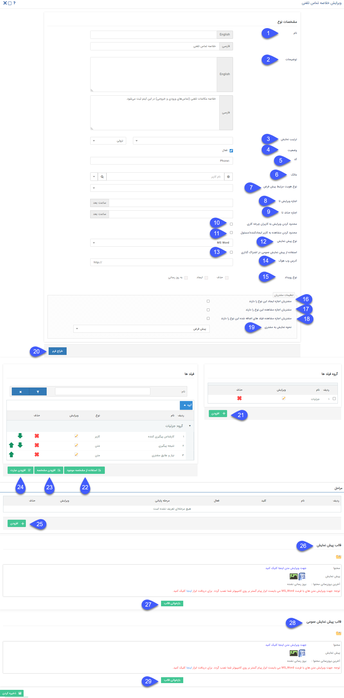
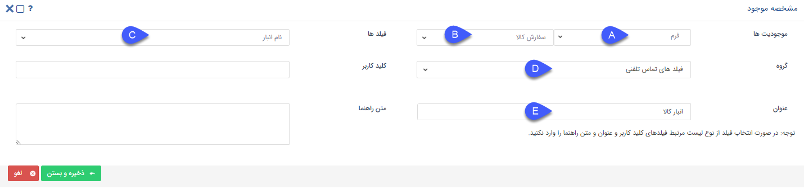

# تنظیمات مشترک شخصی‌سازی آیتم‌ها 

در این قسمت تنظیماتی که در شخصی‌سازی تمامی آیتم‌های CRM مشترک است را مشاهده می‌کنید. توجه داشته باشید که برای آیتم‌های فروش، خرید، دریافت، پرداخت، قرارداد، رسید و حواله انبار، درخواست پشتیبانی و وظیفه لازم است تنظیمات شخصی‌سازی مربوط به خود را علاوه بر این قسمت، مطالعه نمایید.

### موارد زیر در تمامی آیتم‌های سیستم به صورت مشترک وجود دارد:  
1. **نام**: می‌توانید نام آیتم را به دلخواه خود تعیین کنید.
 
 2. **توضیحات**: توضیحاتی که در این قسمت می‌نویسید راهنمایی برای راهبر نرم‌افزار است. مثلا هدف ایجاد این آیتم، یا موارد مهمی که باید از آن مطلع باشد.

3. **ترتیب نمایش**{#OrderedSetting}: با این امکان، میتوانید لیست آیتم‌ها (مثلا خلاصه تماس‌های ثبت‌شده) را براساس فیلد مورد نظر خود مرتب‌سازی کنید.
فیلدهایی که امکان مرتب‌سازی آیتم‌ها براساس آن‌ها وجود دارد، فیلد‌های پیش‌فرض و همچنین فیلدهای اضافه شده‌ی از نوع **عدد** ،**شناسه خودکار**،**تاریخ شمسی** و **تاریخ میلادی**  هستند. لازم به ذکر است فیلدهای اضافه شده باید حتما **الزامی** شده باشند که در لیست کشویی برای شما قابل انتخاب باشد.

> **نکته** 
> اگر مقادیر فیلد انتخاب شده برای مرتب‌سازی، در بین آیتم‌ها یکسان باشد، حالت نمایش این آیتم‌ها در لیست، براساس تاریخ ایجاد و به صورت نزولی خواهد بود . 

برای نمونه فرض کنید به آیتم خلاصه تماس تلفنی یک فیلد با عنوان تاریخ تماس «اتمام پیگیری» اضافه کرده‌ایم و ترتیب نمایش آیتم را براساس این فیلد تنظیم کرده‌ایم.

 اگر خلاصه تماس‌‌های ثبت‌شده با یک تاریخ «اتمام پیگیری» یکسان وجود داشته باشند، ترتیب نمایش بین این چند خلاصه تماس در لیست براساس تاریخ ایجاد و به صورت نزولی می‌باشد.
 
> **نکته** 
> - لازم به ذکر است تنها لیست آیتم‌ها براساس این ترتیب نمایش، مرتب‌سازی می‌گردد، و در سایر بخش‌ها مانند بانک یکپارچه و تب سوابق هویت و ... چینش آیتم‌ها به صورت قبل است.
> - ترتیب نمایش آیتم‌ها در لیست‌ها به صورت پیش‌فرض براساس تاریخ ایجاد آیتم و نزولی است

4. **وضعیت**: با غیرفعال کردن هر آیتم، اجازه ذخیره آن را از کاربران خواهید گرفت. به این معنی که کاربران دیگر نمی‌توانند مورد جدیدی از آن آیتم را ذخیره کنند. (برای مثال اکر یک فرم را غیرفعال کنید، کاربران نمیتوانند از آن فرم مورد جدیدی را ذخیره کنند.) این قابلیت برای جلوگیری از ثبت آیتم (بدون تغییر مجوزها) به صورت کوتاه/بلند مدت کاربرد دارد.

> **نکته** 
> در نظر داشته باشید که اگر آیتم مورد نظر دارای فرآیند باشد، فرآیند همچنان به کار خود ادامه خواهد داد (برای غیرفعال کردن فرآیند آن به مورد 6 در قسمت اطلاعات کلی مراجعه کنید.) اما مورد جدید از آن نمی‌توان ثبت کرد.

5. **کد**: کدی که در این قسمت تعیین می‌کنید شناسه‌ی این آیتم است. بنابراین باید منحصر به فرد بوده و نام آن با عنوان آیتم همخوانی داشته باشد. برای این قسمت از حروف انگلیسی و اعداد استفاده کنید. علاوه بر آن از این کد در وب سرویس و ارتباط با سایر نرم‌افزارها استفاده می‌شود.

*به عنوان مثال* 
*برای آیتم فرصت، کد Opportunity را می‌توانید انتخاب کنید.*

6. **مالک**: مالک آیتم کسی است که علاوه بر مدیران و راهبران سیستم می تواند گردش کار آیتم مربوطه را ویرایش کند و مجوزی همانند مدیر ارتباط با مشتریان در آن آیتم را کسب می کند . جزئیات مربوط به این قابلیت را در مقاله [مالک آیتم](https://github.com/1stco/PayamGostarDocs/blob/master/Help/Settings/Personalization-crm/Overview/General-information/Item-owner/Item-owner.md) مطالعه کنید.

7. **نوع هویت مرتبط پیش‌فرض**: در این قسمت می‌توانید نوع هویت پیش‌فرض برای ایجاد هویت مرتبط با آیتم را که از قسمت مرتبط با در هر آیتم ایجاد می‌شود (ایجاد مخاطب چابک) را انتخاب کرد. 
 
8. **اجازه ویرایش تا**: در صورتی که فیلد "اجازه ویرایش تا" را با یک مقدار عددی به ساعت پر نمایید. تنها تا مدت زمان عددی قبل از این مقدار اجازه ویرایش به ایجاد کننده آیتم داده خواهد شد
(حتی در صورت دارا بودن مجوز ویرایش آیتم، باز هم کاربر امکان ویرایش بعد از این زمان را ندارد).در صورت خالی بودن فیلد، اجازه ویرایش برای کاربر ایجادکننده آیتم آزاد است.
 
9. **اجازه حذف تا**: در صورتی که فیلد " اجازه حذف تا" را با یک مقدار عددی به ساعت پر نمایید. تنها تا مدت زمان عددی قبل از این مقدار اجازه حذف به ایجادکننده آیتم داده خواهد شد.
 (این محدودیت برای کاربرانی که اجازه حذف آن آیتم را دارند صدق نمی‌کند). در صورت خالی بودن فیلد، اجازه حذف برای کاربر ایجادکننده آیتم آزاد است.
 
 
10. **محدود کردن ویرایش به کاربران چرخه کاری**: زمانی معنی پیدا می‌کند که بر روی این آیتم، فرآیند تعریف و فعال شده باشد و در غیر این صورت تاثیری نخواهد داشت. 
فقط کاربری که مسئول کارتابل است می‌تواند آیتم را ویرایش کند،اگر مسئول یکی از مراحل دیگر باشد هم امکان ویرایش ندارد، بافعال کردن این گزینه حتی اگر کاربر ایجاد کننده باشد و یا مجوز ویرایش هم داشته باشد ، نمی‌تواند آیتم را ویرایش کند .
 
11. **محدود کردن مشاهده به کاربر ایجاد کننده/ مسئول**: با فعال کردن این گزینه تنها کاربر ایجاد کننده و یا مسئول آیتم (مثلا در فرصت کاربری که در فیلد "تخصیص داده شده یه" وارد می‌شود به عنوان مسئول فرصت شناخته می‌شود) می‌توانند آیتم را مشاهده کنند. 
 
12. **نوع پیش نمایش**: می‌توان فرمت پیش‌نمایش مرتبط با این آیتم را به صورت word (قابل ویرایش پس از پیش نمایش گرفتن) یا عکس یا pdf تنظیم کرد.

13. **استفاده از پیش نمایش عمومی در اشتراک‌گذاری**: با فعال کردن این گزینه به هنگام اشتراک‌گذاری لینک آیتم ([ارسال لینک قالب چاپ برای مشتری در فرایند](https://github.com/1stco/PayamGostarDocs/blob/master/Help/Settings/Personalization-crm/Overview/Process-design/Create-a-work-cycle/Activity/ijad-link-eshtrakgozari/link%20eshtrakgozari.md)) قالب چاپ به جای پیش‌نمایش اصلی (مورد ۲۶) بر اساس قالب پیش‌نمایش عمومی (مورد ۲۸) ارسال می‌شود.
 
14. **وب هوک**: به عنوان یکی از امکانات نرم‌افزار، شما از این قسمت می‌توانید تعیین کنید که پس از هر بار ایجاد، به روزرسانی و یا حذف این آیتم یک آی دی مبنی بر تغییر آیتم به آدرسی که در این قسمت تعیین می‌کنید فرستاده شود.
 این امکان برای ارتباط این آیتم با یک وب سرویس بیرونی در نظر گرفته شده و قابل استفاده توسط برنامه نویسان است. (برای مثال ارتباط با نرم افزار حسابداری یا یک وب سایت و ...)

15. **نوع رویداد**: در صورت استفاده از وب هوک (نکته فوق) در این قسمت نوع رویداد مورد نظر را انتخاب نمایید. این بدین معناست که پیغام مورد نظر به هنگام حذف آیتم، ایجاد آیتم و یا ویرایش (به روزرسانی) آن برای آدرس مقصد ارسال شود. 

 16. **مشتریان اجازه ایجاد این نوع را دارند**: با فعال بودن این گزینه مشتریان با ورود به صفحه [باشگاه مشتریان](https://github.com/1stco/PayamGostarDocs/blob/master/Help/Supplementary-modules/customer-club/Customer-dashboard/Customer-dashboard.md) خود می‌توانند این نوع آیتم را ایجاد کنند. (برای مثال می‌توان اجازه ثبت پیش‌فاکتور، ثبت فرم شکایت، درخواست پشتیبانی و... را به مشتریان عضو باشگاه مشتریان تخصیص داد.) بدین منظور کافی است این گزینه را در بخش شخصی‌سازی آیتم مربوطه فعال کنید.

17. **مشتریان اجازه مشاهده این نوع را دارند**: با فعال کردن این گزینه مشتریان با ورود به حساب کاربریشان در [ باشگاه مشتریان](https://github.com/1stco/PayamGostarDocs/blob/master/Help/Supplementary-modules/customer-club/Customer-dashboard/Customer-dashboard.md) می‌توانند آیتم‌هایی از این نوع را که در سوابق خود دارند مشاهده کنند. 
(برای مثال بتوانند پرداخت‌های خود را مشاهده کنند.)
 
18. **مشتریان اجازه مشاهده فیلدهای اضافه شده به این نوع را دارند**: با فعال بودن این گزینه مشتریان با باز کردن آیتم مربوطه در [باشگاه مشتریان ](https://github.com/1stco/PayamGostarDocs/blob/master/Help/Supplementary-modules/customer-club/Customer-dashboard/Customer-dashboard.md)خود می‌توانند فیلد‌های اضافه شده
(جهت مشاهده تنظیمات اضافه کردن فیلد مورد 21 تا 24 را مشاهده نمایید) در آیتم مربوطه را نیز مشاهده کنند. (برای مثال به هنگام ثبت و مشاهده پیش‌فاکتور، فیلد‌های اضافه شده به پیش‌فاکتور را مشاهده کنند.)
 
19. **نحوه نمایش به مشتری**: از این قسمت می‌توانید نحوه خروجی دریافتی مشتری از قسمت باشگاه مشتریان را تنظیم نمایید:
**پیش‌فرض:** با انتخاب این حالت، مشتری شما به هنگام مشاهده آیتم مربوطه در باشگاه مشتریان، در صورتی که آیتم دارای فرایند بوده و در مرحله‌ای قرار داشته باشد که [مشتری مسئول انجام اقدامات لازم در آن باشد](https://github.com/1stco/PayamGostarDocs/blob/master/Help/Settings/Personalization-crm/Overview/Process-design/Create-a-work-cycle/Cardboard/Cartable_2.7.5.3.md#CustomerCartableInClub)، صفحه آیتم را مشابه کاربران شما در پیام‌گستر مشاهده خواهد کرد اما در غیر این صورت (در حالتی که صرفا می‌تواند آیتم مربوطه را مشاهده کند) پیش‌نمایشی با قالب تنظیم شده در قسمت ۲۸ با ۲۹ خواهد داشت.  

**پیش‌نمایش:** با انتخاب این گزینه، مشتری در پنل کاربری خود در باشگاه مشتریان، به هنگام مشاهده آیتم ثبت شده برای او (به عنوان مثال پیش‌فاکتور مشتری)، پیش‌نمایشی با قالب تنظیم شده در قسمت ۲۶ و یا ۲۷ را دریافت و مشاهده می‌کند. این همان پیش‌نمایشی است که کاربران شما در نرم‌افزار به هنگام دریافت پیش‌نمایش خروجی می‌گیرند. 

**پیش‌نمایش عمومی:** با انتخاب این گزینه، مشتری در پنل کاربری خود در باشگاه مشتریان، به هنگام مشاهده آیتم ثبت شده برای او (به عنوان مثال پیش‌فاکتور مشتری)، پیش‌نمایشی با قالب تنظیم شده در قسمت ۲۸ و یا ۲۹ را دریافت و مشاهده می‌کند. 

> **نکته** 
> برای اطلاعات بیشتر در این خصوص، قسمت [داشبورد مشتریان ](https://github.com/1stco/PayamGostarDocs/blob/master/Help/Supplementary-modules/customer-club/Customer-dashboard/Customer-dashboard.md)را مطالعه کنید.
 
20. **طراح فرم**: اجازه اضافه کردن فیلدها با استفاده از یک ویرایشگر شماتیک (تصویری) را فراهم می‌کند. برای اطلاع از جزییات بیشتر قسمت [ طراح فرم ](https://github.com/1stco/PayamGostarDocs/blob/master/Help/Settings/Personalization-crm/Overview/General-information/Form-designer/Form-designer.md)را مطالعه کنید.
 
21. **گروه فیلدها**: برای فیلدهایی که قصد ساخت آن را دارید نام و تعداد ستون‌های گروه آن را تعیین کنید.
 این کار به منظور دسته بندی فیلدهای ساخته شده صورت می‌پذیرد که سهولت استفاده از آن آیتم را در برخواهد داشت.
 
22. **استفاده از مشخصه موجود**: برای کپی کردن فیلدهایی که قبلا در آیتم دیگه ای ساخته شده اند می‌توانید از این ویژگی استفاده کنید.
 
 

### مراحل کپی کردن مشخصه موجود (فیلد اضافه از آیتمی دیگر) 
 
**A**. آیتمی‌که فیلد مورد نظرتان در آن قرار دارد را انتخاب کنید.
 
**B**. زیرنوع آیتم را انتخاب کنید.
 
**C**. فیلد مد نظر خود را انتخاب کنید.
 
**D**. گروه فیلدی که می‌خواهید فیلد مورد نظر در آن کپی شود را انتخاب کنید.
 
**E**. عنوانی به فیلد اختصاص دهید.
 
. **کلید کاربر:** در صورت استفاده از وب سرویس میتوانید به این فیلد کلید تخصیص دهید.

 **متن راهنما:** متن راهنمایی که با قرار گرفتن ماوس بر روی آن فیلد نمایش داده میشود را میتوانید از این بخش تنظیم کنید.
 
توجه کنید که پس از کپی شدن هیچ وابستگی ای بین فیلد اصلی و فیلد کپی شده وجود ندارد. به این معنی که ویرایش روی هر فیلد، به فیلد دیگر اعمال نمی‌شود.
 
23. **افزودن مشخصه( فیلد)** فیلدهای خاص مربوط به آیتم خود را می‌توانید از قسمت فیلدها و دکمه افزودن مشخصه بسازید.  
همچنین فیلد اضافه شده در قسمت پارامترهای هوشمند، به عنوان فیلدهای آیتم نمایش داده می‌شود. .برای ساخت فیلدها فقط کافیست نام فیلد، نوع فیلد( یکی از انواع متن، لیست، چک باکس و ...) و گروه فیلدی مربوطه را انتخاب نمایید.
(برای اطلاعات تکمیلی در خصوص انواع فیلدها به [افزودن مشخصه](https://github.com/1stco/PayamGostarDocs/blob/master/Help/Settings/Personalization-crm/Overview/General-information/Add-features/2.6.0/Add-features.md) مراجعه کنید.) 

24. **افزودن عبارت**: در این قسمت می‌توانید یک عبارت ثابت وارد کرده و از آن در تنظیم قالب چاپی استفاده نمایید. این عبارت به عنوان یکی از فیلدهای آیتم نمایش داده نخواهد شد و تنها می‌توانید از پارامتر هوشمند آن برای تنظیم قالب چاپی (پیش نمایش) آیتم‌ها استفاده کنید. (به طور مثال اگر در پیش نمایش تعداد زیادی از فرم‌ها و سوابق دیگر، آدرس شرکت را درج میکنید، می‌توانید آدرس را به عنوان یک عبارت در قسمت سوپرفیلدهای هویت تعریف نموده و از آن در تنظیم قالب چاپی تمامی آیتم‌ها استفاده کنید)

25. **مراحل**: در این قسمت می‌توانید مراحل مورد نیاز برای آیتم مربوطه را ایجاد و مرتب کنید. این مراحل در نمایش کانبان لیست آیتم‌ها داده می‌شود. برای مطالعه بیشتر به [بخش مرحله‌بندی](https://github.com/1stco/PayamGostarDocs/blob/master/Help/Settings/Personalization-crm/Overview/General-information/leveling/leveling.md) مراجعه کنید .

26. **قالب پیش‌نمایش**: در این قسمت می‌توانید قالب چاپ (پیش‌نمایش) آیتم را تنظیم کنید. پیش‌نمایش در واقع قالبی است که کاربران با کلیک بر روی گزینه پیش‌نمایش (موجود در نوار بالای هر آیتم) از آن به صورت PDF و یا word (از بخش ۱۲ انتخاب نمایید) خروجی دریافت می‌کنند. این خروجی ممکن است برای پرینت و یا نسخه ارسالی به مشتری استفاده شود. برای اطلاع از چگونگی انجام این کار به قسمت [تنظیم قالب چاپ ](https://github.com/1stco/PayamGostarDocs/blob/master/Help/Settings/Personalization-crm/Overview/General-information/PrintTemplateSetting/PrintTemplateSetting.md)مراجعه کنید.

27. **بازخوانی از قالب:** برای برخی از آیتم‌ها (مانند پیش فاکتور و فاکتور فروش) یک قالب چاپی پیش‌فرض در نرم‌افزار پیام‌گستر طراحی شده است، با استفاده از این دکمه می‌توان قالب پیش‌فرض نرم‌افزار را جایگزین قالب چاپ فعلی کرد.

28. **قالب پیش‌نمایش عمومی:**{#CustomerPrintTemplate} در این قسمت می‌توانید قالب چاپ (پیش نمایش) آیتم را برای باشگاه مشتریان تنظیم کنید. برخلاف پیش‌نمایش اصلی (مورد ۲۶)، پیش‌نمایش عمومی نه برای کاربران بلکه برای نسخه نمایش داده شده در باشگاه مشتریان تنظیم می‌شود. برای اطلاع از چگونگی انجام این کار به قسمت [تنظیم قالب چاپ ](https://github.com/1stco/PayamGostarDocs/blob/master/Help/Settings/Personalization-crm/Overview/General-information/Set-the-print-template/Set-the-print-template.md)مراجعه کنید.

29. **بازخوانی از قالب عمومی:** در برخی از آیتم‌های نرم‌افزار برای پیش‌نمایش عمومی آیتم (پیش‌نمایش آیتم در باشگاه مشتریان) قالب پیش‌فرض تعریف شده است. با استفاده از این دکمه می‌توانید قالب پیش‌فرض را جایگزین قالب چاپ فعلی کرد.

