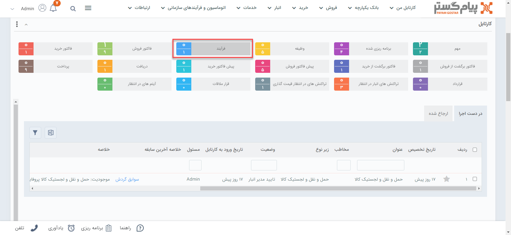

# نحوه استفاده از فرآیند‌های کاری
پس از طراحی و ایجاد فرآیند کاری چنانچه شما کاربری باشید که فرآیند به شما ارجاع داده باشد. فرآیند طراحی شده را در کارتابل خود مشاهده می‌کنید.

 

##  مشاهده مسئولیت‌های کاربر در کارتابل فرآیند    

 در این قسمت می توانید تمام فرآیند هایی که توسط [چرخه‌ها و گردش‌های کاری](https://github.com/1stco/PayamGostarDocs/blob/master/Help/Category-docs/Process-management.md) برای شما ارسال شده است را مشاهده کنید.
 
> **نکته:** 
در صورتی که از تاریخ انقضا یا زمان بحرانی کارتابل تحت چرخه‌های کاری گذشته باشد، رنگ آن آیتم در کارتابل مربوطه قرمز خواهد شد.
در صورتی که از تاریخ یادآوری گذشته باشد، رنگ آیتم زرد خواهد شد.

 1. **در دست اجرا:** لیست آیتم‌های تحت چرخه که در مرحله جاری شما به‌ عنوان مسئول آن انتخاب شده‌اید در این قسمت نمایش داده می‌شود .
2. **ارجاع شده:** لیست آیتم‌های تحت چرخه که اقدام آن توسط شما انجام شده است و به مرحله دیگری منتقل گردیده است .
3. **فیلتر:** فیلترهای مختلفی را برای یافتن  فرآیند مورد نظر می‌توانید استفاده کنید.
4. **فیلترهای ذخیره شده:** می‌توانید فیلتر دلخواه را ذخیره کنید.

> **نکته:** 
 فیلتر ذخیره شده به عنوان یک کارتابل جدید نمایش داده می‌شود و در صورتی که فرآیندی با فیلترهای اعمال شده وارد کارتابل شما شود علاوه بر کارتابل فرآیندها به صورت مجزا در کارتابلی با نام ذخیره شده نمایش داده خواهد شد .

5. **فرستادن به اکسل:** لیست فرآیندها را می‌توانید در قالب یک فایل اکسل خروجی بگیرید.

6. **گزینه‌‍‌های راست کلیک:** با راست کلیک بر روی یک فرآیند یا فرآیندهایی که در یک مرحله کاری هستند می‌توانید بدون باز کردن آن آیتم‌ها، با مشاهده اقدام‌ها، آنها را به مراحل دیگر منتقل کنید.

##  مشاهده فرآیندهای متوقف شده از کارتابل آیتم‌های در انتظار  

آیتم‌هایی که طی فرآیند توسط کاربر به [فعالیت انتظار](https://github.com/1stco/PayamGostarDocs/blob/master/Help/Settings/Personalization-crm/Overview/Process-design/Create-a-work-cycle/Activity/Waiting/Waiting.md) منتقل شدند تا زمانی که از انتظار خارج نشوند در این بخش قابل مشاهده می‌باشد. 

می‌توان با کلیک بر روی آیتم موردنظر آن آیتم را مشاهده و از انتظار خارج کرد. 

 