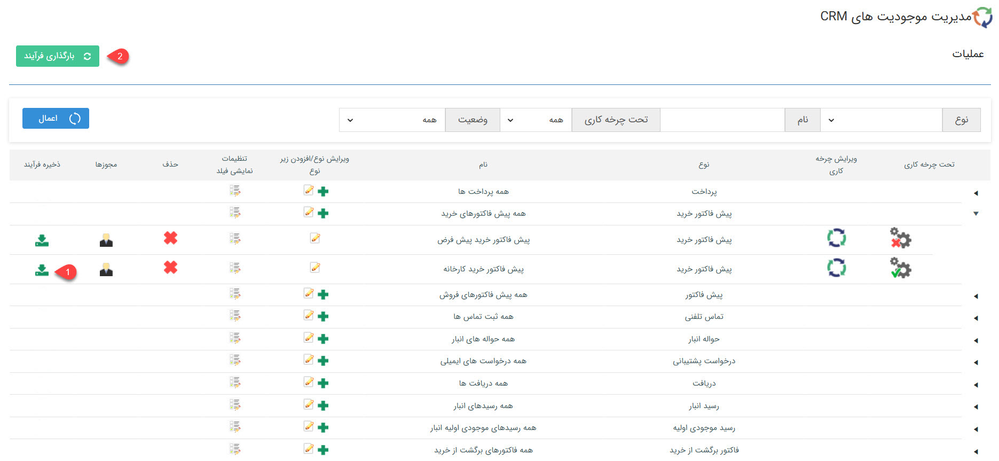
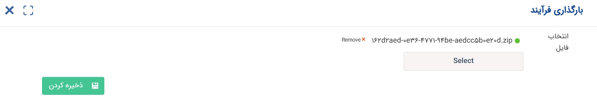
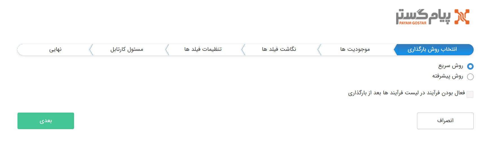
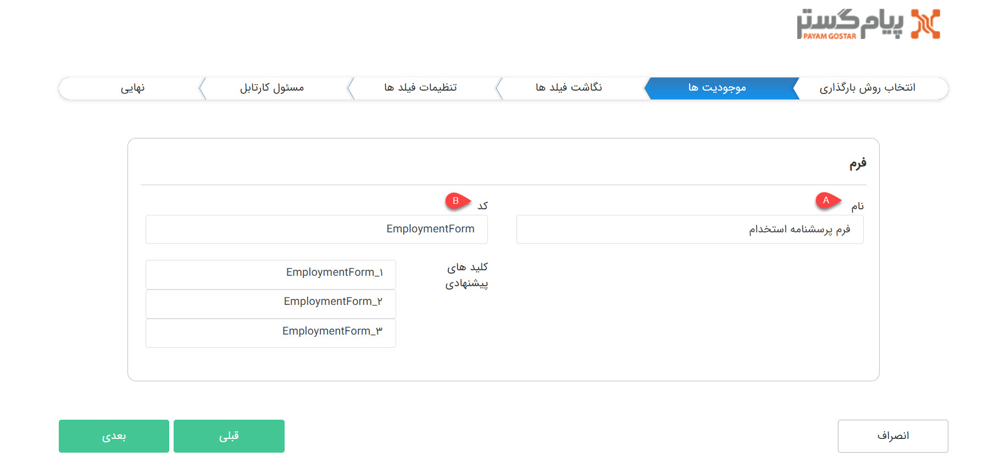
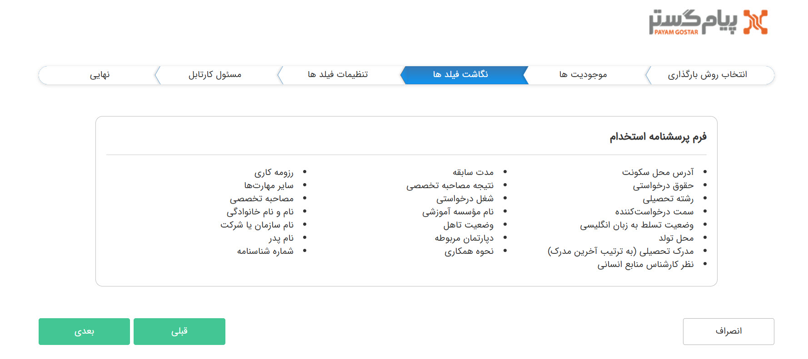
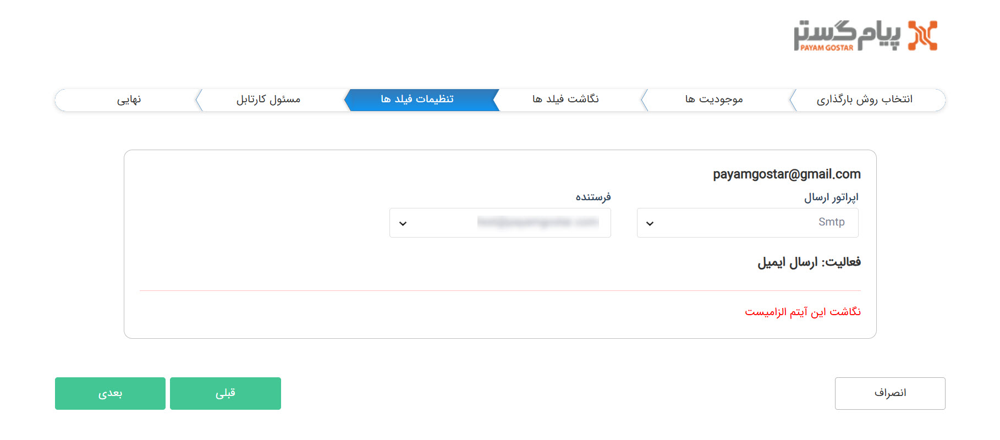
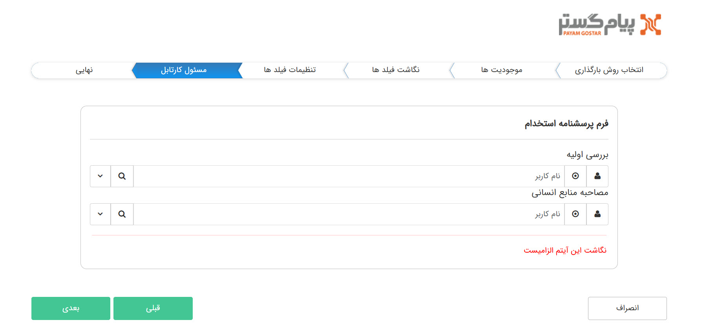
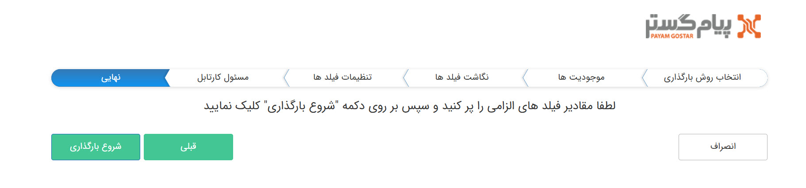

# بارگذاری فرآیند
با استفاده از این قابلیت می‌توانید از چرخه کاری پیاده‌سازی شده بر روی یک آیتم (زیرنوع موجودیت) خروجی دریافت نمایید و آن را در یک نرم‌افزار دیگر و یا همان نرم‌افزار بارگذاری کنید. از این قابلیت می‌توانید برای نگه داشتن نسخه فعلی فرآیند یک آیتم قبل از اعمال تغییرات در آن (جهت بازگشت به حالت قبلی در صورت نیاز)، ایجاد آیتم‌هایی که فیلدها و فرآیندهای مشابه دارند و حتی انتقال فرآیند به یک نرم‌افزار دیگر استفاده نمایید. 
بدین منظور تنها لازم است که دو اقدام را به انجام برسانید: 
1. از فرآیند مورد نظر خروجی دریافت کنید.
2. فرآیند را در سیستم مقصد (که می‌تواند با مبدا یکسان باشد) بارگذاری نمایید. 
در ادامه به مراحل و تنظیمات مورد نیاز برای بارگذاری موفق فرآیند می‌پردازیم. 

## مراحل بارگذاری فرآیند
هنگام ذخیره‌ی فرآیند، تمامی اطلاعات از طریق یک فایل zip به شما خروجی داده‌می‌شود. با بارگذاری این فایل درم نرم‌افزار، یک زیرنوع جدید از آیتم تحت چرخه و همچنین تمامی موجودیت‌هایی که ممکن است از طریق افزودن فیلد آیتم سی‌آرام به آن اضافه شده باشد ایجاد می‌شود. زیرنوع موجودیت ساخته شده تمامی فیلدهای آیتم اولیه را داشته و فرآیند آن را نیز با تمامی تنظیمات دارا می‌باشد. برای شروع فرآیند بارگذاری، ابتدا بر روی کلید «بارگذاری فرآیند» کلیک کنید و سپس با فایل zip دانلود شده را بارگذاری نمایید. با ذخیره‌ی آن وارد صفحه تنظیمات می‌شوید. در ادامه، گام‌های اجرایی جهت بارگذاری فرآیند را بررسی می‌کنیم. 

### گام اول: انتخاب روش بارگذاری
برای بارگذاری فرآیند در نرم‌افزار، می‌توانید از دو روش اقدام نمایید: 
- **روش سریع:** در این روش تمامی گام‌های بعدی از جمله تعیین اطلاعات موجودیت‌های جدید، نگاشت فیلدها و تنظیمات آن‌ها به صورت خودکار انجام می‌پذیرد و کاربر تنها باید تنظیمات برخی فیلدها و مسئولین کارتابل‌ها را مشخص کند تا بتواند بارگذاری فرآیند را به اتمام برساند. 
- **روش پیشرفته:** در این روش تمام گام‌های بارگذاری باید به صورت دستی انجام گیرد. بر این اساس کاربر، علاوه بر تنظیمات کارتابل، می‌تواند اطلاعاتی نظیر عنوان موجودیت‌های جدید، تنظیمات فیلدها و سایر موارد را نیز بر حسب نیاز خود تعیین نماید. 

در صورت فعال کردن گزینه‌ی «فعال بودن فرآیند در لیست فرآیندها بعد از بارگذاری»، فرآیند بارگذاری شده حالت فعال خواهدبود. در غیر این صورت فرآیند به صورت غیرفعال بارگذاری می‌شود و شما خودتان باید اقدام  به فعال‌سازی آن نمایید. 

### گام دوم: موجودیت‌ها
لیست موجودیت‌های استفاده شده در این فرآیند، در این بخش به شما نمایش داده‌می‌شود. علاوه بر موجودیت آیتم تحت چرخه و هویت (که قطعا در فرآیند دخیل هستند) چنانچه در آیتم از فیلدهای موجودیت‌های CRM استفاده کرده‌باشید، این موجودیت‌ها نیز در این بخش به شما نمایش داده‌می‌شوند. اگر روش سریع را برای بارگذاری انتخاب کرده‌باشید، نیازی به انجام کاری در این بخش نمی‌باشد. لکن اگر از روش پیشرفته برای بارگذاری استفاده کرده‌باشید، موجودیت‌های دخیل به شما نمایش داده‌می‌شود تا عنوان و همچنین کد آن را انتخاب نمایید.

از آنجایی که طی بارگذاری فرآیند، یک زیرنوع مشابه از موجودیت تحت چرخه در نرم‌افزار ایجاد می‌شود، در این بخش می‌توانید عنوان زیرنوع ساخته شده را مشخص کنید (A). به سبب اینکه ثبت کد برای ایجاد زیرنوع الزامی است، یک کد نیز برای آن تعریف کنید (B). نرم‌افزار سه نمونه کد پیشنهادی به شما نمایش می‌دهد که بر اساس کد آیتم تحت چرخه‌ (که بارگذاری کرده‌اید) ارائه می‌شود. می‌توانید یکی از همین کدها را به عنوان کد زیرنوع جدید انتخاب نمایید. در تصویر فوق، فرآیند از آیتم «فرم پرسشنامه استخدام» با کد EmploymentForm خروجی گرفته شده‌است. در نتیجه هنگام بارگذاری زیرنوع دیگری از فرم باید ساخته شود. در این بخش شما می‌‌توانید عنوان دیگری (مثلاً فرم مشخصات) را برای فرم جدید در نظر بگیرید و از بین کدهای پیشنهادی یکی را انتخاب نمایید و یا حتی کد جدید مورد نظر را وارد نمایید. 
توجه داشته‌باشید که اگر فیلدی از نوع موجودیت‌های CRM مثل فیلد دریافت، فاکتور و... به آیتم تحت چرخه اضافه شده‌باشد، به ازای هر یک از آن‌ها نیز زیرنوع جدیدی در نرم‌افزار ایجاد می‌شود. در نتیجه لازم است که نام و کد هر یک از آن‌ها را نیز مشخص کنید. به عنوان مثال اگر فرم شما از نوع عمومی باشد، از آنجایی که باید یک زیرنوع هویت برای ثبت‌کنندگان ناشناس ایجاد شود، در این قسمت باید زیرنوعی از نیز باید ساخته شود. بنابراین شما باید نام و کد آن را نیز تعیین کنید. به طور مشابه چنانچه فیلدی از نوع آیتم CRM در در فرم شما وجودداشته‌باشد، موجودیت مذکور به منظور تعیین نام و کد در این قسمت به شما نمایش‌ داده‌می‌شود. 

### گام سوم: نگاشت فیلدها
در این بخش می توانید لیست فیلد‌های اضافه شده به موجودیت‌هایی که تحت فرآیند هستند را به تفکیک دسته‌بندی نوع موجودیت‌ها مشاهده کنید. این فیلدها به صورت خودکار به موجودیت‌هایی که طی بارگذاری فرآیند ساخته می‌شوند، اضافه می‌گردند. 

چه از روش سریع استفاده کرده‌باشید، چه از روش پیشرفته، در این بخش نیاز به انجام اقدامی از جانب شما نمی‌باشد. 

### گام چهارم: تنظیمات فیلدها
در هر دو روش سریع و پیشرفته، در این قسمت سایر اطلاعات الزامی جهت ایجاد زیرنوع آیتم‌ها و پیاده‌سازی فرآیند به شما نمایش داده‌می‌شود. بر این اساس: 
- اگر موجودیت‌های دخیل در فرآیند (موجودیت تحت چرخه یا سایر موجودیت‌‌هایی که طی بارگذاری فرآیند باید ایجاد شوند) دارای فیلدی باشند که احتمال تفاوت بین اطلاعات مندرج در آن‌ها با سیستم مقصد وجود داشته‌باشد، در این قسمت به شما نمایش داده‌می‌شود. به عنوان مثال، چنانچه آیتم تحت چرخه یا سایر موجودیت‌های در حال ایجاد دارای فیلد الگوی شماره‌گذاری باشد (شماره فاکتور، شماره پیش‌فاکتور، شماره مشتری و...)، این فیلد در این قسمت به شما نمایش داده‌می‌شود تا یکی از الگویهای شماره‌گذاری موجود در سیستم مقصد را به عنوان الگوی شماره‌گذاری آیتمی که در حال ایجاد است، انتخاب کنید. 
- اگر در فرآیند در حال بارگذاری، در تنظیمات فعالیت‌ها فیلد اطلاعاتی وجود داشته‌باشد که امکان نگاشت خودکار آن فراهم نباشد (احتمال داشته‌باشد که این اطلاعات در سیستم مقصد موجود نباشد)، فیلدهای تنظیمات فعالیت‌ها در این بخش به شما نمایش داده‌می‌شود که مقادیر مورد نظر را برای آن‌ها مشخص کنید. توجه داشته‌باشید که اگر تمامی فیلدهای تنظیمات فعالیت‌‌های به کار رفته در فرآیند قابلیت این را داشته‌باشند که به صورت خودکار نگاشت شوند، فعالیت و فیلدهای تنظیمات آن در این بخش به شما نمایش داده نمی‌شود. لکن اگر تنظیمات فعالیت دارای فیلد وابسته به تنظیمات اختصاصی باشد، لازم است که تنظیمات لازم آن فعالیت‌ها را در این بخش اعمال نمایید. به عنوان مثال، چنانچه فرآیند شما دارای فعالیت «فراخوانی رویداد» باشد، از آنجا که لیست رویدادهای تعریف شده در هر نرم‌افزار می‌تواند متفاوت باشد، باید رویداد موردنظر را از این قسمت انتخاب نمایید.  

به عنوان مثالی دیگر، در صورت  استفاده از فعالیت ارسال پیام کوتاه یا ایمیل در فرآیند، اگر در فرآیند، تنظیمات فعالیت بر روی خط پیش‌فرض تنظیم شده‌باشد، نیازی به اعمال تنظیمات در این بخش نبوده و خط پیش‌فرض سیستم مقصد برای ارسال پیام استفاده می‌شود. لکن اگر تنظیمات آن بر روی حالت انتخاب خط باشد، از آنجا که ممکن است خطوط تعریف شده در سیستم مقصد متفاوت باشد، لازم است که خط مورد نظر را در این قسمت مشخص کنید. 

### گام پنجم: مسئول کارتابل
از آنجایی که مسئول کارتابل‌ها، قالباً از بین کاربران، گروه‌‌ها و یا بر اساس چارت سازمانی (سمت، دپارتمان یا شعبه) تعیین می‌شوند و و این مقادیر ممکن است در سیستم مقصد متفاوت باشند، لازم است که مسئولان کارتابل را در این گام تعیین کنید. با توجه به توضیحات ارائه شده، در هر دو روش سریع و پیشرفته نیاز است که این گام را تکمیل نمایید. 
لازم به ذکر است که چنانچه مسئول کارتابل، بر اساس مسئول یکی از کارتابل‌های قبلی و یا فیلد کاربر در آیتم انتخاب شده‌باشد، نیازی به تنظیم مجدد مسئول کارتابل نبوده و کارتابل مذکور در این بخش به شما نمایش داده نمی‌شود. 

### گام ششم: نهایی
اگر تمامی مراحل قبلی را به درستی به انجام رسانده باشید، اینک می‌توانید با کلیک بر روی کلید «شروع بارگذاری» اقدام به بارگذاری فرآیند مورد نظر با تنظیمات اعمال شده نمایید. 

توجه داشته‌باشید که چنانچه در هر کدام از مراحل قبلی اقدام به انصراف نمایید، بدون اعمال هیچ گونه تغییراتی در سیستم از مسیر بارگذاری فرآیند خارج می‌شوید. به عبارت دیگر، فرآیند ایجاد موجودیت‌ها و بارگذاری فرآیند پس از فشردن کلید «شروع بارگذاری» آغاز می‌شود. 