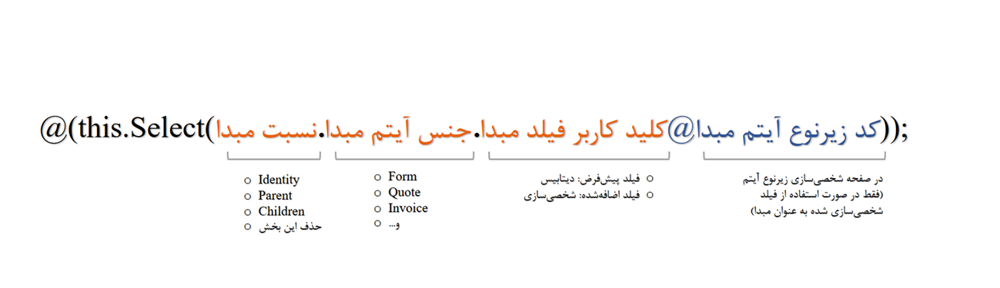

# نوشتن expression برای تخصیص مقدار پیشرفته 
چنانچه پیش‌تر به آن اشاره شد، برای استفاده از تخصیص مقدار پیشرفته باید از دستورات expression برای فراخوانی اطلاعات مورد نیاز استفاده نمایید. دستور expression می‌تواند اطلاعات مورد نیاز شما را از فیلد مربوطه در هر آیتمی یافته، از دیتابیس دریافت کرده و در فیلد مورد نظر شما قرار دهد. برای نوشتن چنین دستوری، لازم است که با Syntaxهای آن آشنا شوید. در این بخش به نحوه‌ی نوشتن دستور expression برای فراخوانی اطلاعات در تخصیص مقدار آشنا می‌شوید.<br>

## آشنایی با Syntaxهای به کار رفته در expression
به صورت کلی برای نوشتن expression می‌توانید از قالب زیر استفاده کنید:<br>

- اگر مبدا از فیلدهای پیش‌فرض باشد:<br>
```
@(this.Select(Identity/Parent/Children.Item.DefaultFieldCode));
```
- اگر مبدا از فیلدهای اضافه‌شده در شخصی‌سازی باشد:<br>
```
@(this.Select(Identity/Parent/Children.Item.ExtendedFieldCode@ItemKey));
```
تصویر زیر نیز قالب بالا را به زبان فارسی توضیح می‌دهد.<br>



در تصویر فوق:<br>
- استفاده از this به معنای ارجاع دادن به آیتم فعلی (آیتم مقصد که چرخه روی آن طراحی شده است) می‌باشد. این بخش ثابت بوده و در ابتدای هر دستوری درج می‌شود.

-  از Select برای انتخاب خروجی مورد نظر استفاده می‌شود.

- منظور از نسبیت تعیین یکی از چهار حالت (Children/Parent/Identity/خود آیتم) است. چنانچه قصد درج اطلاعات از همان آیتم را دارید، این بخش را حذف نمایید.

- منظور از جنس آیتم، نوع موجودیت مبدا است. نوع آیتم می‌تواند فرم، فرصت، انواع فاکتورها و... باشد. چنانچه نسبیت شما Identity است لازم به ذکر این بخش نمی‌باشد.<br>

> **نکته**<br>
> نام آیتم باید بر اساس نام انگلیسی (که به table آن اختصاص داده شده) لحاظ گردد. <br>

- اگر فیلد مبدا جز فیلدهای پیش‌فرض نرم‌افزار باشد (یعنی فیلدهایی که از ابتدا در نرم‌افزار وجود داشته و شما آن را در شخصی‌سازی ایجاد نکرده‌اید)، کلید کاربر آن را می‌توانید از قسمت کوئری‌ساز پیام‌گستر بدست آورید. اگر فیلد مبدا توسط شما در شخصی‌سازی ایجاد شده باشد، کلید کاربر هنگام ایجاد توسط شما تعریف می‌شود.

- اگر فیلد مبدا جز فیلدهای پیش‌فرض نرم‌افزار باشد، نیاز به درج این بخش ندارید. لکن اگر فیلد مبدا طی شخصی‌سازی توسط شما ایجاد شده است،‌ لازم است که کد زیرنوع آن را در این قسمت لحاظ کنید. برای یافتن آن به بخش شخصی‌سازی رفته و در صفحه‌ی شخصی‌سازی آن زیرنوع از آیتم، کد را پیدا کنید.

>**نکته**<br>
>هنگام نوشتن دستور به بزرگ و کوچک بودن حروف دقت کنید.<br>

##   کاربرد expression در تخصیص مقدار پیشرفته
از expression  می‌توانید در حالت‌های زیر برای تخصیص مقدار پیشرفته استفاده کنید:
1.  درج اطلاعات از سایر فیلدهای همان آیتم
2.  درج اطلاعات از فیلدهای صفحه هویت
3.  درج اطلاعات از فیلدهای سابقه‌ی مرتبط با آیتم (Children)
4. درج اطلاعات از فیلدهای آیتم پدر (Parent)

### درج اطلاعات از فیلدهای همان آیتم
در برخی شرایط ممکن است به درج اطلاعات از همان آیتم نیاز داشته باشید. در این حالت نیازی به درج نسبت و جنس مبدا نبوده و فقط کافیست کلید کاربری فیلد آن را در پرانتز لحاظ کنید. <br>
**مثال ۱:**<br>
فرض کنید می‌خواهید نام ایجادکننده‌ی فرصت را در فیلدی به نام «ثبت‌کننده‌ی فرصت» درج نمایید. فرصت توسط هر کاربری ثبت شده باشد، لاگ آن در سیستم به نام کاربری ایشان به طور خودکار ثبت می‌شود. برای ثبت آن در فیلد مذکور کافیست فیلد «ثبت‌کننده‌ی فرصت» را بر روی آیتم فرصت ایجاد نموده و از دستور زیر در بخش تخصیص مقدار پیشرفته استفاده نمایید:<br>
```
@(this.Select(CreatorId));
```
در این دستور CreatorId کلید کاربری ایجاد‌کننده‌ی آیتم می‌باشد. لازم به ذکر است که در این مثال فیلد مقصد باید از نوع فیلد کاربر باشد. چنانچه از فیلد متن برای این کار استفاده نمایید Id کاربر در آن درج می‌شود که برای بیننده کاربردی ندارد.<br>
این نوع از تخصیص مقدار پیشرفته اصولاً برای تاریخ ایجاد، تاریخ ویرایش و یا نام ایجادکننده‌ی آیتم کاربرد دارد.<br>

### درج اطلاعات از فیلدهای صفحه هویت (Identity)
از Identity برای درج اطلاعات از فیلدهای صفحه هویت استفاده می‌شود.<br>
**مثال ۲:**<br>
فرض کنید در آیتم فرصت، فیلدی به نام «شماره تماس برای پیگیری» ایجاد کرده‌اید که باید به صورت خودکار با شماره موبایل مشتری (موجود در صفحه مشخصات هویت) پر شود. با درج شماره موبایل در این قسمت، کارشناس برای برقراری تماس به منظور پیگیری فرصت نیاز نیست به صفحه پروفایل هویت مراجعه کند. دستور expression برای این انتقال اطلاعات به شکل زیر می‌باشد:<br>
```
@(this.Select(Identity.Mobile));
```
لازم به ذکر است که Mobile در واقع نام فیلد موبایل پیش‌فرض در دیتابیس می‌باشد. از طرفی، چون از فیلدهای پیش‌فرض بوده، نیازی به درج ادامه‌ی دستور نمی‌باشد.<br>

**مثال ۳:**<br>
فرض کنید در شخصی‌سازی هویت‌ها، یک فیلد متنی به نام «رشته تحصیلی» و با کلید کاربری Major1 ایجاد کرده‌اید. چنانچه در هر یک از آیتم‌ها، مثلا همان فرصت، فیلدی تحت عنوان «خصوصیات فردی» ایجاد کرده‌اید و می‌خواهید رشته تحصیلی فرد به صورت خودکار در این فیلد درج شود. دستور expression برای این انتقال اطلاعات به شکل زیر می‌باشد:<br>
```
@(this.Select(Identity.Major1@Hoviat));
```
در این دستور Hoviat کد مخاطب حقیقی (زیرنوع هویت) می‌باشد. از آنجا که فیلد رشته تحصیلی طی شخصی‌سازی به صفحه پروفایل مخاطبین حقیقی اضافه شده، در انتهای کد به آن اشاره شده است. برای تعیین و یا مشاهده‌ی کد زیرنوع، به صفحه شخصی‌سازی آن زیرنوع مراجعه نمایید.<br>

### درج اطلاعات از فیلدهای آیتم پدر (Parent)
 استفاده از عبارت Parent به معنای ارجاع دادن به موجودیتی می‌باشد که موجودیت فعلی متصل به آن و در سوابق آن ثبت شده است.<br>

**مثال ۴:**<br>
فرض کنید از روی فرصت فروش، فاکتوری برای مشتری خود ثبت کرده‌اید (فاکتور متصل به فرصت و در سوابق آن است). اگر طی شخصی‌سازی فاکتور،‌ فیلدی تحت عنوان «عنوان فرصت مرتبط» ایجاد کرده باشید و بخواهید به صورت خودکار از روی فیلد «عنوان» در آیتم فرصت که به آن متصل است (آیتم پدر) پر شود، باید از دستوری مشابه دستور زیر استفاده کنید:<br>

```
@(this.Select(Parent.Opportunity.Subject));
 ```

 در دستور بالا Opportunity نام جدول فرصت در نرم‌افزار و Subject کلید کاربری فیلد عنوان در آیتم فرصت می‌باشد. از آنجا که این فیلد، فیلد پیش‌فرض آیتم است، دستور با ذکر کلید کاربری فیلد مبدا خاتمه یافته است.<br>

**مثال ۵:**<br>
در مثال ۴، فرض کنید در آیتم فرصت، فیلد اضافه‌ای تحت عنوان «تاریخ پیشنهادی تحویل» را با کلید کاربری DeliveryDate از طریق شخصی‌سازی اضافه کرده‌اید. فیلد مشابهی از جنس تاریخ نیز تحت عنوان «تاریخ تحویل» در فاکتور فروش ایجاد کرده‌اید و می‌خواهید تاریخی که توسط کارشناس طی مکالمات پیگیری فروش در فرصت آن ثبت می‌شود، به صورت خودکار در فاکتور فروش متصل به آن درج شود. برای این کار باید از دستوری مشابه دستور زیر استفاده کنید:<br>
```
@(this.Select(Parent.Opportunity.DeliveryDate@SalesOpportunity));
```

با توجه به اینکه فیلد مبدا (تاریخ پیشنهادی تحویل) فیلد پیش‌فرض نبوده و طی شخصی‌سازی به آیتم اضافه شده است، SalesOpportunity که کلید کاربری زیرنوع فرصت (فرصت فروش) است در انتهای دستور ذکر شده است.<br>

### درج اطلاعات از فیلدهای آیتم سوابق مرتبط (Children)
استفاده از عبارت Children به معنای ارجاع دادن به موجودیتی است که متصل به موجودیت فعلی و در سوابق آن ثبت شده است.<br>

**مثال ۶:**<br>
فرض کنید از روی فرصت فروش، پیش‌فاکتوری برای مشتری ثبت شده‌است (پیش‌فاکتور متصل به فرصت و در سوابق آن است). چنانچه در شخصی‌سازی، فیلدی تحت عنوان «شماره پیش‌فاکتور مرتبط» در فرصت ایجاد کرده باشید و بخواهید پس از ثبت و شماره‌گذاری پیش‌فاکتور،‌ شماره‌ی آن پیش‌فاکتور به صورت خودکار در فیلد تعبیه شده در پیش‌فاکتور مربوطه ثبت شود، باید از دستور زیر استفاده کنید:<br>
```
@(this.Select(Children.Quote.Number));
```
در دستور بالا، Quote نام جدول پیش‌فاکتورها در نرم‌افزار و Number کد کاربری فیلد شماره پیش‌فاکتور می‌باشد. از آنجا که این فیلد، فیلد پیش‌فرض آیتم است، دستور با ذکر کلید کاربری فیلد مقصد خاتمه یافته است.<br>

**مثال ۷:**<br>
در مثال ۶، فرض کنید در آیتم پیش‌فاکتور، فیلد اضافه‌ای از نوع متن، تحت عنوان «نحوه تسویه» را با کلید کاربری 
SettlementTerms از طریق شخصی‌سازی اضافه کرده‌اید. فیلد مشابهی از جنس متن نیز تحت عنوان «شرایط پرداخت» در فرصت فروش ایجاد کرده‌اید و می‌خواهید توضیحات نحوه‌ی تسویه که در پیش‌فاکتور ثبت می‌شود، به صورت خودکار در فیلد شرایط پرداخت در فرصت مرتبط (فرصتی که پیش‌فاکتور در سوابق آن درج شده است) لحاظ گردد. برای این کار باید از دستوری مشابه دستور زیر استفاده کنید:<br>

```
@(this.Select(Children.Quote.SettlementTerms@SalesOpportunity));
```

با توجه به اینکه فیلد مبدا (نحوه تسویه) فیلد پیش‌فرض نبوده و طی شخصی‌سازی به آیتم اضافه شده است، SalesOpportunity که کد زیرنوع فرصت (فرصت فروش) است در انتهای دستور ذکر شده است.<br>

>**نکته**<br>
> در صورت احتمال وجود چند سابقه از نوع مندرج در دستور، سابقه‌ی مورد نظر را با استفاده از مرتب‌سازی (Order/OredDes) و یا اعمال شرط (Where) مشخص نمایید. در غیر این صورت اولین سابقه‌ی یافت شده (که لزوماً جدیدترین سابقه نیست) به عنوان آیتم مبدا در نظر گرفته می‌شود.<br>

## مرتب‌سازی و انتخاب آیتم
چنانچه هنگام انتخاب از بین آیتم‌های ثبت شده در سابقه‌ی آیتم اصلی (Children)  نیاز دارید که سوابق ابتدا به ترتیب صعودی/نزولی مرتب شده و سپس اولین یا nامین سابقه انتخاب شود، باید از دستورهای زیر استفاده کنید:<br>

- Order: برای مرتب کردن به صورت صعودی استفاده می‌شود. چنانچه شما فیلد تاریخی را به صورت صعودی مرتب نمایید، اولین مورد در حقیقت قدیمی‌تری خواهد بود.
- OrderDes: برای مرتب کردن به صورت نزولی استفاده می‌شود. چنانچه شما فیلد تاریخی را به صورت نزولی مرتب نمایید، اولین مورد در حقیقت جدیدترین خواهد بود.
- Take: آیتم nام از بین لیستی که به صورت صعودی یا نزولی مرتب شده انتخاب می‌شود.
- TakeOrDefault: با استفاده از این دستور در صورت موجود نبودن nامین مورد انتخابی،‌ مقداری که به عنوان پیش‌فرض انتخاب شده است، به عنوان خروجی نمایش داده می‌شود.


به طور کلی برای استفاده از قالب قابل مشاهده در تصویر بالا استفاده می‌شود. قسمت آبی رنگ کد تنها در صورت پیش‌فرض نبودن فیلد مبدا و قسمت سبز رنگ در صورت پیش‌فرض نبودن فیلد مبنای مرتب‌سازی در دستور درج شود.<br>

**مثال ۸:**<br>
فرض کنید می‌خواهید از بین درخواست‌های پشتیبانی (ticket) ثبت شده مرتبط با یک فرم نظرسنجی، «توضیحات» درج شده در قدیمی‌ترین درخواست (اولین درخواست ثبت‌شده‌ی مرتبط با این فرم نظرسنجی) در فیلدی به نام «شرح شکایت» که در فرم نظرسنجی تعبیه شده است درج شود.<br>
در این حالت نیاز است که درخواست‌های ثبت شده در سوابق فرم نظرسنجی، ابتدا بر اساس تاریخ ایجاد به صورت **صعودی** مرتب شده و سپس اولین مورد انتخاب گردد تا فیلد توضیحات آن به عنوان مبدا اطلاعات قرار گیرد. برای اعمال این امر از دستور زیر در بخش تخصیص مقدار پیشرفته‌ی فیلد «شرح شکایت» استفاده نمایید:

```
@(this.Select(Children.Ticket.Description).Order(Children.Ticket.CreateDate).Take(1));
```

در دستور بالا، Ticket نام جدول درخواست‌ها در نرم‌افزار و Discription کلید کاربری فیلد توضیحات در آیتم درخواست می‌باشد. از آنجا که این فیلد، فیلد پیش‌فرض آیتم است، دستور با ذکر کلید کاربری فیلد مقصد خاتمه یافته است. به منظور مرتب‌سازی به صورت صعودی از دستور Order و برای انتخاب اولین مورد (قدیمی‌ترین) عبارت Take با عدد 1 بیان شده است. بدیهی است در صورت نیاز به nامین (مثلا دومین) درخواست از لیستی که به صورت نزولی مرتب شده  عدد مربوطه را به جای عدد 1 در پرانتز درج می‌کنیم.<br>

**مثال ۹:**<br>
در مثال ۸، در صورت نیاز به درج اطلاعات از جدیدترین (آخرین) تیکت ثبت شده، دستور به شکل زیر تغییر می‌کند:

```
@(this.Select(Children.Ticket.Description).OrderDes(Children.Ticket.CreateDate).Take(1));
```

**مثال ۱۰:**<br>

چنانچه در مثال بالا، فیلدی به نام «نتیجه» با کلید کاربری FirstResult از طریق شخصی‌سازی به آیتم درخواست اضافه شده باشد و شما بخواهید اطلاعات آن (از قدیمی‌ترین فرم) را در فیلدی به نام «نتیجه‌ی درخواست اولیه» در فرم نظرسنجی ثبت نمایید، باید از دستور زیر در بخش تخصیص مقدار پیشرفته‌ی فیلد «نتیجه‌ی درخواست اولیه» استفاده نمایید:

```
@(this.Select(Children.Ticket.FirstResult@CustomerTicket).Order(Children.Ticket.CreateDate).Take(1));
```

با توجه به اینکه فیلد مبدا (نتیجه) فیلد پیش‌فرض نبوده و طی شخصی‌سازی به آیتم اضافه شده است، CustomerTicket  که کد زیرنوع درخواست پشتیبانی (درخواست پشتیبانی مشتری) است در انتهای بخش اول دستور ذکر شده است.<br>

**مثال ۱۱:**<br>

چنانچه در مثال ۱۰، قصد داشته باشیم مرتب‌سازی را بر اساس فیلد «تاریخ اتمام» که خودمان در شخصی‌سازی به آیتم درخواست پشتیبانی اضافه‌ کرده‌ایم انجام دهیم، لازم است که به مشابه بخش اول دستور، کد زیرنوع آیتم را در انتهای کد وارد نماییم.<br>
```
@(this.Select(Children.Ticket.Result@
CustomerTicket).OrderDes(Children.Ticket.EndDate@CustomerTicket).Take(1));
```
در مثال فوق EndDate کلید کاربری فیلد تاریخ اتمام و CustomerTicket کد زیرنوع درخواست پشتیبانی (آیتم مبدا) می‌باشد.<br>

**۱۲ مثال:**<br>
در مثالی مشابه مثال ۱۰، فرض کنید می‌خواهید از بین درخواست‌‌های پشتیبانی ثبت شده برای یک فرم نظرسنجی، دومین درخواست مرتبط با این فرم (درخواست یکی مانده به آخر) را پیدا کرده و اطلاعات مندرج در فیلد «توضیحات» آن درخواست، در فیلدی به نام «درخواست پیشین» در فرم نظرسنجی ذخیره شود. در صورت عدم وجود دو درخواست پشتیبانی در سوابق (یافت نشدن دومین درخواست پشتیبانی) عبارت "Only one ticket" در آن درج شود. بدین منظور باید از دستور زیر در بخش تخصیص مقدار پیشرفته‌ی فیلد «درخواست پیشین» استفاده نمایید:<br>
```
@(this.Select(Children.Ticket.Description).OrderDes(Children.Ticket.CreateDate).TakeOrDefault(2,"Only one ticket"));
```
به مشابه نمونه‌‌های قبلی، چنانچه فیلد مبدا از فیلدهای پیش‌فرض نبوده و توسط شما به آیتم اضافه شده باشد، لازم است که کد زیرنوع آیتم مبدا (درخواست پشتیبانی) در انتهای بخش اول دستور (پرانتز اول) ذکر شود.<br>

>**نکته**<br>
> در حالت استفاده از TakeOrDefault، به عنوان عبارت ثابت برای نمایش در صورت یافت نشدن آیتم، باید از متن انگلیسی و یا عدد استفاده نمایید. عبارات فارسی قابلیت نمایش ندارند.<br>


## کاربرد expression در چندشرطی
از سری مزایای Expression  می‌توان به کاربرد آن در فعالیت چندشرطی اشاره کرد که با چندین مثال به درک مفاهیم آن می‌پردازیم.<br>
**۱۳ مثال:**<br>
فرض کنید می‌خواهید از بین قرادادهای ثبت شده برای یک فرصت، قراردادی که عبارت «نمایندگی» در عنوان آن درج شده است انتخاب شده و «تاریخ پایان» مندرج در آن، در فیلدی به نام «تاریخ اتمام قرارداد» در فرصت (که در شخصی‌سازی آن را ایجاد کرده‌ایم) ثبت شود.  

```
@(this.Where(Children.Contract.Subject=="نمایندگی").Select(Children.Contract.EndDate));
```

**۱۴ مثال:**<br>
فرض کنید می‌خواهید از بین پیش‌فاکتورهای ثبت شده برای یک فرصت، پیش‌فاکتوری که «مبلغ تخفیف» دارد (تخفیف آن بیشتر از صفر است) انتخاب شده و «توضیحات» آن در فیلد «شرح تخفیف» را که در فرصت ایجاد کرده‌اید ثبت شود.
```
@(this.Where(Children.Quote.Discount>0).Select(Children.Quote.Description));
```


**۱۵ مثال:**<br>
فرض کنید می‌خواهید از بین پیش‌فاکتورهای ثبت شده برای یک فرصت، مبلغ نهایی پیش‌فاکتوری که تایید شده را یافته و مبلغ تخفیف آن را در فیلد «تخفیف» که در فرصت ایجاد کرده‌اید نمایش دهد.
```
@(this.Where(Children.Quote.FinalValue).Select(Children.Quote.OpportunityDiscount));

```

**۱۶ مثال:**<br>

فرض کنید از بین قراردادهایی که برای یک فرصت ثبت شده است قصد دارید قراردادهایی که در آن چک‌باکس «VIP» فعال بود را در فیلد مشتریان ویژه که در فرصت ایجاد کرده‌اید نمایش دهد.

```
@(this.Where(Children.Contract.Typecontract == VIP).Select(Children.Contract.VIPCustomer));
```

### درج اطلاعات از فیلدهای آیتم پدر (Parent)

فرض کنید از روی فرصت‌فروش پیش‌فاکتورهایی ثبت کرده‌اید، چنانچه درصد احتمال این فرصت بیشتر از ۷۰ درصد بود در فیلدی به‌نام «درصد موفقیت فروش» پیش‌فاکتور(که در شخصی‌سازی آن را ایجاد کرده‌ایم) ثبت شود.
@(this.Where(Parent.Qoute.Subject=="نمایندگی").Select(Parent.Qoute.EndDate));


فرض کنید می‌خواهید از بین قرادادهای ثبت شده برای یک فرصت، قراردادی که عبارت «نمایندگی» در عنوان آن درج شده است انتخاب شده و «تاریخ پایان» مندرج در آن، در فیلدی به نام «تاریخ اتمام قرارداد» در فرصت (که در شخصی‌سازی آن را ایجاد کرده‌ایم) ثبت شود.  

فرض کنید از بین 
فرض از روی فرصت‌‌فروش
فرض کنید از روی فرصت فروش، فاکتوری برای مشتری خود ثبت کرده‌اید (فاکتور متصل به فرصت و در سوابق آن است). اگر طی شخصی‌سازی فاکتور،‌ فیلدی تحت عنوان «عنوان فرصت مرتبط» ایجاد کرده باشید و بخواهید به صورت خودکار از روی فیلد «عنوان» در آیتم فرصت که به آن متصل است (آیتم پدر) پر شود، باید از دستوری مشابه دستور زیر استفاده کنید:<br>

```
@(this.Select(Parent.Opportunity.Subject));