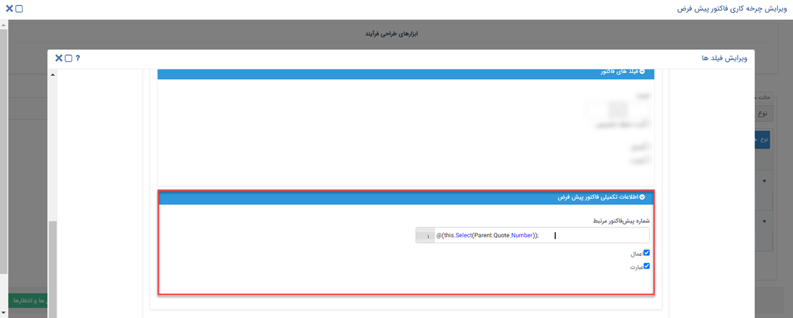

# تخصیص مقدار پیشرفته با استفاده از expression
از فعالیت تخصیص مقدار پیشرفته برای درج اطلاعات یک فیلد بر اساس اطلاعات فیلدی در آیتم دیگر یا بعضاً همان آیتم استفاده می‌شود. با استفاده از تخصیص مقدار (حالت ساده) می‌توانید: 
 ۱. فیلد را با یک عبارت/تاریخ/زمان ثابت پر کنید.  ۲. از بین گزینه‌های موجود یک مورد را انتخاب کنید.  ۳. زمان عبور از مرحله‌ای از فرآیند را برای یک فیلد تاریخی درج نمایید. 
تخصیص مقدار پیشرفته، در حالت‌هایی غیر از موارد بالا کمک می‌کند از اطلاعات مندرج در آیتم دیگری استفاده کنیم. این اطلاعات ممکن است در صفحه‌ی هویت مرتبط، در آیتمی که متصل به آن ثبت شده (مثل فاکتوری که متصل به یک فرصت ثبت شده)،  آیتم پدر (آیتمی که این آیتم متصل به آن ثبت شده) و یا اطلاعاتی در خود آیتم باشد. [*اگر توضیحات بالا براتون شفاف نیست نگران نباشید. جلوتر، مفصل در موردشون صحبت می‌کنیم:)*]. برای انجام این کار باید از expression استفاده کنید. 

## آشنایی با تخصیص مقدار پیشرفته
برای درک بهتر تخصیص مقدار پیشرفته بیایید کاربرد آن را با یک مثال بررسی کنیم. به عنوان مثال فرض کنید می‌خواهید پس از ذخیره‌ی فرم نارضایتی برای یک مشتری،‌ شماره (کد) مشتری (در صورت وجود)، به صورت خودکار در فیلد تعبیه شده در فرم ثبت شود. از آنجا که شماره مشتری در آیتم هویت (صفحه پروفایل) بوده و فیلدی که قصد درج شماره در آن را دارید در آیتم فرم قرار دارد،‌ باید از تخصیص مقدار پیشرفته برای این کار استفاده نمایید. 
برای استفاده از قابلیت تخصیص مقدار پیشرفته، ابتدا باید با مفاهیم و شرایط لازم برای آن آشنا شوید و سپس به قوانین و دستورهای نوشتن expression می‌پردازیم.

## تعیین مبدا و مقصد
به فیلد و آیتمی که می‌خواهیم اطلاعات را از آن برداریم (منبع اطلاعات) **مبدا** و به فیلد و آیتمی که قرار است با این اطلاعات پر شود **مقصد** گفته می‌شود. در مثال فوق فیلد شماره مشتری در آیتم هویت، مبدا و فیلدی در آیتم فرم نارضایتی که قرار است شماره در آن درج شود،‌ مقصد در نظر گرفته می‌شود. 
در حال حاضر، آیتم‌های زیر قابلیت اجرای دستورات expression را دارند. در نتیجه، آیتم **مقصد** باید یکی از آیتم‌های زیر باشد: 
- فرم
- فرصت
- هویت
- وظیفه
- درخواست پشتیبانی
- پیش‌فاکتور خرید/فروش
- فاکتور خرید/فروش
- فاکتور برگشت از خرید/فروش
- قرارداد

فیلدهایی که در ادامه به آن اشاره شده است، قابلیت این را دارند که از طریق دستورات Expression در حین فرآیند، مقداری به آن تخصیص داده شود. در واقع فیلد **مقصد** باید یکی از فیلدهای زیر باشد: 

- متن
- عدد
- ساعت 
- تاریخ شمسی
- تاریخ میلادی
- چک باکس
- پول
- شرکت/شخص
- کاربر
- گروه
- لینک
- Html

با توجه به این نکات،‌ شما می‌توانید هر کدام از فیلدهای آیتم‌های بالا را با استفاده از تخصیص مقدار پیشرفته با اطلاعاتی از سایر آیتم‌ها پر کنید. لازم به ذکر است که شما می‌توانید از این قابلیت هم برای فیلدهای پیش‌فرض و هم برای فیلدهای ایجاد شده در شخصی‌سازی استفاده کنید. 

> **نکته** 
> فیلد مقصد حتما باید در یکی از آیتم‌های نام‌برده در لیست فوق باشد لکن شما می‌توانید از فیلدهای تمامی آیتم‌ها (حتی قرارملاقات، تراکنش‌‌های انبار و... که در لیست مشاهده نمی‌شود) به عنوان مبدا استفاده کنید. به عبارت دیگر شما می‌توانید از هر آیتمی اطلاعات بگیرید ولی اطلاعات باید در یکی از فیلدهای آیتم‌های بالا اعمال/درج شود. 

برای استفاده از expression لازم است که به نوع فیلدهای مبدا، مقصد و محتوای انتقالی توجه داشته باشید. به عنوان مثال بدیهی است که امکان انتقال محتوایی از جنس متن به فیلد ساعت وجود ندارد. برای اینکه انتقال اطلاعات بدون مشکل انجام پذیرد، یا باید فیلد مبدا و مقصد یکسان انتخاب شوند (مثلا انتقال فیلد تاریخ به تاریخ) و یا اینکه اگر جنس فیلد مبدا محتوایی نظیر تاریخ، ساعت، عدد و ... است فیلد مقصد را متن انتخاب نمایید. چرا که امکان پذیرش محتوا از هر نوع فیلد برای فیلد متنی امکان‌پذیر می‌باشد. 

> **نکته** 
> چنانچه فیلد مبدا از جنس لیست کشویی باشد، فیلد مقصد را باید از جنس متن انتخاب نمایید. لکن توجه داشته باشید که طی این انتقال صرفاً شماره‌ی ردیف گزینه‌ی انتخابی (Index) آن در فیلد متنی تخصیص داده می‌شود. برای نمایش محتوای گزینه باید با استفاده از چند شرطی و تخصیص مقدار،‌ عبارات هر گزینه را جایگزین عدد مندرج نمایید. 

## انواع کاربرد expression در تخصیص مقدار پیشرفته
با استفاده از expression می‌توانید در چهار حالت مختلف از تخصیص مقدار پیشرفته استفاده کنید:
1. برای درج اطلاعات از سایر فیلدهای همان آیتم
2. برای درج اطلاعات از فیلدهای صفحه هویت
3. برای درج اطلاعات از فیلدهای سابقه‌ی مرتبط با آیتم (Children)
4. برای درج اطلاعات از فیلدهای آیتم پدر (Parent)

### تشخیص Children و Parent
چنانچه شما از روی یک آیتم، آیتم دیگری (متصل به آن) ثبت کنید، آیتم دوم Child آیتم اول و آیتم اول Parent آیتم دوم معرفی می‌شود. (*پیچیده شده؟*) به مثال زیر توجه کنید. 
فرض کنید که برای یکی از مشتریان خود فرصتی ثبت کرده‌اید. از روی آن فرصت و متصل به آن یک پیش‌فاکتور برای ایشان ثبت می‌نمایید. در این حالت فرصت، Parent پیش فاکتور و همچینین پیش‌فاکتور Child فرصت در نظر گرفته می‌شود. 
چنانچه در مثال فوق، متصل به پیش‌فاکتور مذکور، فاکتوری ثبت شود، فاکتور علاوه بر اینکه Child پیش‌فاکتور است، Child فرصت نیز محسوب می‌شود. به عبارت دیگر پیش‌فاکتور Parent فاکتور بوده و به واسطه‌ی آن فرصت نیز Parent فاکتور محسوب می‌شود. در واقع زنجیره‌ای به شکل زیر تشکیل می شود: 
فرصت > پیش‌فاکتور > فاکتور 

## پیاده‌سازی تخصیص مقدار پیشرفته با استفاده از expression
برای پیاده‌سازی تخصیص مقدار پیشرفته، پس از تعیین مبدا و مقصد و ایجاد فیلدهای مورد نیاز،‌ فعالیت تخصیص مقدار را در بخش مناسب فرآیند خود قرار دهید. برای تنظیم فعالیت، چک باکس **اعمال** و **عبارت** را فعال نمایید. سپس دستور expression مورد نیاز را در فیلد مربوطه وارد کنید. شیوه‌ی نوشتن دستورات در بخش  [نوشتن expression برای تخصیص مقدار پیشرفته]() به صورت کامل توضیح داده شده است. بهتر است دستور را در صفحه Notepad نوشته و آن را در این قسمت paste نمایید. 

به طور خلاصه برای استفاده از تخصیص مقدار پیشرفته باید مراحل زیر را طی کنید:

1. فیلدهای مبدا و مقصد را مشخص کنید و در صورت نیاز فیلدهای آن‌ را ایجاد نمایید.
2. فرآیند مورد نیاز را بر روی آیتم **مقصد** طراحی و پیاده‌سازی نمایید و فعالیت تخصیص مقدار را در آن تعبیه کنید.
3. در بخش تنظیمات فعالیت تخصیص مقدار، چک‌باکس **اعمال** و **عبارت** را فعال نمایید. دستور expression را در فیلد مقصد (که در تنظیمات فعالیت تخصیص مقدار به شما نمایش داده می‌شود) وارد کرده و تنظیمات را ذخیره نمایید.

> **نکته** 
> در صورت قرمز شدن کادر پس از ورود کد و یا پس از ذخیره، کد نادرست بوده و نیازمند اصلاح می‌باشد. 
>> آبی شدن کد به مفهوم صحیح بودن قطعی دستور نمی‌باشد. 
