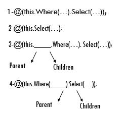
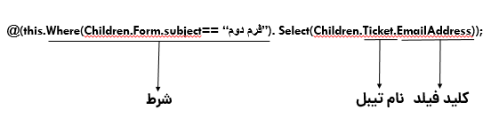

# نحوه نوشتن دستورات Expression 

در حال حاضر، در فعالیت تخصیص مقدار، چند شرطی و اجرای دستورات پایگاه‌داده می‌توان از  Custom Expression استفاده نمود که ساختار کلی آن با زبان C#  در کتابخانه linq مشابهت دارد.

می‌توانید با تعریف Expression در این فعالیت‌ها، در طی فرآیند، اطلاعاتی را از دیتابیس دریافت کرده و خروجی آن را در فیلد موردنظر خود مشاهده کنید.

## syntaxهای کلیدی:

برای استفاده از Custom Expression در فعالیت‌های چندشرطی، تخصیص مقدار و دستورات پایگاه داده Syntaxهای اصلی وجود دارد که شامل موارد زیر می‌شود:

**1. Select:** برای انتخاب خروجی موردنظر جهت /مشاهده، از این دستور استفاده می‌شود.<br>
**2. This:** استفاده از این عبارت به معنای ارجاع دادن به موجودیت فعلی (موجودیت تحت فرآيند) می‌باشد.<br>
**3. Children:** استفاده از این عبارت به معنای ارجاع دادن به سوابق موجودیت فعلی می‌باشد.<br>

>**نکته**<br>
>در نوشتن Expression هنگامی‌که از children استفاده شود، به‌صورت پیش‌فرض اولین سابقه‌ی موجودیت فعلی در نظر گرفته می‌شود. توجه داشته باشید منظور از اولین، اولین سابقه‌ای است که یافت شود، لذا بر اساس تاریخ نمی‌باشد.

**4. Parent:** استفاده از این عبارت به معنای ارجاع دادن به موجودیتی می‌باشد که موجودیت فعلی در سوابق آن ثبت شده است.<br>

>**نکته**<br> 
>در صورتی‌که بخواهید از اطلاعات موجودیت (هویت) Identity خروجی بگیرید، لزومی ندارد برای ارجاع دادن از عبارت Parent  استفاده کنید، درحالی‌که در سایر موجودیت‌ها باید از عبارت Parent استفاده کنید.



**5. Where:** برای گذاشتن شرط از این دستور استفاده می‌شود.<br>

>**نکته**<br>
>می‌توانید از children یا parent  بعد از this  یا در where  استفاده کنید و تفاوتی در دستور ندارد. (گزینه‌های 3 و 4)

**6. Order:** برای مرتب کردن نتایج، به‌صورت صعودی استفاده می‌شود.<br>
**7. OrderDes:** برای مرتب کردن نتایج، به‌صورت نزولی استفاده می‌شود.<br>
**8. Take:** برای انتخاب خروجی موردنظر، از نتایج مرتب شده (توسط دستور Order  یا OrderDes) استفاده می‌شود.<br>
**9.TakeOrDefault:** برای انتخاب خروجی موردنظر، از نتایج مرتب شده (توسط دستور Order  یا OrderDes) استفاده می‌شود، در این حالت درصورتی‌که خروجی موردنظر وجود نداشته باشد، می‌توانیم از مقدار پیش‌فرض تعریف شده برای خروجی استفاده کنیم.<br>
**10. &&:** برای تعریف چندین شرط، بین شرط‌های موردنظر خود در where استفاده کنید.<br>
**11. ||:** برای تعریف "یا" بین شرط‌های موردنظر از این where استفاده کنید.<br>
## نحوه نوشتن Expression: 

Expression موردنظر باید به‌صورت ; (Expression)@   در فعالیت مربوطه تعریف شود که به‌صورت فراخوانی متوالی توابع فوق با استفاده از "." صورت می‌گیرد.

> **نکته**<br>
> در فعالیت اجرای دستورات پایگاه‌داده، در صورت نیاز به استفاده از Expression باید به‌صورت ;Select @(Expression) نوشته شود.




## لیست فیلدهای قابل پشتیبانی جهت تعیین مقدار از طریق Expression:

- Html
- پول
- تاریخ شمسی
- تاریخ میلادی
- چک باکس
- ساعت 
- عدد
- کاربر
- گروه
- لینک
- متن 
- شرکت/شخص

>**نکته**<br>
>لازم به ذکر است در صورت استفاده از  Expression در فعالیت‌های تخصیص مقدار و تصمیم چند شرطی باید نوع فیلدی که برای مقداردهی انتخاب می‌شود با نوع آن فیلدی که به‌عنوان مبدأ می‌باشد، یکسان باشد. در جدول تعاریف فیلدهای موجودیت‌ها، نوع فیلدهای پیش‌فرض سیستم(PropertyDisplayName) آورده شده‌اند. 

### نمونه‌هایی از نحوه‌ی تعریف Expression

 در این قسمت با مثال‌هایی طریقه نوشتن Expression  آموزش داده می‌شود:

 #### مثال ۱:<br>
درحالی‌که بخواهید **بر اساس تاریخ یا فیلد موردنظر** Children انتخاب شود، باید از دستورات  **Order**  یا **OrderDes** استفاده کنید، برای مثال با این دستور اولین فرم موجود در سابقه‌ی آیتم جاری به ترتیب تاریخ انتخاب شده و عنوان آن فرم به‌عنوان خروجی انتخاب می‌شود.

```
Select @(this.Select(Children.Form.Subject).Order(Children.Form.CreateDate).Take(1));
```

>**نکته**<br>
>هنگام نوشتن دستور به بزرگ و کوچک بودن حروف دقت کنید.

درصورتی‌که بخواهیم عنوان **سومین فرم** انتخاب شود درصورتی که اگر فرمی وجود نداشت مقدار عددی 0 به ما داده شود از دستور زیر استفاده می‌کنیم.

```
Select @(this.Select(Children.Form.Subject).Order(Children.Form.CreateDate).TakeOrDefault(3,"0"));
```

>**نکته**<br>
>در فعالیت تخصیص مقدار و چند شرطی تنها می‌توان از آیتم جاری، سابقه آیتم جاری و پدر آیتم جاری اطلاعاتی را دریافت و در خروجی مشاهده کرد. به این معنی که اگر سابقه آیتم جاری دارای فیلد اضافه‌ای از نوع آیتم سی آر ام، مانند "فرم" باشد، فقط می‌توان خود فرم را در خروجی مشاهده کرد و نمی‌توان از درون آن فرم اطلاعاتی را دریافت کرد.

#### مثال ۲:<br>
با این دستور مقدار **عنوان آیتم جاری** (آیتم تحت فرآیند) برگردانده می‌شود.

	@(this.Select(Subject));

#### مثال ۳:<br>
با این دستور **فیلد ایمیل هویت مرتبط** با آیتم جاری (آیتم تحت فرآیند) برگردانده می‌شود.

	@(this.Identity.Select(Email));

#### مثال ۴:<br>
با این دستور مقدار **فیلد اضافه‌ای** با کلید major که در هویت مرتبط با آیتم جاری موجود می‌باشد برگردانده می‌شود.

	@(this.Identity.Select(major));

#### مثال ۵:<br> 
طبق این مثال در موجودیت فعلی فیلد اضافه‌ی رفرنسی با کلید frmk  از نوع **فرم** وجود دارد که می‌توانید این اطلاعات این فرم را به صورت پیش‌فرض از فرم‌های ساخته شده انتخاب نمایید مانند فرم نظرسنجی. در فرم نظرسنجی نیز فیلد اضافه‌ای با کلید customerno وجود دارد که مقدار این فیلد از طریق دستور فوق برگردانده می‌شود.

	@(this.frmk.Form.Select(customerno));


> **نکته:**<br> 
>در صورتی‌که فیلد مربوطه از نوع "آیتم‌های CRM " باشد، باید نوع آیتم نیز بعد از کلید کاربر فیلد نوشته شود.
 
 این دستور را می‌توان به این شکل نیز تعریف کرد:

	 @(this.Select(frmk.Form.customerno));

#### مثال ۶:<br>
طبق این مثال در موجودیت فعلی سابقه درخواست پشتیبانی وجود دارد و طبق آن مقدار فیلد آدرس ایمیل از این سابقه برگردانده می‌شود.

	@(this.Select(Children.Ticket.EmailAddress)); 

این دستور را می‌توان به این شکل نیز نوشت:

	@(this.Children.Select(Ticket.EmailAddress));

#### مثال ۷:<br>
با این دستور فیلد مبلغ محقق شده فرصت، که آیتم جاری (آیتم تحت فرآیند) در سابقه‌ی آن ثبت شده است، برگردانده می‌شود.

	@(this.Parent.Select(Opportunity.RealizedValue));

#### مثال ۸:<br>
با این دستور مقدار فیلد اضافه‌ای با کلید polformat که در فرم موجود در سابقه‌ی آیتم جاری وجود دارد برگردانده می‌شود، با این شرط که عنوان فرم "فرم دوم" باشد. 

	@(this.Where(Children.Form.Subject =="فرم دوم").Select(Children.Form.polformat));


#### مثال ۹:<br>
با این دستور فیلد انتخاب شده با مقدار فیلد اضافه‌ای با کلید polformat که در فرم موجود در سابقه آیتم جاری وجود دارد مقداردهی می‌شود، با شرط این که در آن فرم فیلدی با کلید number  دارای مقدار 99 باشد.

	@(this.Where(Children.Form.number == 99).Select(Children.Form.polformat));

#### مثال ۱۰:<br>
با این دستور فیلد انتخاب شده با مقدار فیلد اضافه‌ای با کلید polformat که در فرم موجود در سوابقی آیتم جاری وجود دارد مقداردهی می‌شود، با این شرط که در آن فرم فیلدی با کلید number دارای مقدار 670 باشد یا فیلدی با کلید poljoin دارای مقدار 400 باشد. 
```
@(this.Where(Children.Form.number == 670 || Children.Form.poljoin == 400).Select(Children.Form.polformat));
```
#### مثال ۱۱:<br>
با این دستور فیلد انتخاب شده با مقدار فیلد اضافه‌ای با کلید polformat که در فرم موجود در سابقه‌ی آیتم جاری وجود دارد مقداردهی می‌شود، با این شرط که در آن فرم فیلدی با کلید npfali دارای مقدار 90  و فیلدی با کلید poljoin دارای مقدار 30 باشد یا فیلدی با کلید numfirst دارای مقدار 18 باشد. 

	@(this.Form.Where(Children.number == 90 && (Children.poljoin == 30 || Children.numfirst == 18)).Select(Children.Form.polformat));

#### مثال ۱۲:<br>
با این دستور فیلد انتخاب شده با مقدار فیلد اضافه‌ای با کلید polformat که در فرم موجود در سابقه‌ی آیتم جاری وجود دارد مقداردهی می‌شود با این شرط که تاریخ ویرایش این سابقه بزرگ‌تر مساوی "2020-08-31" یا کوچک‌تر مساوی "2020-09-01" باشد.

	@(this.Where(Children.Form.ModifyDate >= Convert.ToDateTime("2020-08-31") && Children.Form.ModifyDate <= Convert.ToDateTime("2020-09-01")).Select(Children.Form.polformat));

#### مثال ۱۳:<br>
با این دستور فیلدی با کلید polformat که در موجودیتی با کلید FR123 که در سابقه‌ی آیتم جاری وجود دارد، برگردانده می‌شود.

@(this.Where(Children.Type.Code == "FR123").Select(Children.Form.polformat));

> **توجه:** در صورت نیاز به نوشتن اکسپرشن، کلید فیلدها و موجودیت‌ها در نرم‌افزار می‌بایست یکتا باشند. 


#### مثال ۱۴:<br>
با این دستور فیلد مبلغ نهایی فاکتور برگشت از فروش که در سابقه آیتم جاری وجود دارد، برگردانده می‌شود.
```
@(this.Where(Children.Invoice.BillableObjectTypeindex == 8).Select(Children.Invoice.FinalValue));
```

#### مثال ۱۵:<br>
با این دستور فیلد مبلغ نهایی فاکتور برگشت از خرید که در سابقه آیتم جاری وجود دارد، برگردانده می‌شود.

 @(this.Where(Children.Invoice.BillableObjectTypeindex == 7).Select(Children.Invoice.FinalValue));


در واقع Custom Expression شامل دستوراتی است که ساختار کلی آن با زبان #C در کتابخانه Linq نوشته شده است. از این دستورات می‌توانید در طی فرآیند اطلاعاتی را از دیتابیس دریافت کرده و خروجی آن را در فیلدهای مقصد مورد نظر خود مشاهده کنید. از آنجایی که دستورات به کار رفته در expression پیام‌گستر، دستوراتی ابتکاری الهام گرفته از این دو زبان است، از Syntax مختص به خود برای انتقال اطلاعات استفاده می‌کند.<br>