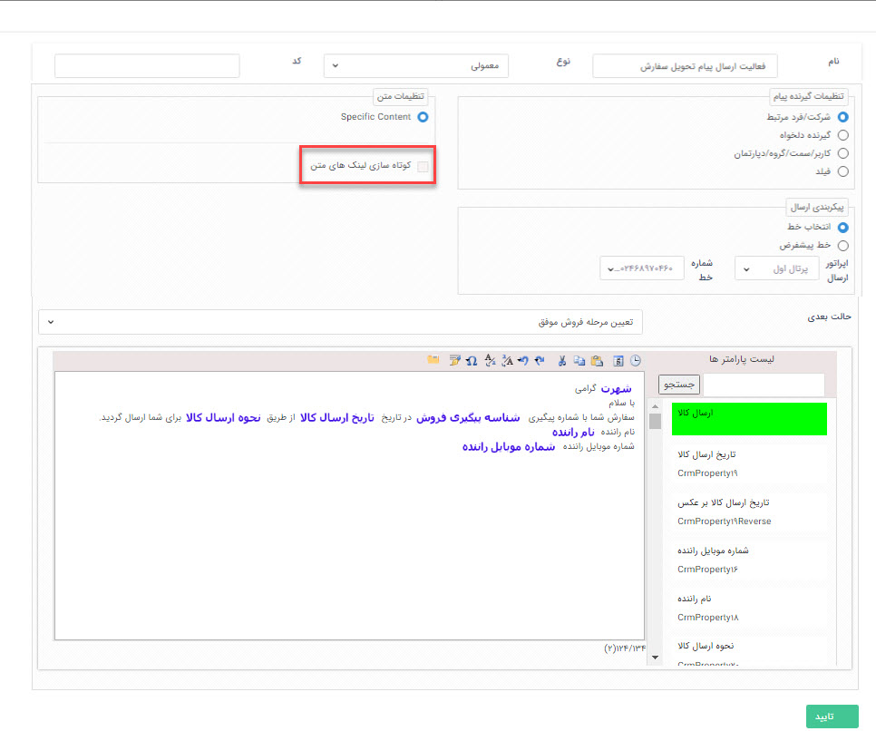
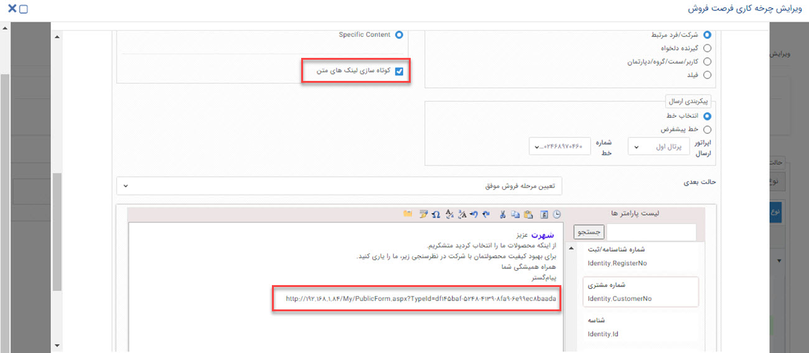

#  فعالیت ارسال پیام کوتاه 
از این فعالیت برای ارسال پیام کوتاه به صورت خودکار در طی فرآیند، استفاده می‌شود. شما می‌توانید به کمک این قابلیت در چرخه‌های کاری خود به یکی از روش‌های زیر به افراد پیامک ارسال نمایید: 
- شماره موبایل هویتی که آیتم در چرخه، در سوابق آن ذخیره شده باشد.
- شماره موبایل یک گیرنده دلخواه که در سیستم CRM شما ذخیره نشده است.
- ارسال ییامک به شماره موبایل پرسنل (کاربران سیستم) سازمان خودتان از طریق یکی از روش‌های کاربر/سمت/گروه/دپارتمان
- ارسال پیامک به شماره موبایل هویت انتخاب شده در طی فرآیند از طریق فیلدهای اضافه **کاربر** و **شرکت/شخص**

برای ارسال پیام از طریق ابزارهای پیام‌کوتاه، ایمیل، فکس و چاپ یک سری تنظیمات مشترک وجود دارد که پبشنهاد می‌کنیم ابتدا قسمت[ ارسال پیامک-ایمیل-فکس-چاپ](https://github.com/1stco/PayamGostarDocs/blob/master/Help/Settings/Personalization-crm/Overview/Process-design/Create-a-work-cycle/Activity/Send-SMS-email/Send-SMS-email.md)را مطالعه کنید.

به طور مثال فرض کنید می خواهید در فرآیند فرصت فروش، پس از ارسال کالا برای مشتری، اطلاعات ارسال برای او پیامک شود.

> **نکته**
> در فعالیت ارسال پیام‌کوتاه تنها امکان ارسال **متن** وجود دارد، فایل و ارسال قالب چاپ از طریق این فعالیت امکان پذیر نیست.

## قابلیت کوتاه‌سازی لینک در متن پیام 
به کمک چک باکس **کوتاه‌سازی لینک‌های متن** می‌توانید لینک‌هایی که در متن پیام خود ارسال می‌کنید را کوتاه کرده و لینک کوتاه شده را در پیام برای مخاطب ارسال می‌کند. 
***به عنوان مثال***
فرض کنید می‌خواهید در پایان فرآیند فروش خود، لینک فرم نظرسنجی را برای مشتری خود ارسال کنید. برای اینکه تعداد کاراکتر متن پیام شما کوتاه شود، می‌توانید لینک فرم نظرسنجی خود را در متن پیام درج کرده و چک باکس **کوتاه‌سازی لینک‌های متن** را فعال نمایید.

