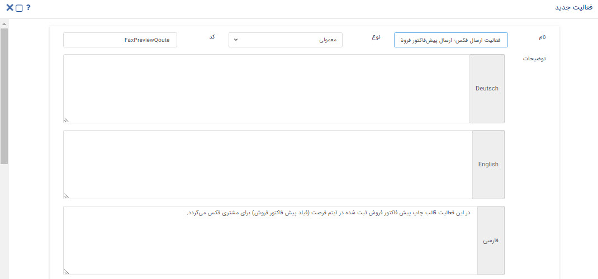
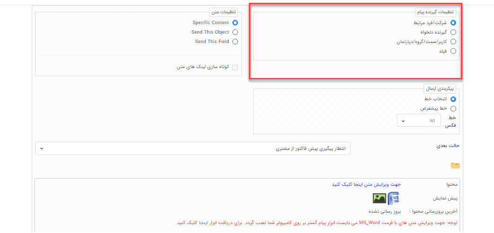
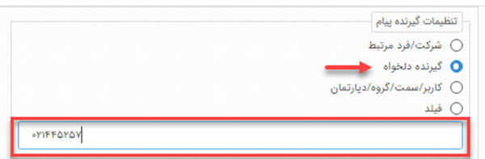
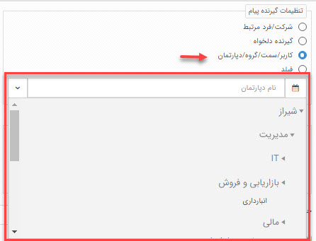
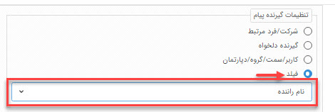
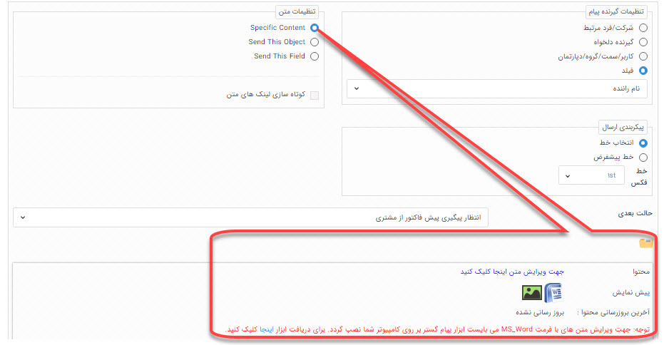
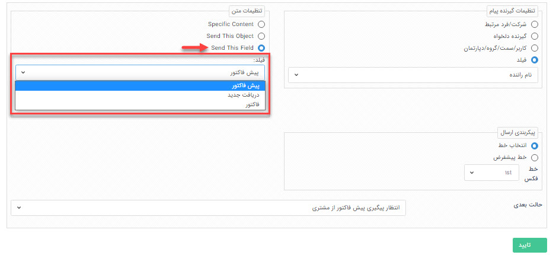
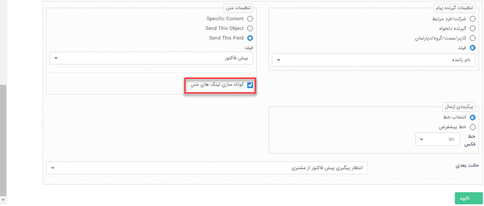
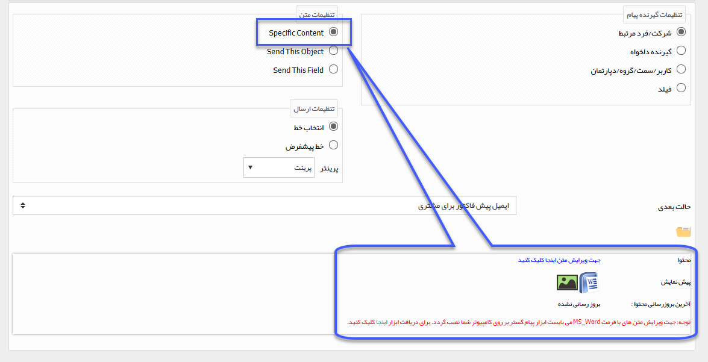

# فعالیت چاپ (Print)
موضوعاتی که در این مقاله مطالعه خواهید کرد:
- [فعالیت چاپ چیست و چه وقت از آن استفاده می‌شود؟](#PrintActivityPurpose)
- [تنظیمات فعالیت چاپ در فرآیند چگونه است؟](#PrintActivitySettings)

## فعالیت چاپ چیست و چه وقت از آن استفاده می‌شود؟{#PrintActivityPurpose}
به کمک این فعالیت می‌توانید به صورت **خودکار** در طی یک فرآیند، یک متنی را به پرینتر تنظیم شده در سیستم ارسال کرده و چاپ نمایید. 
در فعالیت چاپ می‌توانید به روش‌های مختلفی محتوای چاپ خود را انتخاب و ارسال نمایید:
- یک متن مشخص؛
- پیش‌نمایش آیتمی که فرآیند روی آن درحال اجرا است؛
- پیش‌نمایش "آیتم ثبت شده در فیلد اضافه CRM" روی آیتم تحت چرخه.

## تنظیمات فعالیت چاپ در فرآیند چگونه است؟{#PrintActivitySettings}
تنظیمات فعالیت چاپ، در چندین بخش شامل **تنظیمات نام و توضیحات فعالیت**، **تنظیمات گیرنده/گیرندگان چاپ**،  **تنظیمات متن پیام** و **تنظیمات خط** است. 

> **نکته** 
> دقت داشته باشید که هر تنظیماتی برای فعالیت چاپ انجام دهید، چرخه‌ی کاری هر بار که به این مرحله برسد، طبق همان تنظیمات عمل می‌کند.

### تنظیمات نام و توضیحات فعالیت چاپ
**نام:** در کادر نام باید نامی برای فعالیت انتخاب کنید که گویای عملی باشد که در طی فرآیند انجام می‌دهد. دقت داشته باشید انتخاب نام مناسب برای فعالیت، عملیات ویرایش و نگهداری فرآیند را برای شما و راهبر سیستم در آینده آسان‌تر می‌کند. 
**نوع:** در این قسمت نقطه شروع فرآیند را مشخص می‌کنید:
- **اولیه:** از هر مرحله، فعالیت یا کارتابلی که فرآیند شما شروع می‌شود، باید این فیلد روی **اولیه** تنظیم شود. 
- **معمولی:** غیر از مرحله‌ای که فرآیند با آن شروع شده و نوع آن را روی اولیه تنظیم کرده‌اید، سایر اجزا فرآیند روی حالت معمولی قرار می‌گیرند.

> **نکته** 
> دقت داشته باشید که یک فرآیند **تنها یک حالت اولیه** و **یک حالت نهایی** باید داشته باشد. در غیر این صورت فرآیند شما موقع اجرا به خطا برمی‌خورد.

**کد:** به کمک کدی که در این قسمت تعیین می‌کنید، می‌توانید از طریق وب سرویس عملکرد فعالیت چاپ را با نرم‌افزار دیگری ارتباط دهید.

**توضیحات:** به تعداد زبان‌هایی که در تنظیمات زبان سیستم تعریف کرده باشید می‌توانید برای فعالیت چاپ، توضیحاتی ثبت نمایید که راهنمایی برای راهبری چرخه‌کاری باشد.

### تنظیمات گیرنده/گیرندگان در فعالیت چاپ
برای تعیین کردن گیرنده چاپ در طی فرآیند به روش‌های مختلفی می‌توانید عمل کنید. 
- **شرکت/فرد مرتبط** 
   با انتخاب این گزینه چاپ برای شماره **هویت مرتبط با آیتم تحت چرخه** ارسال می‌شود. بنابراین هر بار که چرخه‌کاری به این مرحله برسد، اگر تنظیمات روی این گزینه باشد، گیرنده چاپ هویت مرتبط با آیتم تحت چرخه است. 
    دقت داشته باشید که **شماره چاپ پیش‌فرض** تعیین شده در اطلاعات هویت، برای چاپ در نظر گرفته می‌شود.

- **گیرنده دلخواه** 
   با این گزینه می‌توانید یک شماره چاپ را در کادر نمایش داده شده ثبت کنید که هر بار فرآیند به این مرحله رسید، چاپ را به آن شماره ارسال کند.  
   لازم به ذکر است که این شماره همیشه **ثابت** است و تنها **راهبر** یا **کاربر دارای مجوز شخصی‌سازی موجودیت‌ها**، می‌تواند شماره را در تنظیمات فعالیت چاپ تغییر دهد.

- **کاربر/سمت/گروه/دپارتمان** 
   با انتخاب این گزینه، می‌توانید گیرنده/گیرندگان فعالیت چاپ را از بین کاربران سیستم خود (پرسنل سازمانتان) در حالت‌های کاربر، سمت، گروه کاربری و دپارتمان انتخاب کنید. 
   ***به عنوان مثال*** 
   فرض کنید سازمانی دارای چندین شعبه باشد و فرآیند ارزیابی سالانه‌ برای عملکرد شعب اجرا شده باشد.  می‌توان با ایجاد یک گروه کاربری از مدیران شعب مختلف، تنظیمات گیرنده چاپ را روی این گزینه قرار داد و گروه کاربری مدیران شعب انتخاب شود. در این حالت بخشنامه ارزیابی سالیانه در این مرحله از فرآیند به گروه مدیران به صورت خودکار چاپ می‌شود. 

- **فیلد** 
   با انتخاب این گزینه گیرنده چاپ، از فیلد اضافه تعیین شده روی آیتم می‌خواند. فیلد اضافه تنها می‌تواند از نوع **کاربر** و **شرکت/شخص** باشد. در این حالت در طی فرآیند هویتی که در این فیلد تعیین شده باشد، گیرنده چاپ خواهد بود. 

### تنظیمات متن پیام در فعالیت چاپ
به روش‌های مختلفی می‌توانید متن ارسالی خود به پرینتر را تنظیم نمایید.
- **ارسال متن مشخص (Spesific Content)** 
   در صورتی که بخواهید یک متن ثابت در طی فرآیند توسط این فعالیت چاپ شود، باید این گزینه را انتخاب نمایید.  
   در این قسمت تنظیمات متن پیام انجام می‌شود که به روش‌های بارگذاری فایل ورد، انتخاب قالب پیام آماده و نگارش در Web client tool می‌توانید اقدام نمایید.

- **ارسال این آیتم (Send this object)** 
   با انتخاب این گزینه، پیش‌نمایش (قالب چاپ تنظیم شده) همین آیتم، یعنی آیتمی که روی آن چرخه‌کاری پیاده‌سازی شده است، برای چاپ انتخاب می‌شود. (در فعالیت‌های ارسال پیام‌کوتاه و ارسال پیام شبکه اجتماعی این گزینه وجود ندارد)
- **ارسال این فیلد (Send This Field)** 
   با انتخاب این گزینه می‌توانید **قالب چاپ** یکی از **فیلدهای اضافه‌ی CRM** پیوست شده به این آیتم (فیلدهایی مانند فرم، فاکتور، حواله انبار و ...) را برای چاپ در نظر بگیرید. (در فعالیت های ارسال پیام کوتاه و ارسال پیام شبکه اجتماعی قابل انتخاب نیست)
   

#### قابلیت کوتاه‌سازی لینک در متن پیام {#ShortingPrint}
به کمک چک باکس **کوتاه‌سازی لینک‌های متن** می‌توانید لینک‌هایی که در متن پیام خود ارسال می‌کنید را کوتاه کرده و لینک کوتاه شده را در متن خود چاپ نمایید. 
این قابلیت برای "فعالیت‌های ارسال پیام کوتاه"، ا"رسال چاپ" و "چاپ" قابل استفاده است.

### تنظیمات خط در فعالیت چاپ
در این قسمت پرینتری که با آن باید چاپ در طی فرآیند انجام شود را تعیین کنید. نحوه تنظیم آن به دو روش انتخابی و پیش‌فرض است که در ادامه شرح داده می‌شود:
- **انتخاب خط:**  در صورت انتخاب این گزینه، می‌توانید از لیست خطوط چاپ تعریف شده در نرم‌افزار خط ارسال کننده پیام خود را انتخاب نمایید.
- **خط پیش‌فرض:** در صورت انتخاب خط پیشفرض، خط انتخاب شده به عنوان پیش‌فرض در قسمت[ تنظیمات کلی > خطوط پیش‌فرض > چاپ ](https://github.com/1stco/PayamGostarDocs/blob/master/Help/Settings/General-settings/Default-lines/Default-lines.md)ارسال کننده پیام خواهد بود،.
   
### تعیین مرحله بعدی فرآیند
پس از تکمیل تنظیمات فعالیت، باید **حالت بعدی** فرآیند را در این مرحله تعیین نمایید. دقت داشته باشید این قسمت در تمامی فعالیت‌های چرخه‌کاری وجود دارد و به کمک آن اتصال بین فعالیت‌ها و کارتابل برقرار می‌شود.

لطفا ابتدا قسمت[   ارسال پیامک-ایمیل-چاپ-چاپ ](https://github.com/1stco/PayamGostarDocs/blob/master/Help/Settings/Personalization-crm/Overview/Process-design/Create-a-work-cycle/Activity/Send%20SMS%2C%20email/Send%20SMS%2C%20email.md)را مطالعه کنید.

با انتخاب این فعالیت، یک چاپ به صورت خودکار به چاپگر تعریف شده در نرم افزار ارسال می شود و سپس گردش کار به مرحله بعد می رود.

> نکته مهم: در صورت انتخاب قالب چاپ این آیتم (Send This Object) و یا قالب چاپ یک فیلد وابسته (Send This Field) به عنوان محتوا، قالب چاپی آیتم انتخاب شده به دستگاه چاپگر ارسال می شود.

به طور مثال فرض کنید، می خواهید در فرآیند فرصت پس از صدور پیش فاکتور فروش توسط کارشناس و تایید آن، پیش نمایش پیش فاکتور توسط دستگاه چاپگر مسئول بایگانی پرینت شود تا آن را در پرونده مشتری بایگانی کند.کافی است در قسمت تنظیمات متن، گزینه Send this  Field را انتخاب کرده و پس از آن فیلد پیش فاکتور را انتخاب کنید.

> نکته: در صورتی که گزینه SpecificContent را انتخاب کنید، باید متن ارسالی را از طریق ابزار WebClientTool تنظیم کنید. برای اطلاع در خصوص تنظیم محتوای یک چاپ به قسمت تنظیم متن مراجعه کنید.

