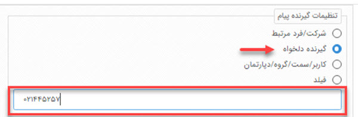
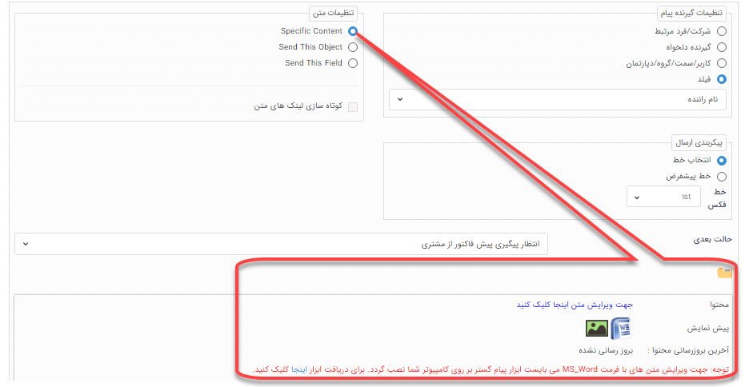
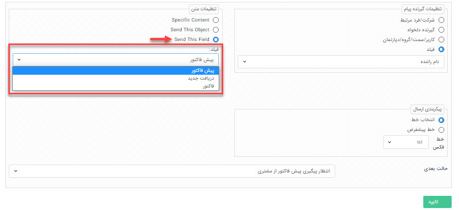

# فعالیت ارسال فکس 
موضوعاتی که در این مقاله مطالعه خواهید کرد:
- [فعالیت ارسال فکس چیست و چه وقت از آن استفاده می‌شود؟](#SendFaxActivityPurpose)
- [تنظیمات فعالیت ارسال فکس در فرآیند چگونه است؟](#SendFaxActivitySettings)

## فعالیت ارسال فکس چیست و چه وقت از آن استفاده می‌شود؟{#SendFaxActivityPurpose}
به کمک این فعالیت می‌توانید به صورت **خودکار** در طی یک فرآیند، یک متنی را برای مخاطب خود **فکس** نمایید. 
در فعالیت ارسال فکس می‌توانید به روش‌های مختلفی محتوای فکس خود را انتخاب و ارسال نمایید:
- یک متن مشخص؛
- پیش‌نمایش آیتمی که فرآیند روی آن درحال اجرا است؛
- پیش‌نمایش "آیتم ثبت شده در فیلد اضافه CRM" روی آیتم تحت چرخه.

***به عنوان مثال*** 
فرض کنید می‌خواهید در طی فرآیند فروش، پیش‌فاکتور فروش به صورت خودکار برای مشتریتان فکس شود. اگر در فرآیند فرصت فروش خود از فعالیت ارسال فکس استفاده کرده باشید، کافی‌ست تنظیمات فعالیت فکس را روی ارسال قالب چاپ فیلد پیش‌فاکتور (Send This Field) قرار دهید. 
در این حالت **پیش‌نمایش پیش‌فاکتور** فروشتان برای مشتری فکس خواهد شد.

## تنظیمات فعالیت ارسال فکس در فرآیند چگونه است؟{#SendFaxActivitySettings}
تنظیمات فعالیت ارسال فکس، در چندین بخش شامل **تنظیمات نام و توضیحات فعالیت**، **تنظیمات گیرنده/گیرندگان فکس**،  **تنظیمات متن پیام** و **تنظیمات خط** است. 

> **نکته** 
> دقت داشته باشید که هر تنظیماتی برای فعالیت ارسال فکس انجام دهید، چرخه‌ی کاری هر بار که به این مرحله برسد، طبق همان تنظیمات عمل می‌کند.

### تنظیمات نام و توضیحات فعالیت ارسال فکس
**نام:** در کادر نام باید نامی برای فعالیت انتخاب کنید که گویای عملی باشد که در طی فرآیند انجام می‌دهد. دقت داشته باشید انتخاب نام مناسب برای فعالیت، عملیات ویرایش و نگهداری فرآیند را برای شما و راهبر سیستم در آینده آسان‌تر می‌کند. 
**نوع:** در این قسمت نقطه شروع فرآیند را مشخص می‌کنید:
- **اولیه:** از هر مرحله، فعالیت یا کارتابلی که فرآیند شما شروع می‌شود، باید این فیلد روی **اولیه** تنظیم شود. 
- **معمولی:** غیر از مرحله‌ای که فرآیند با آن شروع شده و نوع آن را روی اولیه تنظیم کرده‌اید، سایر اجزا فرآیند روی حالت معمولی قرار می‌گیرند.

> **نکته** 
> دقت داشته باشید که یک فرآیند **تنها یک حالت اولیه** و **یک حالت نهایی** باید داشته باشد. در غیر این صورت فرآیند شما موقع اجرا به خطا برمی‌خورد.

**کد:** به کمک کدی که در این قسمت تعیین می‌کنید، می‌توانید از طریق وب سرویس عملکرد فعالیت فکس را با نرم‌افزار دیگری ارتباط دهید.

**توضیحات:** به تعداد زبان‌هایی که در تنظیمات زبان سیستم تعریف کرده باشید می‌توانید برای فعالیت فکس، توضیحاتی ثبت نمایید که راهنمایی برای راهبری چرخه‌کاری باشد.

### تنظیمات گیرنده/گیرندگان در فعالیت ارسال فکس
برای تعیین کردن گیرنده فکس در طی فرآیند به روش‌های مختلفی می‌توانید عمل کنید. 
- **شرکت/فرد مرتبط** 
   با انتخاب این گزینه فکس برای شماره **هویت مرتبط با آیتم تحت چرخه** ارسال می‌شود. بنابراین هر بار که چرخه‌کاری به این مرحله برسد، اگر تنظیمات روی این گزینه باشد، گیرنده فکس هویت مرتبط با آیتم تحت چرخه است. 
    دقت داشته باشید که **شماره فکس پیش‌فرض** تعیین شده در اطلاعات هویت، برای ارسال فکس در نظر گرفته می‌شود.

   

- **گیرنده دلخواه** 
   با این گزینه می‌توانید یک شماره فکس را در کادر نمایش داده شده ثبت کنید که هر بار فرآیند به این مرحله رسید، فکس را به آن شماره ارسال کند.  
   لازم به ذکر است که این شماره همیشه **ثابت** است و تنها **راهبر** یا **کاربر دارای مجوز شخصی‌سازی موجودیت‌ها**، می‌تواند شماره را در تنظیمات فعالیت ارسال فکس تغییر دهد.

   

- **کاربر/سمت/گروه/دپارتمان** 
   با انتخاب این گزینه، می‌توانید گیرنده/گیرندگان فعالیت فکس را از بین کاربران سیستم خود (پرسنل سازمانتان) در حالت‌های کاربر، سمت، گروه کاربری و دپارتمان انتخاب کنید. 
   ***به عنوان مثال*** 
   فرض کنید سازمانی دارای چندین شعبه باشد و فرآیند ارزیابی سالانه‌ برای عملکرد شعب اجرا شده باشد.  می‌توان با ایجاد یک گروه کاربری از مدیران شعب مختلف، تنظیمات گیرنده فکس را روی این گزینه قرار داد و گروه کاربری مدیران شعب انتخاب شود. در این حالت بخشنامه ارزیابی سالیانه در این مرحله از فرآیند به گروه مدیران به صورت خودکار فکس می‌شود. 

   

- **فیلد**
   با انتخاب این گزینه گیرنده فکس، از فیلد اضافه تعیین شده روی آیتم می‌خواند. فیلد اضافه تنها می‌تواند از نوع **کاربر** و **شرکت/شخص** باشد. در این حالت در طی فرآیند هویتی که در این فیلد تعیین شده باشد، گیرنده فکس خواهد بود. 

   

### تنظیمات متن پیام در فعالیت ارسال فکس
به روش‌های مختلفی می‌توانید متن پیام ارسالی خود را تنظیم نمایید.
- **ارسال متن مشخص (Spesific Content)** 
   در صورتی که بخواهید یک متن ثابت در طی فرآیند توسط این فعالیت برای مخاطب خود ارسال کنید، باید این گزینه را انتخاب نمایید.  
   در این قسمت تنظیمات متن پیام انجام می‌شود که به روش‌های بارگذاری فایل ورد، انتخاب قالب پیام آماده و نگارش در Web client tool می‌توانید اقدام نمایید.

   

- **ارسال این آیتم (Send this object)** 
   با انتخاب این گزینه، پیش‌نمایش (قالب چاپ تنظیم شده) همین آیتم، یعنی آیتمی که بر روی آن چرخه‌کاری پیاده‌سازی شده است، برای ارسال انتخاب می‌شود. (در فعالیت‌های ارسال پیام کوتاه و ارسال پیام شبکه اجتماعی این گزینه وجود ندارد)

- **ارسال این فیلد (Send This Field)** 
   با انتخاب این گزینه می‌توانید **قالب چاپ** یکی از **فیلدهای اضافه‌ی CRM** پیوست شده به این آیتم (فیلدهایی مانند فرم، فاکتور، حواله انبار و ...) را برای ارسال در نظر بگیرید. (در فعالیت های ارسال پیام کوتاه و ارسال پیام شبکه اجتماعی قابل انتخاب نیست)
   
   

#### قابلیت کوتاه‌سازی لینک در متن پیام
به کمک چک باکس **کوتاه‌سازی لینک‌های متن** می‌توانید لینک‌هایی که در متن پیام خود ارسال می‌کنید را کوتاه کرده و لینک کوتاه شده را در پیام برای مخاطب ارسال نمایید. 

### تنظیمات خط در فعالیت ارسال فکس
در این قسمت خطی که با آن باید ارسال فکس در طی فرآیند انجام شود را تعیین کنید. نحوه تنظیم آن به دو روش انتخابی و پیش‌فرض است که در ادامه شرح داده می‌شود:
- **انتخاب خط** 
   در صورت انتخاب این گزینه، می‌توانید از لیست خطوط فکس تعریف شده در نرم‌افزار خط ارسال کننده پیام خود را انتخاب نمایید.
- **خط پیش‌فرض** 
   در صورت انتخاب خط پیشفرض، خط انتخاب شده به عنوان پیش‌فرض در قسمت[ تنظیمات کلی > خطوط پیش‌فرض > فکس ](https://github.com/1stco/PayamGostarDocs/blob/master/Help/Settings/General-settings/Default-lines/Default-lines.md)ارسال کننده پیام خواهد بود،.

### تعیین مرحله بعدی فرآیند
پس از تکمیل تنظیمات فعالیت، باید **حالت بعدی** فرآیند را در این مرحله تعیین نمایید. دقت داشته باشید این قسمت در تمامی فعالیت‌های چرخه‌کاری وجود دارد و به کمک آن اتصال بین فعالیت‌ها و کارتابل برقرار می‌شود.