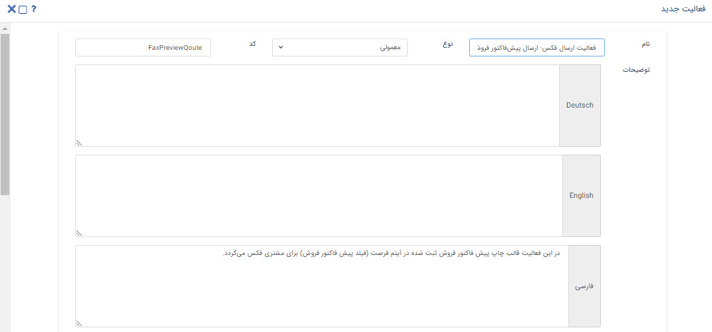
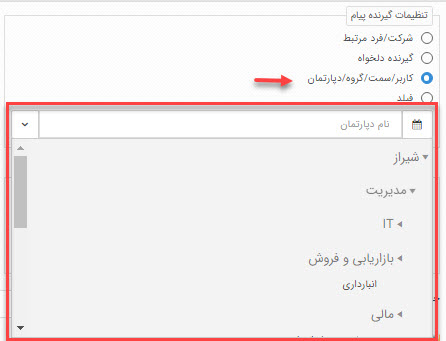

#  فعالیت ارسال پیام کوتاه 

موضوعاتی که در این مقاله مطالعه خواهید کرد:
- [فعالیت ارسال پیام‌کوتاه و کاربرد آن](#SendSMSActivityPurpose)
- [تنظیمات فعالیت ارسال پیام‌کوتاه در فرآیند](#SendSMSActivitySettings)

## فعالیت ارسال پیام‌کوتاه چیست و چه کاربردی دارد؟{#SendSMSActivityPurpose}
به کمک این فعالیت می‌توانید به صورت **خودکار** در طی یک فرآیند، یک متنی را برای مخاطب خود از طریق **پیام‌کوتاه** ارسال نمایید. 
شما می‌توانید به کمک این قابلیت در چرخه‌های کاری خود به یکی از روش‌های زیر به افراد پیامک ارسال نمایید: 
- شماره موبایل هویتی که آیتم در چرخه، در سوابق آن ذخیره شده باشد.
- شماره موبایل یک گیرنده دلخواه که در سیستم CRM شما ذخیره نشده است.
- ارسال ییامک به شماره موبایل پرسنل (کاربران سیستم) سازمان خودتان از طریق یکی از روش‌های کاربر/سمت/گروه/دپارتمان
- ارسال پیامک به شماره موبایل هویت انتخاب شده در طی فرآیند از طریق فیلدهای اضافه **کاربر** و **شرکت/شخص**

## تنظیمات فعالیت ارسال پیام‌کوتاه در فرآیند{#SendFaxActivitySettings}
تنظیمات فعالیت ارسال پیام‌کوتاه، در چندین بخش شامل **تنظیمات نام و توضیحات فعالیت**، **تنظیمات گیرنده/گیرندگان پیام‌کوتاه**،  **تنظیمات متن پیام** و **تنظیمات خط** است. 

> **نکته** 
> دقت داشته باشید که هر تنظیماتی برای فعالیت ارسال پیام‌کوتاه انجام دهید، چرخه‌ی کاری هر بار که به این مرحله برسد، طبق همان تنظیمات عمل می‌کند.

### تنظیمات نام و توضیحات فعالیت ارسال پیام‌کوتاه
**نام:** در کادر نام باید نامی برای فعالیت انتخاب کنید که گویای عملی باشد که در طی فرآیند انجام می‌دهد. دقت داشته باشید انتخاب نام مناسب برای فعالیت، عملیات ویرایش و نگهداری فرآیند را برای شما و راهبر سیستم در آینده آسان‌تر می‌کند. 
**نوع:** در این قسمت نقطه شروع فرآیند را مشخص می‌کنید:
- **اولیه:** از هر مرحله، فعالیت یا کارتابلی که فرآیند شما شروع می‌شود، باید این فیلد روی **اولیه** تنظیم شود. 
- **معمولی:** غیر از مرحله‌ای که فرآیند با آن شروع شده و نوع آن را روی اولیه تنظیم کرده‌اید، سایر اجزا فرآیند روی حالت معمولی قرار می‌گیرند.

> **نکته** 
> دقت داشته باشید که یک فرآیند **تنها یک حالت اولیه** و **یک حالت نهایی** باید داشته باشد. در غیر این صورت فرآیند شما موقع اجرا به خطا برمی‌خورد.

**کد:** به کمک کدی که در این قسمت تعیین می‌کنید، می‌توانید از طریق وب سرویس عملکرد فعالیت پیام‌کوتاه را با نرم‌افزار دیگری ارتباط دهید.

**توضیحات:** به تعداد زبان‌هایی که در تنظیمات زبان سیستم تعریف کرده باشید می‌توانید برای فعالیت پیام‌کوتاه، توضیحاتی ثبت نمایید که راهنمایی برای راهبری چرخه‌کاری باشد.

### تنظیمات گیرنده/گیرندگان در فعالیت ارسال پیام‌کوتاه
برای تعیین کردن گیرنده پیام‌کوتاه در طی فرآیند به روش‌های مختلفی می‌توانید عمل کنید. 
- **شرکت/فرد مرتبط** 
   با انتخاب این گزینه پیام‌کوتاه برای شماره **هویت مرتبط با آیتم تحت چرخه** ارسال می‌شود. بنابراین هر بار که چرخه‌کاری به این مرحله برسد، اگر تنظیمات روی این گزینه باشد، گیرنده پیام‌کوتاه هویت مرتبط با آیتم تحت چرخه است. 
    دقت داشته باشید که **شماره پیام‌کوتاه پیش‌فرض** تعیین شده در اطلاعات هویت، برای ارسال پیام‌کوتاه در نظر گرفته می‌شود.

- **گیرنده دلخواه** 
   با این گزینه می‌توانید یک شماره پیام‌کوتاه را در کادر نمایش داده شده ثبت کنید که هر بار فرآیند به این مرحله رسید، پیام‌کوتاه را به آن شماره ارسال کند.  
   لازم به ذکر است که این شماره همیشه **ثابت** است و تنها **راهبر** یا **کاربر دارای مجوز شخصی‌سازی موجودیت‌ها**، می‌تواند شماره را در تنظیمات فعالیت ارسال پیام‌کوتاه تغییر دهد.

- **کاربر/سمت/گروه/دپارتمان** 
   با انتخاب این گزینه، می‌توانید گیرنده/گیرندگان فعالیت پیام‌کوتاه را از بین کاربران سیستم خود (پرسنل سازمانتان) در حالت‌های کاربر، سمت، گروه کاربری و دپارتمان انتخاب کنید. 
   ***به عنوان مثال*** 
   فرض کنید سازمانی دارای چندین شعبه باشد و فرآیند ارزیابی سالانه‌ برای عملکرد شعب اجرا شده باشد.  می‌توان با ایجاد یک گروه کاربری از مدیران شعب مختلف، تنظیمات گیرنده پیام‌کوتاه را روی این گزینه قرار داد و گروه کاربری مدیران شعب انتخاب شود. در این حالت بخشنامه ارزیابی سالیانه در این مرحله از فرآیند به گروه مدیران به صورت خودکار پیام‌کوتاه می‌شود. 

- **فیلد** 
   با انتخاب این گزینه گیرنده پیام‌کوتاه، از فیلد اضافه تعیین شده روی آیتم می‌خواند. فیلد اضافه تنها می‌تواند از نوع **کاربر** و **شرکت/شخص** باشد. در این حالت در طی فرآیند هویتی که در این فیلد تعیین شده باشد، گیرنده پیام‌کوتاه خواهد بود. 

### تنظیمات متن پیام در فعالیت ارسال پیام‌کوتاه
در فعالیت ارسال پیام‌کوتاه می‌توانید یک متن در تنظیمات به کمک پارامترهای هوشمند تنظیم کرد یا از متن  قالب‌های از پیش تنظیم شده استفاده نمایید. 
**ارسال متن مشخص (Spesific Content)** 
در صورتی که بخواهید یک متن ثابت در طی فرآیند توسط این فعالیت برای مخاطب خود ارسال کنید، باید این گزینه را انتخاب نمایید.  
***به عنوان مثال***
فرض کنید می خواهید در فرآیند فرصت فروش، پس از ارسال کالا برای مشتری، اطلاعات ارسال برای او پیامک شود.

> **نکته** 
> در فعالیت ارسال پیام‌کوتاه تنها امکان ارسال **متن** وجود دارد، فایل و ارسال قالب چاپ از طریق این فعالیت امکان پذیر نیست.

#### قابلیت کوتاه‌سازی لینک در متن پیام{#ShortlinkSMS}
به کمک چک باکس **کوتاه‌سازی لینک‌های متن** می‌توانید لینک‌هایی که در متن پیام خود ارسال می‌کنید را کوتاه کرده و لینک کوتاه شده را در پیام برای مخاطب ارسال نمایید. 
این قابلیت برای "فعالیت‌های ارسال پیام کوتاه"، ا"رسال پیام‌کوتاه" و "چاپ" قابل استفاده است. 
***به عنوان مثال***
فرض کنید می‌خواهید در پایان فرآیند فروش خود، لینک فرم نظرسنجی را برای مشتری خود ارسال کنید. برای اینکه تعداد کاراکتر متن پیام شما کوتاه شود، می‌توانید لینک فرم نظرسنجی خود را در متن پیام درج کرده و چک باکس **کوتاه‌سازی لینک‌های متن** را فعال نمایید.

### تنظیمات خط در فعالیت ارسال پیام‌کوتاه
در این قسمت خطی که با آن باید ارسال پیام‌کوتاه در طی فرآیند انجام شود را تعیین کنید. نحوه تنظیم آن به دو روش انتخابی و پیش‌فرض است که در ادامه شرح داده می‌شود:
- **انتخاب خط:**  در صورت انتخاب این گزینه، می‌توانید از لیست خطوط پیام‌کوتاه تعریف شده در نرم‌افزار خط ارسال کننده پیام خود را انتخاب نمایید.
- **خط پیش‌فرض:** در صورت انتخاب خط پیشفرض، خط انتخاب شده به عنوان پیش‌فرض در قسمت[ تنظیمات کلی > خطوط پیش‌فرض > پیام‌کوتاه ](https://github.com/1stco/PayamGostarDocs/blob/master/Help/Settings/General-settings/Default-lines/Default-lines.md)ارسال کننده پیام خواهد بود،.
   
### تعیین مرحله بعدی فرآیند
پس از تکمیل تنظیمات فعالیت، باید **حالت بعدی** فرآیند را در این مرحله تعیین نمایید. دقت داشته باشید این قسمت در تمامی فعالیت‌های چرخه‌کاری وجود دارد و به کمک آن اتصال بین فعالیت‌ها و کارتابل برقرار می‌شود.
