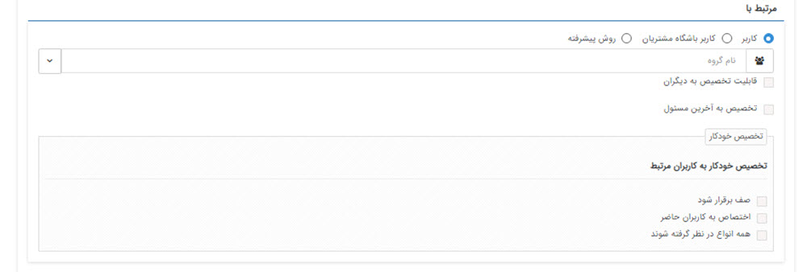
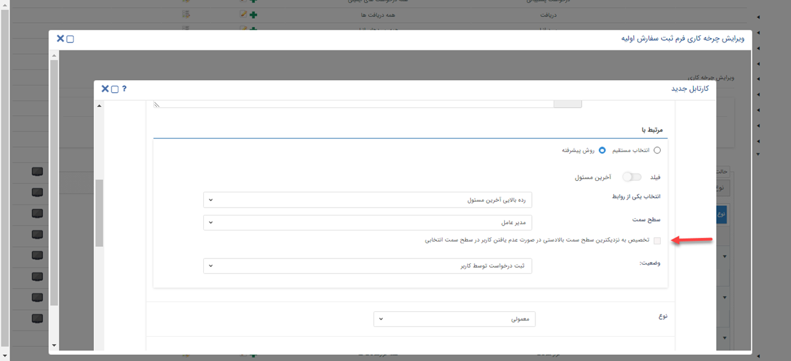
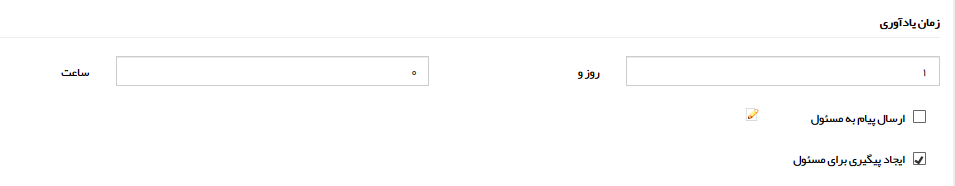
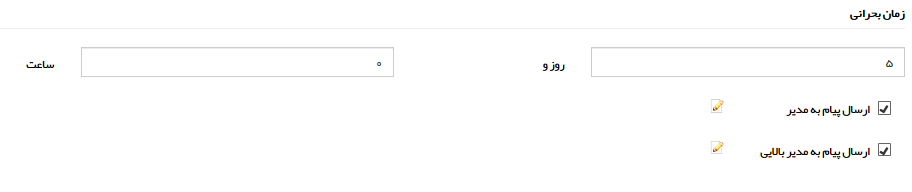

# تنظیمات کارتابل در فرآیند

### A. انتخاب نام کارتابل
 نام کارتابل (مرحله گردش کار) مورد نظر را تعیین کنید. در واقع نام کارتابل، کاری است که باید در آن مرحله از گردش کار توسط کاربر انجام شود، بنابراین این نام را طوری برگزینید که کاربر هنگام مشاهده آن در کارتابل فرآیندها، مسئولیت خود در این مرحله را بداند.

### B. انتخاب مسئول کارتابل (مرتبط با)
در این قسمت باید شخص و یا گروهی که مسئول رسیدگی به این کارتابل هستند را بر اساس یکی از سه روش کاربر / گروه / سمت / دپارتمان مشخص، آخرین مسئول یا فیلد تعیین کنید.

#### 1. انتخاب مستقیم 
در این روش به صورت مستقیم فرآیند را به کارتابل یک یا چند کاربر از پرسنل خود ارجاع می‌دهید.
- **کاربر /گروه /سمت / دپارتمان مشخص:** 
   با کلیک روی آیکن کاربر، می‌توانید مسئول کارتابل را روی یکی از حالت‌های کاربر، گروهی از کاربران، سمت و دپارتمان انتخاب نمایید. 
   درصورتی که یکی از حالت‌های گروه کاربری، سمت و دپارتمان را انتخاب کنید، تنظیمات زیر نمایش داده می‌شود. گزینه‌های زیر این امکان را در اختیار شما می‌گذارد که در طی فرآیند مدیریت کارتابل بین افراد گروه به خوبی انجام شود.

   **قابلیت تخصیص به دیگران:** در صورت فعال بودن این گزینه، کاربر مسئول کارتابل می‌تواند کار را در همین مرحله به سایر کاربران عضو در گروه مسئول کارتابل تخصیص دهد. 

   **تخصیص به آخرین مسئول:** در صورتی که این آیتم در گردش کار، دوباره به این کارتابل بازگردد، مسئولیت آن به آخرین کاربری که به عنوان مسئول این آیتم بوده است، تخصیص داده خواهد شد. 
   **مثال:** فرض کنید بخشی از گردش کار فروش به صورت شکل زیر باشد، مسئول کارتابل اول گروه فروشمی‌باشد، بنابراینهریک از کارشناسان فروشمی‌توانند مسئول این کارتابل باشند، در صورتی که یکی از کارشناسان پیش فاکتور را صادر کند و آن را به مرحله بعد ارجاع دهد و مدیر فروش آیتم را جهت اصلاح پیش فاکتور به این کارتابل برگرداند، کار باید به آخرین مسئول این کارتابل (کارشناس صادرکننده پیش فاکتور) ارجاع داده شود و نباید در کل گروه فروش پخش شود، به همین دلیل در این کارتابل از قابلیت تخصیص به آخرین مسئول استفادهمی‌کنیم

   **تخصیص خودکار:** به صورت پیشفرض در صورتی که مسئول کارتابل یک گروه یا سمتی که به بیش از یک کاربر تخصیص داده شده است باشد، با وارد شدن گردش کار به ایgن مرحله، آیتم در کارتابل تمامی کاربران آن گروه یا دارنده آن سمت مشاهده خواهد شد و یکی از کاربران باید کار را به خود اختصاص دهد و پس از آن، آیتم از کارتابل سایر کاربران خارج خواهد شد، با استفاده از قابلیت تخصیص خودکارمی‌توانید تنظیماتی اعمال کنید که کار به صورت خودکار توسط سیستم به یکی از کاربران عضو در گروه (یا دارنده سمت) اختصاص پیدا کند. برای تخصیص خودکار سه معیار وجود دارد که شرح زیرمی‌باشند: 
   

   1. **برقراری صف بین کاربران:**  با فعال کردن این گزینه نرم‌افزار به صورت خودکار کاربری که کم‌ترین کار را در کارتابل فرآیندها دارد به عنوان مسئول کارتابل تعیین خواهد کرد. با فعال کردن این گزینه می‌توانید در قسمت‌های بعد مشخص کنید که شمارش کارهای موجود در کارتابل بر اساس تعداد کارهای موجود در بین تمام فرآیندها یا صرفاً همین کارتابل انجام شود.
   2. **اختصاص به کاربران حاضر:** اگر این گزینه فعال باشد، نرم‌افزار در اختصاص خودکار تنها کاربرانی را در نظر می‌گیرد که در روز جاری با نام کاربری خود وارد نرم‌افزار شده باشند.
   3. **اختصاص به کاربر آزاد بر اساس تعداد آیتم‌ها در کارتابل فرآیند:** اگر گزینه‌ی «برقراری صف بین کاربران» را فعال کرده‌اید، با فعال کردن این گزینه، آیتم‌های موجود در کارتابل فرآیند (فارغ از موجودیت تحت چرخه) شمارش می‌شود. در واقع کار به کاربری واگذار می‌شود که کم‌ترین تعداد کار در کارتابل فرآیند او باشد.
   4. **اختصاص به کاربر آزاد بر اساس تعداد آیتم‌ها در کارتابل جاری:** اگر گزینه‌ی «برقراری صف بین کاربران» را فعال کرده‌اید، با فعال کردن این گزینه، تنها کارهای موجود در این کارتابل در این فرآیند شمارش می‌شود. در واقع کار به کاربری واگذار می‌شود که کم‌ترین تعداد کار را در این کارتابل مسئول است.
   
> **نکته:** 
> توجه داشته باشید برای تخصیص خودکار می‌توانید بیش از یک گزینه را نیز در نظر بگیرید (به طور مثال در صورتی که بخواهید بین کاربران حاضر صف برقرار شود می‌توانید 2 گزینه اول را انتخاب کنید). اما انتخاب گزینه‌های ۳ و ۴ به صورت همزمان وجود ندارد. 

#### 2. انتخاب کاربر باشگاه مشتریان{#CustomerCartableSettingInClub}
در این روش می‌توانید در حین فرآیند، در مواقعی که نیاز است مراحلی از کار توسط مشتری انجام شود، فرآیند را به کارتابل مشتری در بخش **باشگاه مشتریان** > **پیشخوان** ارجاع دهید. 

#### 3. روش پیشرفته
در این روش این امکان را دارید که مسئول کارتابل را بر اساس اطلاعاتی که در طی فرآیند ثبت می‌شوند، مسئول کارتابل را انتخاب نمایید.  
در صورت صرف نظر از استفاده از فیلد می‌توانید کارتابلی را برای انتخاب آخرین مسؤل کارتابل  مشخص کنید که کار به آخرین مسؤل یا مدیر آخرین مسؤل یا رده بالایی آخرین مسؤل تخصیص یابد. 
لازم بذکر است تشخیص مدیر آخرین مسؤل و رده بالایی آخرین مسؤل بر اساس سمت می‌باشد.

#### تعیین مسئول کارتابل از طریق آخرین مسئول کارتابل

**انتخاب یکی از روابط:** می‌توان از بین آخرین مسؤل، مدیر آخرین مسؤل و رده بالایی آخرین مسؤل مشخص کرد کار وارد کارتابل چه کسی شود.

**وضعیت:** در این قسمت کارتابلی که مسئول آن را به عنوان **آخرین مسئول** در نظر دارید، انتخاب کنید. دقت داشته باشید کارتابل انتخابی شما باید از بین مراحل گذشته انتخاب شود، زیرا باید آیتم در طی فرآیند یک بار از آن مراحل طی شده باشد. 
#### تعیین مسئول کارتابل از طریق فیلد

**انتخاب یکی از روابط:** می‌توان از بین فیلد، مدیر فیلد و رده بالایی فیلد مشخص کرد کار وارد کارتابل چه کسی شود

 **فیلد:** می‌توان از بین فیلدهای اضافه شده به آیتم، فیلدی را انتخاب کنید تا با توجه به روابط مشخص شده در فیلد قبلی، مسئول کارتابل انتخاب شود.  
در مواقعی استفادهمی‌شود که در طول چرخه بخواهید کاربر ، مسئول یکی از کارتابل‌های بعدی را مشخص کند. که با اضافه کردن فیلدی از نوع لیست کاربران/ لیست گروه‌ها برای آیتم مورد نظر و پر کردن آن توسط کاربر، مالک کارتابل مقصد همان فرد/گروه مشخص شدهمی‌شود. کافی است مسئول مرتبط با کارتابل مقصد را فیلد مربوطه بگذارید . یامی‌توان یکی از مسئولین مشخص شده در پروفایل مخاطب (کارشناسان فروش، پشتیبانی و متفرقه) را به عنوان مسئول کارتابل در نظر گرفت.

شایان ذکر است می‌توان مسئول جایگزین را در صورت پر نشدن این فیلدها مشخص نمود.

**مثال:** گردش کار مثال‌های قبل را در نظر بگیرید، فرض کنید در صورت ناموفق شدن فروش، کار به کارتابل مدیر فروش برای رویت ارجاع شود، اگر بخواهیم این امکان را برای مدیر فروش در نظر بگیریم که با توجه به شرایط مشتری و مذاکرات قبلی، کار را به کارشناس فروش دیگری جهت مذاکره مجدد ارجاع دهد(شکل پایین)،می‌توانیم یک فیلد به نام مذاکره کننده 2 در آیتم بسازیم و مسئول کارتابل مذاکره مجدد را روی فیلد مذاکره کننده2 تنظیم کنیم. (مانند شکل بالا)

> **نکته مهم:** در صورتی که مسئول کارتابل را روی فیلد تنظیممی‌کنید،می‌توانید با استفاده از قابلیت الزام فیلدها روی اقدام از خالی بودن فیلد در زمان وارد شدن گردش کار به این مرحله جلوگیری کنید. اما در صورت خالی بودن نیز، کار وارد کارتابل کاربر/گروهی که در قسمت کاربر/گروه مرتبط در صورت خالی بودن فیلد مشخص کرده اید خواهد شد.

**کاربر/گروه مرتبط در صورت خالی بودن فیلد:** در صورتی که فیلد مشخص شده خالی باشد، کاربر یا گروهی که در این قسمت مشخص شده به عنوان مسئول کارتابل  انتخاب می‌شود 

> **نکته** 
> در صورت انتخاب مدیر آخرین مسؤل یا رده بالایی آخرین مسؤل، اگر کارتابل به چند سمت (کاربر) تخصیص داده شود همانند منطق گروه عمل می‌کند و وارد کارتابل همه در آن رده می‌شود که یک کابر باید کار را به خود اختصاص دهد. همچنین در صورت فعال بودن چک باکس اختصاص به صورت صف و کاربران حاضر، عملکرد سیستم همانند منطق گروه خواهد بود. لازم بذکر است بمنظور استفاده از مدیر آخرین مسؤل و رده بالایی آخرین مسؤل لازم است برای کاربرانی که چند حکم سازمانی فعال دارند، در مدیریت حکم‌های سازمانی، حکم پیش‌فرض را مشخص کرد تا اگر آخرین مسؤل دارای چند حکم سازمانی بود با توجه به حکم پیشفرض وی کار وارد کارتابل مدیر آخرین مسؤل یا رده بالایی آخرین مسؤل شود. واضح است در صورت منقضی یا غیر فعال شدن حکم پیش‌فرض، فرآیند با خطا مواجه شده و لازم است حکم پیش‌فرض جدید تعیین شود.

**انتخاب رده بالایی فیلد/ آخرین مسئول**{#TopLevel} 
 هنگامی که مسئول کارتابل را روی **رده‌بالایی آخرین مسئول / رده بالایی فیلد** انتخاب کنید، چک باکسی با عنوان **تخصیص به نزدیکترین سطح سمت بالادستی، در صورت عدم یافتن کاربر در سطح سمت انتخابی** نمایش داده‌ می‌شود. اگر آن را فعال کنید، در حالتی که در سمت انتخاب شده (مثلا کارشناس ارشد) کاربری فعال نباشد، سیستم سمت بالاتر از آن را چک می‌کند. اگر باز هم در آن سمت کاربر فعال نباشد همینطور سطوح بالاتر آخرین مسئول را چک می‌کند تا به سمتی برسد که کاربر فعال داشته باشد.   
 حال اگر در هیچ یک از سمت‌های بالاتر کاربر فعال پیدا نشد، سیستم فرآیند را به کارتابل **مالک آیتم** می‌فرستد. 
 اگر مالک آیتم هم تعیین نشده بود، فرآیند به کارتابل کاربر تعیین شده در [**تنظیمات کلی** > **فرآیند**](https://github.com/1stco/PayamGostarDocs/blob/master/Help/Settings/General-settings/Process/Process.md) ارجاع می‌دهد.
 

**آخرین مسئول:**  در مواقعی استفادهمی‌شود که در وسط چرخهمی‌خواهید مسئول یک کارتابل کسی باشد که مسئول کارتابل دیگری قبل از این کارتابل در چرخه بوده است. با انتخاب این گزینه لیست کارتابل‌های تعریف شده نمایش دادهمی‌شود و باید از بین آنها کارتابل مورد نظر را انتخاب نمایید و آخرین مسئول آن کارتابل، به عنوان مسئول این کارتابل نیز در نظر گرفته میشود.

**مثال:** گردش کار مثال قبل را در نظر بگیرید و تصور کنید که بعد از صدور پیش فاکتور و تایید آن توسط مدیر فروش، پیش فاکتور باید برای مشتری ارسال گردد و تایید آن از مشتری اخذ گردد و بخواهید مسئول ارسال پیش فاکتور، کارشناس صادرکننده آن باشد(مانند شکل پایین). در این صورتمی‌توانید مسئول کارتابل ارسال پیش فاکتور را روی آخرین مسئول کارتابل مذاکره/صدور پیش فاکتور تنظیم نمایید. (مانند شکل بالا)

> **نکته مهم:** توجه داشته باشید در صورتی که مسئول کارتابل را روی آخرین مسئولمی‌گذارید، حتما چرخه کاری باید از کارتابل مربوطه رد شده باشد تا لاگ مسئول کارتابل ثبت شود.

**C. نوع:**

می توانید تعیین کنید که این کارتابل معمولی و یا اولیه است. ( هر فرآیند تنها نیاز به یک حالت اولیه دارد.)

توجه داشته باشید وضعیت اولیه یک فرآیندمی‌تواند یک کارتابل یا یک فعالیت باشد و تعیین وضعیت اولیه به این دلیل است که گردش کار آیتم، پس از ذخیره از این وضعیت شروعمی‌شود و ادامه آن با استفاده از اقدام‌ها و حالت بعدی فعالیت‌ها تعیینمی‌گردد.

**موارد D تا G شامل چند پیام سیستم هستند که در زمان‌های مختلف برای مسئول کارتابل یا هویت مرتبط با آیتم ارسالمی‌شوند. توجه داشته باشید که متن تنظیم شده برای این پیام‌ها برای همه کارتابل‌های تمامی فرآیندهای پیاده سازی شده مشترک هستند. (برای اطلاعات بیشتر[مدیریت پیام‌های سیستم]( https://github.com/1stco/PayamGostarDocs/blob/master/Help/Basic-Information/Manage-system-messages/Manage-system-messages.md) را مطالعه فرمایید.) **

**D. در هنگام ورود به این حالت:**

میتوانید تعیین کنید که زمانی که گردش کار به این کارتابل وارد شد، نرم افزار به صورت خودکار، پیامی (از طریق پیامک، ایمیل، پیام سیستمی) برای کاربر/گروه مسئول کارتابل و یا شرکت/شخص مربوطه ارسال کند. دکمه ویرایش نمایش داده شده در کنار هریک از موارد، میانبر به صفحه ویرایش متن پیام سیستمی مربوطهمی‌باشد.

**E. زمان یادآوری:**

با استفاده از این گزینهمی‌توانید تعیین کنید که پس از گذشتن مدت زمان مشخصی از ورود کار به کارتابل، یک پیام به کاربر مسئول آن ارسال گردد و یا روی آیتم مربوطه یک پیگیری برای او ایجاد گردد.

**F. زمان پایان:**

با استفاده از این گزینهمی‌توانید تعیین کنید که پس از گذشتن مدت زمان مشخصی از ورود کار به کارتابل، یک پیام به کاربر مسئول آن ارسال گردد و یا روی آیتم مربوطه یک پیگیری برای او ایجاد گردد. در واقع با استفاده از این قابلیت، به پایان رسیدن زمان انجام کار را به مسئول آن یادآوری خواهید کرد.

> نکته: در گزارشات فرآیندی، قسمت نمایش کانبان،می‌توانید با استفاده از فیلترهای موجود کارتابل‌هایی که زمان پایان آن‌ها فرا رسیده است را جستجو کنید.

**G  . زمان بحرانی:**

با استفاده از این گزینهمی‌توانید یک پیام و/یا یادآوری برای مدیر کاربر/گروه مرتبط (مدیر دپارتمان) و/یا مدیر بالایی (مدیر شعبه) تعیین کنید. ( برای اطلاعات بیشتر در خصوص نحوه تعیین این مدیران به مدیریت شعب، دپارتمان و سمت مراجعه کنید.)

> **نکته مهم:** زمان ارسال پیام به مدیر بالایی دو برابر زمان ارسال به پیام مدیر است. ( برای مثال در تصویر زیر بعد از 5 روز از ورود این چرخه به این کارتابل پیامی برای مدیر دپارتمان و پس از 10 روز پیامی برای مدیر شعبه ارسالمی‌گردد.)

**H. شرایط انقضای کارتابل:**

با استفاده از این قابلیتمی‌توانید تنظیماتی اعمال کنید که کارتابل بر اساس شرایطی که مشخصمی‌کنید منقضی شود و با فرا رسیدن زمان انقضاء، فرآیند به صورت خودکار از این کارتابل خارج شده و به وضعیت دیگری از فرآیند هدایت شود. شرایط انقضاءمی‌تواند مدت زمان مشخص باشد یا بر اساس مقادیر وارد شده در فیلدهای از نوع عدد یا تاریخ آیتم در طی فرآیند مشخص شود.

**1**. برای فعال شدن انقضاء برای این کارتابل این گزینه را فعال کنید.

**2**. مدت زمانی که باید از ورود کار به کارتابل بگذرد تا کارتابل منقضی شود را مشخص کنید. این مدت زمان رامی‌توانید به صورت ثابت و یا بر اساس فیلدهای عددی یا تاریخی آیتم تنظیم نمایید.

**3**. در این قسمت مشخص کنید که پس از منقضی شدن کارتابل، فرآیند به کدام وضعیت هدایت شود (می‌توانید یکی از کارتابل‌ها یا فعالیت‌ها را انتخاب کنید)

مثال4: گردش کار زیر که در مثال‌های قبلی نیز از آن استفاده شده بود را در نظر بگیرید. برای جلوگیری از توقف کار در کارتابل تایید دریافت/صدور فاکتور و تاخیر در تحویل کالا به مشتری، شرایط انقضاء برای این کارتابل فعال شده است و پس از دو روز به کارتابل مدیر مالی ارجاع دادهمی‌شود(نحوه تنظیم در شکل بالا). در واقع انقضاء یک خروجی از کارتابل(مانند اقدام‌ها) است، با این تفاوت که اختیار آن دست کاربر مسئول کارتابل نیست و در صورت فرا رسیدن زمان انقضاء به صورت خودکار توسط سیستم اعمال خواهد شد.

