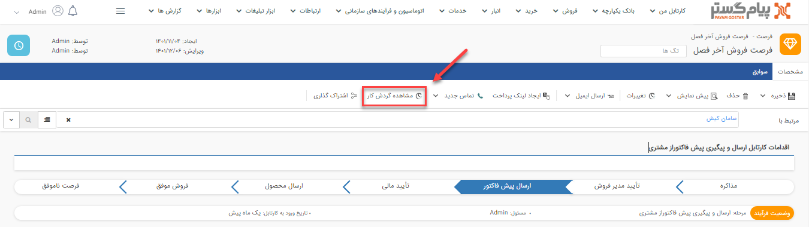
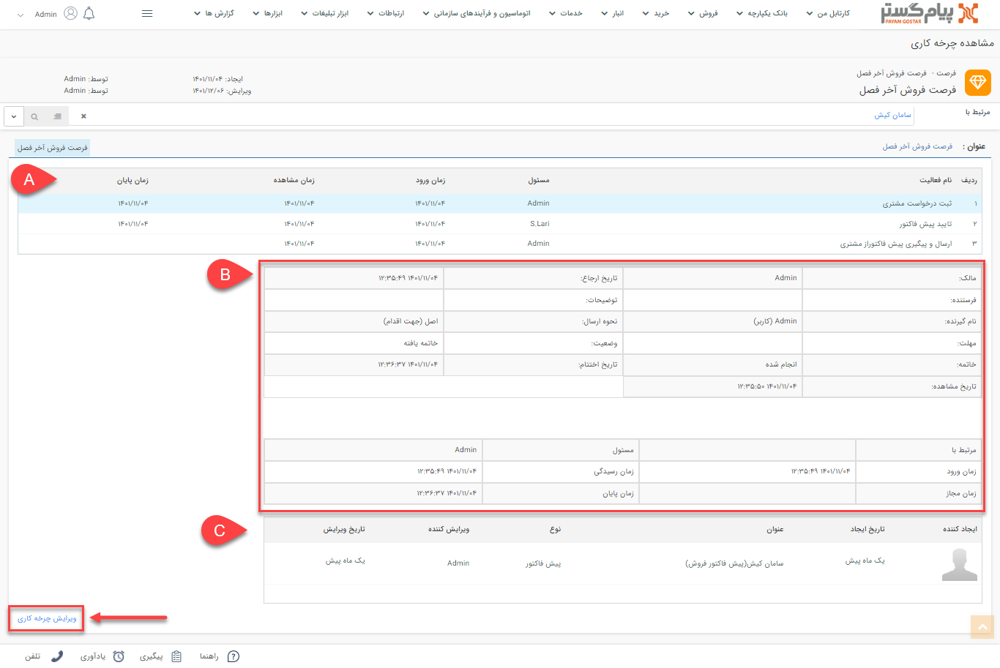
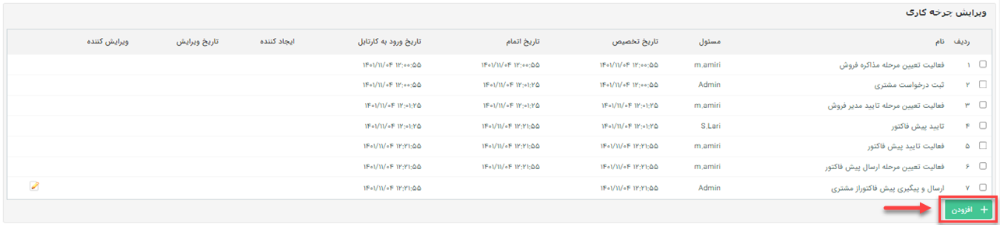
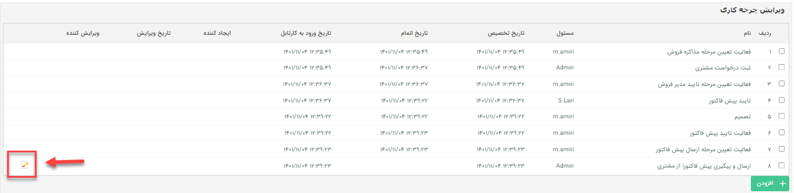
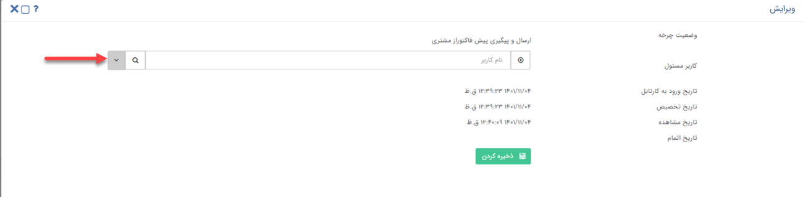
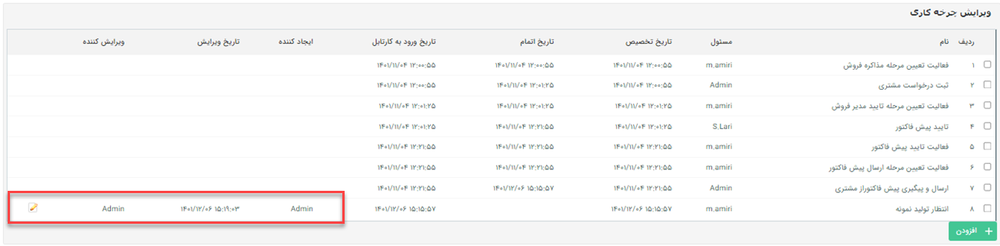

# ویرایش چرخه‌کاری آیتم‌های جاری
در هر آیتم که فرآیند فعال دارد، می‌توانید گردش کار آیتم تحت چرخه را مشاهده کرده و تغییر دهید. از این قابلیت زمانی استفاده می شود که چرخه‌کاری یکی از سوابق ثبت شده به دلیل خطای کاربری وارد مرحله اشتباهی از فرایند گردد یا به هر دلیلی بخواهید گردش کار سابقه‌‌ای، روال فرایندی تعریف شده را طی نکند. 

*به عنوان مثال* 
*فرض کنید به عنوان مدیر واحد قصد تأیید درخواستی را داشته‌اید ولی به اشتباه آن درخواست را رد می‌کنید. در این موقعیت کاربری که دسترسی ویرایش فرآیند به مسیر مورد نظر شما را دارد می‌تواند مسیر فرآیند را تغییر دهد.* 
این مورد، مثالی از موقعیت‌های موجود برای ویرایش فرآیند است. حالت‌های مختلفی مثل تغییر مسئول کارتابل، مسئول فعالیت انتظار و تغییر مراحل فرآیند وجود دارد که با قابلیت **ویرایش چرخه‌کاری** انجام می‌شود. 
برای ویرایش چرخه‌کاری آیتم، طبق مراحل زیر عمل کنید:  
1. به صفحه مشخصات آیتمی که قصد ویرایش چرخه‌کاری آن را دارید، بروید (می‌توانید آن را در لیست مربوط به آن بیابید).
2. در تب **مشخصات** آیتم، روی [مشاهده چرخه‌کاری](https://github.com/1stco/PayamGostarDocs/blob/master/help2.5.4/Settings/Personalization-crm/Overview/Process-design/ViewWorkflowItems.md) کلیک کنید. صفحه‌ی پیش روی شما گردش کاری که آیتم تاکنون داشته را به همراه جزئیات هر مرحله، نشان می‌دهد که تنها لیست **کارتابل‌ها** و **فعالیت‌های انتظار** در این قسمت فهرست می‌شود.

در صفحه پیش‌رو جزئیات مربوط به هر مرحله در اختیار شما قرار داده می‌شود.

  **A.** در این جدول لیست کارتابل و فعالیت‌های انتظار گذشته طی فرآیند را مشاهده خواهید کرد. 
  **B.** زمانی که روی هرکدام از ردیف‌های کارتابل یا فعالیت انتظار از جدول بالا کلیک کنید، جزئیات اطلاعات آن در این دو جدول نمایش داده می‌شود. 
  **C.** در این جدول لیست سوابقی که در هر مرحله ذخیره شده باشد، نمایش داده می‌شود.

> **نکته**  
> برای مشاهده گزینه **مشاهده گردش کار** کاربر باید مجوز **مشاهده چرخه‌کاری** را روی آیتم داشته باشد.

3. صفحه‌ی پیش رو را به سمت پایین اسکرول کرده و روی گزینه **ویرایش چرخه‌کاری** کلیک کنید. در این قسمت امکان حذف فعالیت یا کارتابل‌هایی که فرآیند از روی آن‌ها گذشته را **ندارید** و تنها می‌توانید فعالیت یا کارتابل مورد نظر خود به ادامه‌ی لیست اضافه کنید یا مسئول آخرین کارتابل را ویرایش نمایید.

- **افزودن کارتابل/فعالیت در چرخه‌کاری** 
اگر بخواهید فرآیند را به موقعیت مورد نظر خود تغییر مسیر دهید، تنها می‌توانید به انتهای لیست، کارتابل/فعالیت مورد نظر خود را اضافه کنید زیرا دیگر امکان حذف هیچ کدام از مراحل گذشته وجود **ندارد**. 
با کلیک بر دکمه **افزودن** کارتابل/فعالیت مورد نظر خود را اضافه نمایید. زین پس فرآیند از مرحله اضافه شده ادامه‌ی مسیر می‌دهد.

 

- **تغییر مسئول آخرین کارتابل، در چرخه‌کاری** 
همانطور که در توضیحات بالا اشاره شد، امکان حذف آخرین کارتابل در بخش ویرایش چرخه‌کاری وجود ندارد و تنها می‌توانید مسئول **آخرین کارتابل** را تغییر دهید. برای این کار روی گزینه ویرایش کلیک کنید.

در صفحه پیش رو زمان دقیق ورود به کارتابل، تخصیص به کاربر، مشاهده آیتم و خروج فرآیند از کارتابل کاربر نمایش داده می‌شود. درصورتی که بخواهید مسئول این کارتابل را تغییر دهید، می‌توانید نام کاربر مورد نظر خود را از لیست انتخاب نموده و تغییرات را ذخیره نمایید.

> **نکته** 
> لازم به ذکر است تغییرات پس از **یک ساعت** در فرآیند اعمال خواهد شد.

### مشاهده سابقه تغییرات در ویرایش چرخه‌کاری
برای هر دو حالت افزودن کارتابل/فعالیت جدید به انتهای فرآیند و ویرایش مسئول آخرین کارتابل، **نام ایجاد کننده**، **نام ویرایش کننده** و **زمان دقیق تغییرات** اعمال شده در لیست مراحل فرآیند، نمایش داده خواهد شد.

### دسترسی‌های مورد نیاز برای ویرایش چرخه‌های کاری
**مالک آیتم** و **مدیر سیستم** به طور کلی امکان ویرایش چرخه‌کاری را دارند. علاوه بر آن برخی مجوزهای مدیریتی (مثل مدیر مالی، مدیر فروش و ...) نیز دسترسی ویرایش چرخه‌کاری آیتم‌های مختلف را به کاربر می‌دهد که در ادامه به تفکیک توضیح داده می‌شود.

- **آیتم‌هایی که با مجوز «مدیر ارتباط با مشتریان» دسترسی ویرایش چرخه‌کاری آن را وجود دارد**
   - وظیفه
   - یادداشت
   - فایل
   - قرارملاقات
   - فرم
   - درخواست پشتیبانی
   - تماس تلفنی

- **آیتم‌هایی که کاربر با مجوز «مدیر فروش» دسترسی ویرایش چرخه‌کاری آن را دارد**
   - پیش‌فاکتورهای خرید و فروش
   - فاکتورهای خرید و فروش
   - فاکتورهای برگشت از خرید و فروش
   - قرارداد
   - فرصت

- **آیتم‌هایی که کاربر با مجوز «مدیر انبار» امکان ویرایش چرخه‌کاری آن را دارد**
   - انواع حواله‌های فروش، معمولی، انتقالی و مرجوعی
   - انواع رسیدهای معمولی، انتقالی و مرجوعی
   - رسید موجودی اولیه

- **آیتم‌هایی که کاربر با مجوز «مدیر مالی» امکان ویرایش چرخه‌کاری آن را دارد**
   - دریافت
   - پرداخت

- **آیتم‌هایی که کاربر با مجوز «مدیر بانک اطلاعاتی» امکان ویرایش چرخه‌کاری آن را دارد**
   - انواع هویت

