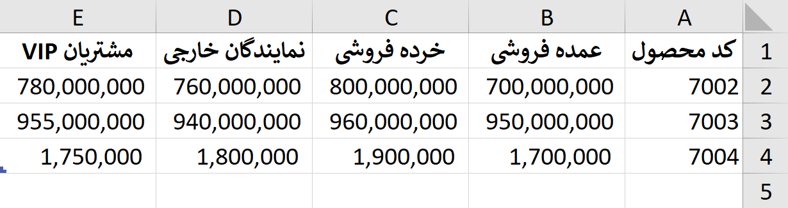
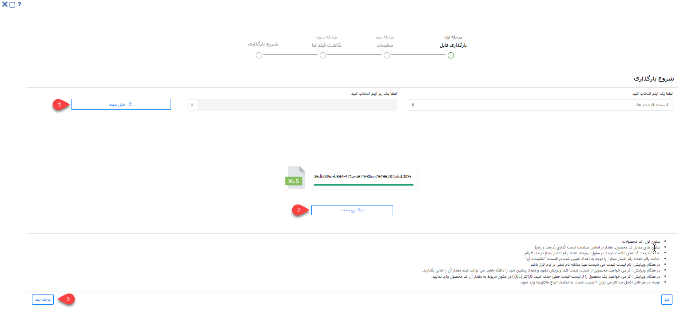
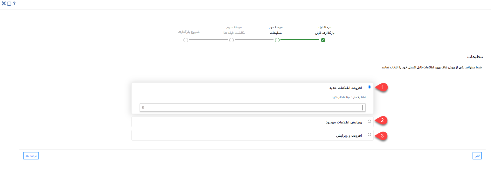
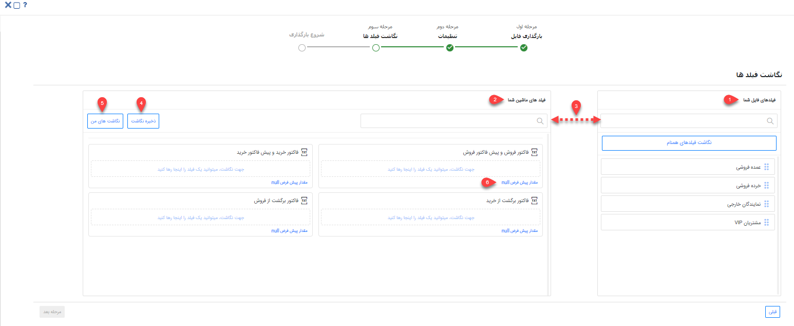

# ثبت لیست قیمت‌ها از طریق اکسل

در صورت نیاز به بارگذاری اطلاعات لیست قیمت محصولات به صورت یکجا، می‌توانید از روش ورود اکسلی استفاده نمایید. بدین ترتیب می‌توانید اطلاعات لیست قیمت مورد نظر را در اکسل درج نمایید (یا از سایر نرم‌افزارهای خود خروجی بگیرید) و سپس بارگذاری کنید. در این حالت لیست قیمت مورد نظر ایجاد شده و اطلاعات آن در فیلدهای مربوطه وارد می‌شود. علاوه بر آن از این روش می‌توانید برای ویرایش لیست قیمت‌های موجود استفاده نمایید. 
برای اینکه بارگذاری لیست قیمت‌ها بدون مواجهه با خطا و با موفقیت به اتمام برسد، لازم است که قوانین تهیه و بارگذاری اکسل را رعایت کنید. در این راهنما تمامی موارد لازم برای تنظیم صحیح فایل اکسل، به همراه شیوه بارگذاری آن مطرح شده‌است. بدین منظور در این راهنما به موارد زیر می‌پردازیم: 

- [شیوه‌ی تهیه و تنظیم فایل اکسل لیست‌ قیمت‌ها](#PriceListExcel)
- [روش بارگذاری فایل اکسل لیست‌ قیمت‌ها](#PriceListExcelUploading)
- [مجوزهای لازم برای بارگذاری اکسل لیست ‌قیمت‌ها](#PriceListExcelPermision)

## تنظیمات فایل اکسل{#PriceListExcel}
برای ورود اطلاعات لیست‌ قیمت‌ها از طریق اکسل، ابتدا باید لیست قیمت و سیاست‌ قیمت‌گذاری (سیاست‌ قیمت‌گذاری مشخص می‌کند که قیمت‌گذاری براساس رقم یا درصد انجام گیرد) را مشخص کنید. به عنوان مثال، می‌توانید لیست قیمت‌های متفاوتی از جمله لیست قیمت خرده‌فروشی، عمده‌فروشی ، مشتریان VIP و ... ایجاد کنید.
برای ایجاد لیست قیمت با کلیک روی دکمه افزودن می‌توانید «نوع لیست قیمت» و «سیاست‌های قیمت‌گذاری» و نوع فاکتوری که قصد دارید از این لیست در‌ آن استفاده کنید را انتخاب کنید.
پس از ذخیره‌ لیست قیمت می‌بایست اطلاعات مرتبط با محصولات این لیست قیمت را تعیین کنید.

> **نکته** 
در هر فایل اکسل حداکثر می‌توانید چهار لیست قیمت به ازای هر "نوع فاکتور" که در تنظیمات لیست قیمت موجود است، تعریف نمایید. 

 اکسل مورد نظر را بر اساس فرمت مورد پذیرش نرم‌افزار تنظیم کنید. بدین منظور می‌توانید اکسلی با ستون‌هایی که در تصویر می‌بینید ایجاد کنید و یا از فایل نمونه استفاده نمایید. فایل نمونه در مرحله‌ی اول بارگذاری به شما ارائه می‌شود (جلوتر به آن می‌رسیم). 

تصویر فوق،‌ ستون‌های مورد نیاز برای بارگذاری لیست‌ قیمت‌ها را نشان می‌دهد. چنانچه از فایل نمونه‌ای که نرم‌افزار به شما می‌دهد استفاده می‌کنید، این فیلدها به صورت خودکار در فایل اکسل قرار داده‌می‌شود. 

- **کد محصول**: این ستون شامل کد محصولات تعریف شده در بخش مدیریت محصولات در نرم‌افزار است

> **نکته** 
اگر می‌خواهید محصول تعریف شده در اکسل در برخی از لیست قیمت‌ها تعریف نشود یا در هنگام ویرایش لیست قیمت، ویرایش نشود و مقدار پیشین خود را داشته باشد، باید سلول مقدار آن در لیست قیمت مورد نظر خالی باشد.

- **لیست قیمت**: می‌توانید برای محصولات لیست قیمت‌های متفاوتی در نظر بگیرید. سر ستون‌ها می‌تواند شامل لیست‌ قیمت‌هایی که در مرحله قبل تعریف کرده‌اید باشند. به عنوان مثال، هر محصول می‌تواند قیمت‌های متفاوتی براساس لیست قیمت عمده فروشی‌، خرده فروشی، نمایندگان خارجی و مشتریان VIP داشته باشد. 

> **نکته** 
چنانچه سیاست قیمت‌گذای براساس درصد باشد می‌بایست علامت درصد را در سلول مربوطه وارد کنید. در صورتیکه سیاست قیمت‌گذاری براساس رقم باشد باید تعداد رقم مجاز را در **تنظیمات کلی** > **تنظیمات ارز های سیستم** مشخص کنید.

## مراحل بارگذاری فایل اکسل{#PriceListExcelUploading}
بارگذاری اکسل در پیام‌گستر، چهار مرحله‌ی اصلی دارد:

### بارگذاری فایل
برای بارگذاری فایل اکسل از مسیر تب **تنظیمات** > **مدیریت لیست قیمت‌ها** را انتخاب کنید و وارد صفحه لیست قیمت‌ها شوید. بر روی کلید «ورود اطلاعات از اکسل» کلیک کنید تا صفحه بارگذاری به شما نمایش داده‌شود. 

با کلیک بر روی کلید فایل نمونه (شماره ۱) می‌توانید قالب نمونه اکسل را دریافت نمایید. همان طور که پیش‌تر به آن اشاره شد، در این قالب ستون‌هایی برای درج لیست قیمت‌ها براساس کد محصولات تعبیه شده‌است.  
پس از تنظیم فایل اکسل، با کلیک بر روی کلید بارگذاری فایل (شماره ۲)، فایل مورد نظر را انتخاب و بارگذاری کنید. پس از اتمام بارگذاری، کلید مرحله‌ی بعد (شماره ۳) در پایین صفحه برای شما فعال می‌شود. با کلیک بر روی این کلید، برای اعمال تنظیمات به مرحله‌ی بعدی می‌روید. 

### تنظیمات بارگذاری فایل
در این بخش باید تنظیمات لازم جهت تعیین روش ورود اطلاعات را مشخص کنید.

**1. افزودن اطلاعات جدید** 
با انتخاب این گزینه، تمامی لیست قیمت‌های جدید موجود در اکسل بر اساس مبنای انتخابی شما شناسایی و بارگذاری می‌شود. در این مرحله باید فیلد «نام لیست قیمت» را مبنای شناسایی انتخاب کنید. بر اساس نام لیست قیمت، جستجوی تکراری بودن انجام شده و در صورت تکراری نبودن لیست قیمت، قیمت آن محصول به لیست قیمت اضافه می‌شود. 
**2. ‌ویرایش اطلاعات موجود** 
در این حالت بر اساس فیلدی که به عنوان مبنا انتخاب شده است (نام لیست قیمت)، جستجو انجام می‌شود. در صورت وجود لیست قیمت مشابه، لیست قیمت مربوطه ویرایش شده و اطلاعات موجود در اکسل برای آن درج می‌شود. در صورت  یافت نشدن کد محصول با چنین قیمتی،‌ اطلاعات آن سطر از اکسل بارگذاری نخواهدشد. 
با انتخاب چک باکس " فقط فیلد‌های خالی پر شوند" تنها فیلدهای خالی پرداخت مقداردهی شده و فیلدهایی که دارای اطلاعات می‌باشند بدون تغییر باقی می‌مانند. 

> **نکته** 
برای ویرایش لیست قیمت باید نام لیست قیمت تعریف شده در اکسل با نام لیست قیمت موجود کاملا یکسان باشد.

**3. افزودن و ویرایش** 
در این حالت بر اساس فیلد مبنای انتخاب شده جستجو انجام می‌شود. در صورت وجود محصولی، با اطلاعات فیلد مبنا، پرداخت مربوطه ویرایش می‌شود و در صورت یافت نشدن محصول با عنوان یا شماره یکسان (فیلد مبنا)، آن رکورد به عنوان محصول جدید به نرم‌افزار اضافه می‌شود. 
با انتخاب چک باکس "فقط فیلد‌های خالی پر شوند"،‌ در محصولاتی که بر اساس فیلد مبنا یافت شده (محصولات موجود) و نیازمند ویرایش می‌باشند، ‌تنها فیلدهای خالی مقداردهی شده و فیلدهایی که دارای اطلاعات می‌باشند بدون تغییر باقی می‌مانند. 

- **افزودن محصولات جدید به لیست قیمت موجود** 
 در این روش تنها محصولاتی که در لیست قیمت موجود در نرم افزار، وجود ندارند را به لیست قیمت اضافه می‌کند.
- **بروز رسانی مقادیر محصولات موجود** 
 با استفاده از این حالت تنها مقادیر رقم یا درصد تعریف شده برای محصولات موجود در لیست قیمت ویرایش می‌شوند.
-  **حذف محصولات موجود در لیست قیمت با وارد کردن کارکتر DL در سلول مقدار آن** 
حذف محصولات موجود در لیست قیمت با وارد کردن کاراکتر DL در سلول مقدار آن با انتخاب این حالت و استفاده از کاراکتر DL در سلول مقدار برای محصول، آن محصول از لیست قیمت حذف می‌شود.  

به این موضوع توجه داشته‌باشید که در زمان ویرایش، مقادیر مندرج در اکسل جایگزین مقادیر قبلی می‌شوند. بنابراین در صورتی که نیاز است مقادیر جدید بدون حذف مقادیر قبلی به آن‌ها اضافه‌شوند، باید مقادیر قبلی موجود هر فیلد که قصد حفظ آن را دارید، در اکسل تکرار شوند. 
برای ادامه‌ی فرآیند بارگذاری، بر روی کلید مرحله بعدی کلیک کنید. 

### نگاشت فیلدها
در مرحله سوم، سرستون‌های فایل اکسل در بخش «فیلدهای فایل شما» (شماره ۱) و فیلدهای موجود در مشخصات لیست قیمت در بخش «فیلدهای ماشین شما» (شماره ۲) نمایش داده‌می‌شود. در واقع در این بخش مشخص می‌شود که اطلاعات هر ستون اکسل باید در کدامیک از فاکتورها یا پیش‌فاکتورهای پیش‌فرض که می‌خواهید این لیست قیمت‌ها برای آن ها تعریف شود را وارد شود. 
در صورت یکسان بودن نام ستون با عناوین مندرج در فایل نمونه،‌ نگاشت به صورت خودکار انجام می‌گیرد. در غیر این صورت باید با drag & drop نام هر ستون را از بخش فیلدهای فایل شما (سمت راست) به فیلد مربوطه در بخش فیلدهای ماشین شما (سمت چپ) متصل نمایید. در این شرایط برای یافتن عنوان مورد نظر در هر دو بخش می‌توانید از قابلیت جستجو (شماره ۳)‌ استفاده کنید. 

> **نکته** 
در هر بار ورود اطلاعات تنها یک لیست قیمت را می‌توانید به هر کدام از نوع فاکتورها اختصاص دهید.

اگر نگاشت خود را به صورت دستی انجام داده‌اید، می‌توانید نگاشت خود را ذخیره نمایید (شماره ۴). در صورت استفاده مجدد از این اکسل یا اکسل مشابه برای بارگذاری، با کلیک بر روی نگاشت‌های من (شماره ۵)، نگاشت به صورت خودکار انجام می‌شود. شما می‌توانید نگاشت‌های پرکاربرد خود را در سیستم ذخیره نموده و در وقت خود صرفه‌جویی کنید. در لیست نگاشت‌های من امکان ویرایش یا حذف نگاشت ذخیره شده نیز وجود دارد. 
شما این امکان را دارید که برای هر فیلد مقداری را به عنوان مقدار پیش‌فرض (شماره ۶) در نظر بگیرید تا در صورت خالی بودن مقدار فیلد در اکسل، فیلد با مقدار پیش‌فرض که در این قسمت تعریف کرده‌اید پر می‌شود. 
برای شروع بارگذاری، روی کلید مرحله بعدی کلیک کنید.  

### شروع بارگذاری
بارگذاری فایل ممکن است لحظاتی زمان ببرد. پس از اتمام فرآیند بارگذاری، در صورت بارگذاری موفق اکسل،‌ انجام موفقیت‌آمیز آن در این صفحه اعلام می‌شود. پیشنهاد می‌شود که پس از آن به صفحه‌ی لیست لیست قیمت‌ها بروید و نتیجه را برای هر لیست قیمت بررسی کنید. 
در منوی گزارش‌ها، بخش وضعیت عملیات انبوه می‌توانید نتایج ورود اطلاعات را مشاهده کنید. اگر فرآیند بارگذاری آغاز شود اما به هر دلیلی امکان بارگذاری برخی سطرها وجود نداشته‌باشد، با دانلود فایل اکسل از این بخش می‌توانید خطا و علت خطا را مشاهده نمایید. برای دانلود فایل، بر روی جزئیات رکورد مربوطه کلیک کرده و خروجی اکسل دریافت کنید. در اکسل دریافتی، سطرهای دارای مشکل با رنگ قرمز مشخص شده و در ستون آخر دلیل بروز خطا درج شده‌است. 

چنانچه بارگذاری فایل با خطا مواجه شده‌باشد و بارگذاری انجام نشود، پیغامی مشابه تصویر فوق به شما نمایش داده‌می‌شود. توجه داشته‌باشید که در این حالت، به سبب آغاز نشدن فرآیند بارگذاری، امکان دریافت فایل خطا از بخش گزارشات انبوه وجود ندارد. در چنین شرایطی فایل اکسل خود را مجدد بررسی و با فرمت راهنما مطابقت دهید. پس از رفع خطاهای فایل، مجدد اقدام به بارگذاری نمایید.  

## مجوزهای مورد نیاز برای بارگذاری لیست قیمت از طریق اکسل{#PriceListExcelPermision}
برای ایجاد لیست قیمت‌ها از طریق اکسل،‌ کاربر باید مجوز **مدیریت محصولات** را داشته باشد. همچنین چنانچه بخواهید از لیست قیمت‌ها استفاده کنید باید مجوز استفاده از لیست قیمت فعال باشد.

