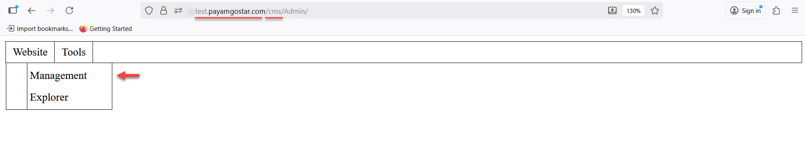
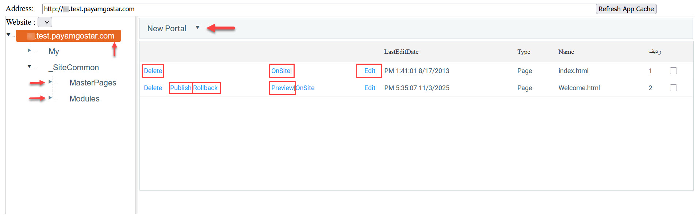
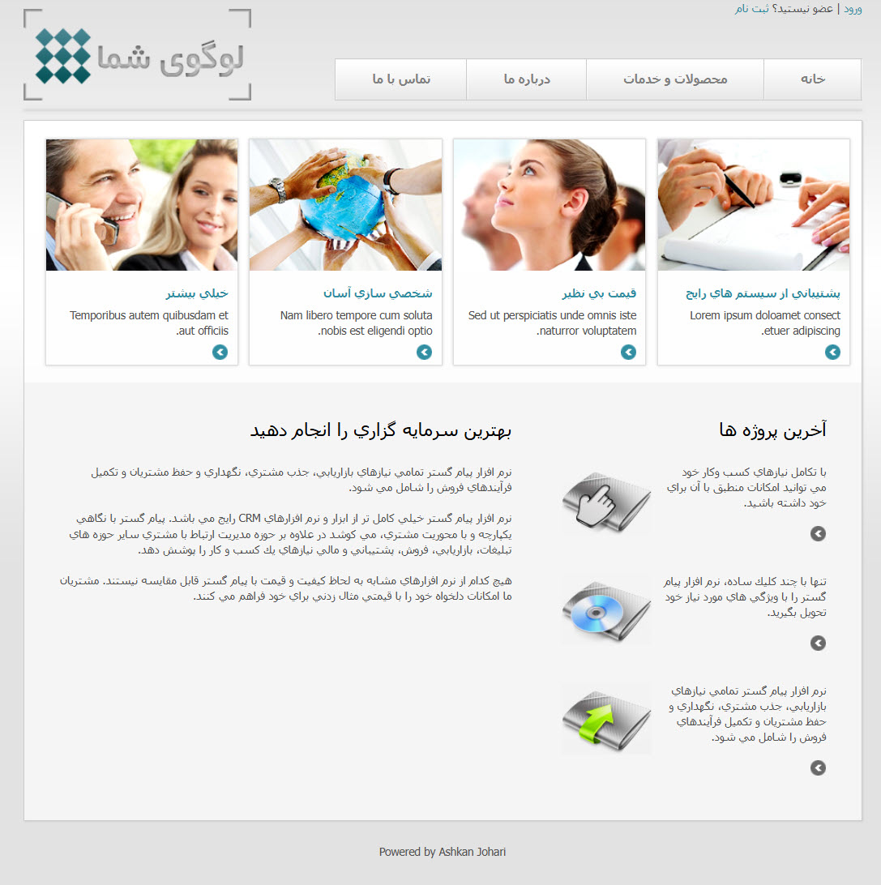
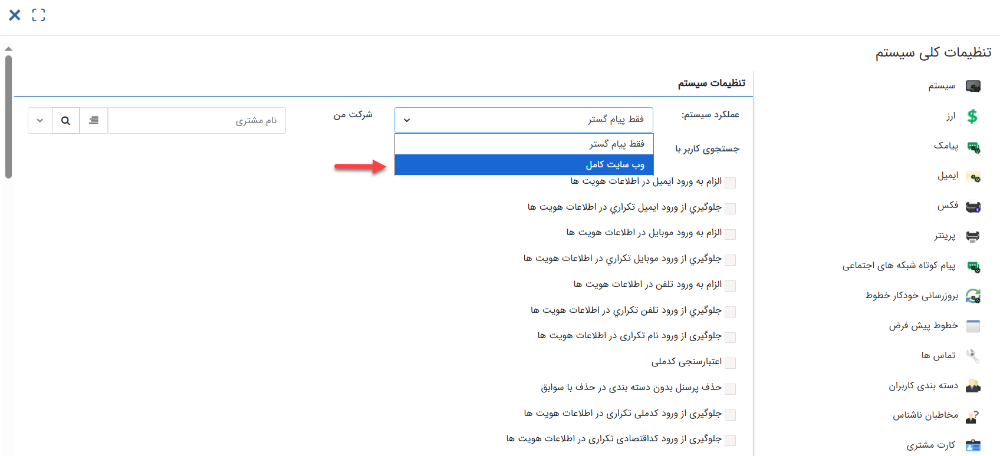

# طراحی سایت با سایت‌ساز
ابزار سایت‌ساز به شما این امکان را می‌دهد که صفحه ورود به نرم‌افزار را شخصی‌سازی کنید. بر این اساس می‌توانید تنظیم کنید که پس از درج آدرس URL نرم‌افزار شما، کاربر ابتدا صفحه‌ی شخصی‌سازی شده‌ی شما را مشاهده نموده و سپس، با انتخاب کلید «ورود»، وارد صفحه Login پیام‌گستر شود. با استفاده از سایت‌ساز می‌توانید صفحات متعددی طراحی و ایجاد کنید تا مخاطب بتواند از صفحه‌ی اولیه به آن‌ها دسترسی داشته‌باشد.  

> **نکته** 
> استفاده از ابزار سایت‌ساز جهت طراحی صفحه نیازمند تسلط بر زبان HTML می‌باشد که از حوزه‌ی راهنمای نرم‌افزار خارج است. در این مقاله صرفاً راهنمایی‌های لازم جهت دسترسی به بخش‌های مختلف ابزار سایت‌ساز ارائه شده‌است. 

برای ورود به سایت‌ساز جهت ایجاد صفحه اولیه و صفحات دیگر:  
1. وارد حساب کاربری خود شوید. توجه داشته‌باشید که برای اینکه بتوانید وارد محیط سایت‌ساز شوید یا باید مدیر سیستم (ادمین) باشید و یا مجوز مدیر سایت‌ساز را داشته‌باشید. 
2. در قسمت URL مرورگر، CSM/ را به انتهای آدرس URL نرم‌افزار خود اضافه کنید.
3. صفحه را به‌روزرسانی کنید تا وارد سایت‌ساز شوید.

برای ورود به بخش تنظیمات صفحات، از مسیر Website گزینه‌ی Management را انتخاب کنید و سپس بر روی آدرس نرم‌افزار خود (در سمت چپ تصویر) کلیک کنید. از این طریق می‌توانید به تنظیمات صفحه اولیه یا صفحات دیگری که قصد ایجاد آن‌ها را دارید، دسترسی داشته‌باشید. علاوه بر آن، موارد مشترک صفحات نظیر MasterPage و Madualها در بخش SiteCommon در دسترس هستند. برای مشاهده‌ی موارد موجود از هر یک از آن‌ها لازم است که بر روی دسته‌بندی آن کلیک کنید. به عنوان مثال بر روی Modules کلیک کنید تا تمامی Moduleهای تعریف شده به شما نمایش داده شوند. 

## ایجاد و ویرایش عناصر مورد نیاز برای طراحی سایت 
کلید بالای صفحه، امکان ایجاد پرتال و صفحات جدید را برای شما فراهم می‌سازد. با استفاده از فلش کنار کلید، گزینه‌هایی برای ایجاد انواع آیتم‌های مورد نیاز جهت طراحی صفحه در اختیار شما قرار داده‌می‌شود. با استفاده از این کلید می‌توانید اقدام به ایجاد موارد زیر نمایید: 
- New Portal
- New Folder 
- New Master Page 
- New Page 
- New Module

با کلیک بر روی آدرس سایت (در ستون سمت چپ)، لیست تمامی صفحات (Pageها) به شما نمایش داده می‌شود. در واقع تمامی صفحاتی که ایجاد کرده‌اید یا قصد شخصی‌سازی آن‌ها را دارید، در این جدول قرار دارد. به صورت پیش‌فرض، دو صفحه‌ی اولیه تحت عناوین صفحه Welcome و Index به عنوان قالب اولیه به شما ارائه شده‌است. شما می‌توانید از همین قالب‌ها استفاده کرده و با شخصی‌سازی آن، صفحه مورد نظر خود را طراحی نمایید یا اینکه صفحه/صفحات مورد نظرتان را خودتان طراحی کنید. کلید OnSite که در ردیف مربوطه مشاهده می‌کنید، به شما این امکان را می‌دهد که نمایی از صفحه مشاهده کنید. 

عناصری که به صورت مشترک و تکرارشونده در صفحات و بخش‌های مختلف می‌توانند به کار گرفته‌شوند (مثلاً تصویر لوگو که در صفحات مختلف و به دفعات ممکن است استفاده شود)، در بخش SiteCommon به شما نمایش داده می‌شوند. از این طریق می‌توانید به Module و MasterPage مورد نظر دسترسی داشته‌باشید. به عنوان مثال Module لوگو در این بخش در دسترس شماست و می‌توانید اقدام به ویرایش آن نمایید. 
اگر قصد استفاده از صفحات و عناصر موجود را دارید یا اینکه می‌خواهید عناصری که ساخته‌اید را ویرایش کنید، از کلید Edit در مقابل آن ردیف استفاده کنید. هنگام ایجاد/ویرایش هر یک از صفحات می‌توانید از ابزار Text Editor یا HTML Editor برای تنظیمات مورد نظر استفاده کنید. پس از اعمال تغییرات بر روی علامت تایید پایین صفحه (تیک سبز) کلیک کنید تا تغییرات شما ذخیره شود. 

## حذف یک عنصر
با کلیک بر روی Delete، تنظیمات بخش مربوطه حذف می‌شود. به عنوان مثال، اگر Module یا صفحه‌ای ایجاد کرده‌اید که به آن نیازی ندارید، از این طریق می‌توانید اقدام به حذف آن نمایید. 

## پیش‌نمایش، انتشار و بازگردانی یک عنصر
پس از اعمال تغییرات، با استفاده از کلید «Preview» می‌توانید پیش‌نمایش صفحه‌ای که طراحی کرده‌اید را مشاهده کنید. در صورت نیاز به بازگشت به حالت پیش‌فرض، کلید «Rollback» و در صورت تایید جهت انتشار، کلید «Publish» را انتخاب کنید.  

## تنظیمات سیستم
پس از ایجاد و تنظیمات صفحات مورد نیاز در سایت‌ساز و انتشار آن‌ها، لازم است که تنظیمات نرم‌افزار را برای نمایش این صفحه ویرایش نمایید. بدین منظور از مسیر **تنظیمات** > **تنظیمات کلی**  به صفحه **تنظیمات سیستم** بروید و عملکرد سیستم را روی حالت «سایت کامل» قرار دهید. به صورت پیش‌فرض، گزینه‌ی «پیام‌گستر» برای آن انتخاب شده‌است. در این حالت کاربر با درج آدرس URL نرم‌افزار، به صورت مستقیم به صفحه ورود به حساب کاربری (صفحه Login) هدایت می‌شود. با تغییر آن به گزینه‌ی «سایت کامل» صفحه‌ای که در سایت‌ساز تنظیم کرده‌اید به عنوان صفحه اولیه به کاربر نمایش داده می‌شود و از آن طریق می‌تواند به سایر صفحات یا صفحه ورود کاربر منتقل شود. 

به این موضوع توجه داشته‌باشید که در صورت تنظیم سیستم بر روی حالت «تنظیمات سیستم»، صفحه‌ی تنظیم شده در سایت‌ساز به عنوان صفحه اولیه به تمامی کاربران نرم‌افزار و باشگاه وفاداری نمایش داده می‌شود و مختص به گروه خاصی از کاربران نمی‌باشد.  

