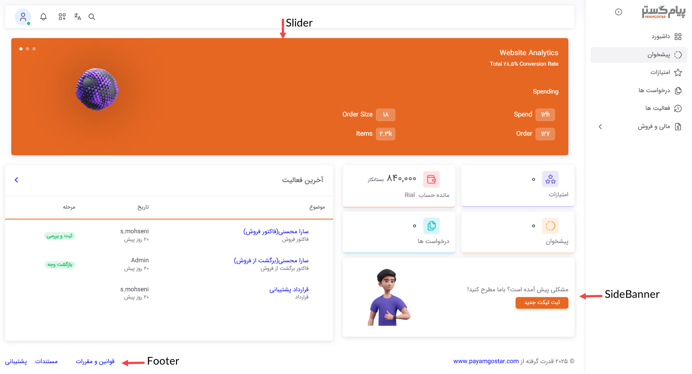
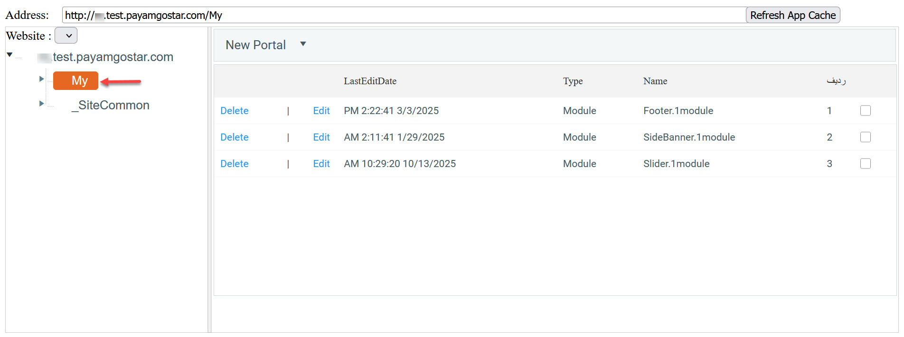
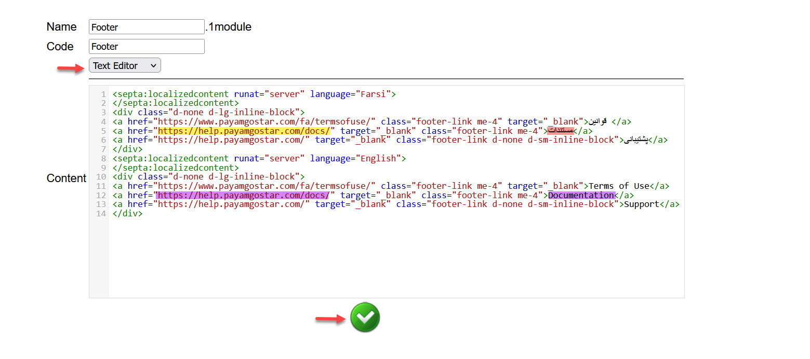
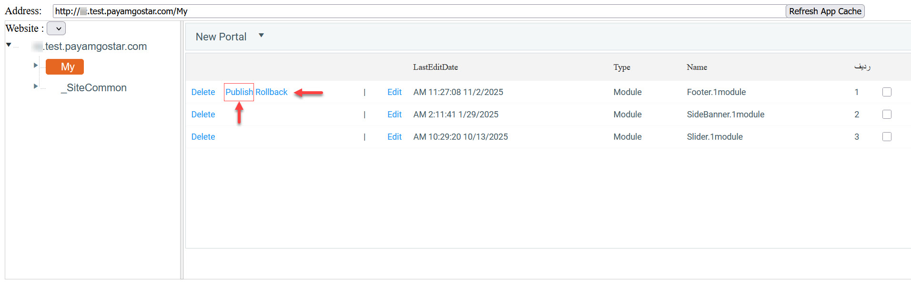

# شخصی‌سازی باشگاه با سایت‌ساز
ابزار سایت‌ساز به شما این امکان را می‌دهد که پنل باشگاه مشتریان و نمایندگان خود را شخصی‌سازی کنید. بر این اساس می‌توانید: 
- اطلاعات فوتر را ویرایش کنید.
- بخش بنر را تغییر دهید.
- بخش اسلایدر را شخصی‌سازی نمایید.

> **نکته**  
> در صفحه پنل باشگاه، تنها سه بخش مذکور قابل ویرایش است و امکان شخصی‌سازی منوی کناری یا سایر اجزای صفحه فراهم نمی‌باشد. 

برای ورود به سایت‌ساز جهت شخصی‌سازی پنل باشگاه مشتریان و نمایندگان:  

1. وارد حساب کاربری خود شوید. توجه داشته‌باشید که برای اینکه بتوانید وارد محیط سایت‌ساز شوید یا باید مدیر سیستم (ادمین) باشید و یا مجوز مدیر سایت‌ساز را داشته‌باشید. 
2. در قسمت URL مرورگر، CSM/ را به انتهای آدرس URL نرم‌افزار خود اضافه کنید.
3. صفحه را به‌روزرسانی کنید تا وارد سایت‌ساز شوید.

برای ورود به بخش تنظیمات باشگاه، از مسیر Website گزینه‌ی Management را انتخاب کنید و سپس بر روی بخش MY کلیک کنید. از این طریق می‌توانید به تنظیمات پنل باشگاه دسترسی داشته‌باشید. 

در ردیف اول تا سوم جدول می‌توانید به ترتیب تنظیمات فوتر، بنر و اسلایدر را مشاهده نمایید. 

## حذف بخشی از پنل
با کلیک بر روی Delete، تنظیمات بخش مربوطه حذف می‌شود. به عنوان مثال، اگر قصد حذف اسلایدر بالای صفحه را دارید، می‌توانید بر روی Delete در ردیف دوم جدول کلیک کنید. 
## ویرایش بخشی از پنل
با کلیک بر روی Edit، می‌توانید وارد صفحه ویرایش اطلاعات ردیف مربوطه شوید. به عنوان مثال برای ویرایش اطلاعات مندرج در بخش فوتر، بر روی Edit در ردیف اول جدول کلیک کنید تا وارد صفحه‌ی زیر شوید. 

در این بخش می‌توانید محتوای مورد نظر را از طریق Text Editor و یا HTML Editor ویرایش نمایید. به عنوان مثال در تصویر بالا، صفحه‌ی ویرایش فوتر را مشاهده می‌کنید. فرض کنید که می‌خواهید در بخش فوتر، به جای کلید «مستندات» کلید «راهنما» را داشته‌باشید که نماینده/مشتری با کلیک بر روی آن، به صفحه‌ی راهنمای سایت شما هدایت شود. بدین منظور لازم است که عبارت «مستندات» را به «راهنما» تغییر دهید (هایلایت قرمز) و همچنین آدرس صفحه سایت مورد نظر را با لینک مندرج فعلی (هایلایت زرد) جایگزین کنید. توجه داشته‌باشید که تغییرات مورد نظر را در زبان انگلیسی نیز اعمال کنید (هایلایت بنفش). 
همچنین می‌توانید از HTML Editor برای اعمال تغییرات مورد نظر و شخصی‌سازی فوتر استفاده کنید. اگر با زبان HTML آشنایی دارید از این بخش می‌توانید فوتر پنل باشگاه را مظابق با نیاز خود تنظیم نمایید. در صورت تمایل به انجام این کار، با استفاده از کلیک «HTML» در پایین صفحه کادر می‌توانید به کد HTML فوتر دسترسی داشته‌باشید و تغییرات مورد نظر را اعمال نمایید.  
پس از اعمال تغییرات بر روی علامت تایید پایین صفحه (تیک سبز) کلیک کنید تا تغییرات شما ذخیره شود. 

> **نکته** 
> با توجه میزان طولانی بودن هر خط از کدها، ممکن است که عرض صفحه متفاوت باشد. چنانچه علامت تایید (تیک سبز رنگ) را پایین صفحه مشاهده نمی‌کنید، از طریق نوار اسکرول ، صفحه را به سمت راست هدایت کنید تا بتوانید به کلیک تایید دسترسی داشته‌باشید. 

پس از بازگشت به صفحه اصلی، حال که تغییری در بخش (مثلاً فوتر) اعمال کرده‌اید، کلید Publish را ردیف مربوطه مشاهده می‌کنید. برای انتقال این تغییرات به پنل، لازم است که بر روی Publish کلیک کنید.  

چنانچه قصد بازگردانی تنظیمات آن بخش به حالت اولیه را دارید، روی Rollback کلیک کنید تا تنظیمات پیش‌فرض بازگردانی شود. 

> **نکته** 
> توجه داشته‌باشید که با توجه به یکسان بودن بستر باشگاه مشتریان و نمایندگان، تغییرات اعمال شده برای پنل باشگاه، هم برای باشگاه مشتریان و هم برای باشگاه نمایندگان اعمال می‌شود و امکان ارائه دو تنظیمات مختلف برای مشتریان و نمایندگان فراهم نمی‌باشد.