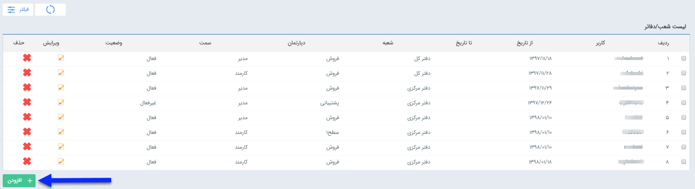
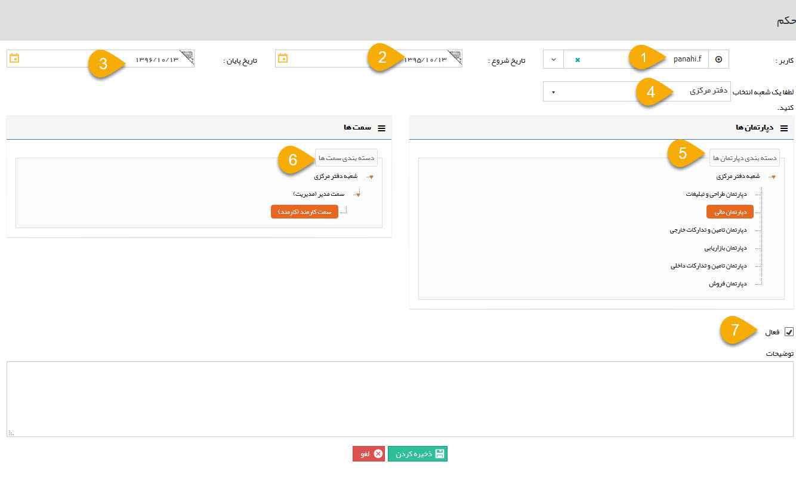

# مدیریت  حکم‌های پرسنلی

با استفاده از این بخش، می توانید حکم‌های پرسنلی متعددی ایجاد نمایید. از این حکم های پرسنلی در ارجاع وظیفه ها و فرآیندها و تعیین مجوز ها استفاده می شود. همچنین نحوه عملکرد قسمت [گزارشات عملکردی](https://github.com/1stco/PayamGostarDocs/blob/master/Help/Management-and-reports/Functional-reports/Functional-reports.md) نرم افزار بر اساس حکم‌های پرسنلی تخصیص داده شده در این قسمت می باشد، به این صورت که هر کاربر بر اساس حکم‌های پرسنلی خود می تواند گزارش عملکرد سمت های زیر مجموعه خودش را دریافت کند

> **نکته** 
برای ایجاد چارت سازمانی ابتدا قسمت [مدیریت شعب، دپارتمان و سمت ](https://github.com/1stco/PayamGostarDocs/blob/master/Help/Basic-Information/branches-department/branches-department.md)را مطالعه کرده و تنظیماتش را انجام دهید تا بتوانید در این قسمت هر کاربر را به سمت سازمانی مرتبط، تخصیص دهید.

با کلیک بر دکمه **افزودن** می‌توانید یک حکم پرسنلی جدید به یک کاربر تخصیص دهید.

1. **کاربر:** نام کاربری که می خواهید حکم را به او اختصاص دهید، انتخاب کنید.
2. **تاریخ شروع:** تاریخ شروع حکم را تعیین کنید.
3. **تاریخ پایان:** تاریخ منقضی شدن این حکم را تعیین کنید.  توجه داشته باشید که این حکم پس از تاریخ انقضا غیر فعال می گردد.

> **نکته** 
در نظر داشته باشید در صورتی که ماژول حکم سازمانی را تهیه نکرده باشید، فیلد تاریخ پایان غیرفعال خواهد بود.

4. **انتخاب شعبه:** شعبه ای که می خواهید حکمی را در آن تعیین کنید، انتخاب کنید.
5. **دسته بندی دپارتمان:** دپارتمان مربوط به حکم را تعیین کنید
6. **دسته بندی سمت‌ها:** سمت حکم مورد نظر را تعیین کنید.
7. **فعال:** با فعال کردن این گزینه حکم فعال می شود. در صورتی که نیاز دارید حکم را به صورت موقت یا دائم از کار بی اندازید، این گزینه را غیر فعال کنید.

