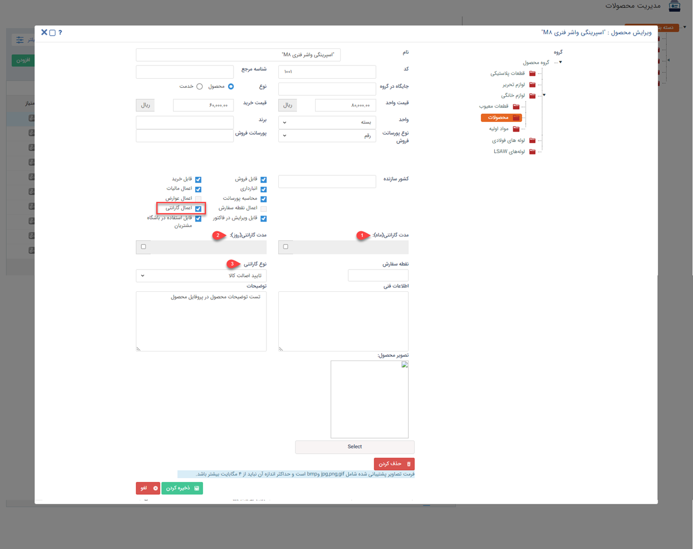

# تعیین گارانتی کالا 
چنانچه ماژول انبارداری سریالی را تهیه کرده باشید می‌توانید به منظور بهبود خدمات مشتری برای محصولات گارانتی  ثبت نمایید. 
برای ثبت گارانتی محصولات از طریق مسیر زیر اقدام نمایید:
**تنظیمات**> **مدیریت محصولات**> **اعمال گارانتی**

برای ثبت گارانتی ابتدا می‌بایست در قسمت مدیریت محصولات چک باکس مرتبط با **اعمال گارانتی** فعال باشد

- **مدت گارانتی(ماه)**: برای ثبت مدت زمانی که محصول شامل گارانتی می‌شود، می‌توانید تعداد ماه‌ها را در این قسمت وارد کنید.
- **مدت گارانتی(روز)**: تعداد روزهایی که محصول شامل گارانتی ‌می‌شود را در این قسمت وارد نمایید.
- **نوع گارانتی**:  در این قسمت مشخص می‌کنید گارانتی در هنگام ثبت کالا در نظر گرفته شود یا هنگام تایید اصالت کالا.