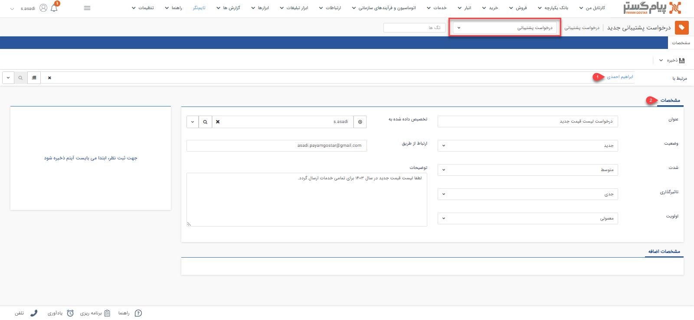

# درخواست پشتیبانی جدید

چنانچه قصد ثبت درخواست پشتیبانی برای مشتری دارید می‌توانید از آیتم پشتیبانی (تیکت)استفاده نمایید. درخواست‌های پشتیبانی پر پیام‌گستر از طریق خطوط ایمیل دریافت می‌شود و پس از انجام فرآیندها و رسیدگی‌های لازم، درخواست‌ها پاسخ داده شده و در سوابق مشتریان ثبت خواهد شد. با امکان دسترسی به سوابق، پرونده مشتریان و مشاهده درخواست‌های ثبت شده می‌توانید با درک کامل از مشکلات مشتری و اطلاعات او، در زمان کوتاهی رضایت او را جلب کنید.
>**نکته** 
درخواست پشتیبانی جز آیتم‌های پیش‌فرض نرم افزار نیست پس چنانچه نیاز به ثبت آن دارید می‌بایست از طریق **شخصی‌سازی crm** نسبت به ثبت آن اقدام نمایید.

## مسیر‌های ثبت درخواست پشتیبانی
برای ثبت درخواست پشتیبانی در پیام‌گستر، مسیرهای مختلفی وجود دارد. بنا بر نیاز خود می‌توانید از مسیرهای زیر اقدام به ثبت درخواست پشتیبانی جدید برای مشتری خود نمایید. 

- **ویجت دسترسی سریع** > **درخواست پشتیبانی**

- **تب خدمات** > **درخواست‌ها** > **انتخاب زیرنوع موردنظر از درخواست ها**

- **صفحه اصلی پروفایل مخاطب** > **آیتم جدید** > **درخواست جدید** 
برای مشاهده لیست «آیتم‌های جدید» بر روی فلش کنار «تماس جدید» (قابل مشاهده در نوار سفید بالای صفحه) کلیک نمایید. 

- **صفحه اصلی پروفایل مخاطب** > **تب سوابق** > **درخواست جدید**

- **صفحه اصلی پروفایل مخاطب** > **تب درخواست‌ها** > **درخواست جدید**

> **نکته** 
> توجه داشته باشید که چنانچه از صفحه هویت مورد نظر اقدام به ثبت درخواست نمایید (مسیر سوم، چهارم و پنجم)، بخش «مرتبط با» به صورت خودکار با نام هویت پر می‌شود. به عبارت دیگر درخواست به نام هویت ثبت می‌شود. اما اگر از مسیرهای صفحه اصلی (مسیر اول و دوم) اقدام به ثبت درخواست‌‌ پشتیبانی نمایید، باید نام هویت را در قسمت «مرتبط با» جستجو و انتخاب کنید. 

## شیوه‌ی ثبت درخواست پشتیبانی
در صورت داشتن چند زیرنوع خواست، به انتخاب صحیح آن توجه داشته‌باشید. زیرنوع آیتم در قسمت بالای صفحه قابل مشاهده و قابل تغییر می‌باشد. در تصویر زیر، «درخواست پشتیبانی» برای ثبت نمونه انتخاب شده‌است. 
برای ثبت درخواست لازم است فیلدهای مورد نیاز آیتم را با اطلاعات موجود تکمیل و سپس ذخیره نمایید. مشخصات درخواست در پیام‌گستر به شرح زیر می‌باشد: 

برای ثبت درخواست پشتیبانی می توانید زیرنوع مناسب با این درخواست را تعیین کنید 

### ۱. مرتبط با  
نام هویتی که می‌خواهید برایش درخواست ثبت کنید را در این قسمت درج کنید. بدین منظور کافیست بخشی از نام هویت مورد نظر را تایپ نمایید تا لیست هویت‌های مشابه آن برای انتخاب به شما نمایش داده‌شود. چنانچه پیش‌تر به آن اشاره شد، اگر از صفحه هویت اقدام به ثبت درخواست کرده‌باشید، نام هویت به صورت خودکار در این بخش ثبت شده‌است. 

### ۲. مشخصات  
- **عنوان**: می توانید برای درخواست خود عنوانی متناسب با درخواست ثبت کنید.
- **تخصیص داده شده به**: به منظور پیگیری بهتر این درخواست می توانید این درخواست را به یکی از پرسنل اختصاص دهید.
- **ارتباط از طریق**:  پیگیری و انجام فرآیند پاسخ‌دهی به تیکت از طریق ایمیل انجام می‌گیرد. بنابراین، ثبت ایمیل فرد پاسخ‌دهنده به این درخواست در این قسمت اجباری است و بدون ثبت ایمیل اجازه ذخیره‌ این درخواست را نخواهید داشت.
- **وضعیت**: به منظور الویت‌بندی بهت درخواست‌ها می‌بایست وضعیت تمام درخواست‌ها را براساس ماتریس شدت - تاثیرگذاری انتخاب کنید. وضعیت درخواست در سه دسته **جدید**، **بسته شده** و **در دست بررسی** قابل انتخاب است.
- **شدت**: براساس نوع درخواست می‌توانید شدت درخواست را در یکی از دسته‌بندی‌های **پایین**، **متوسط** و **بحرانی** قرار دهید.
- **تاثیرگذاری**: درخواست‌ها را می‌توانید براساس میزان تاثیرگذاریشان در سه دسته‌بندی **جزئی**، **جدی** و **فاجعه‌بار** قرار دهید.
- **الویت**: براساس ماتریس شدت-تاثیرگذاری در بخش تنظیمات، الویت درخواست‌ها به صورت خودکار مشخص می‌شود. این بخش به شما در برنامه‌ریزی برای پاسخ به درخواست‌ها کمک می‌کند. الویت درخواست‌ها براساس میزان سشدت و تاثیرگذاریشان در سه دسته الویت **پایین**، **معمولی** و **بالا** قرار میگیرد.
- **توضیحات**: میتوانید توضیحات مورد نیاز با این درخواست را در این قسمت وارد کنید.

> **نکته**  
> اگر طی روند شخصی‌سازی، فیلدی برای ثبت اطلاعات در پشتیبانی در نظر گرفته‌شده باشد، آن را در  قسمت «مشخصات اضافه» مشاهده می‌کنید. 

