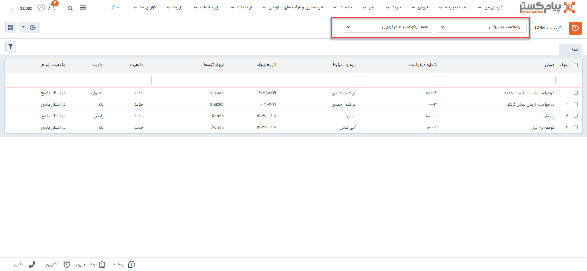
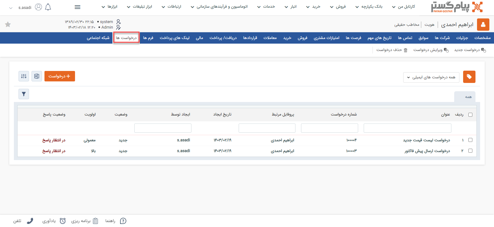
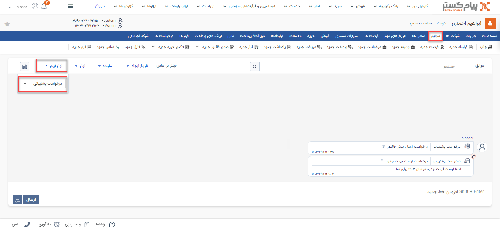
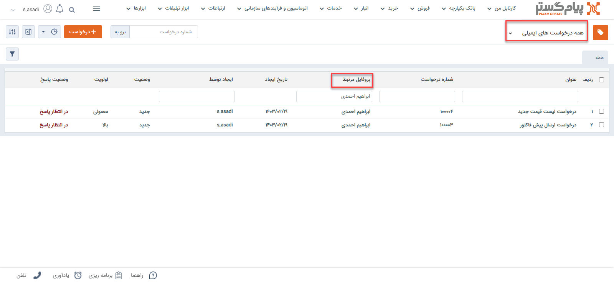
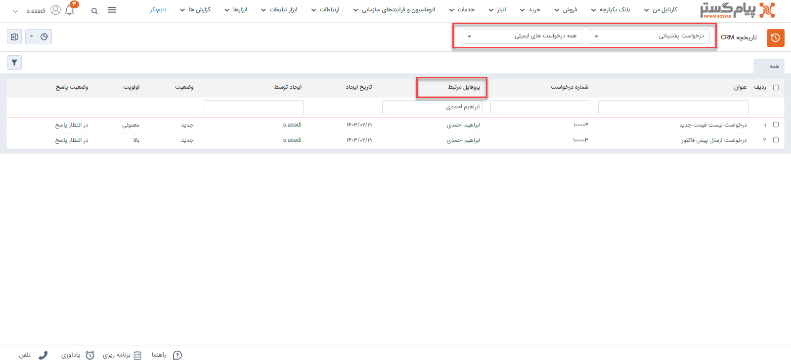

# مشاهده لیست درخواست‌ها
دراین مقاله روش‌های مشاهده‌ی لیست درخواست‌ها در دو حالت بررسی می‌شود: 
- [مشاهده لیست تمامی درخواست‌های ثبت شده](#AllTicketing)
- [مشاهده درخواست‌های ثبت شده برای یک هویت](#CustomerTicketing)

## مشاهده لیست همه درخواست‌ها{#AllTicketing}
برای مشاهده لیست همه درخواست‌های ثبت شده در سیستم، می‌توانید از دو مسیر اقدام نمایید: 

- از مسیر **تب خدمات** > **درخواست‌ها** > **انتخاب زیرنوع موردنظر از درخواست‌ها**
با انتخاب یکی از زیرنوع‌های درخواست، وارد صفحه درخواست‌ها می‌شوید. در این حالت، تمامی درخواست‌های ثبت‌شده از زیرنوع انتخابی به شما نمایش داده‌می‌شود. 

از قسمت بالای صفحه می‌توانید سایر زیرنوع‌ها و یا همه را برای نمایش انتخاب نمایید. با انتخاب «همه درخواست‌ها»، تمامی درخواست‌ها از همه زیرنوع‌ها در لیست به شما نمایش داده‌می‌شود. 

- از مسیر **تب بانک یکپارچه** > **تاریخچه CRM**  می توانید با اعمال فیلتر «نوع» بر روی درخواست‌ها و انتخاب زیرنوع مورد نظر/همه در فیلتر کناری، تمامی درخواست‌های ثبت شده را مشاهده نمایید.

> **نکته** 
> در صورت داشتن مجوز مشاهده لیست زیرنوع‌های درخواست‌ها، شما می‌توانید تمامی درخواست‌های ثبت شده را در این قسمت‌ها مشاهده نمایید. در غیراین صورت تنها مجاز به مشاهده درخواست‌هایی که خودتان ثبت کرده‌اید، خواهید بود. 

## مشاهده لیست درخواست‌های ثبت‌ شده برای یک هویت{#CustomerTicketing}
برای مشاهده لیست درخواست‌های ثبت شده برای یک مخاطب می‌توانید یکی از چهار مسیر زیر را انتخاب نمایید: 

- از طریق صفحه **پروفایل مخاطب** > **تب درخواست‌ها** می‌توانید به درخواست‌های مشتری دسترسی داشته‌باشید. بدین منظور با استفاده از ویجت جستجوی سریع، وارد صفحه پروفایل هویت مورد نظر شوید. در صفحه اصلی پروفایل هویت از قسمت «درخواست‌ها» می‌توانید تمامی درخواست‌های مخاطب را مشاهده نمایید.  
توجه داشته‌باشید که در این صفحه همه‌ی انواع درخواست‌ها به شما نمایش داده‌می‌شود. برای اینکه فقط درخواست‌های را مشاهده نمایید، با استفاده از فیلتر بالای صفحه، در قسمت نوع، «درخواست» را انتخاب نمایید. 

- از طریق صفحه **پروفایل مخاطب** > **تب سوابق** نیز می‌توانید به درخواست‌های ثبت شده برای مخاطب دسترسی داشته‌باشید. بدین منظور با استفاده از ویجت جستجوی سریع، وارد صفحه پروفایل هویت مورد نظر شوید. در صفحه اصلی پروفایل هویت، در تب سوابق، گزینه «پیش‌فاکتور» را در لیست «نوع آیتم» انتخاب نمایید تا پیش‌فاکتورهای فروش ثبت‌شده در فرآیند فروش هویت مورد نظر را مشاهده کنید. 

- از طریق **تب خدمات** > **درخواست‌ها** > **زیرنوع درخواست** به صفحه لیست درخواست‌ها رفته و در صورت نیاز زیرنوع درخواست‌ها را به «همه درخواست‌های ایمیلی» تغییر دهید (از فلش کنار کادر قرمز بالا استفاده کنید). با استفاده از جستجوی «پروفایل مرتبط» درخواست‌‌های ثبت شده برای هویت مورد نظر را جدا کنید. بدین منظور کافیست نام هویت را در  قسمت مربوطه نوشته و Enter کنید. 

- از طریق **تب بانک یکپارچه** > **تاریخچه CRM** با اعمال فیلتر(کادر قرمز بالا)،  درخواست‌ها را یافته  و با استفاده از جستجوی «پروفایل مرتبط» (کادر قرمز پایین) درخواست‌های هویت مورد نظر را جدا کنید. بدین منظور کافیست نام هویت را در قسمت مربوطه نوشته و Enter کنید. 

> **نکته** 
> برای مشاهده درخواست‌ها در سابقه یک هویت باید مجوز مشاهده سوابق را بر روی آن زیرنوع هویت و همچنین مشاهده آیتم را در زیرنوع‌های درخواست‌ها داشته‌باشید.  
