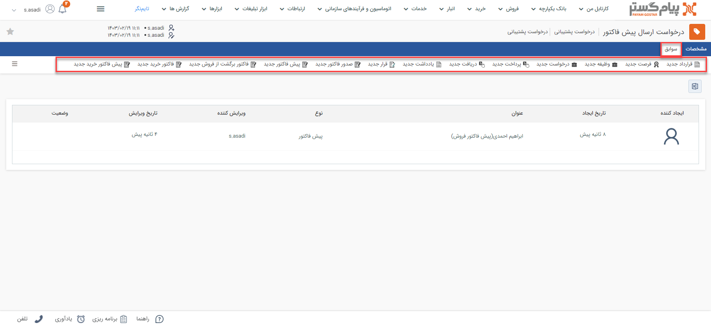

# سوابق مرتبط بادرخواست‌ پشتیبانی
در صفحه درخواست‌ها، تب «سوابق» در کنار مشخصات آن مشاهده می‌شود. در این مقاله با کاربرد این دو تب آشنا می‌شوید: 

## سوابق درخواست
مشابه فرصت، موجودیت‌های مختلفی (از جمله پیش‌فاکتور، فاکتور، قرارداد، دریافت، قرارملاقات و سایر موارد) می‌توانند به درخواست شما متصل باشند. این آیتم‌‌ها علاوه بر سوابق هویت، در سوابق درخواستی که به آن متصل شده‌اند نیز قابل دسترس هستند. برای دسترسی به آن‌ها کافیست وارد صفحهدرخواست مورد نظر شوید و بر روی تب سوابق کلیک کنید. 

نوار بالایی تب سوابق درخواست، امکان ثبت سوابق جدید را به شما می‌دهد. سوابقی که از این بخش ثبت شوند، به درخواست مذکور متصل خواهند‌بود. 
