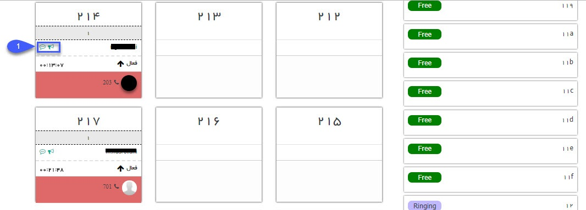

# داشبورد مرکز تماس
در این صفحه می‌توانید خطوط داخلی که در نرم‌افزار تعریف شده است را مشاهده کنید.
 علاوه بر نمایش وضعیت خطوط (مشغول، آزاد و ...)، امکان شنود مکالمه داخلی کاربران و همچنین امکان نجوا (مکالمه با کاربر بدون اینکه شخصی که در حال مکالمه با او هستید از ضبط شدن مکالمه مطلع شود) نیز وجود دارد.

در صورتی که از سیستم تلفنی سانترال برای ضبط مکالمه استفاده می‌کنید، برای ضبط مکالمات باید دستگاه تلسا را تهیه کنید. در سیستم سانترال امکان داشتن داشبورد مرکز تماس برای شما فراهم شده است. با استفاده از این داشبورد فقط امکان مشاهده وضعیت خطوط و شماره تماسی که با آن صحبت می‌شود، وجود دارد. در صورت استفاده از سیستم تلفنی ویپ شما علاوه بر داشتن داشبورد مرکزتماس قابلیت شنود و نجوا مکالمه را نیز دارید.

در سمت راست لیست خطوط و سمت چپ لیست داخلی‌ها نمایش داده می‌شود، داخلی‌هایی که در حال مکالمه باشند از این قسمت مشخص است و می‌توانید جزئیاتی مانند نام کاربر متناظر و مدت زمان مکالمه را مشاهده کنید.

1. **شنود و نجوا:** با استفاده از دکمه‌های این قسمت می‌توانید مکالمه را شنود کنید و یا پیغامی را برای شخص در حال مکالمه نجوا کنید.

