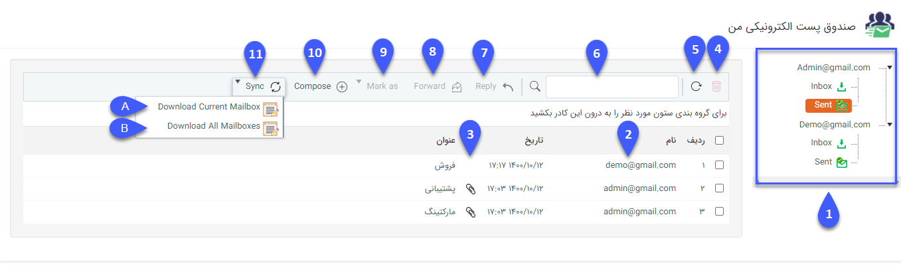
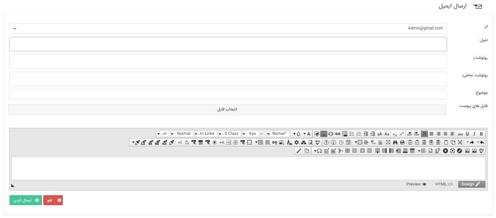
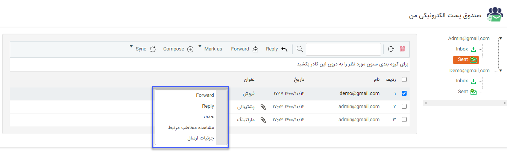

# صندوق پست الکترونیک 

از قسمت تنظیمات کلی بخش،ایمیل می‌توانید ایمیل‌های شخصی خود را برای ارسال و دریافت در نرم افزار تنظیم نمایید.

در این قسمت می‌توانید صندوق ارسال و دریافت تمامی ‌ایمیل‌هایی که با کاربری شما به اشتراک گذاشته شده‌اند را مشاهده و مدیریت کنید و همچنین ایمیل جدید ارسال کنید.

**1**. همانطور که در تصویر مشاهده می‌کنید، ایمیل‌های تنظیم شده در سمت راست نمایش داده می‌شود. هر کدام از ایمیل‌ها شامل Inbox،  Sent است .

توجه داشته باشید در این قسمت تنها ایمیل‌هایی نمایش داده می‌شود که در هنگام تنظیم با کاربری شما به اشتراک گذاشته شده باشند .

**2**. در این ستون نام فرستنده ایمیل (در صندوق inbox) یا دریافت کننده ایمیل (در صندوق Sent) نمایش داده می‌شود. 

**3**. در این ستون می‌توانید مشاهده کنید که این ایمیل فایل پیوست دارد یا خیر.

**4**. پس از انتخاب یک یا چند تا از ایمیل‌ها، با کلیک بر روی این دکمه می‌توانید آن‌ها را حذف کنید.

**5**. می‌توانید صفحه فعلی خود را بازخوانی (Refresh) کنید.

**6**. می‌توانید بر اساس فرستنده/دریافت کننده ایمیل، عنوان ایمیل و همچنین محتوای ایمیل در این قسمت جستجو انجام دهید.

**7**. پس از انتخاب یکی از ایمیل‌ها، با کلیک بر روی این دکمه می‌توانید یک ایمیل برای پاسخدهی (Reply) تنظیم نمایید.

**8**. پس از انتخاب یکی از ایمیل‌ها، با کلیک بر روی این دکمه می‌توانید آن را برای هویت/هویت‌های دیگری ارسال (Forward) کنید.

**9**. پس از انتخاب یک یا چند تا از ایمیل‌ها، با کلیک بر روی این دکمه می‌توانید وضعیت آن/آن‌ها را به خوانده شده یا خوانده نشده تغییر دهید.

**10**. برای ارسال یک ایمیل جدید می‌توانید از منوی بالای صفحه بر روی Compose کلیک نمایید.

**11**. دکمه Sync یا همگام سازی برای دانلود کردن ایمیل‌های جدید و نمایش آن‌ها در نرم افزار می‌باشد. با کلیک بر روی این دکمه دو گزینه نمایش داده خواهد شد:

**A-** با انتخاب این گزینه وضعیت ایمیل‌های دریافتی و ارسالی این ایمیل (ایمیل انتخاب شده در لیست سمت راست) بروزرسانی خواهد شد.

**B-** با انتخاب این گزینه وضعیت ایمیل‌های دریافتی و ارسالی تمامی ‌ایمیل‌ها بروزرسانی خواهد شد.

> **نکته مهم:** توجه داشته باشید در صورتی که در قسمت تنظیمات کلی، [بروز رسانی خودکار خطوط ](https://github.com/1stco/PayamGostarDocs/blob/master/Help/Settings/General-settings/Automatic-update-of-lines/Automatic-update-of-lines.md)چک باکس دریافت خودکار ایمیل را فعال کرده باشید، در صندوق پست الکترونیکی دکمه Sync نمایش داده نخواهد شد و ایمیل‌های نمایش داده شده به صورت خودکار با توجه به بازه زمانی مشخص شده در تنظیمات کلی بروزرسانی خواهند شد. 

## ارسال یک ایمیل جدید

**از:** در این قسمت می‌توانید از بین ایمیل‌های به اشتراک گذاشته شده برای شما، یک ایمیل را به عنوان فرستنده انتخاب نمایید.

**اصل:** در این قسمت آدرس ایمیل گیرنده یا گیرندگان مورد نظر خود را وارد کنید.

**رونوشت:** در صورتی که برای چند گیرنده ایمیلی به حالت رونوشت ارسال شود، تمامی گیرندگان می‌توانند لیست باقی گیرندگان و ایمیل‌هایی که در پاسخ ایمیل فرستاده شده است را مشاهده کنند.

**رونوشت مخفی:** در صورتی که ایمیل به حالت رونوشت مخفی ارسال شود، لیست گیرندگان و ایمیل‌هایی که در پاسخ ایمیل فرستاده شده است قابل مشاهده نخواهد بود ( در واقع نمی‌توان فهمید ایمیل به چه کسانی ارسال شده و چه ایمیل‌هایی در جواب ایمیل فرستاده شده است.) .

> **نکته:** ارسال ایمیل به صورت رونوشت و رو نوشت مخفی تنها از طریق پروتکل SMTP امکان پذیر است. 

 
در صورت نیاز به الصاق فایل (Attach) می‌توانید از گزینه انتخاب فایل استفاده کنید. سپس موضوع و محتوای ایمیل خود را مشخص کرده و روی دکمه "ارسال کردن" کلیک کنید.

## گزینه‌های کلیک راست روی ایمیل

  کلیک راست بر روی هر کدام از ایمیل‌ها شامل گزینه‌های Reply، Forward ، حذف و مشاهده مخاطب مرتبط(جهت نمایش پروفایل هویت مرتبط با این آدرس ایمیل) می‌شود. همچنین کلیک راست روی ایمیل‌های صندوق ارسال (Sent) گزینه جزئیات ارسال را نیز دارد که در آن می‌توانید اطلاعاتی مانند وضعیت ارسال و تحویل یا کاربر ارسال کننده ایمیل را مشاهده کنید.

 
 
##  جزئیات ارسال:
 
 
 
 
 
