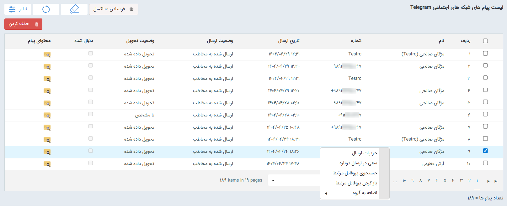

# پیام‌های ارسالی و دریافتی شبکه‌های پیام‌رسان 
در بخش ارتباطات می‌توانید لیست پیام‌های ارسالی و دریافتی هر خط را به صورت مجزا مشاهده نمایید، به جزئیات آن‌ها دسترسی داشته‌باشید و در صورت لزوم از آن‌ها خروجی اکسل تهیه کنید.  

> **نکته** 
> به منظور آشنایی با هر یک از اطلاعات قابل مشاهده در لیست پیام‌ها، پیشنهاد می‌شود که راهنمای [لیست پیام‌های دریافتی از شبکه‌های پیام‌رسان](https://github.com/1stco/PayamGostarDocs/blob/master/Help/Marketing/SocialNetworkMessage/List/ReceivedList.md) و [لیست پیام‌های ارسالی از شبکه‌های پیام‌رسان](https://github.com/1stco/PayamGostarDocs/blob/master/Help/Marketing/SocialNetworkMessage/List/SentList.md) را مطالعه نمایید. 

در این لیست می‌توانید پیام‌های ارسالی/دریافتی از خط انتخابی در شبکه‌ی پیام‌رسان را مشاهده نمایید. در صورت نیاز به مشاهده‌ی لیست‌ پیام‌های ارسالی و دریافتی تمامی خطوط به صورت یکجا، از تب تبلیغات اقدام به دریافت لیست نمایید. 
