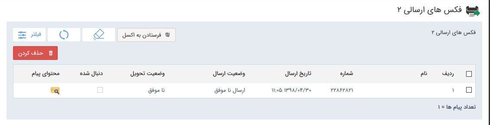

# لیست فکس‌ها  

 > نکته: لطفا ابتدا قسمت[ اطلاعات مشترک ابزارها ](https://github.com/1stco/PayamGostarDocs/blob/master/Help/Marketing/moshtarak-abzar/moshtarak-abzar.md)را مطالعه کنید.

در این قسمت، لیست خطوط عمومی (منظور از خطوط عمومی خطوطی هستن که به کاربر خاصی اختصاص داده نشده است، یعنی کاربر در این قسمت لیست خطوطی رو مشاهده میکند  که به خودش اختصاص داده شده و یا به هیچ کاربر دیگری اختصاص داده نشده )   در اختیار قرار میگیرد تا با انتخاب آن، لیست فکس های ارسالی و دریافتی را ببینید.

در لیست دریافت هم  اطلاعات ارسال کننده ، خط دریافتی و محتوای پیام قابل مشاهده است .

