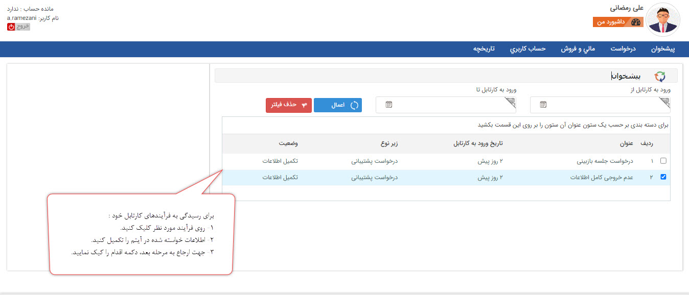
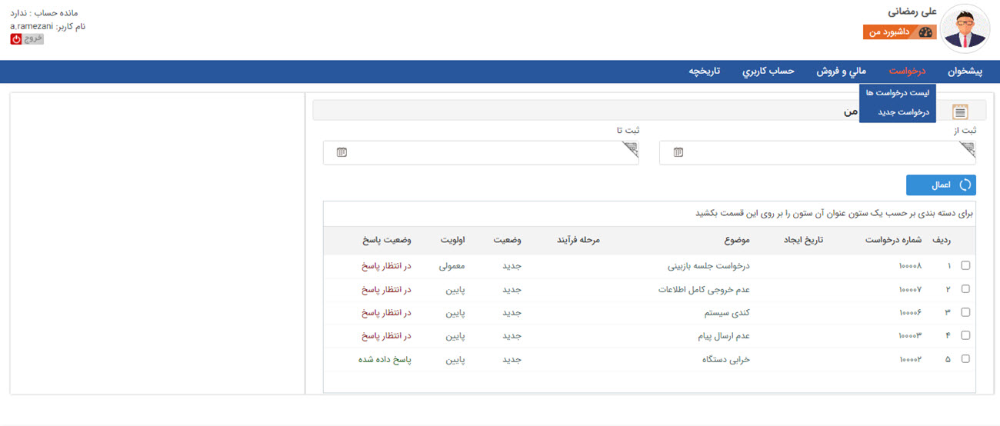
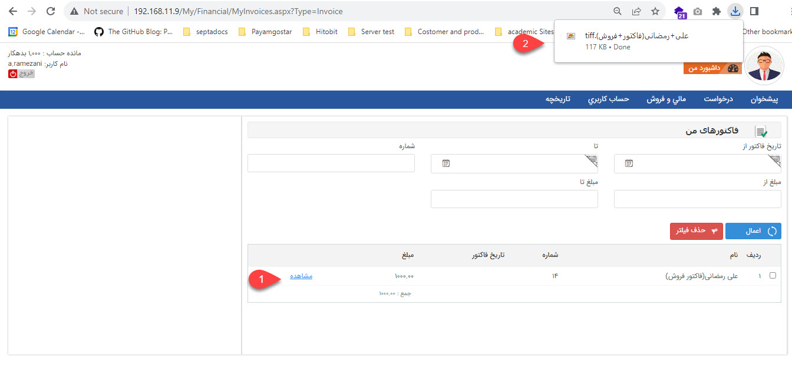
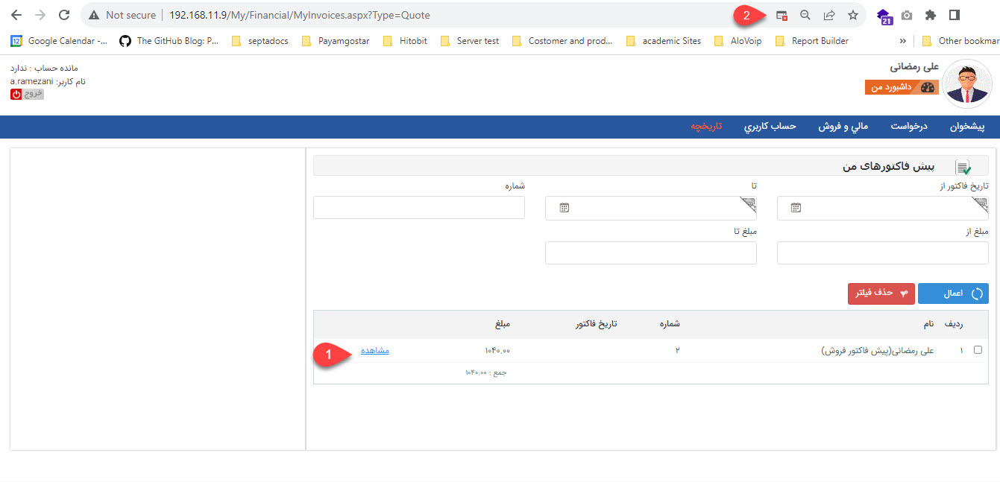
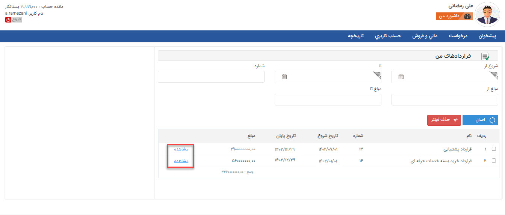
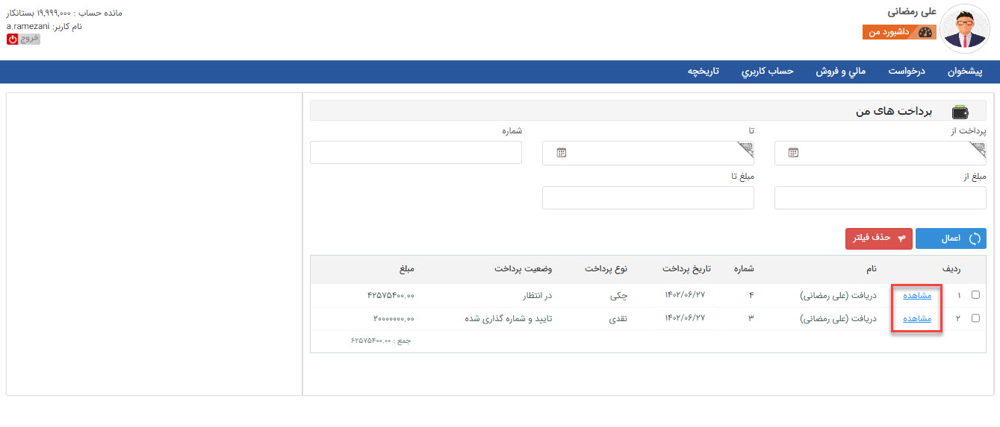

# داشبورد باشگاه مشتریان

مشتریان شما در صورت دارا بودن **نام کاربری** و **رمز عبور**، می‌توانند پس از ورود به سوابق، فرآیندها و اسناد مرتبط با خود دسترسی داشته باشند.
مانده حساب، فرآیندها، امیتازات، ثبت و مشاهده درخواست‌ها و آیتم‌های مالی در این بخش برای کاربران امکان پذیر است. 

> **نکته** 
> - برای هویت‌های از نوع **مشتری**، **نماینده** و **تامین کننده** امکان تعریف کاربر باشگاه مشتریان وجود دارد. **کاربران سیستم** یا هویت از نوع **اپراتور** نیز از مسیر **حساب کاربری** > **پروفایل من** می‌توانند به این صفحه دسترسی داشته باشند و سوابق مرتبط با خود را مشاهده نمایند.
> - برای اینکه کاربر باشگاه مشتریان بتواند لیست سوابق مرتبط با خود را **مشاهده** نماید، باید مجوز «**مشتریان اجازه مشاهده این نوع را دارند**» روی آیتم‌ها فعال شده باشد.
> - برای اینکه کاربر باشگاه مشتریان بتواند لیست سوابق مرتبط با خود را **ایجاد** نماید، باید مجوز «**مشتریان اجازه ایجاد این نوع را دارند**» روی آیتم‌ها فعال شده باشد.

## پیشخوان و انجام اقدامات حین فرآیند توسط مشتری{#ClubCartable}
از طریق پیشخوان باشگاه مشتریان می‌توانید با مشتریان خود تعامل داشته باشید. یعنی می‌توانید در فرآیندهایی که نیاز است بخشی از اقدامات توسط مشتریان شما انجام شود، تنظیماتی لحاظ کنید که فرآیند را به کارتابل کاربری مشتری خود ارجاع دهید. 

> **نکته** 
> لیستی که کاربر باشگاه مشتریان در بخش پیشخوان مشاهده می‌کند، فرآیندهایی است که مشتری مسئول مرحله‌ای از فرآیند است. بنابراین اگر مجوز «**مشتریان اجازه مشاهده این نوع را دارند**» را در تنظیمات شخصی‌سازی **فعال نکنید،** باز هم مشتری آن را در این بخش مشاهده می‌کند. بنابراین بخش پیشخوان از دسترسی‌ مشاهده در شخصی‌سازی آیتم مستثنا است.

## ثبت درخواست پشتیبانی و مشاهده لیست درخواست‌های کاربر
درصورتی که ماژول درخواست‌های پشتیبانی را تهیه کرده باشید، می‌توانید دسترسی‌های **ایجاد** و **مشاهده** را برای درخواست پشتیبانی فعال کنید که مشتری شما از طریق باشگاه مشتریان بتواند درخواست پشتیبانی ثبت کرده و لیست درخواست‌های مرتبط با پروفایل خود را مشاهده نماید. این درخواست‌ها ممکن است توسط خود مشتری یا توسط شما در نرم‌افزار پیام‌گستر  (کاربران سیستم) ثبت شده باشند.

## مشاهده لیست فاکتورهای فروش
در این بخش کاربران فاکتورهایی که دسترسی **مشاهده** در تنظیمات شخصی‌سازی آن فعال شده است، را مشاهده می‌نمایند. این فاکتورهای فروش ممکن است توسط خود مشتری یا توسط شما در نرم‌افزار پیام‌گستر (کاربران سیستم) ثبت شده باشند.

> **نکته** 
> فاکتورهای فروش **تایید شده** در این جدول قابل نمایش هستند.

1. با کلیک روی گزینه **مشاهده** امکان دانلود قالب چاپ
فاکتور فروش برای کاربر باشگاه مشتریان فراهم می‌شود.
2. برای دانلود فایل یک Popup در مرورگر نمایش داده می‌شود که باید اجازه دانلود فایل را به سیستم داده تا فایل برای کاربر قابل مشاهده شود.

## مشاهده لیست پیش‌فاکتورهای فروش
در این قسمت کاربر باشگاه مشتریان می‌تواند لیست پیش‌فاکتورهایی که دسترسی **مشاهده** در تنظیمات شخصی‌سازی آن فعال شده است، را مشاهده نماید. این پیش‌فاکتورها ممکن است توسط خود مشتری یا توسط شما در نرم‌افزار پیام‌گستر (کاربران سیستم) ثبت شده باشند.

> **نکته** 
> پیش‌فاکتورهای فروش **تایید شده** در این جدول قابل نمایش هستند.

1. با کلیک روی گزینه **مشاهده** امکان دانلود قالب چاپ پیش‌
فاکتور فروش برای کاربر باشگاه مشتریان فراهم می‌شود.
2. برای دانلود فایل یک Popup در مرورگر نمایش داده می‌شود که باید اجازه دانلود فایل را به سیستم داده تا فایل برای شما قابل مشاهده شود.

## مشاهده لیست قراردادها
کاربر قراردادهایی که دسترسی **مشاهده** در تنظیمات شخصی‌سازی آن فعال شده است، را مشاهده می‌نماید. این قراردادها ممکن است توسط خود مشتری یا توسط شما در نرم‌افزار پیام گستر (کاربران سیستم) ثبت شده باشند.

> **نکته** 
> قراردادهای **تایید شده** در این جدول قابل نمایش هستند.

1. با کلیک روی گزینه **مشاهده** امکان دانلود قالب چاپ پیش‌
فاکتور فروش برای کاربر باشگاه مشتریان فراهم می‌شود.
2. برای دانلود فایل یک Popup در مرورگر نمایش داده می‌شود که باید اجازه دانلود فایل را به سیستم داده تا فایل برای شما قابل مشاهده شود.

## ثبت پرداخت وجه و مشاهده لیست پرداخت‌های انجام شده
کاربر در باشگاه مشتریان می‌تواند از مسیر **مالی و فروش** > **پرداخت جدید** پرداخت وجه انجام دهد. روش‌های ممکن جهت پرداخت وجه شامل موارد زیر می‌باشد:
-  **پرداخت اینترنتی**: با وارد کردن مبلغ مورد نظر و کلیک روی دکمه پرداخت، مشتری به پنل پرداخت واسط هدایت می گردد تا پرداخت آنلاین انجام دهد.
- **واریز نقدی به حساب**: کاربر اطلاعات واریز وجه خود را وارد می‌کند و پس از ذخیره یک دریافت در سوابقش ایجاد می‌شود.
- **انتقال از طریق کارت خودپرداز**: اگر کاربر پرداخت وجهی از طریق خود پرداز انجام داده باشد، از این قسمت می‌‌تواند اطلاعات واریز وجه خود را ثبت نموده که یک سابقه دریافت در پرونده‌ی او در پیام‌گستر ثبت خواهد شد.

کاربر باشگاه مشتریان از مسیر **مالی و فروش** > **پرداخت‌ها** لیست تمامی آیتم‌های دریافتی که در سابقه‌ی او ثبت شده باشد را مشاده می‌کند. لازم به ذکر است که باید مجوز «**مشتریان اجازه مشاهده این نوع را دارند**» برای آیتم فعال شده باشد. این دریافت ها ممکن است تایید شده، رد شده یا در انتظار باشند. این دریافت ممکن است توسط خود مشتری یا توسط کاربران سیستم ثبت شده باشند.

> **نکته**  
> حساب های مجاز به انتخاب در هریک از روش های پرداخت بستگی به تنظیمات اعمال شده برای هریک از حساب ها در قسمت [مدیریت حساب های مالی ](https://github.com/1stco/PayamGostarDocs/blob/master/Help/Basic-Information/Financial-account-management/Financial-account-management.md)دارد.

## پرداخت‌های رد شده
در این قسمت تمامی دریافت های رد شده به مشتری نمایش داده خواهند شد.

## لیست اسناد در دست بررسی
در این قسمت سوابق فاکتور فروش، پیش‌فاکتور فروش، قرارداد و دریافت **رد شده** و در **انتظار تایید** مشتری نمایش داده می شوند.

> **نکته** 
اگر در تنظیمات شخصی‌سازی آیتم‌های پیش‌فاکتور فروش، فاکتور فروش، قرارداد و دریافت الزام به **تایید** و **شماره‌گذاری** را فعال کرده باشید، سابقه‌ی ثبت شده در پیام‌گستر به کارتابل کاربری که مجوز تایید و شماره‌گذاری داشته باشد وارد می‌شود.

## مشاهده امتیازات در باشگاه مشتریان
گزارش لیست امتیازهای کسب شده، مصرف شده، منقضی شده با جزئیات کامل در این بخش قابل مشاهده است.

## مدیریت حساب کاربری در باشگاه مشتریان
در این قسمت مشتریان می توانند اطلاعات حساب کاربری خود را مشاهده کنند و یا رمز عبور و لوگوی کاربری خود را تغییر دهند، همچنین در صورت فعال بودن ماژول سیستم امتیازدهی می توانند امتیازات خود را نیز مشاهده نمای

## تاریخچه
در این قسمت کاربر باشگاه مشتریان امکان ثبت و مشاهده سوابق مرتبط با پروفایل خود را دارد. در خصوص ثبت سابقه جدید و مشاهده لیست سوابق نکات مهمی وجود دارد که لازم است به آن توجه نمایید.

- برای آیتم‌های مالی علاوه بر چک باکس «**مشتریان اجازه ایجاد این نوع را دارند**» باید دسترسی **ذخیره اولیه** روی آیتم‌ در قسمت سازنده فعال شود. برای دسترسی به این قسمت از مسیر زیر باید اقدام نمایید: 
**تنظیمات** > **شخصی‌سازی CRM** > **نمای کلی** > **مجوز کاربر روی آیتم در لیست آیتم‌ها** > **سازنده**
- تنها سوابقی را که مشتری خودش در باشگاه ثبت کرده باشد در این لیست مشاهده می‌کند.

