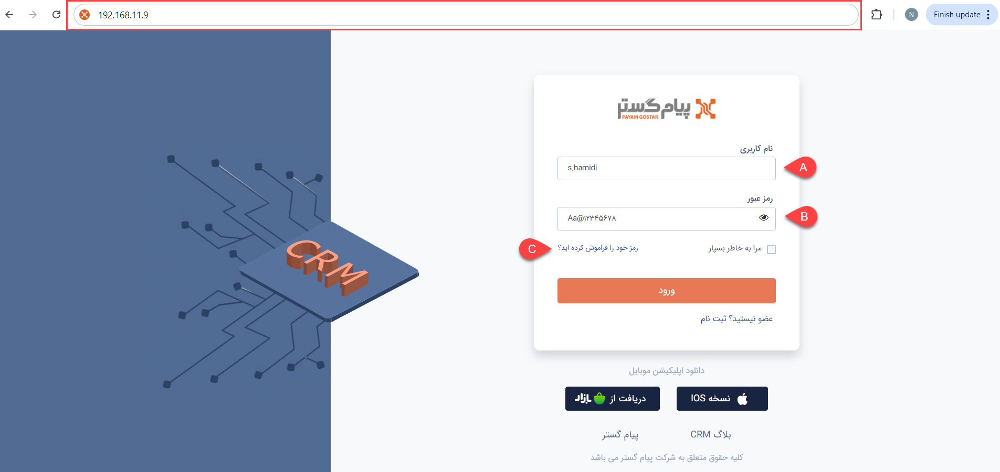
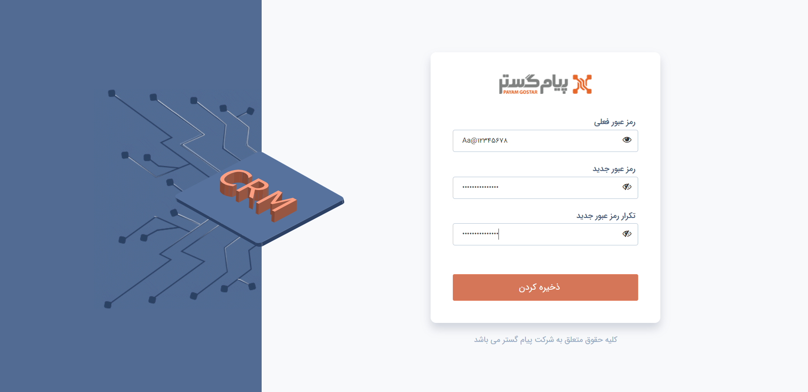
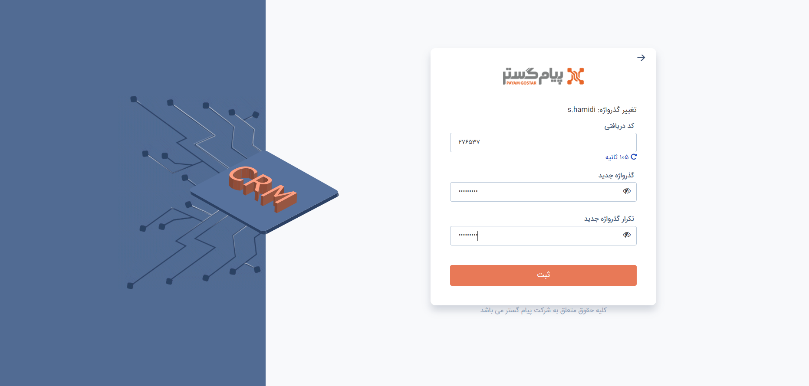

# ورود به پیام‌گستر
برای ورود به نرم‌افزار پیام‌گستر می‌توانید از تمامی مرورگرها (مانند Chrome، Firefox و Brave) استفاده نمایید. بدین منظور کافیست که آدرس url نرم‌افزار خود که هنگام نصب به شما اعلام گردیده است را در قسمت آدرس (که در تصویر با کادر قرمز مشخص شده‌است) وارد کنید. 
سپس با استفاده از **نام کاربری** (A) و **رمز عبور** (B) به حساب کاربری پیام‌گستر خود وارد شوید. 

> **نکته** 
> به صورت پیش‌فرض، نام کاربری مدیر سیستم **admin** و رمز عبور آن **dmin@dmin@** تعیین شده‌است که پس از ورود می‌توانید اقدام به تغییر آن نمایید. نام کاربری و رمز عبور سایر کاربران به هنگام تعریف کاربری‌هایشان توسط مدیر سیستم تعیین شده و از طرف ایشان به کاربران اعلام می‌شود. 

## تغییر رمز عبور پس از اولین ورود
پس از اولین ورود هر کاربر، درخواست تغییر رمز عبور برای او نمایش داده‌می‌شود. با مشاهده تصویر زیر باید رمز عبوری که با آن وارد شده‌اید را درج کنید و سپس رمز عبور مورد نظر خودتان را وارد و تکرار نمایید. سیستم شما را مجدد به صفحه ورود بازمی‌گرداند. از این پس می‌توانید با نام کاربری و رمز عبوری که تعریف کرده‌اید وارد حساب کاربری‌تان بشوید. 

## فراموشی رمز عبور{#OTP}
چنانچه رمز عبور خود را فراموش کردید، بر روی لینک مربوطه (C) کلیک کنید و در صفحه‌ی جدید، نام کاربری خود را وارد نمایید. پس از هدایت به صفحه زیر، یک کد یکبار مصرف (OTP) برای شما ارسال می‌شود. بنابر تنظیمات اعمال شده در نرم‌افزار، این پیام ممکن است از طریق پیامک و یا ایمیل برای شما ارسال شود. کد OTP را وارد کرده و رمز عبور جدید خود را درج و تکرار نمایید. 

اگر تغییر رمز شما با موفقیت انجام شود، مجدد به صفحه اول ورود منتقل می‌شوید و می‌توانید با رمز عبور جدیدتان وارد حساب کاربری خود شوید. 
