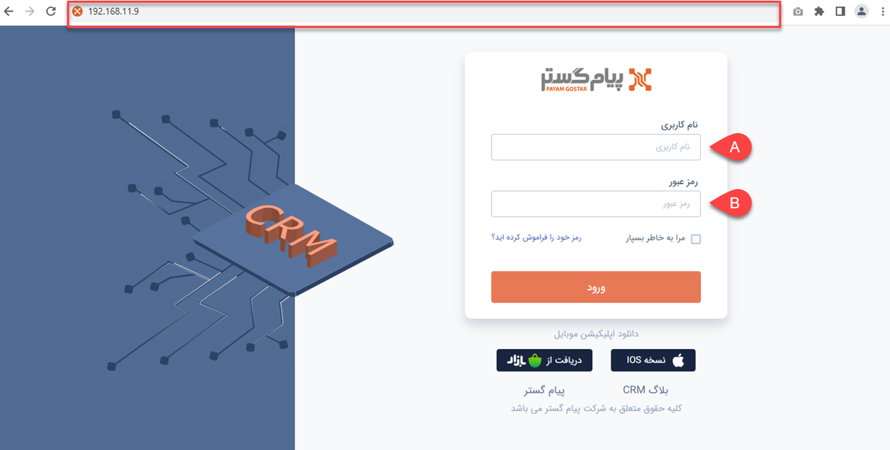
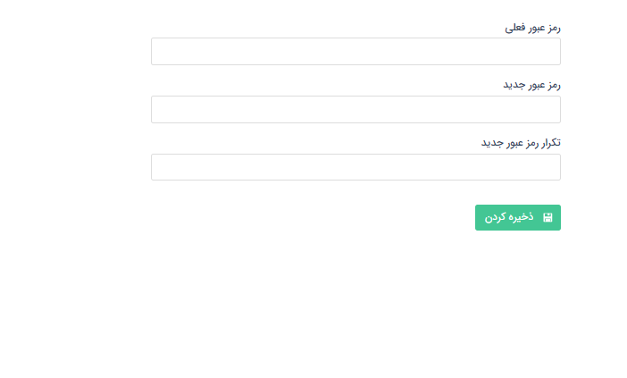

# ورود به پیام‌گستر
برای ورود به نرم‌افزار پیام‌گستر می‌توانید از تمامی مرورگرها (مانند Chrome، Firefox و Brave) استفاده نمایید. بدین منظور باید آدرس url نرم‌افزار خود که هنگام نصب به شما اعلام گردیده است را در قسمت آدرس (که در تصویر با کادر قرمز مشخص شده است) وارد کنید. 
سپس با استفاده از **نام کاربری** (A) و **پسورد** (B) به پنل کاربری پیام‌گستر خود وارد شوید. 

> **نکته** 
> به صورت پیش‌فرض، نام کاربری مدیر سیستم **admin** و رمز عبور آن **dmin@** تعیین شده است که پس از ورود می‌توانید اقدام به تغییر آن نمایید. 
>> نام کاربری و رمز عبور سایر کاربران به هنگام تعریف کاربری‌هایشان توسط مدیر سیستم تعیین شده و از طرف ایشان به کاربران اعلام می‌شود. 

## تغییر رمز عبور پس از اولین ورود
پس از اولین ورود هر کاربر، درخواست تغییر رمز عبور برای او نمایش داده می‌شود. با مشاهده تصویر زیر باید رمز عبوری که با آن وارد شده‌اید را درج کنید و سپس رمز عبور مورد نظر خودتان را وارد و تکرار نمایید. سیستم شما را مجدد به صفحه ورود بازمی‌گرداند. از این پس می‌توانید با نام کاربری و رمز عبوری که تعریف کرده‌اید وارد حساب کاربری‌تان بشوید. 

> **نکته** 
> در صورت تمایل می‌توانید [رمز عبور](https://github.com/1stco/PayamGostarDocs/blob/master/Help/home/UserPasswordChange.md) خود را به صورت دوره‌ای تغییر دهید. لکن امکان تغییر **نام کاربری** وجود ندارد.