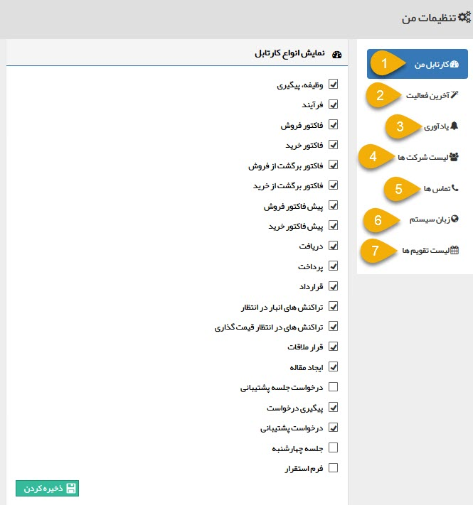
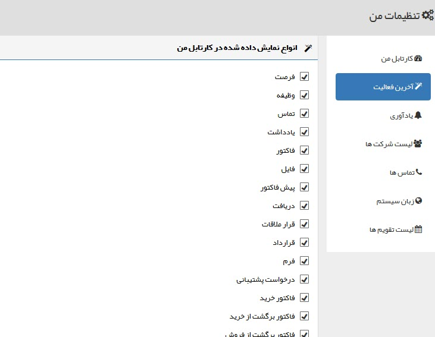
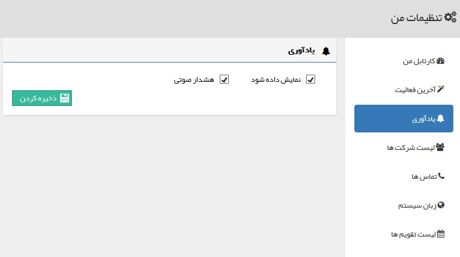
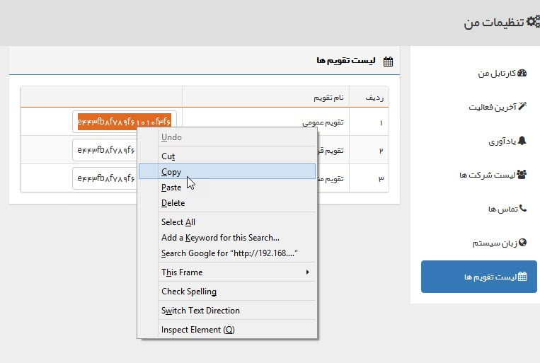
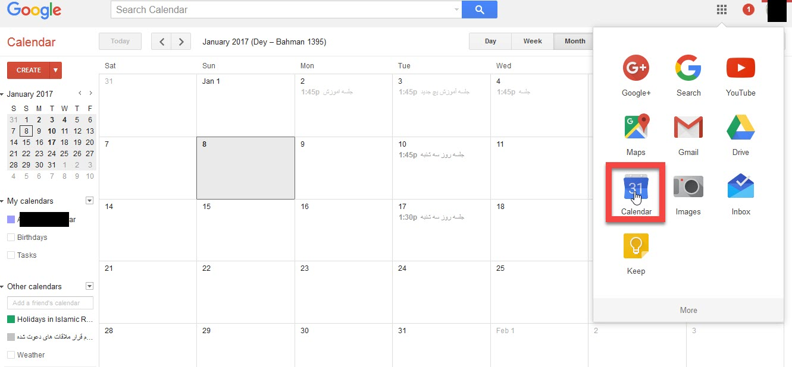
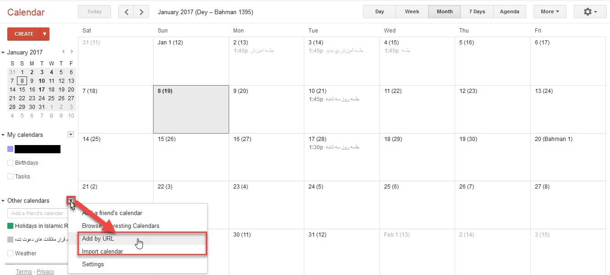
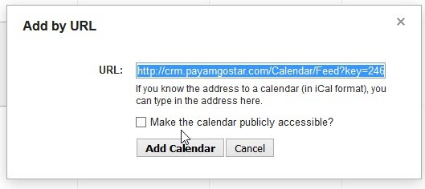

# پروفایل من

در این قسمت می‌توانید تنظیمات کاربری خود را ویرایش نمایید. تنظیمات اعمال شده در این بخش صرفاً در مورد کاربری شما اعمال شده و تاثیری در حساب کاربری سایر کاربران ندارد.

1. اطلاعات کاربری
در این صفحه می‌توانید اطلاعات اولیه کاربری خود از جمله نام کاربری، نام پروفایل و همچنین ایمیلتان را مشاهده نمایید. توجه داشته‌باشید که اطلاعات مذکور از این صفحه قابل ویرایش نمی‌باشد. نام کاربری قابل ویرایش نبوده و برای تغییر نام و ایمیل باید از صفحه ویرایش اطلاعات کاربری و یا پروفایل هویتتان اقدام نمایید.
با کلیک بر روی فیلد تصویر می‌توانید برای پروفایل خود تصویر انتخاب نمایید.

2. 

این قسمت تنظیمات مرتبط با هر کاربر نمایش داده می‌شود.

 **1. کارتابل من:** تب های نمایش داده شده در[ کارتابل](https://github.com/1stco/PayamGostarDocs/blob/master/Help/home/widget/Cardboard/Cardboard.md) خود را در این قسمت می توانید تعیین کنید.
 
 
 
 
 **2. آخرین فعالیت:** سوابقی که در ویجت آخرین فعالیت نمایش داده می شود را می توانید تعیین کنید.

**3. یادآوری:** می توانید تعیین کنید که هنگام دریافت کار جدیدی (وظیفه، فرایند و ...) در کارتابل، یک اعلان(notification) نشان داده شود یا خیر، و اینکه این اعلان با هشدار صوتی همراه باشد یا خیر

**5. تماس‌ها:** می توانید تعیین کنید که هنگام دریافت یک تماس روی داخلی خود یکی از سه حالت زیر اتفاق بیافتد.

**A**. پروفایل هویت مرتبط به صورت خودکار برای شما باز شود.

> نکته: توجه داشته باشید که برای نمایش داده شدن پروفایل در هنگام تماس، باید در تنظیمات مرورگر خود Pop-up Blocking را غیر فعال کرده باشید.

**B**. می توانید انتخاب کنید که هنگام دریافت تماس، کدام آیتم مرتبط با هویت به منظور ایجاد به صورت خودکار باز شود. ابتدا نوع آیتم سپس زیر نوع آیتم را مشخص کنید و ذخیره کنید.

> نکته: کاربر برای ایجا آیتم باز شده ، باید مجوز "ذخیره اولیه" را روی آیتم انتخاب شده در این قسمت  داشته باشد.

**C**. هنگام دریافت تماس هیچ پروفایل یا آیتمی باز نشود.{#PhoneHistoryNumber}

تعداد تماس‌های نمایش داده شده در نوار تلفن را هم می‌توانید تعیین کنید

**6. زبان سیستم:** از بین زبان های مجاز در نرم‌افزار میتوانید زبان دلخواه را انتخاب کنید.

تعریف  زبان  برای سیستم از قسمت مدیریت زبان ها انجام می شود .

**7. لیست تقویم‌ها:** لیست تقویم‌هایی که به آن دسترسی دارید، در این قسمت به شما نمایش داده می‌شود. از این طریق می‌توانید با استفاده از لینک هر تقویم، آن را به برنامه‌ها و وبسایت‌هایی که از آن پشتیبانی می‌کنند، اضافه کنید. به عنوان مثال می‌توانید تقویم مورد نظر را به تقویم گوگل خود اضافه متصل کرده و جلسات تنظیم شده را در آن مشاهده نمایید. قرار ملاقات‌های تنظیم شده برای شما در تقویم مورد نظر، در تقویم گوگل شما نمایش داده خواهد شد. 
برای اضافه کردن تقویم مورد نظر (در پیام‌گستر) به تقویم گوگل از روش زیر استفاده کنید:

ابتدا وارد بخش «تنظیمات من» شوید (از فلش سمت چپ بالای صفحه‌ی خانه می‌توانید به آن دسترسی داشته باشید) و لینک تقویم پیام‌گستر را کپی کنید.

سپس وارد تقویم گوگل (Google Calendar) شوید.

بر روی Other Calendars کلیک کنید و گزینه Add by URL را انتخاب کنید.

لینک تقویم‌هایی که در پیام‌گستر دارید را یک به یک از این طریق اضافه کنید.

