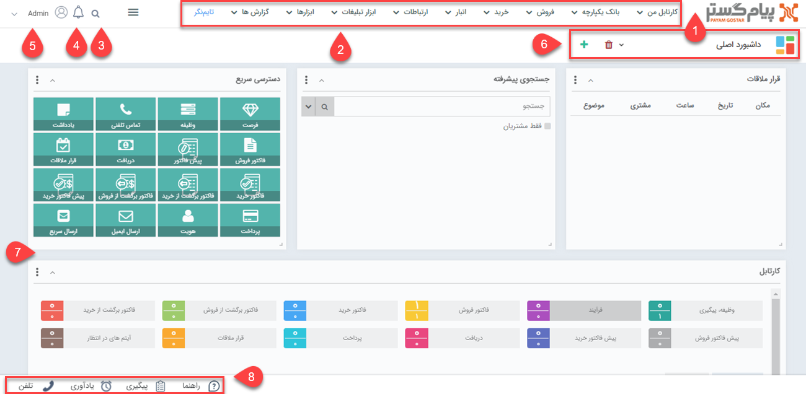

# آشنایی با صفحه خانه
پس از ورود به نرم‌افزار اولین صفحه‌ای که مشاهده می‌کنید، صفحه خانه یا داشبورد کاربری شما می‌باشد. در ادامه مطلب به موارد قابل مشاهده در صفحه خانه پرداخته می‌شود. 
> **نکته** 
> تفاوت صفحه اولیه برای کاربران مختلف از دو دلیل ناشی می‌شود: ۱) میزان دسترسی کاربران با یکدیگر متفاوت است. ۲) صفحه اولیه و داشبوردها قابلیت شخصی‌سازی دارند. این بدین معناست که چیدمان صفحه و داشبوردها می‌تواند بر اساس نیاز و سلیقه کاربران تنظیم شود. 

به صورت عمومی صفحه خانه شامل موارد زیر می‌باشد:
 

1. **لوگوی نرم‌افزار** 
در هر صفحه/بخش از نرم‌افزار که باشید، کلیک بر روی لوگوی نرم‌افزار شما را به صفحه خانه (صفحه اولیه) بازمی‌گرداند. 
2. **نوار منو** 
تب‌های مختلف موجود در این نوار، امکان دسترسی به بخش‌های مختلف نرم‌افزار را با توجه به ماژول‌های تهیه شده فراهم می‌آورد. آیتم‌های نمایش داده شده در این نوار به سبب یکسان نبودن میزان دسترسی کاربران می‌تواند متفاوت باشد. 
3. **جستجو** 
با استفاده از بخش جستجو می توانید هویت‌هایی که در هر بخش از اطلاعاتشان حاوی عبارت مورد جستجو هستند بیابید. به عنوان مثال در صورتی که عبارت «عادل» را در این قسمت جستجو نمایید،‌ همه هویت‌هایی که در صفحه مشخصاتشان (در فیلد موضوع، نام، نام‌خانوادگی، توضیحات و...) این عبارت درج شده باشد به عنوان نتیج برای شما نمایش داده می‌شود. 
4. **یادآوری‌های سیستم** 
پیام‌های اطلاع‌رسانی در مورد فعالیت‌های انجام شده در سیستم، در بخش پیام‌های سیستمی قابل مشاهده می‌باشد.
این پیام‌ها بر اساس رخدادهایی مانند تخصیص وظیفه به شما، دعوت شدن شما به قرار ملاقات، تایید و رد آیتم مالی و سایر مواردی که برای آن‌ها پیام سیستمی تنظیم شده باشد ایجاد می‌شوند. توضیحات کامل در مورد این موضوع در بخش [یادآوری‌های سیستم من](https://github.com/1stco/PayamGostarDocs/blob/master/Help/home/NotificationManagement2.6.0.md) ارائه شده‌است. 
5. **مدیریت حساب کاربری** 
با استفاده از امکانات این بخش می‌توانید برای [تغییر رمز عبور](https://github.com/1stco/PayamGostarDocs/blob/master/Help/home/UserPasswordChange.md) خود، [تنظیم حساب کاربری‌تان](https://github.com/1stco/PayamGostarDocs/blob/master/Help/home/MySetting.md)، [تعیین کاربرجانشین](https://github.com/1stco/PayamGostarDocs/blob/master/Help/home/SurrogateUser2.5.6.md)، [ورود به پنل باشگاه مشتریان](https://github.com/1stco/PayamGostarDocs/blob/master/Help/home/ClubUserAccount.md) و یا خروج از حساب کاربری‌تان استفاده کنید. توضیحات کامل در مورد هر یک از موارد نام‌برده در قسمت مربوطه ارائه شده‌است. 
6. **مدیریت داشبوردها** 
داشبوردهای کاربری شما در این بخش قابل مشاهده بوده و امکان ایجاد داشبور جدید و یا حذف داشبوردهای موجود فراهم می‌باشد. در واقع شما با استفاده از داشبوردهای مختلف می‌توانید به تعداد مورد نیاز صفحه اولیه داشته باشید. با ایجاد چند داشبورد و قرار دادن ویجت‌های مورد نظر در هر داشبورد، دسترسی به بخش‌های مورد نیاز برایتان آسان‌تر خواهد بود. توضیحات کامل در مورد [قابلیت چند داشبورد](https://github.com/1stco/PayamGostarDocs/blob/master/Help/home/MultiDashboard.md) در بخش مربوطه ارائه شده‌است. 
7. **ویجت‌ها** 
با توجه به اینکه ویجت‌های روی صفحه قابلیت شخصی‌سازی دارند، ویجت‌های موجود،‌ اندازه و جایگاهشان در صفحه برای هر کاربر متفاوت است. از این ویجت‌ها می‌توانید برای دسترسی سریع و آسان‌تر به بخش‌های مختلف نرم‌افزار استفاه کنید. توضیحات کامل در مورد [ویجت‌ها]()، انواع و کاربردشان و همچنین شیوه تنظیم‌ آن‌ها در بخش مربوطه ارائه شده‌است. 
8. **نوار دسترسی** 
 نوار دسترسی سریع امکان استفاده از [راهنما](https://github.com/1stco/PayamGostarDocs/blob/master/Help/home/Storytelling/Help/HelpInAccessBar.md)، [تلفن](https://github.com/1stco/PayamGostarDocs/blob/master/Help/home/Storytelling/Phone/PhoneInAccessBar.md)، مشاهده لیست [پیگیری](https://github.com/1stco/PayamGostarDocs/blob/master/Help/home/Storytelling/FollowUp/FollowUpInAccessBar.md) و [یادآوری‌ها](https://github.com/1stco/PayamGostarDocs/blob/master/Help/home/Storytelling/Reminder/ReminderInAccessBar.md)یی که برای خود ثبت کرده‌اید را فراهم می‌کند. برای توضیحات بیشتر در مورد هر یک از این موارد،‌ می‌توانید به بخش مربوطه مراجعه کنید. 

> **نکته** 
> با توجه به اینکه نوار بالا و پایین صفحه، در صفحات مختلف قابل مشاهده می‌باشند، امکان دسترسی به موارد فوق در تمامی صفحات نرم‌افزار فراهم خواهد بود. 
