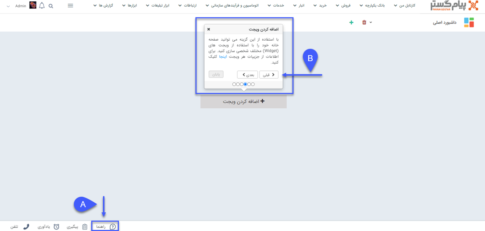

# راهنمای پیام‌گستر در نوار دسترسی

در هر بخش/صفحه‌ای از نرم‌افزار با کلیک روی گزینه راهنما (A)، توضیح آیتم‌های موجود در صفحه به صورت تور نمایش داده می‌شود. هر تور شامل توضیح کلید‌های موجود در آن صفحه بوده و به ترتیب مراحلی که باید طی کنید بیان شده است. برای مشاهده توضیحات هر گام از کلید‌های قبل و بعد (B) استفاده کنید. 

توجه داشته باشید که توضیحات ارائه شده در این بخش به صورت خلاصه نوشته شده‌ و برای دسترسی به توضیحات کامل باید به [**راهنمای پیام‌گستر**](https://help.payamgostar.com/docs) مراجعه نمایید.
